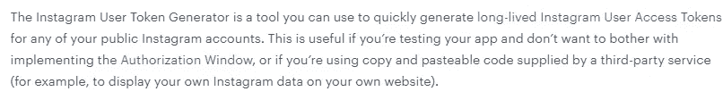
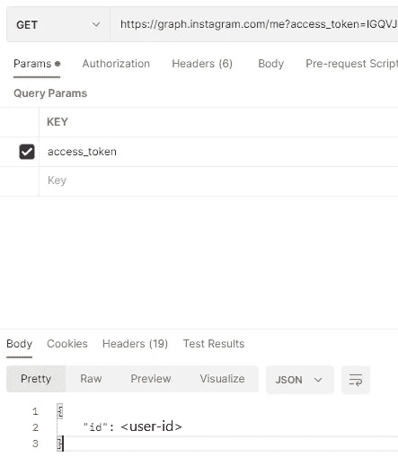
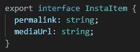
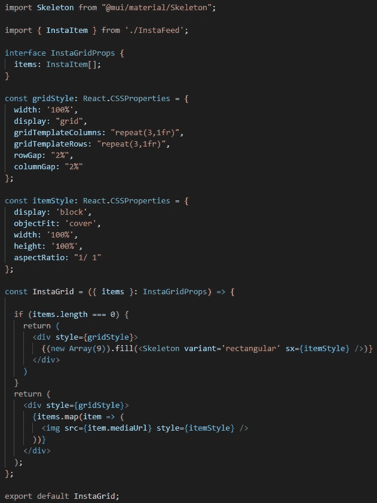
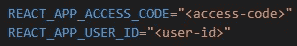
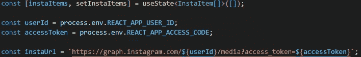
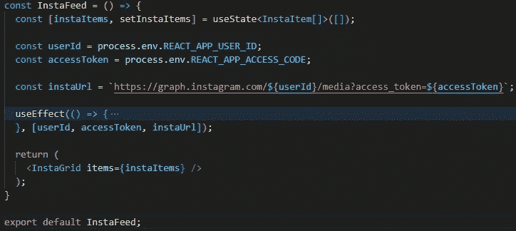
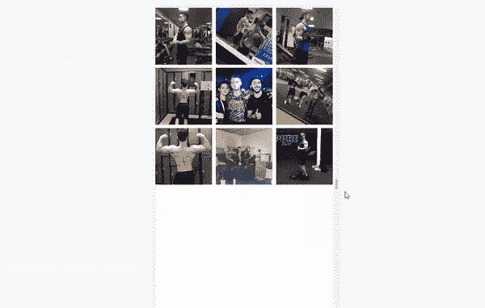

# 如何将 Instagram 帖子添加到 React 项目中

> 原文：<https://blog.devgenius.io/how-add-your-instagram-posts-to-your-react-project-e8527d2a7187?source=collection_archive---------4----------------------->

**我的目标:** *将我在 React 项目中的最新 Instagram 图片显示在一个响应式的 3*3 正方形网格中。*

# 获取 Instagram 访问令牌

第一步是拿到`access_token`。facebook 开发者文档非常好，但是我发现这个教程更好！

**确保仍然阅读文档，以确保您正在使用您的用例的正确方法，并且您遵守 T & Cs。**

脸书开发者文档

这对于我的用例来说已经足够了，因为我正试图在自己的网站上显示自己的 Instagram 数据。

# 获取 Instagram 用户 Id

一旦有了访问令牌，获取用户 id 就非常简单了。在 Postman 中，对这个端点执行一个 GET 请求，如[文档](https://developers.facebook.com/docs/instagram-basic-display-api/reference/me)中所述:

*   **https://graph.instagram.com/me?access_token={access_token}**

邮递员回复

这是必需的`user_id`。

# 在 React 中获取 Instagram 照片

## 创建演示组件

Instagram 中的媒体项目有`media_url`和`permalink`字段，如[文档](https://developers.facebook.com/docs/instagram-basic-display-api/reference/media#reading)中所述。这些是我使用的字段。

首先，我创建了一个`InstaItem`类型。这种类型的对象将用于存储从端点返回的`media_url`和`permalink`字段:

InstaItem 类型

然后，表示组件可以接收一个`InstaItem`列表，并整齐地表示它们，而不用担心`InstaItem`列表是如何获取的。下面是我如何在我的好朋友维克多的帮助下实现组件的:

演示组件

`itemStyle`的长宽比是`1 / 1`用于`itemStyle`以确保项目是方形的。

如果`items`列表为空(当图片仍在获取时)，网格显示 9 个正方形 [MUI 骨架](https://mui.com/material-ui/react-skeleton/#main-content)。这是不必要的，但我认为这真的很好。

## 创建容器组件

现在是有趣的部分！我首先在项目的根目录下创建了一个. env 文件。这里我添加了两个变量，`REACT_APP_ACCESS_CODE`和`REACT_APP_USER_ID`。

环境变量

**注意:将变量存储在。env 文件不安全，这些变量将是可见的。在我的例子中，我很乐意将我的** `**access_token**` **作为只读，而** `**user_id**` **反正是公共的。**

然后，我创建了一个容器组件来获取媒体项。用于获取所有媒体项目的 [URL 如下所示:](https://developers.facebook.com/docs/instagram-basic-display-api/reference/user/media)

*   **https://graph.instagram.com/{user_id}/media?访问令牌= {访问令牌}**

首先，我们可以将检索到的项目存储在状态中，这样就可以将它传递给表示组件。我们可以使用用户 id 的环境变量和。环境文件:

从`instaUrl`获取数据将返回媒体项目的列表`id`，该列表可用于检索实际的媒体项目。

用于获取 `[media_url](https://developers.facebook.com/docs/instagram-basic-display-api/reference/media#reading)` [和](https://developers.facebook.com/docs/instagram-basic-display-api/reference/media#reading) `[permalink](https://developers.facebook.com/docs/instagram-basic-display-api/reference/media#reading)` [字段](https://developers.facebook.com/docs/instagram-basic-display-api/reference/media#reading)的 [URL 如下所示:](https://developers.facebook.com/docs/instagram-basic-display-api/reference/media#reading)

*   **https://graph.instagram.com/${id}?访问令牌= $ {访问令牌} &字段=媒体 url，永久链接**

对于我们获得的每个媒体`id`，我们可以检索其对应的`media_url`和`permalink`字段，并将它们保存为一个`InstaItem`对象。

我定义了一个`useEffect`来做这件事(虽然回想起来用`React Query`更好，但是过程是一样的)。

正在获取 Instagram 媒体“media_url”和“permalink”

折叠了`useEffect`的整个容器组件看起来像这样，我将其命名为`InstaFeed`:

用于获取 Instagram 项目的容器组件

就是这样！最终结果是，我的 Instagram 帖子变成了一个响应性的 3*3 方形网格:

# 结论

我描述了如何将 Instagram 帖子添加到 React 项目中。

弄清楚如何实现这一点有点麻烦。从获得`access_token`和`user_id`到使其反应灵敏，在我得出这个解决方案之前，我必须经历多次迭代，谢谢[维克多](https://sharpvik.medium.com/)😄

我必须指出，有 3 种类型的媒体，`IMAGE`、`VIDEO`或`CAROUSEL_ALBUM`。这段代码只涵盖了`IMAGE`媒体类型，所以还有一些工作要做。

将`access_token`和`user_id`存储为环境变量**是不安全的**。如果这是一个问题，一个简单的解决方案是构建一个小型后端或无服务器功能，存储这些变量并代表 React 项目执行查询，只返回媒体项，而不泄露任何敏感信息。