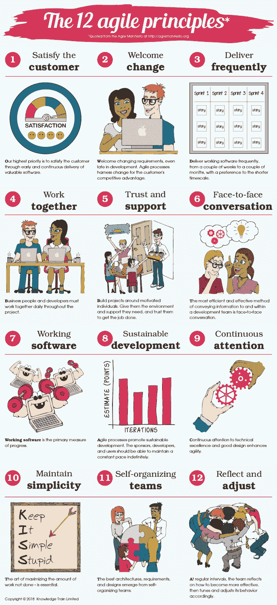
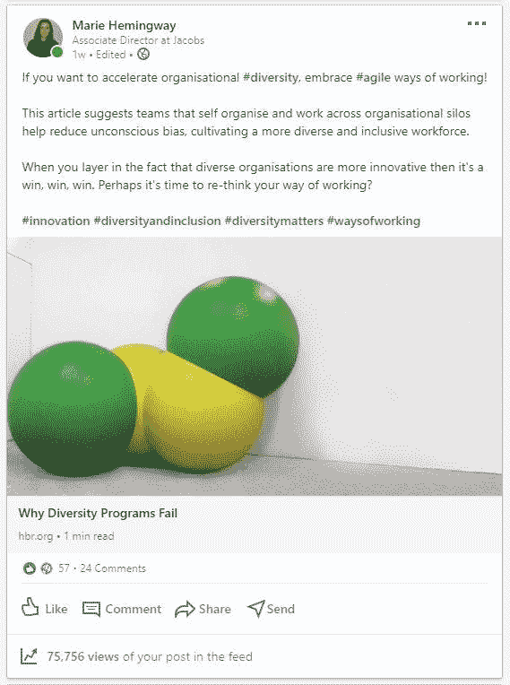
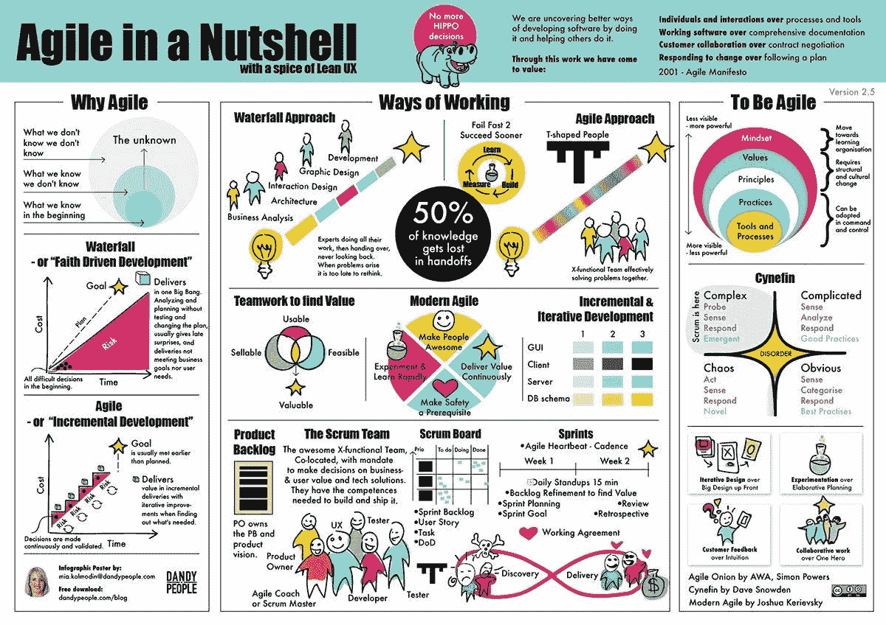
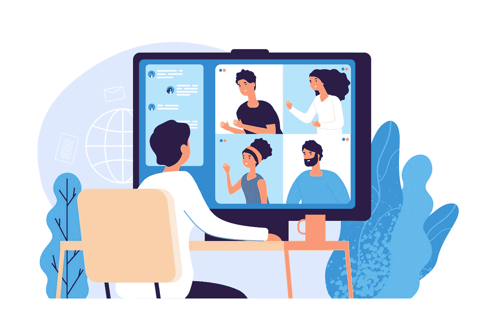
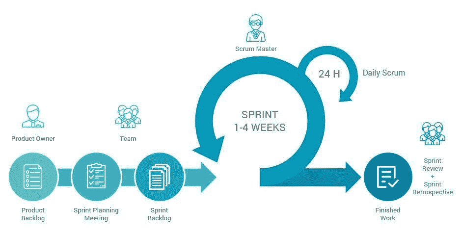
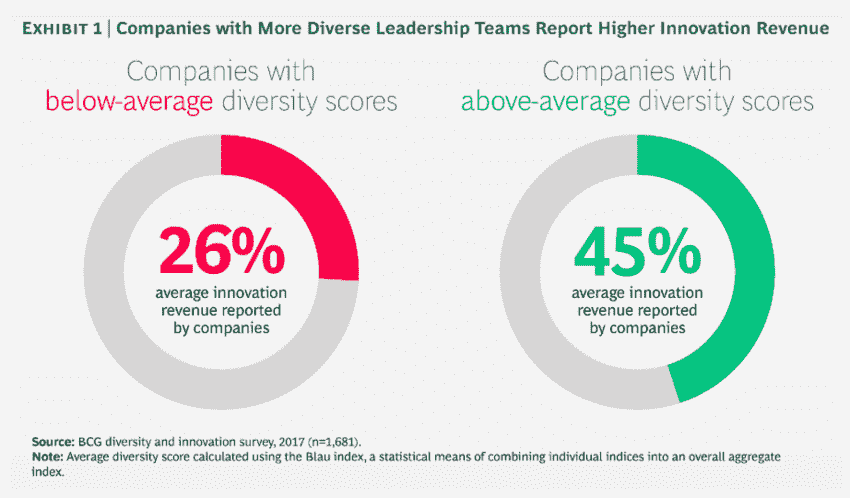

# 敏捷的工作方式如何(意外地)提供了加速组织多样性的解决方案

> 原文：<https://blog.devgenius.io/how-agile-ways-of-working-accidentally-delivered-the-solution-for-accelerating-organisational-97782f2fe138?source=collection_archive---------32----------------------->

敏捷的工作方式能提高组织的多样性并推动创新吗？研究显示，自组织团队和跨越组织孤岛的工作显然会加速组织构成的多样化，因此，希望保持竞争优势的企业或许需要反思自己更传统的工作方式。

在这篇文章中，我分享了我对采用敏捷工作方式来改善组织多样性、潜在挑战和公认商业利益的机会的想法。

# 敏捷和多样性有什么关系？

我第一次*正式*体验敏捷的工作方式，并成为一名实践者([安全](https://www.scaledagileframework.com/about/)敏捷方法论——对于那些知道的人来说！)同时支持  项目，该项目包括软件开发和敏捷方法中的补充业务转换活动。快节奏、协作和持续关注能给最终客户带来最大价值的东西，我找到了自己完美的工作方式。从那以后，可以公平地说，敏捷已经渗透到了我的思想中…再见瀑布，你好敏捷！

与此同时，作为[女性基础设施网络](https://www.womens-infra-uk.org/)的董事会成员，我对平等、多样性和包容性充满热情，并积极阅读相关主题。最近，我偶然看到《哈佛商业评论》的一篇文章“[为什么多元化项目会失败”](https://hbr.org/2016/07/why-diversity-programs-fail)，这篇文章挑战了我公认的(似乎不正确的)观点，即组织应该把精力集中在哪里来改善多元化。

简而言之，这篇文章强调了传统的、被广泛采用的增加多样性的组织方法，如 D&I 培训(与直觉相反)，是如何产生负面结果的。与此同时，实施自我管理团队和跨组织孤岛工作等方法会带来更积极的结果。我立刻意识到这两种方法都是敏捷工作方式中固有的。这让我想知道，如果…

> 自我管理的团队和交叉培训比强制性的多元化培训、绩效评估、工作测试或申诉程序有更积极的效果，这些都是为了促进多元化。

想要加速员工多元化和变得更加包容的组织应该专注于采用敏捷的工作方式吗？这是最近一篇 LinkedIn 帖子的主题，在 75，000 次浏览后，我决定需要更多的思考…

# 敏捷——它是什么？(软件开发人员可以跳过这一步！)

作为一名商业战略顾问，我经常听到“敏捷”这个词……而且对不同的人和组织来说，它的含义往往大不相同。本文讨论了交付业务结果的敏捷方法(产生于软件行业)——我在本文中不打算解释。如果您刚接触敏捷并想了解更多，请在这里找到一些有用的信息。

在软件开发中，敏捷方法通过自组织和跨职能团队及其客户的协作努力来开发需求和解决方案。它提倡适应性规划、进化发展、早期交付和持续改进，并鼓励对变化做出灵活的反应。

# 敏捷方法如何提高组织的多样性？

敏捷方法本质上利用了自我管理的团队和跨组织孤岛的工作。这种商业实践增加了不同群体之间的联系，他们平等地朝着一个共同的目标努力。因此，这减少了偏见，打破了负面的陈规定型观念，最终导致更公平的招聘和晋升做法。

例如，创建自我管理的团队可以让不同角色和职能的人平等地在项目中一起工作。这增加了不同类型的人之间的接触，通过混合不同专业的人，这些专业仍然在很大程度上按照种族、民族和性别划分。

> 创建自我管理工作团队的组织发现，白人女性、黑人男性和女性以及亚裔美国女性在管理岗位上的比例在五年内上升了 3%至 6%。

此外，鼓励跨组织孤岛工作(通过交叉培训计划或类似方式)允许进一步的小组间联系，从而带来类似的积极结果。

> 交叉培训项目发现，在过去五年里，白人女性、黑人男性和女性以及亚裔美国男性和女性在管理层的比例上升了 3%至 7%。

当谈到增加多样性时，更广泛地采用敏捷工作方式的前景是，这种方法不会因为明显是“多样性的努力”而受到影响。许多研究表明，如此推广的多元化计划实际上会引发偏见或引发反弹，对增加劳动力中的多元化产生反作用。

# 缺点是什么？

参考我自己使用 SAFe 敏捷方法交付的经验，并特别关注性别多样性，我看到了开发敏捷方法的两个关键挑战:

**1 .敏捷促进团队的同地办公**

这种方法提倡面对面的对话，认为这是传达信息的最有效和高效的方法，如果不加考虑地采用，就会形成一种呈现主义文化。

妇女基础设施网络举办的一次研讨会将工作灵活性确定为致力于增加性别多样性的组织的一项关键要求。在这种情况下，弹性工作包括在家工作、非标准时间和兼职工作。

鉴于最近全球转向虚拟工作，有效远程工作的大规模概念验证已经得到证明。因此，我鼓励在必要时采用虚拟的面对面对话，以适应需要灵活性的团队成员。

**2。敏捷提倡一种结构化的方法来交付成果(增量、冲刺和仪式)**

这种方法提倡频繁的交付，这是由一个标准的仪式(会议)模式促成的，通常在一个计划周期(增量)内的两周时间周期(冲刺)内举行。

这种方法的成功依赖于大多数(如果不是全部)团队成员支持这些仪式，这对于承担育儿责任和兼职工作安排的个人来说是一个挑战。

我鼓励 Scrum Master 合作计划仪式时间，以适应整个团队的个人约束。例如，这应该认识到，对于一个必须把孩子送到学校的人来说，每天早上 9 点站起来是一场后勤噩梦！

通过对实现的一些考虑，这些缺点很容易被减轻，并且，在我看来，被促进团队内的包容性的内置实践大大超过了。

与更传统的工作方式不同，这种方式经常导致内向的团队成员被忽略，最大声的团队成员主导对话，而不太自信的团队成员努力让别人听到他们的声音。敏捷方法鼓励所有团队成员参与团队成果的创建、开发和交付的一致且频繁的机会。我认为，这些机会为个人创造了理解他人观点、感同身受和被理解的空间，创造了一个真正协作和公平的工作环境。

# 获得竞争优势

我认为，组织有机会通过更少的传统、更有效的方法，如更广泛地采用敏捷的工作方式，来推动多样性和包容性。

[工作场所多元化的商业案例现在势不可挡](https://www.weforum.org/agenda/2019/04/business-case-for-diversity-in-the-workplace/)；研究表明企业具有:

1.  高管团队中的性别多样性越高，他们的竞争力就越强，更有可能获得高于平均水平的盈利能力，也更有可能在长期价值创造方面超越同龄人
2.  更加注重文化的多样性和包容性对千禧一代的求职者更有吸引力
3.  由于创新，更多样化的管理团队有更高的收入

> 更加多样化的公司更具创新性

不可否认的是，企业有一个明显的机会通过劳动力多样化来推动竞争优势。也许拥抱敏捷的工作方式是我们一直在寻找的解决方案？

感谢阅读！