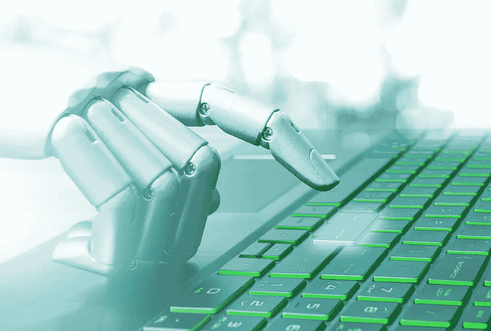
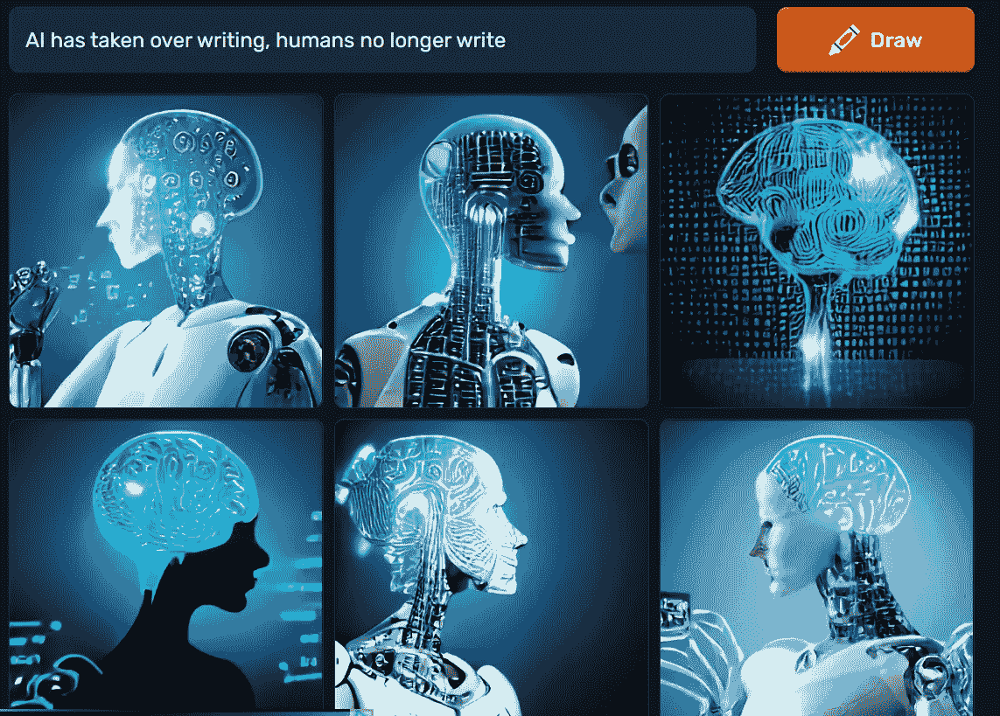
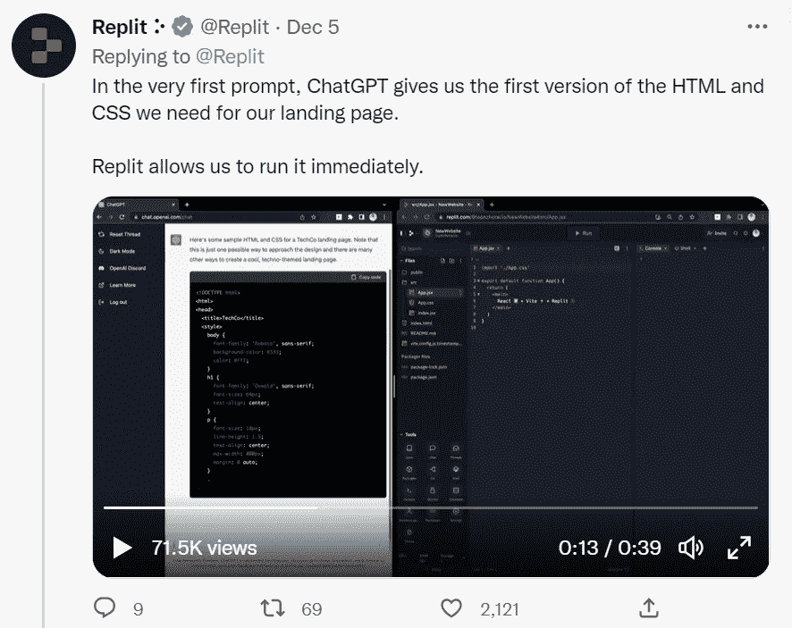
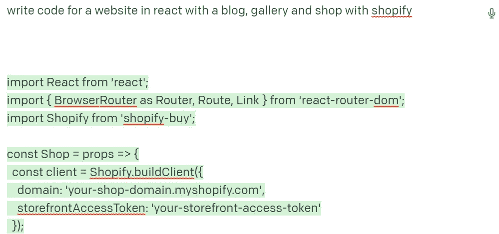
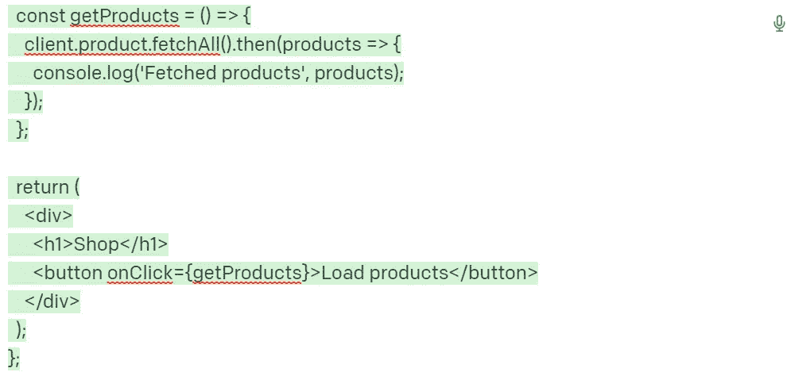
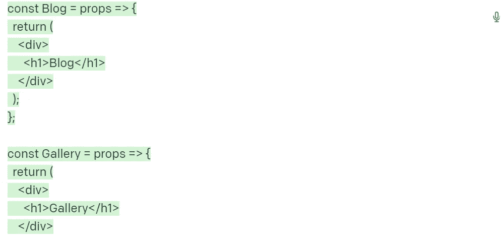
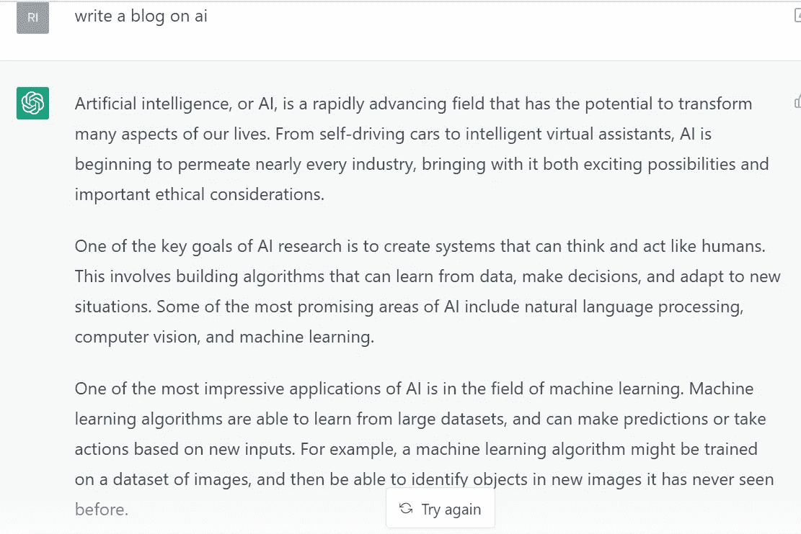
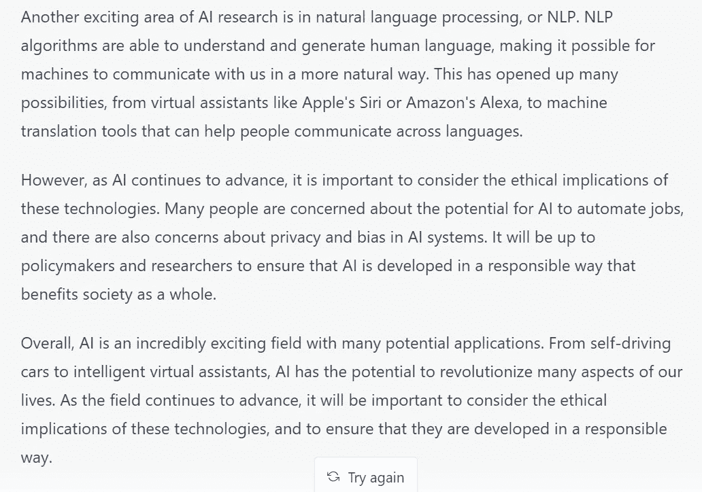
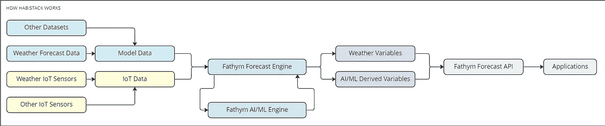

# 人工智能聊天机器人如何取代人类作家

> 原文：<https://blog.devgenius.io/how-ai-chatbots-could-replace-human-writers-41e634a2798b?source=collection_archive---------14----------------------->

# 作家能做些什么

人工智能将以许多不同的方式重塑我们所知的世界。

人工智能正被用于在自动驾驶汽车中进行计算，完成像创建报告这样的日常任务，以及像面部/步态识别这样的安全任务。

但是，计算机算法真的也有创造力吗？简单的回答是，“是的。”

我们已经看到人工智能接受提示，并把它们变成小而简单的艺术品。说实话，Dall-e 并不完美，甚至没有那么好。但这项技术正以疯狂的速度发展，正如我们在 Lensa.ai 中看到的那样。

(这个，来自 dall-e 也就是现在的克雷永。你可以看到，这不是我们真正想要的。)

说到艺术和人工智能，[艺术家](https://www.nbcnews.com/tech/internet/lensa-ai-artist-controversy-ethics-privacy-rcna60242)的作品被输入人工智能，然后，基本上，被偷走了。

写作呢？嗯， [ChatGPT](https://beta.openai.com/playground) 于 2022 年 11 月 30 日在世界上发布，它产生的文字实际上是人类的品质。令人难以置信的令人印象深刻，这对于作家来说是一个可怕的前景。

# 人工智能定义人工智能

“人工智能(AI)是计算机科学的一个分支，旨在创造能够像人类一样思考和行动的智能机器。它是一个跨学科的科学领域，结合了计算机科学、数学、心理学、语言学、工程学和其他科学来创建智能系统，这些系统可以分析大量数据，识别模式和关系，并根据它们所拥有的信息做出决策。人工智能有可能彻底改变许多行业，并已被用于帮助解决医疗保健、金融和交通等领域的复杂问题。”

这是 AI 自己用 ChatGPT 给出的答案。

# AI 写的是什么？

OpenAI 创建的 ChatGPT 目前处于聚光灯下。

让它写博客，它会的。向它要一个大纲，很好，就这样。它可以回答问题，它可以创建 tweet 线程；这是许多人希望谷歌能够回答的问题。

请 ChatGPT 写一集《辛普森一家》，这是可以的(尽管不是一个充实有趣的剧本)。

尽管如此，我们谈论的是人类的文字。很详细。聪明。与人类相比复杂而难以辨认。

例如，我问“什么是 chatgpt ”,这是它在大约 15 秒内吐出的内容:

“‘什么是 chatgpt’

ChatGPT 是 OpenAI 开发的对话式人工智能聊天机器人。它使用自然语言处理和深度学习算法，以自然语言理解和响应用户的查询。ChatGPT 旨在提供与用户的个性化对话，以自然和人性化的方式吸引他们。"

再读一遍，“……类似人类的方式。”

重点不仅仅是回答问题，而是让计算机获取数量惊人的数据，进行计算，并向人类反馈人类的描述。

太疯狂了。

# ChatGPT 编写代码

ChatGPT 不仅仅用于编写，也用于编写代码。

下面是 [Replit 使用 ChatGPT 编写代码，实时构建网站。](https://twitter.com/Replit/status/1599803817515548674)

当然，这很酷。它快速、高效，任何人都可以使用。

但是这对网站开发者和他们的工作意味着什么呢？

在这里，我要求 ChatGPT 使用 React 为一个带有博客、画廊和 Shopify 商店的网站编写代码。

这是它给我的启示:

这似乎很简单，我们的 CTO 确认了“组件看起来是正确的。”

# ChatGPT 关于人工智能的博客及其对作家的意义

对于作家来说，未来也同样不祥。AI 已经很擅长写作，而且只会越来越好。

以下是 ChatGPT 关于人工智能的博客:

奇妙的是，ChatGPT 甚至承认在这里使用人工智能的道德含义。

**“许多人担心人工智能自动化工作的潜力，也担心人工智能系统中的隐私和偏见，”** ChatGPT 自己写道。

所以这就引出了这个关键问题，ChatGPT 刚刚自己解释了:如果 ChatGPT 能写得这么好，对作家来说意味着什么？内容创作者？博主？会全部被取代吗？

对于开发者来说，也是类似的恐怖:开发者会被 AI 取代吗？

作家也会被机器人取代吗？

# 人类作家如何反击

我们已经看到人工智能颠覆了艺术世界。

[艺术家](https://www.nbcnews.com/tech/internet/lensa-ai-artist-controversy-ethics-privacy-rcna60242)——活着的和去世的——正在把他们的作品放入人工智能，然后这些艺术家基本上被敲竹杠。艾创造了一种基于特定艺术家作品的艺术风格。

听起来很像抄袭。

就像工厂里的工人被机器人取代一样，说人类在不久的将来也会被取代成为作家似乎也不是什么难事。

当你可以免费获得人工智能生成的内容时，为什么要付钱给人类作家来为你创建内容？

公司可以通过“雇用”人工智能来生成他们的书面内容，从而节省数千美元。这对作家来说是非常可怕的事情。

那么，作家可以做些什么来反击呢？

很简单，做你自己。

你的声音是独一无二的。

除非，出于某种原因，一个人把你的文字输入到 AI 中，像那些画家/数字艺术家一样复制，你的文字永远是你的。

继续写，继续读，继续学。通过记笔记来提高你的手艺。设定目标。玩得开心。

# 诉诸情感

记住民族精神、悲情和标志。当然，AI 会知道那些术语是什么意思，但它会学会与它们交流吗？

精神气质意味着对性格的诉求，或者建立信誉。悲怆是诉诸逻辑，或进行逻辑论证。比如“AI 可以用机器学习比人类更快地处理信息。电脑处理信息比人快，因为它们有更快的处理器和更大的内存容量

然后是 logos。逻各斯是对情感的诉求，这是大多数辩论的基础。事实上，你正在阅读的这篇文章使用了很多标志“…想到人工智能可以取代人类作家是很可怕的…”同时也使用了逻辑，“人工智能正被用于在自动驾驶汽车中进行计算…”

虽然大多数论点会更多地使用一种诉求而不是另一种诉求，但几乎所有的论点都会综合使用这三种诉求来形成可能的最佳论点。

但是当谈到情感诉求时，这是人类可以做到的，而人工智能还做不到的。

那么下一个问题就变成了:我们希望人工智能理解我们的情感，然后根据这些情感进行论证，以说服我们吗？

# AI 不可能每天都创作独特的艺术吧？

归根结底，写作本身就是创造性的。人类不可能每一天都简单地创造出独一无二的新艺术品。

AI 也不会。至少，在这一点上是有一定限度的。

当然，你可以输入提示“写一篇关于兔子的博客”，它会的。但是只有 233 个字。并要求它再做一次，同样的故事就出来了。或者至少是非常相似的一个。

一个人能够并且愿意调整，接受反馈，朝着正确的目标努力。当然是休息。

# 人工智能聊天机器人的积极一面

对于小团队，甚至是一个人的公司，ChatGPT 可能是创建网站副本、帮助营销副本甚至可能写小博客的绝佳工具。

它的速度快得令人难以置信，所以节省时间对于一个只需要*点东西*就能起步的小团队来说至关重要。

# 头脑风暴

另一个巨大的好处是，作者可以输入任何有助于他们集思广益的提示。有时候最难的事情是写博客的第一句话，然后事情就像水从大开的水龙头流出一样。

你可以申请一个关于某个主题的“博客”——这对你不太了解的主题很有帮助——甚至可以申请一个复杂事物的“提纲”。然后，作者可以将该大纲复制并粘贴到博客、书籍或任何其他创意的开头。

# 人工智能辅助机器人

想象一下，在一个你不会说这种语言的机场或外国城市迷路了。

人工智能聊天机器人可以帮助你认路——理解你的母语——破译标志，帮助你知道去哪里，并回答你旅途中可能出现的任何其他问题。

类似地，人们可以假设性地问聊天机器人如何更换汽车的机油，或者甚至在未来对汽车进行更复杂的维修，聊天机器人可以带你完成这个过程。

# 人工智能和机器学习解决复杂问题

人工智能的另一个巨大优势是能够为人类解决极其复杂、耗时的问题。

它解决这些问题的方法是机器学习。

来自 Jay Selig 在 [expert.ai](https://www.expert.ai/blog/machine-learning-definition/) :

“机器学习是人工智能的一种应用，它使系统能够在没有显式编程的情况下根据经验进行学习和改进。机器学习专注于开发能够访问数据并利用数据进行自我学习的计算机程序。”

所以，把人工智能想象成智能，计算机系统的智慧。数据。

但是机器学习是如何使用这些数据来预测未来事件或听起来像人类的 T2。简单地说，从数据中学习。

# AI-ML 用例:Habistack 天气预报 API

[Fathym 的 Habistack](https://www.fathym.com/forecast) ，也使用 AI-ML 的组合进行天气预报，特别是与路况相关的天气预报。

Habistack 将世界上最好的天气预报与基于统计的机器学习技术相结合，以处理最大的数据集，包括道路天气。Habistack 为开发人员提供全球范围内自由选择位置和路线的全面天气预报能力。该 API 提供了一套独特的高度专业化的预测变量，这些变量是通过基于统计的机器学习模型得出的。

这些数据都被摄取到微软 Azure 和人工智能中，然后机器学习使用所有这些数据来基于这些数据创建预测。

# 创造性人工智能的伦理将会是什么？

抄袭是不好的。句号。

这是我们在学校学习写作时被教会的第一件事。

你不能只是照搬别人的话或想法。那是错误的。

那么，我们会用同样的标准来看待 AI 吗？

如果我们不这样做，艺术家们能做些什么呢？一个作家如何证明他们被剽窃了？想象一下，人工智能有成百上千个作家的文字插入其中。很难证明这些是你说的话。

一个作家如何找到时间或金钱来对抗这些剽窃？

我们有一天会在书店里有人类 vs. AI 作家吗？

如果 AI 变得比我们更擅长写故事，人类会想成为作家吗？

人们是否会更愿意阅读人工智能编写的材料，因为他们知道人工智能拥有其中所有内容的丰富知识，而相比之下，人类的知识相对较少？

当然，这是一项新技术。问题比答案多。

但人们可以想象未来——一个不太遥远的未来——我们消费的许多文字实际上是由人工智能聊天机器人而不是人类编写的。

如果真的发生了，那将是人类历史上悲伤的一天。

几十万年来，叙事一直是人类构建和理解世界的核心。这就是为什么社交媒体如此受欢迎，也是为什么它是我们在洞穴里围坐在篝火旁的现代版。

我们必须继续写记叙文，即使(什么时候？)AI 比我们强。似乎迫在眉睫。

*最初发表于*[T5【https://www.fathym.com】](https://www.fathym.com/blog/articles/2022/december/2022-12-13-how-ai-could-replace-human-writers)*。*

## 👋如果你觉得这有帮助，请点击拍手👏按钮几下，以示你对作者的支持👇

## 🚀[加入 FAUN 开发者社区&每周在收件箱中收到类似的故事](http://from.faun.to/r/8zxxd)