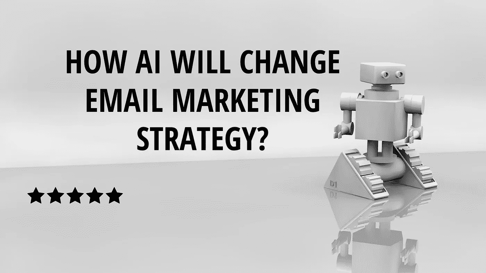
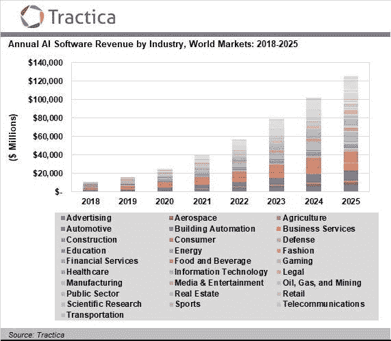
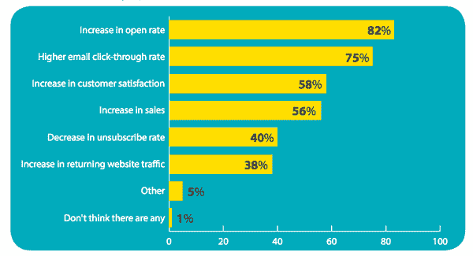

# 人工智能将如何改变电子邮件营销策略？

> 原文：<https://blog.devgenius.io/how-ai-will-change-email-marketing-strategy-2006785009d8?source=collection_archive---------26----------------------->

电子邮件是最重要的商务交流方式，很难想象一个没有它的商业世界。根据 Statista 的数据，到 2023 年，全球将有大约 43 亿电子邮件用户。73%的千禧一代逐渐影响了大品牌的客户群，他们更喜欢通过电子邮件交流商业交易和事务。在 B2B 领域，[电子邮件营销一如既往地重要。](https://www.linkedin.com/pulse/how-ai-change-email-marketing-strategy-shormistha-chatterjee/?trackingId=k2jAOnJtTjKMw4FLlo5whg%3D%3D) Statista 还透露,[全球 30%](https://www.statista.com/statistics/736848/roi-digital-marketing-channels/) [的营销专家](https://www.statista.com/statistics/255080/number-of-e-mail-users-worldwide/)提到，在[所有营销渠道](https://shormistha4.blogspot.com/2020/07/how-ai-will-change-email-marketing.html)中，电子邮件营销提供了最大的投资回报率。

鉴于 [**电子邮件营销**](https://www.linkedin.com/pulse/how-ai-change-email-marketing-strategy-shormistha-chatterjee/?trackingId=k2jAOnJtTjKMw4FLlo5whg%3D%3D) 对企业的重要性，毫不奇怪，人工智能的使用在电子邮件营销人员中迅速增长。如今，几乎每个行业都在采用自动化工具和技术，因为它们降低了成本，简化了复杂的流程。人工智能技术在电子邮件营销策略中具有优势，因为它可以比人更专业地审查数据。从技术角度来看，人工智能对许多其他新兴趋势都很有用，比如机器学习、大数据等等。

营销中的人工智能现在可以让大多数商业品牌轻松了解电子邮件策略中的哪些元素需要调整，哪些真正有效。像智能分段这样的技术；电子邮件自动化工作流程、优化的电子邮件主题行等有助于提高点击率(CTR)和打开率。它彻底改变了每一个数字原住民的生活。

## [统计数据怎么说？](https://www.linkedin.com/pulse/how-ai-change-email-marketing-strategy-shormistha-chatterjee/?trackingId=k2jAOnJtTjKMw4FLlo5whg%3D%3D)

[Forrester Research](https://go.forrester.com/) 估计，使用最新人工智能技术推动电子邮件营销的企业将比不使用这些技术的企业每年增长 1.2 万亿美元

正如 Tractica 的一份新报告所述，全球人工智能市场正在进入一个新的阶段，故事正在从传言走向现实。

49%的企业表示，他们已经在电子邮件营销策略中采用了自动化，随着企业主和营销人员看到未来的发展，这一数字有望上升

[GetResponse 和 Ascend 的](http://ascend2.com/wp-content/uploads/2019/03/GRE_Ascend2_B2BEmailMarketing-1.pdf?zd_source=mta&zd_campaign=12804&zd_term=merilynpereira)最新研究报告称，由于令人满意的营销活动结果，约 63 %的 B2B 营销人员每年都大幅增加了电子邮件营销预算，而 18 %的营销人员由于业绩恶化而减少了投资

[Socialmediatoday 的统计数据](https://www.socialmediatoday.com/news/13-surprising-email-personalization-statistics-infographic/528246/)显示，利用人工智能，82%的营销人员在电子邮件营销活动中使用定制技术和行动计划后，报告了高打开率；75%的人承认它产生了很高的点击率。

[Tractica](https://tractica.omdia.com/newsroom/press-releases/artificial-intelligence-software-market-to-reach-118-6-billion-in-annual-worldwide-revenue-by-2025/) 还透露，到 2025 年，来自使用人工智能技术的软件的回报将从 2018 年的约 95 亿美元上升到全球年收入的 1186 亿美元。人工智能将会有巨大的增长，这确实会导致电子邮件营销的创纪录增长。

***【图片来源:Tractica.com】***

## [电子邮件营销活动](https://www.linkedin.com/pulse/how-ai-change-email-marketing-strategy-shormistha-chatterjee/?trackingId=k2jAOnJtTjKMw4FLlo5whg%3D%3D)的目标是什么？

定义主要目标会让你对电子邮件营销活动的形式有更清晰的想法。确切地知道你想要完成什么是将你的战略和目标整合成一个总体的、连贯的战略的关键一步

***确定你的目标是:聪明***

具体——易懂且精确

可衡量—易于跟踪

可实现-可实现

现实-明智

具体时间——你打算什么时候实现目标？

***使用 OKRs***

*这意味着阐明你希望从每个目标中获得的关键结果，以及你如何努力实现这些结果。*

*   目标
*   主要结果

## 利用人工智能充分利用他们的电子邮件营销活动

电子邮件营销技术中的人工智能已经在改变营销人员开发、安排、计划和实施电子邮件活动的方式。利润丰厚的[电子邮件营销策略](https://shormistha4.blogspot.com/2020/07/how-ai-will-change-email-marketing.html)面临的主要挑战是:

*   增加销售线索生成
*   提高参与度
*   增加转化率

## *从长远来看，人工智能对电子邮件营销有好处*

1.  自动化和人工智能技术可以很容易地优化和制作几种电子邮件营销友好格式的内容
2.  营销中的人工智能可以提供几个电子邮件营销活动的详细分析
3.  这需要对等式进行猜测，决定发邮件和跟进的时间
4.  AI 可以通过分析用户的浏览偏好和习惯并发送电子邮件来重新确定目标，以增加转化的概率
5.  它甚至可以提高电子邮件营销活动和策略的日常结果和绩效
6.  人工智能可以帮助公司在发现新客户的同时留住现有客户
7.  人工智能技术可以更好地洞察业务增长

简而言之，将[人工智能融入电子邮件营销策略](https://shormistha4.blogspot.com/2020/07/how-ai-will-change-email-marketing.html)可以带来更好的个性化、更高的转化率、智能细分、提高客户满意度，从而大幅提高客户保留率。

# 人工智能改变电子邮件营销的 5 种方式

人工智能具有巨大的特性，可以更好地改变电子邮件营销领域。让我们更深入地了解一下[营销人员如何整合和利用人工智能](https://shormistha4.blogspot.com/2020/07/how-ai-will-change-email-marketing.html)来充分利用他们的电子邮件营销策略:

**1。个性化电子邮件技术打造更智能的营销活动**

个性化对[电子邮件营销实践](https://www.bloglovin.com/@shormistha/how-ai-will-change-email-marketing-strategy-5832845)至关重要。带有个性化主题行的电子邮件被点击的可能性增加了 26%,并带来 6 倍的交易价值。甚至 74%的营销人员认为，有针对性的个性化提升了他们的整体客户参与度。

***个性化邮件的重要性:***

*   个性化的电子邮件无疑使一封电子邮件很有可能被点击打开
*   这类电子邮件在收件箱中显得非常突出，是非常相关的定制材料
*   真正的个性化允许电子邮件营销人员针对个人受众个性化内容
*   个性化电子邮件通过在正确的时间向正确的用户发送包含正确内容的正确主题来支持客户体验

由于电子邮件营销工具，个性化电子邮件可以变得像使用电子邮件列表分段和个性化标签一样简单。电子邮件营销中的人工智能技术通过分析目标客户的行为，允许更高程度的个性化，从而更容易发现他们会对什么样的内容做出回应。在预测分析的帮助下，人工智能可以掌握复杂的客户数据、算法、基于先前交互的客户行为以及数据趋势。多亏了像 Persado 和 Phrasee 这样的最新平台，电子邮件营销人员可以让[人工智能技术](https://www.bloglovin.com/@shormistha/how-ai-will-change-email-marketing-strategy-5832845)确定哪些正文、主题行和行动号召收件人更有可能回复。

**正版个性化允许** [**邮件营销人员**](https://shormistha4.blogspot.com/2020/07/how-ai-will-change-email-marketing.html) **进行:**

了解每个消费者的实时品味和兴趣

针对一个受众的个性化内容

根据用户行为不断更新

**2。使用人工智能优化电子邮件主题行**

毫无疑问，这是你的信息的核心要素。虽然一个完美的主题行会吸引用户的注意，但一个不吸引人的主题行将被方便地标记为垃圾邮件或被忽略。只有 5 个单词的主题行比更长的主题行打开率提高了 15.9%。 [Chadwick Martin Bailey](https://www.cmbinfo.com/) ，调查显示，近 40%的客户仅仅根据[邮件的主题行](https://shormistha4.blogspot.com/2020/07/how-ai-will-change-email-marketing.html)来决定他们是否会在邮件上打卡。主题行需要优化以避免最常见的错误，包括:

太多潜在的行动

太长的句子

无个性化

具有新想法的人工智能技术创造了能够吸引更高点击率的主题。它分析单个电子邮件营销活动的结果，以随着时间的推移优化电子邮件主题。即使感谢智能[电子邮件营销工具](https://www.bloglovin.com/@shormistha/how-ai-will-change-email-marketing-strategy-5832845)，如 Phrasee，它使用[人工智能技术](https://shormistha4.blogspot.com/2020/07/how-ai-will-change-email-marketing.html)生成高效的主题行。它通过以下模式优化您的电子邮件:

个性化和优化的主题行

推动点击的正文

推动转化的行动号召

简而言之，人工智能技术可以分析什么样的内容和拷贝是高效的。

**3。预测分析和指标**

预测分析是当今营销人员使用的电子邮件营销现代趋势。这种秘密力量可以支持他们进行高效的电子邮件营销活动，并以最聪明的方式开始销售，以分析订户和网站访问者的数据。预测分析识别客户对特定促销优惠或电子邮件的反应，从而帮助您以前所未有的方式创建适当的个性化内容。

***【图片来源:adestra.com】***

除了使用人工智能算法来优化电子邮件营销活动，营销人员还利用人工智能、ML、统计算法和建模来审查现有数据并预测即将到来的变化。现在的问题是，预测分析将对电子邮件营销活动产生多大影响？为了回答这个问题，Forrester 调查了大约 579 名营销决策者。结果如下:

*   78 %的人宣称所有的电子邮件营销方式将很快变得有预见性
*   82 %的人认为预测性电子邮件营销对保持优势至关重要
*   81 %的公司计划扩大用于推动电子邮件营销结果的预测分析

高度先进的[人工智能驱动技术](https://shormistha4.blogspot.com/2020/07/how-ai-will-change-email-marketing.html)在粒度级别上识别客户。网络上有无数预测性电子邮件分析和个性化的例子，其中网飞是著名的一个。

**4。定制特殊电子邮件促销**

为你定制的电子邮件列表提供特别促销是一个伟大的技术，既能影响更多的用户注册该列表，又能增加销售额。电子邮件营销与人工智能有助于规划特别促销和优化电子邮件频率的正确策略。电子邮件营销人员可以通过为每个客户定制促销和最佳优惠来轻松创造销售。

基于用户的兴趣、习惯和历史，人工智能算法知道什么样的推广对你的每个用户更有效，无论是产品折扣、回扣、推荐还是免费赠品。随着每天越来越多的人订阅您的简讯，销售数据不断增加，需要对其进行管理。人工智能技术使电子邮件营销人员能够研究用户行为并管理数据，以便向每位客户发送定制的促销电子邮件。

例如，根据 Salesforce 的说法，人工智能可以分析你当前用户的行为，从购买模式到网站形式。它还对模式进行了分类，有助于以新的方式对受众进行细分。这种方式比任何人都要快。

太多的推广和人会退订，人们会忘记什么是特定的业务。“由于人工智能，转化的可能性明显增加。人工智能软件优化了最小的促销活动，可以使用预先编写的促销活动、图像、副本、链接、策划内容、博客帖子片段，甚至机器生成的内容来创建经过优化和定制的电子邮件，以实现高参与率。如果没有人工智能的力量，这种个人晋升是不可能的。

**5。使用人工智能进行智能分段和电子邮件重定向**

你把正确的邮件发给正确的受众了吗？你的用户列表是否被最佳分割？每个用户都有不同寻常的行为和行为特征，使其有别于其他消费者。细分非常有用，电子邮件营销活动已经证明[将收入提高了 760%](https://www.campaignmonitor.com/resources/guides/email-marketing-new-rules/) 。最终，人工智能技术将改善数据，使消费者可能成为高度相关营销的单独目标。此外，根据销售漏斗中的位置、地理位置、人口统计、购买历史等标准对每个用户进行细分，可以帮助您更好地锁定用户。

随着人工智能和机器学习的出现，电子邮件专家获得特定客户细节并微调您的重新定位策略变得更加简单。适当的电子邮件确保你向感兴趣的客户发送正确的信息，从而促进点击率和转化率。人工智能还可以区分不同类型的客户，并在最佳时间发送重新定向的电子邮件。当用户放弃购物车时，人工智能可以通过发送电子邮件重新定位该客户端，以便最终推荐类似的商品或购买该产品。简而言之，人工智能细分可以让你的电子邮件营销活动更上一层楼。

## 定论

利用像[人工智能这样的智能技术可以优化你的电子邮件](https://www.linkedin.com/pulse/how-ai-change-email-marketing-strategy-shormistha-chatterjee/?trackingId=k2jAOnJtTjKMw4FLlo5whg%3D%3D)营销活动，让你更快地实现你的关键绩效指标和投资回报率。人工智能已经成为任何电子邮件营销策略不可或缺的一部分。总之，人工智能驱动的电子邮件营销是必由之路。那么，你还在等什么？让你的电子邮件营销策略在瓶颈竞争中脱颖而出。

***你可以关注我:***

*   **Dzone**:[https://dzone.com/users/3854036/shormistha.html](https://dzone.com/users/3854036/shormistha.html)
*   **Quora**:【https://www.quora.com/profile/Shormistha-Chatterjee】T2
*   **博主**:[https://shormistha4.blogspot.com/](https://shormistha4.blogspot.com/)，[https://qaandsoftwareblog.blogspot.com/](https://qaandsoftwareblog.blogspot.com/)
*   **布洛格洛文**:[https://www.bloglovin.com/@shormistha](https://www.bloglovin.com/@shormistha)