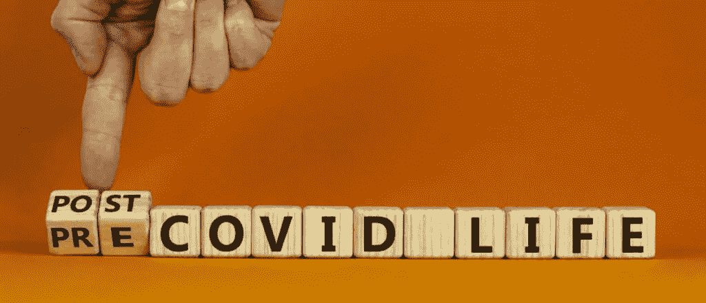

# 新冠肺炎事件后，我的生活发生了变化

> 原文：<https://blog.devgenius.io/how-am-i-doing-with-post-covid-1845460db1f6?source=collection_archive---------6----------------------->

新冠肺炎对我们所有人来说都很艰难。这是毋庸置疑的。它在许多方面影响了几乎每个人。一些人失去了亲人，失去了工作，不得不卖掉房子或汽车，等等。我觉得这是 21 世纪大家最难熬的时候。

对我来说也一样。2020 年 2 月初移居澳洲。在 2 月末边境关闭之前一切正常，直到 11 月末，持续的封锁是不可避免的。无意冒犯，当谈到把事情放回一起时，锁定在澳大利亚发挥了重要作用。澳大利亚做得很好。为此向政府致敬！

现在你可能会想，这个人会告诉我们什么？这个故事是关于我如何穿越新冠肺炎的顶峰，以及我现在过得怎么样？

在新冠肺炎期间，对我来说那是一段非常紧张的时期，我有我的工作，但是我远离了在斯里兰卡的家人，由于封锁，我也不能去看望我在澳洲的叔叔和阿姨。所以姑且称之为僵局吧。在新冠肺炎期间，我明白了你随时可能失去生命，随时可能丢掉工作，基本上你可以很快从富有变成破产。所以我明白生命中的每一秒都很重要。当我在斯里兰卡的时候，我不是一直和我的父母在家。我忙于办公室工作、学习和朋友等等。我记得我给了他们人生中最低谷的时光。来到澳洲，独自面对新冠肺炎教会了我很多东西。生活中的事情永远无法挽回。给你爱的人时间和空间。过平衡的生活。我们有任务、项目等的截止日期，但问题是我们知道自己的截止日期吗？话虽如此，现在我与家人共度了美好时光。事实上，此刻我正和家人在墨尔本共度美好时光。

我学到的另一件事是，你的生活有时会很悲惨，但你必须适应它。我妈妈过去总是告诉我，会有更艰难的时候，但好时光也会到来。这句话让我坚持下去。我发现的另一件事是，你需要为你此刻正在做的事情找一个理由。这对你真的很重要，如果不是当你遇到困难的时候，你就会偏离轨道！我对我所做的或追求的事情有一个非常强烈的理由，每当我在疫情碰壁时，这个理由都激励着我。在好的时候，你可以带着缺点走，一切都感觉很好，但问题是当你的生活变得悲惨时会发生什么？你会有同样的动力吗？同样的奉献？所以一定要知道，你为什么要做你现在正在做的事情！当生活在考验我们的时候，它真的很重要！

你需要和优秀的人在一起，这是事实！简单地保持你的圈子小和你的啤酒冷！新冠肺炎教我，如何在你的生活中发现真正的人，这真的很重要。我所说的伟人是指你需要有好朋友，一个你可以敞开心扉的好家庭。他们给你很好的建议，并确保你在正确的轨道上。我还年轻，对生活中的大部分事情可能不会有很好的体验。所以当我不能把生活中的一些困惑联系起来时，我需要建议和指导。有趣的是，即使是国王也有他们的顾问团。你需要有自己的！在某种程度上，我真的很感谢新冠肺炎，因为它摘下了大多数人的面具，他们在用别人的生命上演一出伟大的戏剧。女王和国王的戏剧结束了！

我在疫情学到的另一件事是，你可能会看到你周围的世界被撕裂，但那是为了别人，而不是你！这可能是你最美好的时光！被开除了吗？继续申请新工作！有很多新的工作机会。获取新技能！有很多网站提供免费课程，开始一项新的爱好。有句话说，乌云背后总有一线光明！你需要相信自己，继续做你擅长的事情。事情最终会按照你的方式发展。

我生活中的一个重要部分就是帮助别人，不管是不是疫情，我一直在这样做！我相信我们的慷慨会成为我们的祝福！我不是说，因为那个原因去帮助别人。但是它会来的，我这辈子经历过。我想因果报应就是这么解释的吧！毕竟事情是绕圈走的，不是直线！

最后，我需要你记住好时光会来到我们身边！那些正在经历困难时期的人，那些无论生活中发生什么都有韧性的人，向他们所有人致敬！好日子来了！