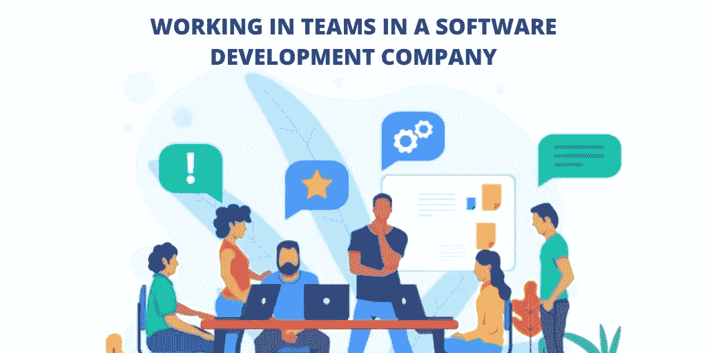
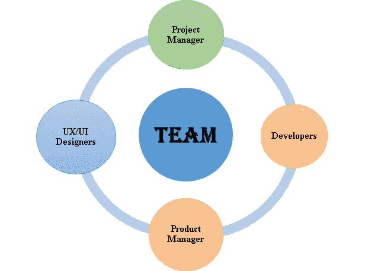
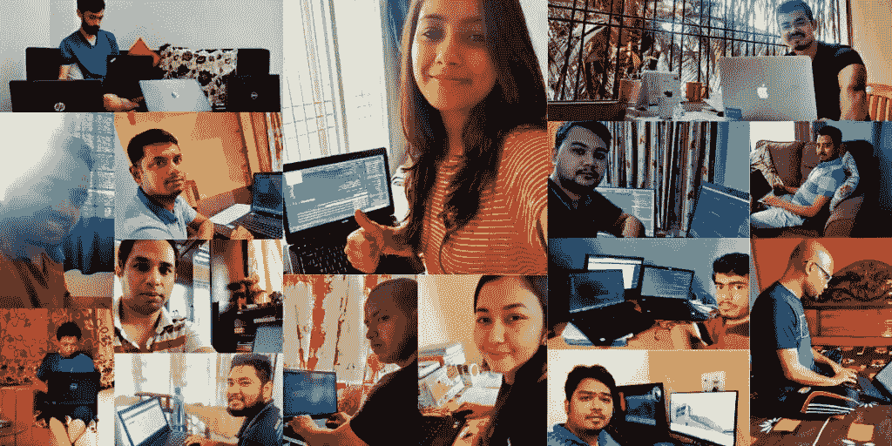

# 在软件开发公司的团队中工作是什么样的

> 原文：<https://blog.devgenius.io/how-and-what-its-like-working-in-teams-in-a-software-development-company-c76f5508c8f6?source=collection_archive---------28----------------------->

俗话说得好，“大家一起做得更好，走得更远。”我在团队中与重要的人一起朝着共同的目标前进的经历也是如此。

对于一个成功的组织来说，没有什么是注定的，因此在给定的期限内建立、连接、维护和成功交付项目需要付出大量的努力和管理。因此，一个好的团队是敬业的专业人员的结合，同时也是超越专业范围的合作，这样即使在项目结束后，团队也同意一起工作。

现在，当谈到在软件开发公司的团队中工作时，我将带你经历几个阶段，并尝试给你一个在这个领域工作的简单场景。因此，基本上一个软件开发公司的团队将由以下成员组成，形成一个整体:

1.**项目经理**:他/她可以被称为“领导者”或负责启动、继续或结束指定项目的所有职能的人。这些功能包括为新项目寻找客户，收集需求，建立开发团队，分配每个人的角色和责任，计划，控制，监控，与所有团队成员和客户沟通等。

2.**工程师/开发人员**:他们拥有专业的知识和技能，能够根据客户的要求启动、解码和开发项目。

3. **UX/UI 设计师**:他们是创意中心，负责设计所有吸引人的图片、网站等。产品或服务。

4.产品经理:这个职位不是所有软件开发团队都必须有的，但大团队需要。他们的职能与其名称相符，因为他们负责执行项目的所有顺利运作。他/她检查系统中的任何错误或漏洞，并帮助修复或维护项目的正常运行。

要事第一，所以为了摆脱新项目的时差，设定一个明确的目标或要实现的目标是必须的，这取决于随后要建立的团队。目标决定了必要的专业知识和团队的规模。因此，我们需要详细记录所有的业务目标，然后建立一个专家团队。

虽然数字不能描述任何团队对于更大和更长时间框架的项目的效率，但是团队的数量应该更多。然而，如果在一个由有远见的合作决策者和问题解决者组成的团队中有开放和有效的沟通，那么不管团队有多大，成功一定会来到我们的门前。

新团队组建完成后，接下来是产品经理在团队成员中公平分配角色和职责。因为他/她知道产品开发的最佳策略，因此能够通过向开发人员清楚地解释委托他们进行新项目的客户的要求来向他们提出建议。在咨询其他成员开发产品后，由产品经理决定最佳方法。如果我们从零开始一个新项目，1-2 个前端和后端开发人员和一个项目经理就足够了。

现在，一个团队建立起来了，它需要付出努力来培养和实现一个目标或一个强大团队的过多目标。下面是一个“待办事项”列表，缺少这些事项会给团队合作带来巨大的失败:

**1。** **对成就的赞赏**

每位员工对微小成就的一点赞赏可以带来归属感，提升自尊，因为他们会觉得自己受到重视。我们必须确保每个团队成员都认可对方的努力，并相互欣赏。这在很大程度上激励了员工发展纽带，强化自己，让他们更好地为团队而不是为自己工作。

**2。** **明确说明要求**

清楚地定义我们的项目需求对于高效地完成工作至关重要。我们不能浪费时间写过去或现有技术的细节，因为这将导致纯粹的时间浪费。相反，我们必须把重点放在需要什么上。

我们可以利用流程图来定义所有这样的流程，作为解决方案的一部分。这些图包括所需的所有步骤、改变所采取步骤的决策、用户或技术组件将执行的内容以及允许的偏差。这有助于保持团队的透明度，因为所有成员都知道设定的目标和目的。

技术项目的一个常见挑战是与第三方或供应商打交道以实现我们的技术需求。一些供应商在签署合同前做出重大承诺，但最终未能交付分配给他们的货物。避免这种情况的最好方法是在与这些供应商合作之前，编写详细的需求，并记录我们的预期业务流程。

**3。** **建立里程碑**

里程碑非常重要，因为它们是向整个团队和管理层传达进展的一种方式。一组好的里程碑可以确保在正确的时间向我们所有的利益相关者传达正确的信息。但是在开发里程碑时，我们必须记住的几件事是频率和位置。我们不能设置太多的里程碑，因为这会给团队带来不必要的进度压力。

最后要考虑的是正确命名里程碑。这可能听起来非常基本，但它非常重要，因为如果一个里程碑是以人们不理解要交付什么的方式编写的，那么我们就错过了清晰目标的交付。我们还可以使用路线图来显示项目的各个阶段，以及每个阶段中的里程碑来跟踪进度。

**4。** **妥善而透明的沟通计划**

技术项目的沟通规划至关重要，需要精心管理，因此项目经理需要做的第一件事是建立沟通策略。这个策略需要包括要沟通的对象、沟通的频率以及每次沟通的目的。

建议与企业宣传团队的人员合作，因为他们可以帮助我们选择可用的媒体，并帮助我们在整个项目中开展宣传活动。

需要沟通的常见群体包括项目团队成员、高级管理层、外部供应商、监管机构等。频繁的书面和口头交流对项目团队成员来说至关重要。有必要让所有团队成员了解每天发生的所有事情。

**5。** **委派职责给所有人**

在委派角色和责任后，项目经理必须让所有团队成员享受自由，允许他们按自己的方式做事。不应该有严格工作时间的硬性规定，而应该提供灵活的工作时间，甚至让每个人都有权在危难和紧急情况下在家工作。这营造了一个健康的工作环境，每个小时的工作都会带来丰硕的成果。

**6。** **跟踪进度**

同样，随着时间的推移，焦点往往会转移，所以定期与团队召开审查会议，检查进展状态，因为从每个团队成员那里寻求关于他们工作的反馈是必须的。必须听取每个团队成员的观点和顾虑，有时如果观点相互冲突，这些会议可以作为一个平台，在广泛考虑和大多数人的明智决定后解决这种情况。因此，这些分享观点和意见的经历有助于保持对进展的跟踪，并将团队结合在一起。

**7。** **别忘了庆祝**

当我们完成目标的时候，我们一定不能控制自己的情绪，让内心的幸福感爆发出来，与我们的团队一起庆祝，让这一天成为值得纪念的一天。这些庆祝活动鼓励并唤醒了所有人的团队精神。因此，它标志着更多庆祝活动的开始，因为团队成员被鼓励一起从事更多这样的项目。

每个团队都有在各自不同领域拥有专业知识的成员，因此成为团队的一员就像置身于一个平台中，所有这些想法在此汇聚并产生强大的协作。此外，每个成员都有机会接触新的知识流，掌握新的想法。在团队中，我们不仅能学到专业技能，也是提高社交技能的必要途径。无论一个人是否喜欢互动，他/她都必须互动、交流，从而走出他们的外壳并大声说出来。

有什么比在团队中工作更好的呢？在团队中，你们有着共同的愿景，并专注于与队友一起实现一个专注的目标。这就像在家庭之外与一个家庭一起工作，实现工作与生活的平衡。最棒的是，一个强大的团队将推动我们超越极限，让我们一起实现我们的目标。

分享我们目前的远程工作模式，由于新冠肺炎疫情和无缝通信帮助我们管理每一个交付的时间。

我碰巧在一家名为[**tech variable**](https://www.linkedin.com/company/techvariable/)**的印度 IT 初创公司工作，在那里我获得了与这样一个紧密团结的专业团队一起工作的最大机会，这总是令人振奋和着迷。**

**你也可以在[**LinkedIn**](https://www.linkedin.com/in/sonali-saikia)**和**[**Twitter**](https://twitter.com/SonaliSaikia1)上和我联系。感谢阅读！******