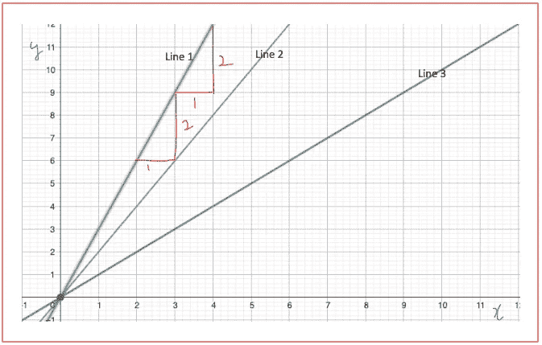
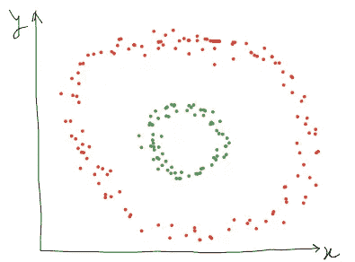
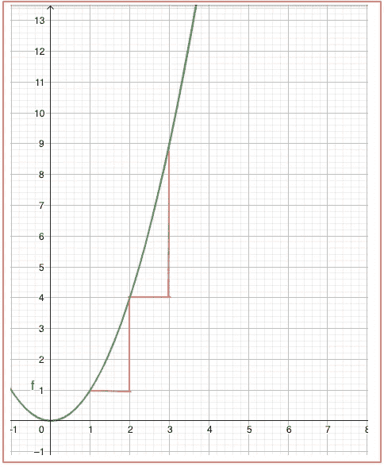
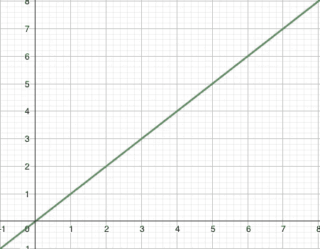
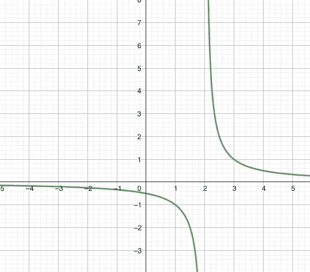
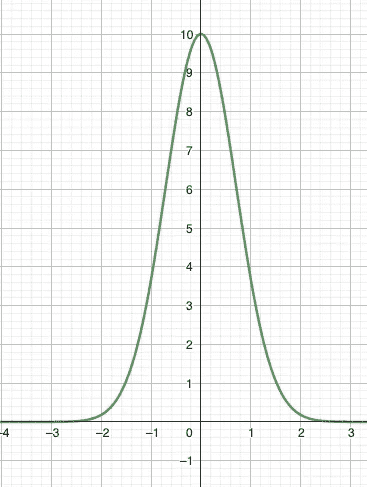
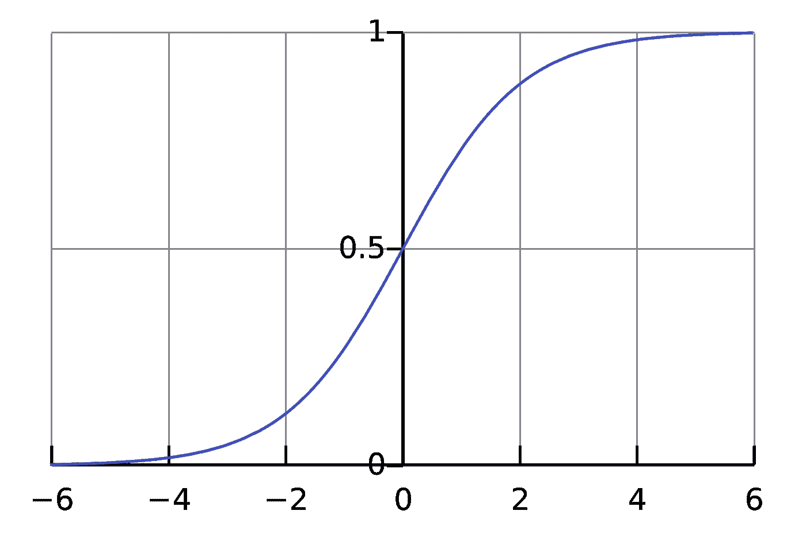
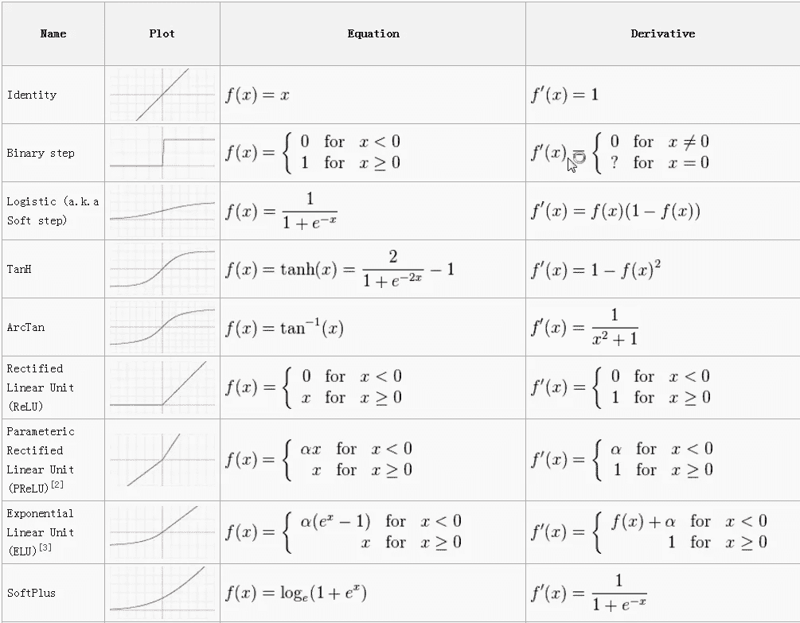

# 如何选择激活功能？

> 原文：<https://blog.devgenius.io/how-are-activation-functions-selected-29d9e0fa293b?source=collection_archive---------26----------------------->

你有没有想过，为什么只有几个函数像 Sigmoid，tanh，ReLU。，或者漏 ReLU 被选为深度学习中的激活函数？这篇文章的目的是简要解释选择一个特定功能作为激活功能的原因。
在进入原因之前，将了解激活功能的类型。
1)线性激活函数。
2)非线性激活函数。

**线性激活函数:**该函数本质上是线性的或者是一条直线。如下所示，函数的输出不会被限制在任何范围之间。线性函数将保持 x 与 y 之间比率差的关系。例如:在第 1 行中，y 轴上两点之间的差为 2，x 轴上的差为 1，比率始终保持不变。这同样适用于第 2 行和第 3 行。

线性函数

在 DL 世界中，线性激活函数通常有助于解决基于回归的问题，否则，问题可以通过传统的机器学习算法来解决。使用 DL 是为了解决复杂的问题。例如，正如我们在下图中看到的，有时，数据呈非线性形状，如圆形或椭圆形。如果你想把两个圆分成两组，一个线性模型将无法做到这一点，但一个具有多个神经元和非线性激活函数的神经网络可以帮助你实现这一点。

**非线性激活函数:**与线性函数相反，如下图所示，非线性函数不会始终保持轴之间的比率不变。

非线性函数

现在，这个话题的重要讨论开始了。要将非线性函数视为激活函数，它必须具有以下属性。

1.非线性的。

2.连续的(导数或微分)。

3.单调递增。

**非线性:**下面的函数不可能是激活函数，因为它本质上是线性的。下面是非线性函数的一个例子。

线性函数(非线性函数)

**连续和微分(微分):**在神经网络中，对于前馈和反向传播，函数必须可微分以更新权重。如果函数不是连续的，在这种情况下，函数的折扣部分斜率/微分将为 0，这是不期望的，理想情况下，这将使方程更新为相同的，权重不变。下面是一个离散函数的例子，这不可能是激活函数。

非连续函数

**单调递增:**这意味着激活函数的值应该增加或保持与 x 相同，而不应该减少。下面是一个非单调递增函数的例子，这不可能是激活函数。

非单调递增函数。

让我们以最著名的激活函数 Sigmod 来检验一下这是否满足所有条件。

Sigmoid 是 x 从-无穷大到+无穷大的任何范围值的函数。该函数的输出从 0 到 1 变化。

sigmoid 函数([来源](https://en.wikipedia.org/wiki/Sigmoid_function#/media/File:Logistic-curve.svg))

1.y 的增加对应于 x 的增加，并不是所有点都一样。

2.函数是连续的，因为它不会在任何时间点中断，并且方程是可微的。

3.从图中可以清楚地看出，该图在任何时间点都是单调递增而非递减的。

相同的逻辑适用于不同的非线性函数，如 tanh、ReLU。，或泄漏的 ReLU。

激活功能([来源](https://towardsdatascience.com/activation-functions-neural-networks-1cbd9f8d91d6)