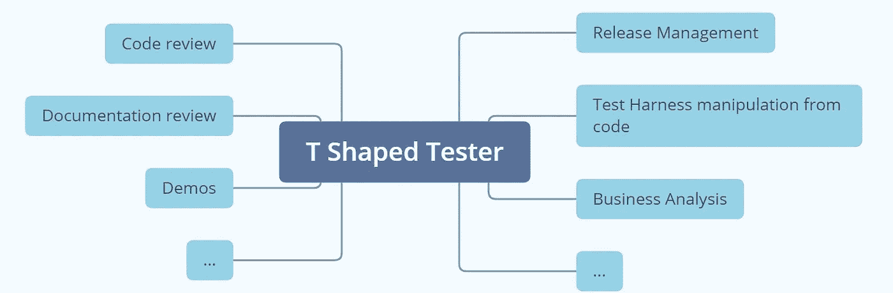

# 如何问“我能为自己做到吗？”让我变得更 T 型

> 原文：<https://blog.devgenius.io/how-asking-can-i-do-that-for-myself-made-me-more-t-shaped-88880235709a?source=collection_archive---------25----------------------->

我是一名手工软件测试人员。我将尝试测试自动化，但是它超出了我的舒适区。所以，当我的经理希望我的测试团队变得更“T 型”时，我很焦虑。我不觉得自己过于技术化，而且我编码的想法很可笑。然而，我对“T 形”在敏捷环境中的含义的概念发生了变化，我意识到我已经在这么做了！

最初，我认为成为“T 型”意味着我将削减代码和建立基础设施，虽然这部分是真的，但我不相信我能做到，直到我意识到，我做到了。与此同时，我渴望成为一名自给自足的测试人员。我不耐烦等待开发人员为我部署代码，所以我问:“我能为自己部署最新的代码吗？”答案是肯定的。我们已经建立了持续集成和持续交付基础架构，我只需要在 Azure DevOps 中导航，自己启动部署。我给自己写了一些笔记，偶尔会遇到中断的合并或者失败的构建，但是很快我就负责了我自己的发布管理。

然后我们用集装箱化做了一些项目。我仍然想部署我自己的版本，但这突然涉及到混合使用 Docker、PowerShell、Kubernetes 和在 YAML 文件中编写设置来构建容器。一开始我很抗拒。这些都是令人生畏的极客工具。但是我又一次对依赖别人来为我发布感到不耐烦，所以我问，“我能自己部署最新的代码吗？”。我和一位非常耐心的基础设施工程师坐在一起，他向我解释了这个难题的所有部分。一旦我在别人的帮助下完成了一次，我就试图用我能记住的方式记录这个过程，但是在我自信地删除容器、改变我的 YAML 文件中的变量和用最新的代码创建新的容器之前，确实花了几个会议和许多问题。

另一次，我不得不在 Visual Studio 代码中对各种设置文件进行更改，这样我就不必依赖开发人员来操作我的测试标准，同时使用非常基本的测试工具。我进行分支，提取最新的代码，进行修改，编译，然后构建我自己的代码本地版本，这样我就可以运行我的测试了。虽然我仍然不得不偶尔寻求帮助，但我认为开发人员真的很感激我尝试学习这一新技能并腾出他们的时间，所以他们非常乐意帮我摆脱困境。

在项目中，通常没有业务分析师，这是一个我很乐意承担的角色，为团队收拾残局。理解遗留软件和记录客户需求是我的专长。我将能够把我的测试技能和我的 BA 技能结合起来，并为团队准备具有良好定义的验收标准的用户故事，以便在 sprint 规划中进行讨论。

有了一个测试人员的整体视角，我可以在需要的时候轻松地运行客户演示，并且我有足够的技术文档经验，能够审查，并提供关于架构设计、线框和构建规范的良好反馈。那时我意识到，我变成了“T 型身材”。在危机中，我可以让一些齿轮转动，我可以——在一点指导下——迅速提升技能，暂时填补团队中的空缺。这就是“T 型”的含义。我觉得自己对团队贡献更大。我所有的新技能都归功于我周围的团队，他们花时间教我并回答我的问题，而一开始他们自己做会更快。从长远来看，他们对我的耐心为他们节省了很多时间，并给整个团队带来了自豪感和成就感。正是这种感觉确保我永远不会停止问“我能为自己做到吗？”。