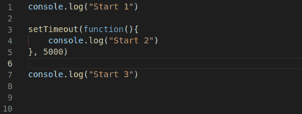

# JavaScript 中异步的工作原理。事件循环概念

> 原文：<https://blog.devgenius.io/how-asynchronous-works-in-javascript-event-loop-concept-3bf609d8be96?source=collection_archive---------6----------------------->

*由基里尔·比契科夫为* [*UppLabs*](https://upplabs.com/) *所写。*

JavaScript 中异步的工作原理。事件循环概念。由 UppLabs 提供

当您需要的只是一个简单的工作界面时，JavaScript 就很容易了。当界面变得更加复杂时，问题就出现了。这里你需要对 JavaScript 有更深入的了解。重要的是，即使一个大而复杂的接口保持快速响应。响应通常是通过使用异步函数来实现的。这意味着您可以让代码同时做几件事，而不用停止或阻塞主线程。

在本文中，我将尽可能简单地告诉您 JavaScript 中异步的工作原理。在我一生中的所有面试中，我总是被问到这个问题。当你开始学习 JS 时，它可能看起来令人生畏，但实际上，一切都要简单得多。

## 事件循环是如何工作的？

事件循环是每个 JavaScript 开发人员都会以某种方式遇到的事情之一。JavaScript 提供了基于事件循环的并发模型，它执行代码、收集和处理事件，并执行排队的子任务。

## 让我们看一个设置超时的例子。

我想不难猜到这些日志会以什么顺序被调用。让我们检查一下。

但是让我们来看看引擎盖下发生了什么。在这个例子中，我正在使用这个[有用的站点](http://latentflip.com/)

当程序启动时，它会遍历代码行。当遇到一个异步操作时，解释器将这个操作抛出到一个调用栈中。在堆栈中，它开始看起来像一个特定的设置超时和浏览器 API。然后，它抛出设置的超时，并在 web APIs 中注册一些匿名函数，这些函数将在 5000 秒后浏览器完成设置的超时时执行。接下来，匿名函数进入回调队列。一个无限循环在队列中运行，该队列遍历它的元素，如果它检测到函数准备好了，它就把它扔回调用堆栈并执行。

因此，我们不会阻止代码的工作。我们不仅讨论设置超时，还讨论其他异步操作，比如与服务器一起工作的事件监听器。

但是，如果将 0 作为第二个参数传递给超时设置，会发生什么呢？一模一样。让我们看看。

浏览器仍然会将该功能放入 web API，程序将继续工作。

让我们看看事件监听器是如何工作的。

事件监听器，如上所述，也是一个异步事件，并转到 web API。你现在明白退订听事件的重要性了。你可以在这里阅读更多细节

## **宏任务**

让我们以同一个事件为例，试着点击几次按钮。

我们看到一系列事件。这是宏任务回调队列，v8 术语。队列中的任务根据先进先出规则执行。

**让我们注意两个细节:**

1.  在引擎执行任务的过程中，不会呈现页面。任务需要多长时间并不重要。对 DOM 的更改只有在任务完成后才会呈现。
2.  如果任务需要很长时间，并且浏览器无法执行其他任务或处理用户事件。因此，过一段时间后，浏览器会让你“杀死”这个长时间运行的任务。当脚本包含大量复杂计算或导致无限循环的错误时，这是可能的。

## **微任务**

我们可以在最后一个例子中看到微任务。当宏任务执行时，其中的函数被放在调用堆栈中。新的宏任务直到微任务完成后才开始执行。如果需要更多的例子，可以查看[这里](https://developer.mozilla.org/en-US/docs/Web/API/HTML_DOM_API/Microtask_guide)。

**结论**

感谢 JavaScript，我们可以编写异步应用程序，而无需考虑数据完整性和数据一致性等多线程问题。如果我们正在执行一个耗时的操作，比如查询数据库并使用结果填充模板，那么最好将它们推出主线程并异步执行任务。我们用大量的回调和不断丢失的上下文来补偿这些好处。

根据任务的具体情况，可能会使用 async/await、回调或不同技术的混合。事实上，选择哪种异步开发方法取决于项目的具体情况。如果某个方法允许您使用易于维护并且其他团队成员能够容易理解的可读代码来解决问题，那么这个方法就是您所需要的！

现在你可以使用回调、承诺或异步/等待，并理解它在浏览器中的工作方式:)

我希望这篇文章对你有帮助。你也可以在我们的[博客](https://upplabs.com/)上找到更多有用的信息。