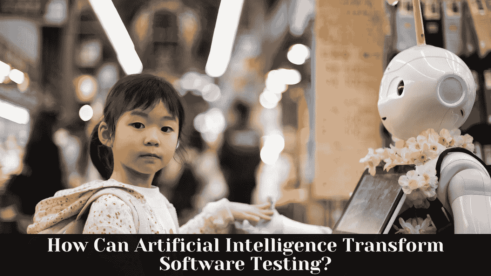
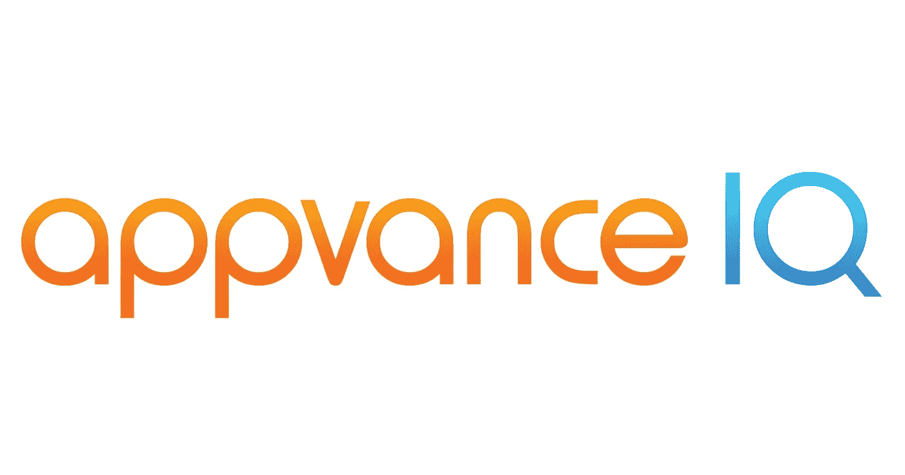
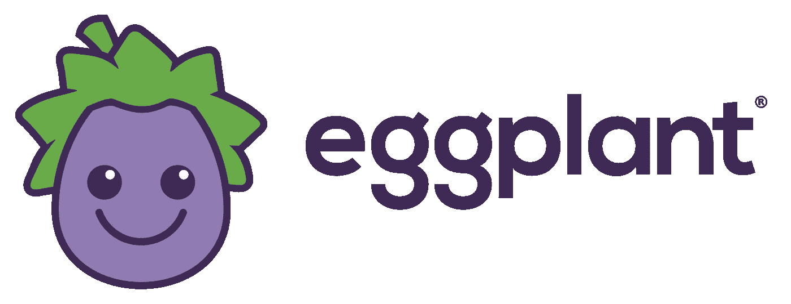

# 人工智能如何改造软件测试？

> 原文：<https://blog.devgenius.io/how-can-artificial-intelligence-transform-software-testing-81d9e4fbf219?source=collection_archive---------2----------------------->

人工智能是所有领域和垂直行业都可以利用的尖端技术。类似地，人工智能正被用于软件测试和 QA 领域，以简化测试过程并交付更高质量的结果。为了成功地引入最新的软件，不可避免地要以一种平稳的方式进行测试。很明显，让 QA 测试有效的关键在于 AI(人工智能)。通过使用可以完全像人类一样工作的技术，QA 专家可以超越手工测试的旧方法，向基于精度的测试系统发展。

**有趣的是，AI(人工智能)测试框架可以更有效地识别陷阱，随着算法的不断升级，即使是最少量的错误也可以发现。** AI 测试框架需要少量维护，可以自行发现新路径。随着企业对人工智能的认识，测试人员可以使用它来简化决策过程，并提高 QA 领域的效率。这个点的优化，随着人工智能的引入，可以达到一个不可思议的高度。人工智能执行重复的日常工作，给出代码质量报告，并帮助系统化过程。人工智能还可以协助团队学习和协助，有大量的商业应用程序——可能性是无限的。

制造业、医疗保健、金融和物流等多个行业正在利用人工智能来简化他们的流程。将人工智能纳入框架极大地包含了使用基于人工智能的应用程序和物联网设备来控制和自动化所涉及的程序。因此，这些人工智能应用的成功或失败将对业务产生影响。因此，在部署之前测试这些应用程序变得至关重要。然而，软件测试面临一系列挑战。这些因素包括缺乏意识、现实应用中与稳定性、性能、功能和可扩展性相关的挑战。

**人工智能在软件测试中的意义**

自动化测试的增加与软件开发中敏捷方法的接受相一致。这使得 QA 专家小组能够小批量地交付无错误且健壮的软件。手工测试仅限于业务验收测试。开发运维测试和自动化有助于敏捷团队通过持续集成/持续交付渠道为 SaaS/云部署交付有保证的产品。

在软件测试中，人工智能融合了机器学习、认知自动化、推理、分析和自然语言处理。认知自动化利用了几种技术方法，如数据挖掘、语义技术、文本分析、机器学习和自然语言处理。例如，机器人流程自动化(RPA)就是人工智能和认知计算之间的一个连接环节。

**在 QA 中使用人工智能可以帮助克服这些争议，并使软件测试过程不那么繁琐和自动化。那么，让我们看看人工智能是如何改变传统的软件测试方法的。**

**1。自动编写测试用例**

自动化测试中机器学习/人工智能的巨大应用程序一直在为应用程序或软件自动编写测试用例。在早期，我们听说过网络爬虫和“蜘蛛网”(使用自动化程序或脚本以系统化和自动化的方式浏览网页/软件)，它们帮助我们找到了 404 个死页。

现在，机器学习/ AI 工具已经远远领先于学习测试中的应用程序的业务使用场景。他们只需要指向软件。在学习应用程序时，他们会自动抓取和收集有用的数据，如 HTML 页面和页面加载时间，以及截图。随着时间的推移，他们从应用程序中收集了足够的数据，以便他们可以为应用程序的预期模式训练机器学习模型。

当它们被执行/运行时，应用程序的当前状态与已知或保存的模式进行比较。如果有任何视觉差异、错误、运行时间慢或相同的问题，则自动系统将其标记为潜在问题。但是，在少数情况下，这种区别可能是有效的。在这种情况下，QA 专家需要验证故障或错误。

**2。视觉验证自动化测试**

视觉验证测试是 QA 的一部分，测试评估用户界面是否正确显示给最终用户。测试的目标不是确保解决方案交付预期的性能，而是仔细检查每个 UI 组件的大小、位置、颜色和形状是否正确。

自动化视觉测试是困难的，因为存在无数可能的错误场景。测试人员需要形象化用户的心态，用他们的眼睛观察用户界面。即使对于手工测试人员来说也很难，更不用说自动化程序了。这就是为什么将可视化测试改为自动化解决方案与不情愿的规范和细节相关联——QA 专家旨在精确地设置条件，但最终却得到一个混乱的文件——这实际上是不可能实现的。

人工智能分析应用运行的环境——操作系统、浏览器、硬件要求，并检测哪些用户界面标准适用。与常规的自动化视觉验证测试不同，基于人工智能的场景可以适应消费者的需求。

**3。增强可靠性**

你是因为软件开发人员对应用程序的小修改(如调整大小或重命名字段)而导致 Selenium 测试或 UFT 失败的人之一吗？如果是，那么不要焦虑，这是大多数 QA 专家面临的问题。现在人工智能可以纠正代码，使其变得额外可管理和可靠，这样你就不必在每次开发人员做出小的改变时都修改测试。

人工智能/机器学习工具可以读取对 app 所做的修改，并理解它们之间的关系。这种自我修复测试脚本会注意到应用程序中的变化，并开始学习修改的模式，然后可以在运行时识别变化，而无需您执行任何操作。随着应用程序的发展，机器学习脚本会自动调整，从而减少自动化测试的脆弱性和不稳定性。

**4。简化的基于用户界面的测试**

机器学习/ AI 给自动化测试带来的另一个修改是没有 UI 的自动化。诸如性能、单元集成、漏洞和安全性等非功能性测试也不例外。可以应用基于人工智能/机器学习的技术来在这些层中生成测试。此外，AI/ML 应用于几个应用程序日志，如生产监控系统日志和源代码，有助于开发一般软件生态系统中的错误预测、自我修复、早期通知和自动扩展能力。

基于人工智能的测试减少了总体测试成本、时间、脚本和错误。这不正是我们所渴望的吗？毫无疑问，机器学习和人工智能是 QA 行业的游戏规则改变者，因此它将很快成为市场趋势。现在是 QA 团队转向基于人工智能的软件开发、管理和测试方法的时候了。

**5。自我修复参与执行硒测试**

Selenium 测试是高效的测试框架。然而，有时它们是耗时的、复杂的，甚至一个小的技术错误都会导致测试用例增长的失败。基于人工智能的解决方案自动确定此类错误并帮助自我修复。它还提供了智能的技术见解，以改善其他测试程序。

**6。快速上市时间**

上述两个好处的结合有助于开发者和执行者。在 QA 测试中使用人工智能可以在测试所需的最短时间内带来更好的应用程序开发。因此，最终产品可以最早地被广告、销售和用于商业用途。因此，软件开发人员可以用最少的错误更快地构建产品，用户可以最早开始使用产品，并在适当的时候成为最终用户。因此，这对参与的每一方都是双赢的局面。

**7。预测分析**

基于人工智能的测试可以利用现有的客户数据和分析数据，找出用户需求和用户浏览行为在未来将如何发展。它确保 QA 开发人员和测试人员领先消费者一步&他们的需求。有了基于人工智能的解决方案，服务质量将得到提高，对不断增长的需求的预测也将更准确。

**8。可靠有效**

人工智能算法在 QA 测试中引入了效率。人工智能理论也通过减少人力和严格的成本提高了测试方法的可靠性。该程序是可靠的，因为故障将通过检查代码来检查，这些代码不会在没有解决它们的情况下留下缺陷。

**9。质量提高**

随着人工激励智能的使用，软件质量将得到广泛发展。由于所有的测试技术都将自动执行并具有可靠的确定性，因此质量将大大提高。此外，随着市场有效性的提高，应用程序的寿命将大大提高。

10。最早的响应/反馈

由于基于人工智能的测试过程是自动化的，开发人员将获得关于应用程序效率和工作的快速反馈报告。另外，争议和缺陷将被迅速解决，因此，产品可以被迅速引入市场。

**11。集成平台**

整个过程在嵌入式和集成平台上执行。这将使开发人员更容易在客户的站点上毫无困难地启动站点。因此，执行程序会变得格外迟缓。基于人工智能的应用程序继续在软件测试领域被广泛接受，在未来，该技术将有助于增强现有的框架和工具，以瞄准精确的问题。

**用于测试自动化的人工智能工具**

通过探索当前的工具，你可以直接在你的测试自动化中开始执行人工智能。我们挑选了 QA 测试自动化、监控、QA 预测和监控以及可视化测试的最佳工具。

****

**该软件/工具通过计算用户的行为和执行认知生成来分析应用的核心特征。该应用程序预测用户可能会利用哪些机会，并确保产品展示出合适的性能，主要是在这些重要功能上。额外的特性包括 AJAX 自动捕获、逐屏分析和测试用例设计。**

****[**茄子艾**](http://docs.testplant.com/EAI/eggplant-ai-documentation-home.htm)****

********

****该工具利用人工智能来预测经过充分测试的软件中的技术故障，在更短的时间内导航 1000 个功能，并提供智能数据驱动的解决方案。该仪器可以连接到任何自动化引擎，它还提供了所有行动的图形报告。****

******[**test . ai**](https://www.test.ai/)******

********

****该工具自动构建软件的功能，并检查各种屏幕。关键的目的在于开发有效的案例来衡量每一种情况。测试。人工智能跟踪和追踪任何成分的变化，并确定它是消极的还是积极的。如果很少特征需要人工测试，人工智能将评估情况，并立即提醒 QA 团队。****

******[**应用工具**](https://applitools.com/)******

********

****它是著名的基于人工智能的可视化自动化测试工具之一。配备了健壮的视觉，Applitools 可以预测用户在应用程序上的活动，并总结软件的结构。该工具将用户的期望与现有界面进行比较，确定不一致性，并适应不同的浏览器和屏幕尺寸。****

******[**Testsigma**](https://testsigma.com/)******

********

****如果您希望减少测试自动化中的人工参与，您可以寻求 test sigma——一种评估测试用例质量的语言处理软件工具，这样 QA 专家就不必这么做了。该工具将自动检测过载威胁，确定相关的测试用例，并控制瓶颈。****

******结论******

****简而言之，在 QA 测试中使用人工智能的最终目的是为了一个软件能够分析、诊断和自我诊断的世界。这可以实现高质量的工程设计，并且可以将测试时间从几个小时减少到几天。在 QA 测试中部署人工智能可以节省资金、资源和时间，并帮助测试人员将注意力集中在执行一件重要的事情上——发布优秀的软件。****