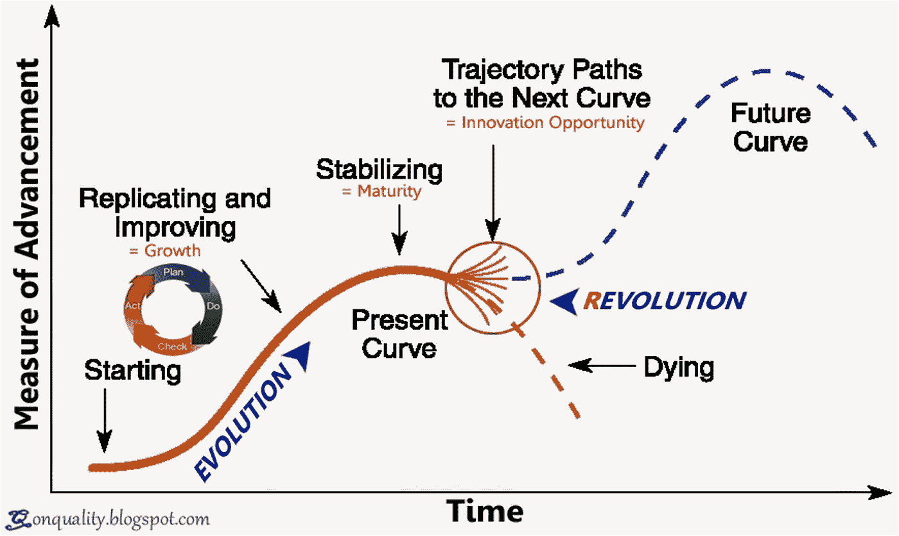
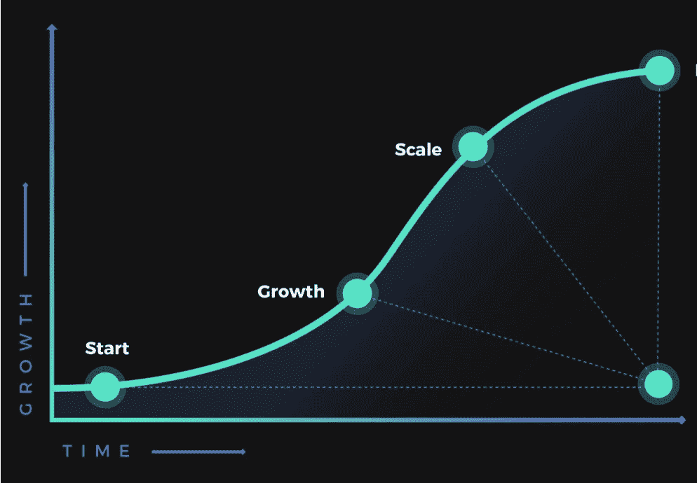
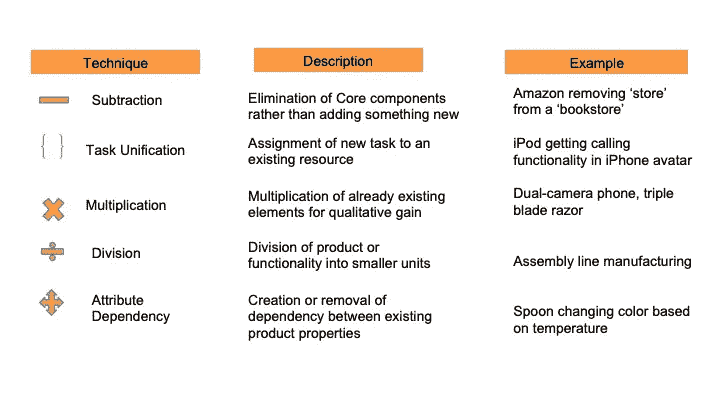

# 工程经理如何积极管理团队中的创新？

> 原文：<https://blog.devgenius.io/how-can-engineering-managers-actively-manage-innovation-in-their-teams-e5eaad76e27b?source=collection_archive---------2----------------------->

## 工程创新太重要了，不能等待天才的突然出现。

这篇博客是博客系列的一部分— [工业时代的管理工具如何帮助有效的工程管理？](https://medium.com/@meet.aman.gupta/how-can-industrial-era-management-tools-help-in-effective-engineering-management-862104a33d80)

您可以访问上面的上下文链接和本系列其他文章的链接。

工程经理必须积极管理创新，不应该听天由命。

传说年轻的艾萨克·牛顿(Isaac Newton)坐在一棵苹果树下，被落下的水果击中头部，这是一个 17 世纪的“啊哈时刻”，促使他突然提出了万有引力定律[ [1](https://www.newscientist.com/article/2170052-newtons-apple-the-real-story/) ]。阿基米德也有类似的“灵光一现”时刻，当时他在浴缸里发现了浮力原理。

这样的故事可能会灌输这样一种信念，即创新需要突发奇想，而要创新，我们需要做的就是在苹果树下等待那个价值十亿美元的想法。不幸的是，创新对于现代企业来说太重要了，不能一直等待那个“啊哈”时刻。我认为管理者应该积极管理创新，就像他们管理管理的其他重要方面一样。

## **扔给你的团队一个(创新)曲线球**

创新的 s 曲线

首先，要管理创新，我们需要了解创新的生命周期以及在这个周期中所处的阶段。

创新通常遵循 S 曲线模型，该模型在以下阶段起作用:

1.  第一阶段:蜗牛式的增长，包括大量的尝试和错误
2.  **阶段 2** :一段时间后，团队破解工作模型。在这个转折点，团队进入进化成长阶段。
    在这个阶段，我们通过复制和改进产品中行之有效的东西来实现增长。如果在一定范围内做得好，它会为组织开启一个指数增长的阶段。
3.  **第三阶段**:在第二阶段的梦幻之旅之后，当产品稳定下来，我们面临另一个拐点，增长开始进入平台期。虽然目前的产品仍然是摇钱树，但这是一个人应该对新的创新想法更加积极的阶段。
4.  **阶段 4:** 如果这些新的创新想法中的任何一个成功了，我们就会看到 S 曲线的重复模式；否则，产品或组织会自然死亡。

## 我们能从 S 曲线中学到什么？

既然我们已经理解了创新 S 曲线。以下是创新周期每个阶段的一些考虑点:

1.  在第一阶段，进展会很缓慢。涉众和团队可能会将如此缓慢的进展误认为没有进展，从而导致沮丧。工程经理必须**主动向利益相关者传达**小胜，**积极加强**团队。
2.  当团队开发出适合客户的产品时，不是休息的时候。在成长阶段，我们必须坚持不懈地通过产品和运营优化来追求规模和效率。
3.  在增长阶段的中期，有些人可能会觉得我们将永远保持指数增长。然而，S 曲线表明，即使是最好的时代也会结束。成长阶段不是沾沾自喜的时候。这是利润最大化的时候，同时致力于下一个创新。
4.  s 曲线还表明，你的产品或技术在巅峰时期有多好并不重要；他们仍将面临生命的终点**。因此，不要对你目前的产品或技术产生感情。当到了向一项技术说再见的时候，为平稳过渡带头，而不是在政治上为它辩护，拖延不可避免的事情。**
5.  最重要的是，因为每项技术最终都会消亡，所以在你的团队中把创新作为一个过程是有意义的。如果一个人一直在等待一个绝妙的想法出现，创新将会充满挑战。创新应该是我们日常工作的一部分。

## 盒子里的创新

像庆祝量子飞跃一样庆祝渐进式创新

为了让创新成为一个过程，我想提出一个稍微反直觉的方法，即在盒子里思考。

有足够多的材料表明，打破常规的思维可以制造出像 iPhones 这样的颠覆性产品。这些思考过程有其优点，我不打算否认它们，但我也觉得有时寻找这样宏伟的想法贬低了增量的改进。我的观点是，即使是渐进式的创新也要庆祝。

## **系统的创造性思维(SIT)**

SIT 是认为创新是一个渐进过程的框架之一。

> **系统发明思维(SIT)** 是 20 世纪 90 年代中期在以色列发展起来的一种思维方法，源于[的](https://en.wikipedia.org/wiki/Genrich_Altshuller)[3](https://en.wikipedia.org/wiki/Genrich_Altshuller)[TRIZ](https://en.wikipedia.org/wiki/TRIZ)[4](https://en.wikipedia.org/wiki/TRIZ)工程学科。你可以通过超链接了解更多信息。

许多创新思维过程(如设计思维)的基础是，新产品创意的最佳来源是客户，包括现有客户和潜在客户。然而，我们越来越多地看到，客户缺乏想象力来设想创新产品，以满足他们新兴甚至现有的需求或愿望。正如亨利·福特曾经讽刺的那样—

> 如果我问人们想要什么，他们会说更快的马

在这种情况下，客户可以很好地描述他们的问题，他们希望更快地从 A 点到达 B 点，但他们缺乏描述创新解决方案的想象力。

SIT 理论认为创新的解决方案有共同的模式。不关注创新解决方案的不同之处，而是关注它们的共同点，这是 SIT 方法的核心。[ [6](https://en.wikipedia.org/wiki/Systematic_inventive_thinking)

SIT 框架提供了五种思考工具，可以深入了解现有产品的特性，从而思考产品的下一次迭代。这五种思维技巧是——减法、任务统一、乘法、除法和属性依赖。

我试着把这些思考工具和真实世界的例子放在下表中，以帮助读者进行类比。这些只是例子，并不是说这些公司利用 SIT 技术创新了这些产品。

SIT 五种思维技巧及相应的例子

## 外卖食品

这里有一个 TL；本博客的 DR 摘要:

1.  不要把创新视为重大的突发天才之举。积极地管理它，就像组织中的其他工程过程一样
2.  理解创新生命周期的 S 曲线，并根据产品所处的创新阶段采取行动
3.  庆祝渐进式创新，而不仅仅是巨大的飞跃
4.  了解关于创新的各种思维技巧，如 SIT、设计思维等。，并在您的团队中部署这些技术，以实现更可预测的创新周期

虽然听到关于科学突破的传奇是鼓舞人心的，但我恳请你考虑在你的团队中采取更可预测的创新方法。

请通过 Linkedin 联系我，以便进一步交流。

[这里的](https://medium.com/@meet.aman.gupta/how-can-industrial-era-management-tools-help-in-effective-engineering-management-862104a33d80)是该系列主页的链接，方便参考。

如果你喜欢读这篇文章，别忘了鼓掌👏请关注我，了解更多关于工程管理的内容。欢迎反馈！

*非常感谢！*

# 参考

1.  [https://www . new scientist . com/article/2170052-newtons-apple-the-real-story/](https://www.newscientist.com/article/2170052-newtons-apple-the-real-story/)
2.  [https://www.livescience.com/58839-archimedes-principle.html](https://www.livescience.com/58839-archimedes-principle.html)
3.  [https://en.wikipedia.org/wiki/Genrich_Altshuller](https://en.wikipedia.org/wiki/Genrich_Altshuller)
4.  [https://en.wikipedia.org/wiki/TRIZ](https://en.wikipedia.org/wiki/TRIZ)
5.  [https://www . goodreads . com/quotes/15297-if-I-have-quest-people-they-want-they-they-would](https://www.goodreads.com/quotes/15297-if-i-had-asked-people-what-they-wanted-they-would)
6.  [https://en.wikipedia.org/wiki/Systematic_inventive_thinking](https://en.wikipedia.org/wiki/Systematic_inventive_thinking)