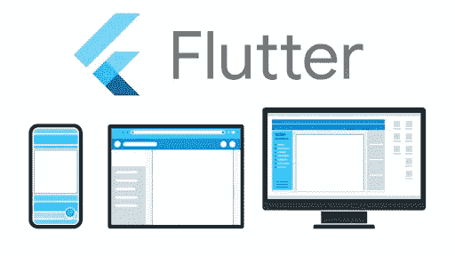
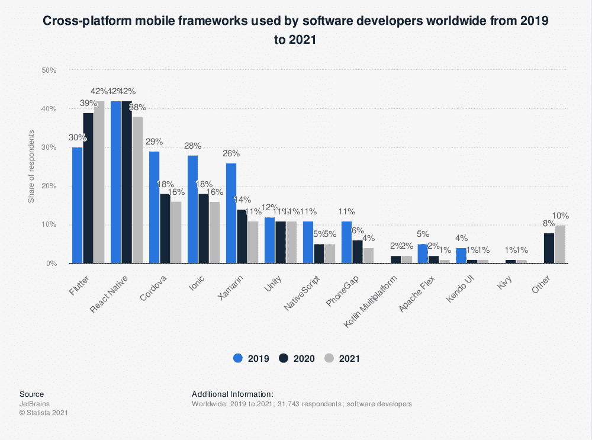
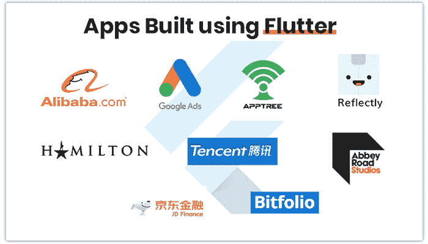
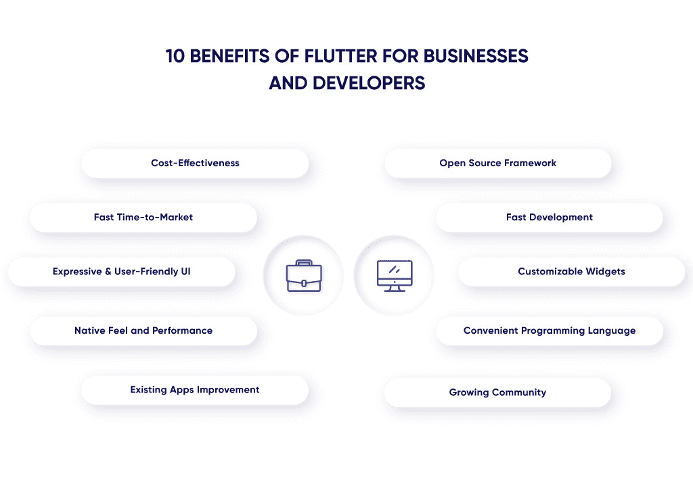

# Flutter 如何为企业开启成功之门？

> 原文：<https://blog.devgenius.io/how-can-flutter-unlock-the-door-of-success-for-businesses-df76e681236f?source=collection_archive---------16----------------------->

图片来源: [Siliconangle](https://siliconangle.com/2021/09/08/google-introduces-flutter-2-5-big-performance-updates-new-material-support/)

你一定听说过基于 Flutter 的跨平台开发。许多技术爱好者认为这是谷歌将 iOS 和 Android 从其移动领域赶下台的最新尝试。

然而，Flutter 还有很多方面是企业几乎不知道的。事实上，在当今竞争激烈的市场中，Flutter 有潜力为企业带来成功。

我们将浏览一下这一令人惊叹的新技术，通过让您在更多平台上接触到更多潜在客户，它可以帮助您的企业销售飙升。所以，继续读下去。

**什么是旋舞？**

Flutter 是一个跨平台的开发框架，在移动应用程序开发界引起了轰动。此外，它可以彻底改变应用程序，使之成为下一代解决方案。

最近，微软宣布他们将在所有平台上采用 Flutter，包括 Windows、Android 和 IOS。这是微软最大的举措之一，因为我们看到他们采用了像 Flutter 这样的开源语言，而不是创建自己的语言。

[图片来源](https://www.statista.com/statistics/869224/worldwide-software-developer-working-hours/)

目前，越来越多的企业转向跨平台框架来构建他们的应用程序。还有！它的出现仅仅是因为与其他方法相比有一些明显的优势。

许多行业的开发人员都认识到跨平台框架(XCF)是困扰商业应用的常见问题的潜在解决方案。XCF 的一些问题包括维护成本、缓慢的部署时间、成本超支和生命周期短。

但是随着新技术的出现，比如 Flutter，开发人员有了一个新的工具来解决这些问题，效率是以前无法想象的。因此，企业必须**雇佣 flutter 开发者**来创建跨平台的应用程序以赢得竞争。

**为什么 Flutter 这么受欢迎？**

谷歌的移动应用框架 Flutter 最近大受欢迎。但是为什么呢？嗯！因为它让开发者创建跨平台的应用成为可能。

这意味着你可以用一套代码为多个平台构建一个应用。对于希望通过移动设备和台式机访问业务的企业来说，这是一个好消息。

此外，它提供了快速的开发时间和对人工智能、机器学习和虚拟现实等热门话题的支持。简而言之，许多专家认为它很可能处于所有移动事物的最前沿。

[图像来源](https://www.mobileappdaily.com/apps-developed-using-flutter-framework)

在最近的一项研究中，市场上只有 0.21%的应用是基于 Flutter 的。因此，对于希望让自己的应用在谷歌 Play 商店和苹果应用商店脱颖而出的开发者来说，这使得 flutter 应用成为一个不常见的选择。

然而，Flutter 可以提供快速开发，因为在使用 Unity 或 Unreal 4 engines 这样的平台时，您不需要等待程序加载。在这些平台上，即时加载至关重要，因为游戏爱好者需要快速响应。

所以，如果你想更快地创建你的商业应用，你必须**雇佣一个优秀的应用开发者。**

**颤振开发如何成为企业成功的关键？**

很多企业和创业公司问他们为什么要选择 Flutter 进行应用程序开发。或者！Flutter 如何帮助企业取得成功？嗯，Flutter 作为一个跨平台的应用程序开发框架，为企业带来了许多好处。

以下几个方面表明，在当代，Flutter 可能是开启企业成功之门的关键。

**#1。Flutter 能让你更快地启动应用程序**

商业世界讲究的是速度。无论你是创业企业主还是企业主，时间真的很重要。

还有！如果你的竞争对手走在了前面，那么推迟推出新产品是没有意义的，因为他们可能会蚕食任何可能因推迟而获得的市场份额。

此外，初创公司需要在竞争对手复制它们之前快速推出，这可能比让所有人同时加入的成本高出 42%。所以，创业公司要趁着机会好好把握！

此外，对于时间紧迫的业务来说，构建最小可行产品(MVP)的重要性怎么强调都不为过。用 Flutter 构建跨平台应用如此重要的原因在于 MVP 如何帮助这个过程，反之亦然！

以下是 Flutter 的一些特性，这些特性让它在业务增长方面表现出色。

*   **热重装**

Flutter 中的热重新加载特性使开发人员能够进行修改，并在仿真器或硬件上即时预览。在 MVP 中，这个特性可以减少变更过程中的所有麻烦。

此外，这一特性加快了应用程序 MVP(最小可行产品)开发的时间，当你试图在竞争对手之前快速构建一些东西时，这一点至关重要！

*   **两个平台一个代码**

谷歌新的 Flutter 应用程序开发框架是一种跨平台的方式，只需编写一次代码，即可为 iOS 和 Android 构建应用程序。通过一些巧妙的调整，构建两种不同类型的应用程序所花费的时间可以大大减少！

此外，有许多内置的小部件使得开发应用程序比以往任何时候都要快。此外，我们知道当 SDK(软件开发工具包)只在 Windows 平台上发布时有多难。

现在有了这个令人兴奋的消息，Google 即将推出他们自己的电话系统程序员接口库，应用程序开发将会是一件乐事。

*   **更快的测试& QA**

通过减少测试时间，Flutter 使测试人员和 QA 的生活变得更加容易。有了 Flutters 单代码库，他们可以轻松地在不同平台上测试这两个应用程序，而不会对每个操作系统的功能感到困惑。

如果你使用的是 iOS 平台，那么不会有任何问题，因为它支持所有设备，而当我们谈论 Android 操作系统时，事情就变得复杂了，因为支持不同的品牌和品牌。

简而言之，通过避免维护和开发时间的问题，Flutter 允许企业在不同的平台上更快地启动移动应用程序。因此，无论是创业公司还是企业都必须**雇佣优秀的开发人员**来更快地推广他们的应用。

**#2。Flutter 是同时发布 Android & iOS 应用**的划算选择

使用 Flutter 可以节省开发成本。这是因为它能够创建在多个平台上无缝运行的应用程序代码，比如 iOS 和 Android 等；

此外，代码不只是像 Windows 或 Web 浏览器可能需要的一种特定类型。从长远来看，这方面可以节省大量的时间和金钱！

[**图片来源**](https://light-it.net/blog/benefits-of-flutter-app-development/)

**#3。Flutter 允许您即使在低预算的情况下也能保持应用程序的质量**

小型企业应该考虑使用 Flutter 进行应用程序开发。该框架的跨平台能力使其成为创建快速、功能强大的应用程序的绝佳选择。

此外，你可以用比 iOS 或 Android 等其他流行平台更低的预算开发出好的功能和设计。总之，Flutter 应用程序开发人员可以在保持质量标准的同时为客户提供闪电般的速度(尽管并不总是如此)。

一般来说，在更大的设备上保持质量是困难的，因为用户需求的增加，测试需要更长的时间。因此，发布后的 bug 修复和错误检测始终是企业所经历的。

然而，Flutter 可以帮助您避免这样的麻烦，开发人员可以在早期阶段识别 bug。

**#4。Flutter 帮助您创造卓越的用户体验**

Flutter 是想要直观、易用界面的用户的最佳选择。凭借 Flutters 自己的渲染引擎，无论您使用什么平台，它都可以提供令人难以置信的用户体验。

此外，它使 Flutter 应用程序开发人员在设备/游戏等之间切换时不必更改代码。

**#5。Flutter 提供了巨大的生产力**

Flutter 以其热重新加载功能而闻名，该功能允许开发人员和设计人员更高效地工作。对于 UI 中的更改，设计人员可以轻松完成，同时双方可以在开发过程中立即看到这些修改。

它节省了每个人完成各自任务的时间。

**#6。Flutter 使第三方访问变得容易**

Flutter 可以轻松访问第三方插件，使应用程序开发更加流畅。凭借广泛的免费工具和小部件选择，Flutter 的应用程序开发过程非常直观，并且为开发人员提供了完美的 UI 套件。

**#7。Flutter 允许你开发高性能的应用程序**

Flutter 使您能够构建快速、简单、美观的应用程序，并且可以在任何地方运行！使用 Flutter，您可以创建高性能的移动或 web 应用程序，而无需对代码进行任何更改。

这使得它非常适合那些希望自己的应用程序可以在多个平台上使用的企业——无论他们现在使用的是哪种设备。

**包装完毕**

Flutter 是一个跨平台的移动应用程序开发框架，可以帮助您为 Android 和 iOS 设备构建原生应用程序。在这个强大工具的帮助下， **Flutter 应用程序开发人员**可以轻松创建具有丰富功能的高性能应用程序，提供出色的用户体验。

使用 Flutter 开发你的应用程序最好的地方是它的成本效益；不管你的预算是少还是多，因为 Flutter 允许你在保持质量的同时降低成本。

如果你正在寻找一种方法来更快地推出新产品，并在不打破银行的情况下跟上消费者的需求，那么你必须**雇用 Flutter 应用程序开发人员。**