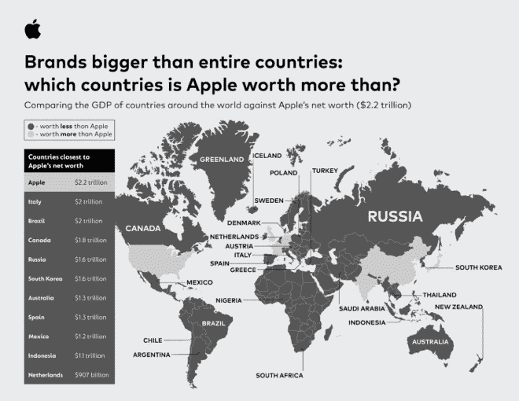
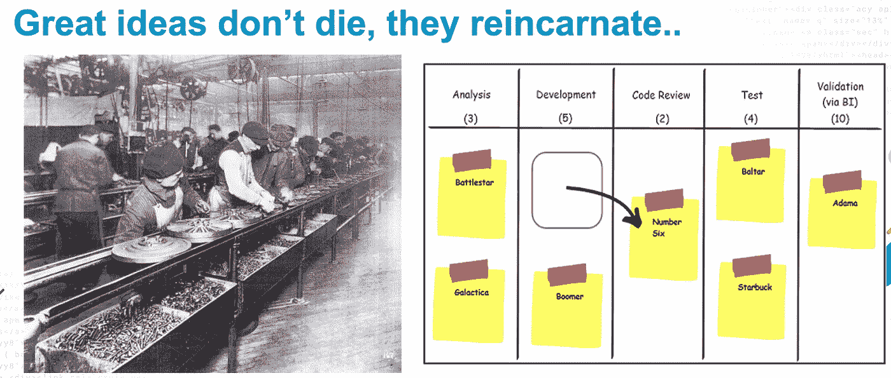

# 工业时代的管理工具如何帮助有效的工程管理？

> 原文：<https://blog.devgenius.io/how-can-industrial-era-management-tools-help-in-effective-engineering-management-862104a33d80?source=collection_archive---------13----------------------->

## 工业时代发展起来的管理原则在软件工程领域仍然有效。

公司是新的国家！苹果公司在 2022 年 1 月 4 日达到了 3 万亿美元的市值。把这个庞大的数字放在背景中，如果苹果是一个国家，它将是世界上第五个最繁荣的国家，仅次于美国、中国、日本和德国。这个市值让苹果比全球 98%的国家都富有。苹果的同行，比如微软、Alphabet、亚马逊，也不甘落后，比世界上 90%的国家都富裕。

图 1:根据 2021 年的数据，苹果比地图上所有阴影部分的国家都富裕。这使得它比世界上超过 96%的人更富有

当组织在人类历史的大部分时间里只从事农业时，实现这样的市场估值是值得称赞的。然而，随着 19 世纪中期工业革命的大爆炸，这一切都改变了。工业革命创造了如此丰富的资源，以至于挣扎在马斯洛需求层次基础上的人类可以梦想在不到 200 年的时间里到达火星。

# 时代变了，宏伟的愿景不变。

分析家认为亨利·福特因其在装配线和 5 美元工作日方面的创新而成为工业革命的典型代表。当汽车还是新奇事物时，亨利·福特就有向每个人提供汽车的设想。

图 2:福特和盖茨对各自行业的愿景有着惊人的相似之处

就像亨利·福特在 1913 年的想象一样，比尔·盖茨在 1975 年为世界设想——“每张桌子和每个家庭都有一台电脑。”那是世界上大多数人还没有听说过个人电脑的时候。

当每个人的汽车转变成每张桌子的电脑时，像装配线这样的执行策略也是如此，其根源可以在现代的 scrum 板中找到。

制造业和软件业之间的相似之处比看上去要多得多。制造业比软件业早 100 年甚至更久。在此期间，这些行业发展出了稳健的管理原则，至今仍在全球顶级商学院教授。了解这些工具和策略可以帮助工程经理专注于他们独特的问题，而不是花时间重新发明轮子。

# 工程管理的“管理”部分

在这个博客系列中，我将讨论一些有效工程管理的工具和原则。这个博客的目标读者是软件行业中负责*完成工作的中层管理者。*

我想在这个系列中讨论的主题是:

1.  [度量标准如何帮助设计您的组织](https://medium.com/@meet.aman.gupta/how-metrics-can-help-in-designing-your-organization-b2e101649515)
2.  [工程管理经济学](https://medium.com/@meet.aman.gupta/economics-in-engineering-management-5fda115477e7)
3.  [工程经理如何积极管理团队中的创新？](https://medium.com/@meet.aman.gupta/how-can-engineering-managers-actively-manage-innovation-in-their-teams-e5eaad76e27b)

请点击上面的超链接重定向到相关主题。以后我会继续给这个列表添加更多的主题。

请在 Linkedin[上联系我，以便进一步交流。](https://www.linkedin.com/in/meetguptaaman/)

如果你喜欢读这篇文章，别忘了鼓掌👏请关注我，了解更多关于工程管理的内容。欢迎反馈！

*多谢！*

**参考文献:**

[【1】https://mackeeper.com/blog/tech-giants-as-countries/](https://mackeeper.com/blog/tech-giants-as-countries/)

[2][https://economic times . India times . com/markets/stocks/news/apple-m-cap-at-3 万亿-only-four-nations-worth-than-the-iphone-maker/articleshow/88685135 . CMS？from=mdr](https://economictimes.indiatimes.com/markets/stocks/news/apple-m-cap-at-3-trillion-only-four-nations-worth-more-than-the-iphone-maker/articleshow/88685135.cms?from=mdr)

[3][https://HBR . org/2014/07/managements-three-era-a-brief-history](https://hbr.org/2014/07/managements-three-eras-a-brief-history)

[4][https://corporate . Ford . com/articles/history/moving-assembly-line . html](https://corporate.ford.com/articles/history/moving-assembly-line.html)