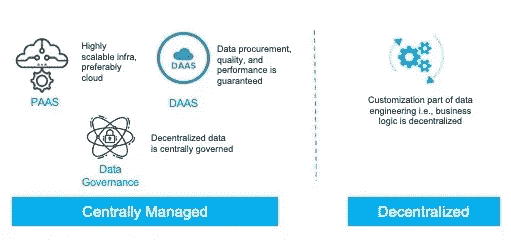
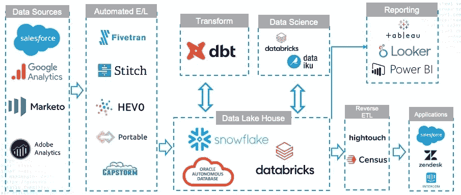

# 现代数据栈如何帮助数据民主化？

> 原文：<https://blog.devgenius.io/how-can-modern-data-stack-help-in-data-democratization-fed426e764b7?source=collection_archive---------7----------------------->

## 现代数据堆栈提供了真正实现数据民主化的突破性技术。

在本博客系列的[第一部分中，我们确立了数据民主化是数据驱动文化的基石——然而，集中式数据交付模式是数据民主化的瓶颈。我们讨论了混合数据交付模型如何通过建立交付模型来帮助扩大规模，如下图所示。](https://medium.com/@meet.aman.gupta/why-data-driven-culture-is-still-a-far-reaching-goal-for-many-organizations-ab8a6d5bf0a7)

业务逻辑的自助服务可以扩展数据工程团队的数据交付模型。

这篇博文将讨论使用现代技术栈建立这种混合数据交付模型。

现代技术堆栈中最重要的变化，也是本博客的基本信息，是数据管道的分离*和 ***转换*** 层。下面的框图提供了这一技术堆栈的高级架构，以及各自技术领域中最主要参与者的图标。*

*   **标志在框图中用作示例。请不要将它们视为供应商建议。**

**

*现代技术堆栈— Wave 3.0*

*从左到右阅读框图，我们从通过 API 访问的现代基于云的 SAAS 数据源开始。这些应用程序提供标准服务；因此，他们有标准的数据对象，不管谁使用这些应用程序。这些应用程序的普及和标准化为 ***自动化 E/L 工具带来了机遇。****

*A 自动化 E/L 工具是这样一类工具，它们具有感知源代码的连接器，可以连接到各种流行的 SAAS 应用程序。这些工具理解源的元数据，并以近乎实时的方式增量复制数据。这些应用程序的这些利基功能有助于创建快速、可扩展和低维护的复制管道。所有这些功能都是现成可用的，不需要编写任何逻辑。*

*自动化 E/L 工具将源数据复制到一个集中的数据存储层、一个数据仓库/数据湖或一个湖库。这些集中可用的数据现在可供数据分析师社区使用，这是中央数据团队的*托管服务*的终点。*

*除了自动化 E/L 工具之外，BT 是第二重要的技术，可以创建混合数据交付模式。数据分析师可以利用自助转换功能对集中可用数据的副本执行业务逻辑转换。DBT 将转换和扩充的数据推回到中央数据存储。*

*数据科学和报告团队现在可以利用这些*黄金*数据，这些数据也可以使用反向 ETL 工具写回到事务性应用程序。*

## *为什么 EL 和 T 的分离是数据工程中的一个范式转变？*

1.  ***解耦—** 上下游变更的解耦大大降低了这些管道的维护成本*
2.  ***打开黑盒—** 业务逻辑的分散有助于业务逻辑的速度和治理。分析师现在可以自助服务业务逻辑，同时还可以了解数据的外观。*
3.  ***智能集成—** 由于我们将管道的 EL 部分标准化，仅用于复制，因此与定制管道相比，我们还使这一部分变得更加智能和自动化。*

## *自动化 EL 工具最重要的特征是什么？*

1.  ***数百个本地源连接器** —这些工具与数百个高度感知源的连接器打包在一起。这些连接器理解源中预期的数据对象、源的元数据和数据模型。因此，这种智能节省了开发人员大量的工作，同时提高了管道的质量。*
2.  ***自动化元数据同步—** 工具对元数据的感知帮助它同步数据和 ***元数据*** 。该工具自动检测元数据更改，并开始将新列和数据同步到目标。例如，如果源引入了一个新列或者更改了列名或数据类型，那么在目标中复制这些更改不需要开发人员的参与。
    该特性有助于节省开发人员的时间，并使最终用户在几分钟内即可获得变更，而不是几周。*
3.  ***增量数据刷新—****工具自动处理增量刷新，无需变更数据捕获(CDC)的嵌入式逻辑。
    该功能使管道变得轻量级，从而降低了网络成本，同时改善了刷新时间。***
4.  *****近实时同步—** 借助上述功能，这些工具可以近实时地复制数据。更快的刷新速度提高了分析速度，增强了用户对数据的信任。***

## ***DBT 如何帮助分散数据转换？***

***EL-T 实现的第二个关键部分是数据管道的 ***转换*** 部分的去中心化。由于被称为数据构建工具的开源工具的出现，或者更通俗地说，T4 DBT 的出现，转换现在可以是分散的。DBT 工具可以被认为是 SQL 类固醇。DBT 可以做 SQL 能做的一切，甚至更多。它具有以下显著特征:***

1.  *****类似 SQL 的编码语言** — SQL 可以认为是数据世界的英语。由于 DBT 使用类似 SQL 的语言进行编码，这大大减少了新用户的学习曲线。***
2.  *****重用您的数据仓库的处理能力** — DBT 只充当数据仓库的抽象层。它为开发人员编写代码提供了一个窗口，而数据处理发生在数据仓库本身。
    该特性有助于通过重用资源来优化资源和成本，这与需要单独处理资源的 ETL 工具不同。***
3.  *****软件工程最佳实践—** DBT 将软件工程领域的最佳实践带到了数据工程领域。最佳协作编码实践，例如内联文档、注释、版本控制、宏、CICD 等。，可以在 DBT 使用，这样 SQL 代码也可以模块化，重用，并在将来易于维护。***
4.  *****自动化在线目录和沿袭** — DBT 可以创建自动化沿袭和数据目录，无需第三方工具或手动操作。随着我们追求广泛的数据民主化，这个特性对于数据治理变得至关重要。***

## ***平衡动作***

***虽然现代数据堆栈比传统架构提供了许多优势，但整个生态系统仍处于萌芽状态。上述框图中的徽标数量表明，这仍是一个不断发展的领域，很快就可以进行整合。***

***因此，我建议在将这些技术引入任务关键型应用程序之前进行权衡并保持谨慎。我的建议是，在我们实现技术现代化的过程中，遵循爬行-行走-奔跑的策略。***

***在我们的技术堆栈中，更重要的是分离数据管道的 EL 和 T 组件。例如，数据工程师可以将现有的 ETL 工具仅用于数据管道的 EL 部分，同时通过利用数据库本地技术(如物化视图)或向报告工具本身公开逻辑，向最终用户开放转换组件。数据团队也可以执行这种与现有工具分离的行为，而不用担心市场上最新的工具。***

## ***结论***

***如果这个博客只有一个收获，那应该是—***

> ***分离数据管道的 EL 和 T 组件，以实现数据工程的规模，从而在组织中实现更好的数据民主化***

***现代数据堆栈使这种最终用户支持成为现实。数据工程团队应该接受这些技术和交付模型，以帮助在他们的组织中建立数据驱动的文化。***

***[这里](https://medium.com/@meet.aman.gupta/why-data-driven-culture-is-still-a-far-reaching-goal-for-many-organizations-ab8a6d5bf0a7)是本系列第一篇博客的链接，方便参考。***

***请通过 [Linkedin](https://www.linkedin.com/in/meetguptaaman/) 联系我，以便进一步交流。***

***如果你喜欢读这篇文章，别忘了鼓掌👏它跟我来。欢迎反馈！***

****非常感谢！****