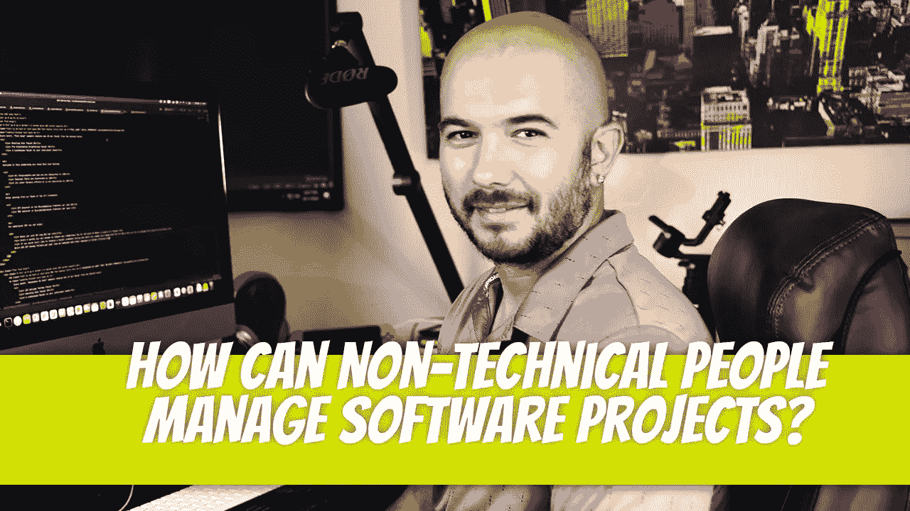

# 非技术人员如何管理软件项目？

> 原文：<https://blog.devgenius.io/how-can-non-technical-people-manage-software-projects-9035e491c518?source=collection_archive---------4----------------------->

可能吗？是的。为了取得成功，需要对任务进行分离，并了解基础知识。其他的都是足够高的水平，项目经理不需要任何软件开发或者软件开发项目的背景也可以足够成功。

项目是不是更容易被技术项目经理管理？当然了。对软件开发有深刻的理解在小团队中是非常有益的，但是当涉及到角色清晰的时候可能是一个劣势。一个技术项目经理很可能会插手他们职责之外的领域，这是一个失败的长期策略。

## 了解基础知识

应该对软件开发中的某些主题有高层次的理解。非技术型项目经理应该知道的一些信息包括:

*   什么是 API？
*   开发服务器和生产服务器有什么区别？
*   理解软件开发工作流程和方法(即敏捷)。
*   了解部署流程。

任何项目经理都应该对项目管理概念有透彻的理解。当谈到软件开发中的 PM 时，没有什么不同。

## 从用户的角度了解软件

许多项目经理陷入了试图从开发人员的角度理解软件如何运行的陷阱。在开发人员层面上交流对双方都有伤害:开发人员和客户端。

这伤害了客户，因为客户很可能是非技术性的。当他们描述软件时，他们是从用户的角度来解释的。他们不关心在幕后需要如何进行交流。“表单需要发送电子邮件给我”是客户希望提供的最多的技术信息；这也是他们期望收到的最多的技术信息。

这伤害了开发人员，因为项目经理并不生活在代码中。钻研代码浪费时间。这就是开发人员要解决的问题。项目经理应该站在客户的角度说话。他们需要声明这个表单不起作用，而不是试图诊断它不起作用的原因。

在这种形式的交流中，了解软件的来龙去脉是有利的。项目经理应该对整个软件有一个坚实的理解。当客户提出问题时，项目经理应该能够深思熟虑地回答，而不是每个问题都跑到开发人员那里。例如，如果客户询问当用户提交特定表单时会发生什么，项目经理应该能够说明该操作，如“内容通过电子邮件发送给销售团队”或“通知通过电子邮件发送给销售人员，有内容等待他们在管理端进行审查。”

## 如果解释需要专业技术知识呢？

非技术项目经理被一个团队包围着，其中大部分是技术型的。这些问题应该向技术主管提出。如果需要与客户进行持续的技术沟通，技术项目负责人应随时接听客户电话。

## 非技术项目经理做什么？

项目经理需要收集信息，沟通项目时间表，跟踪预算，并监控任务和任务的完成情况。任务本身应该由技术负责人评估，并反馈给项目经理。

项目经理的主要职责是促进客户和软件开发人员之间的有效沟通。他们是这个项目的门面；保持人际关系很重要。

当向客户翻译软件开发语言时，非技术项目经理首先需要向他们自己翻译“dev-talk”。培训开发团队在高层次上发言是非技术项目经理相对于技术项目经理的一个优势。

一个好的非技术项目经理是一个伟大的激励者。巨大的动力鼓励项目的成功。即使当问题出现时，有效的项目经理知道如何解决问题，而不会责怪开发人员。这延续了积极的关系，并允许建设性的批评。

软件开发人员编写代码。项目经理确保一切都组织得当；组织技能很难获得。有经验的项目经理将这一技能作为他们核心技能的一部分。通过适当的组织，在不同学科之间转移成为一项简单的任务。

## 调整期

需要多长时间？这取决于个人，但大多数人在 6 个月内开始掌握它。也要看工作量。从事一个项目与五个项目相比，在一个方面有其优点，在另一个方面有其缺点。一个项目允许项目经理用缓慢而稳定的方法巩固技能。

## 结论

一个有经验的项目经理能够适应技术环境。我见过成功和失败。有时候，环境是罪魁祸首。其他时候，个人并不意味着软件开发业务。如果你没有技术经验，你应该害怕在软件开发行业尝试项目管理职业吗？绝对不是，只要你有很强的项目管理背景。

迪诺·卡伊奇目前是 [LSBio(生命周期生物科学公司)](https://www.lsbio.com/)、[绝对抗体](https://absoluteantibody.com/)、 [Kerafast](https://www.kerafast.com/) 、[珠穆朗玛生物](https://everestbiotech.com/)、[北欧 MUbio](https://www.nordicmubio.com/) 和 [Exalpha](https://www.exalpha.com/) 的 IT 主管。他还担任我的自动系统的首席执行官。他有十多年的软件工程经验。他拥有计算机科学学士学位，辅修生物学。他的背景包括创建企业级电子商务应用程序、执行基于研究的软件开发，以及通过写作促进知识的传播。

你可以在 [LinkedIn](https://www.linkedin.com/in/dinocajic/) 上联系他，在 [Instagram](https://instagram.com/think.dino) 上关注他，[访问他的博客](https://www.dinocajic.com/)，或者[订阅他的媒体出版物](https://dinocajic.medium.com/subscribe)。

阅读 Dino Cajic(以及 Medium 上成千上万的其他作家)的每一个故事。你的会员费直接支持迪诺·卡吉克和你阅读的其他作家。你也可以在媒体上看到所有的故事。