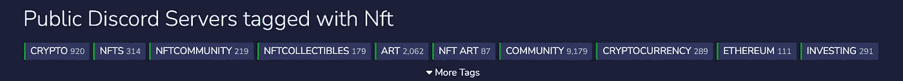
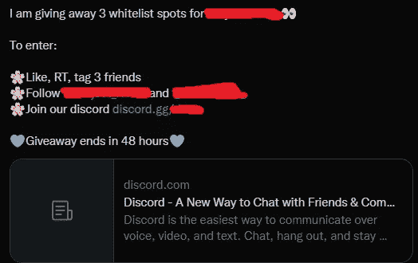

# 如今，人们怎么能从非金融交易中赚这么多钱——他们是“庞氏骗局”吗

> 原文：<https://blog.devgenius.io/how-can-people-make-so-much-money-off-nfts-these-days-and-are-they-ponzi-scheming-21293b14ccd7?source=collection_archive---------9----------------------->

因为让我们面对现实——人们正在通过多种方法用非功能性食物制造成千上万，有时是数百万。

这些包括造币，成为“白名单”的一部分，利用内幕信息低买高卖，等等。他们是怎么做到的？合法吗？

让我们假设你的名字是迈克。一个周六的清晨，当你啜饮着咖啡时，一位朋友在网上给你发来短信:

“老兄，我刚刚花了 20 倍的利润买了这个只值 0.08 美分的 NFT！卖 1.6ETH！！兄弟，把我的邀请链接到他们的不和，他们很快会有更多的**赠品**，我可以进入他们的下一个 WL！!"

*嗯？*

-这是你第一眼看到的所有疑惑。薄荷糖是什么？为什么不和谐？

让我们退后一点。

因此，也许你知道什么是不可替代代币(ERC 721 代币/NFT)，以及如何购买/出售它们。只需前往 NFT 的一个市场，如 OpenSea 或 Rarible，连接你的加密钱包(使用 MetaMask 等应用程序)，然后行动。

那么…你到底是怎么赚钱的？就低买高卖？

通过这些非功能性交易获利的一个主要因素——如果不是关键因素的话——是成为 NFTs 艺术项目的“ **w *hitelist”，通常被称为 WL。***

处于 WL 意味着你的(公开)加密钱包密钥被收集在一个秘密列表中，以获得对“ [***造币***](https://azbigmedia.com/business/how-nft-minting-works-an-initial-guide-to-nfts/) ***的访问权。****你加入了许多其他获得这种特权的特殊人群。如果是这样的话，一旦到了铸造的日期/时间，你就可以自己在 NFT 市场网站上列出 NFT 艺术品(代币),如 OpenSea、Rarible 或该项目的自有平台。*

*通常，这需要支付很少的费用(铸造费+汽油费)来列出艺术品。然而，如果这个项目很受欢迎，你肯定可以通过将你的作品上市来获得一笔可观的利润。*

*我把整个过程称为“**铸币到销售**”循环:通过某种方法(或运气)获得一个项目白名单中的位置，铸造，然后以更高的价格出售。这就是庞氏骗局指控的来源。*

*让我们更深入地了解一下这是如何工作的。*

**

*截至 2022 年 2 月，数百个加密/NFT/艺术相关的 Discord 频道可用。*

# ***第一步:加入一个热门项目的不和谐。***

*如果不是所有的话，大多数 NFT 艺术项目的社区参与和公告都不和谐，这是一个完美设计的平台，适合 NFT 项目创始人想要的所有用例。Discord 有许多用户可以参与评论或频道的创造性方式，如玩游戏、视频/语音通话和屏幕共享、反应、获得频道内的“角色”等等。*

*有数以千计的不和谐频道致力于一个特定的 NFT 艺术项目，其中涉及“**造币到销售**”的周期。一旦你加入，你不会相信有多少人和你一样，致力于从这个项目中赚钱或收集。这里有一个例子:【http://discord.gg/livesofasuna】T2*

*由于 Discord 允许用户使用各种参与方法，这有助于推动对该项目的认识和需求，尤其是在其“**预售**”发布或“**铸造**”期间这一点，加上一个项目可以通过其 Twitter 页面产生的疯狂活动，进一步加强了这一理论:**随着 NFT 项目通过 Discord 和 Twitter 的参与度增加，它在 NFT 各社区的知名度也增加了，因此，它的需求也增加了，这可以提高其公开上市后的价格。***

*我称之为**恶性订婚循环**。一旦一个项目的知名度扩大，价格可能会上涨，但这也意味着你个人被列入白名单的机会更小，因为更多人会对竞争白名单感兴趣。*

*那么，如何才能让它进入项目的白名单，让你成为少数几个能够在正式公开之前铸造艺术品的幸运儿之一呢？*

# *第二步:通过竞争进入项目白名单。*

*大多数用户希望通过在 Discord 和 Twitter 上转发、点赞、标记和回应来帮助推动该项目的参与，因为你称之为“**白名单莱佛士**”或“**赠品**”*

*让我们以这条推文为例:*

**

*这些推文获得了成百上千次的参与点击。这一切都是为了那 0.05%的机会，你将赢得一个白名单的位置。这些抽奖显然不是你进入白名单的唯一方式，但它肯定是最受欢迎的方式之一。因此，每个人都有助于提高该项目的知名度，进一步提高其市场价格。人们将创建多个 Twitter 账户，通过与他们所有人一起参与帖子来增加他们获胜的机会。*

*如果你最终不在白名单中，好吧，糟透了；那些幸运的人可能会在事后以更高的价格卖出，这要感谢你所做的宣传。*

*让我们不要忘记从参与和需求的角度提及项目的受欢迎程度。如果时机合适，像志那都红豆或 T2 无聊猿游艇俱乐部这样的项目是最受欢迎的项目。*

*如前所述:受欢迎程度和价格受多种因素影响:*

*   *Twitter 参与度*
*   *人气/参与度不一致*
*   *合作机会，如果你持有 X NFT。*
*   *竞赛和其他好处，如果一个人持有 X NFT。*

*最终，通过我提到的各种平台(或许还有其他平台)的参与，它的意识决定了他们的非功能性测试项目在“ ***”公开销售*** ”后的价格*

# *第三步:如果你在 WL:造币厂，希望能获利。*

*最常见的是，一颗薄荷糖大约是 0.08 ETH。如果你想想这些 NFT 可以达到的荒谬价格(只要看看 OpenSea 上 500 强项目的底价)，0.08ETH 就是花生。例如，一个人可以铸造 0.08ETH(+ X 汽油费)，然后获得≥1 ETH 的 NFT 报价。太疯狂了。*

*正如你现在可能意识到的，这些 NFT 项目几乎可以保证你的利润，如果你能在公开销售开始时铸造或购买的话，是最难在 WL 获得一席之地的。请记住，大多数项目不会给你带来利润，即使你在 WL 铸造。你必须挖掘受欢迎的项目，并幸运地发现自己在 WL。*

## ***其他加入白名单的方式***

*如果你为项目 A 持有 NFT，有时项目 A 会与另一个项目 b 进行所谓的“合作”。如果发生这种情况，作为项目 A 的 NFT 持有者，你可以参加更容易的抽奖，以获得项目 b 的 WL 席位*

*有时，如果合作紧密，仅仅是作为项目 A 的 NFT 持有者，你就能自动进入项目 b 的 WL*

***此外，其他活动可以包括:***

*   *达到邀请“配额”(邀请 X #人加入他们的频道)*
*   *赢取聊天抽奖*
*   *参与 X 次(反应、聊天、玩游戏等。)*
*   *成为社区的不和谐音*
*   *成为“早期”粉丝(通常意味着成为第一批加入他们的 discord 频道的用户之一)*
*   *持有同一个创始人以前项目的 NFT*

# ***最终要点***

*现在——这是庞氏骗局吗？根据定义，是的。那些能够混进一个项目的 WL 的人将能够在该项目的非专利技术上市公开销售之前造币。如果该项目由于其痴迷的社区所驱动的需求和参与而非常受欢迎(如上所述，这种参与是一种恶性循环)，那么你肯定会在之后获得大量利润。也就是说，如果你铸造并以更高的价格出售。*

*然而，目前做所有这些都是合法的，如果你有时间和密码来开始并想探索更多关于 NFTs 的东西，我鼓励你这样做，只要你小心。这是一个粗糙和令人厌倦的游戏，更不用说一个人可能不得不处理的税务申报的影响。*

*NFTs 将在元宇宙中扮演一个稳定的角色，而“所有权”的概念，由于各种区块链网络为所有这一切提供动力，在许多生活和工作应用中有着疯狂的潜力。*

*小心骗子！因为在几秒钟内将密码从一个钱包转移到另一个钱包非常容易，所以很多时候骗子会试图给你发送 DM，假装是某个项目的 Discord 频道的 mod 或 admin，告诉你你赢了一大笔钱。然后他们会给你发一个可疑的链接，让你发送你的邮件；永远消失了。*

*同样值得一提的是，“从制造到销售”过程中的所有这些活动都需要**的大量关注和努力。**就我个人而言，我无法用 30 多天的阿敏日时间来竞争 WL 的职位、参与帖子发布、了解当前 NFT 的最新价格，因此我错过了很多赠品。我认识的一些人在这方面投入了大量的时间，并获得了丰厚的利润。*

*然而，这种做法越来越受欢迎，这意味着这些活动可能很快就会变成自己的泡沫，等待破裂。在一天结束的时候，大多数人不得不为自己在“白名单”上的位置而战。这可以比作赌博，特别是如果你持有的项目价格波动性很大，NFT 反弹。*

*关注我更多的科技/生产力/生活文章，关注我的[推特](https://twitter.com/seykafu)！*