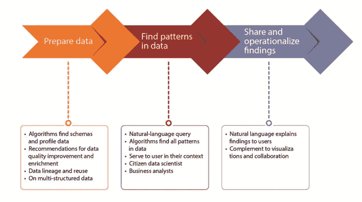

# 智能数据如何改进基于搜索的分析

> 原文：<https://blog.devgenius.io/how-can-smart-data-improve-search-based-analytics-a716dfffe53e?source=collection_archive---------17----------------------->

越来越需要一种方法来聚合数据并将业务策略应用到新兴技术中。[大数据](http://entradasoft.com/blogs/how-can-smart-data-improve-search-based-analytics)体积庞大，缺乏许多重要财务决策所需的精确度。智能数据触及信息的核心，让高管专注于重要问题，而不是在无关或分散注意力的信息上浪费时间。这些数据的聚合是这个行业所需要的，而这正是[智能数据提供的](http://entradasoft.com/blogs/how-can-smart-data-improve-search-based-analytics)。

**全文:**[http://entradasoft . com/blogs/how-can-smart-data-improve-search-based-analytics](http://entradasoft.com/blogs/how-can-smart-data-improve-search-based-analytics)

## 什么是搜索分析

Search analytics 通过提供一个交互式环境将这种方法推向了一个新的高度，在这个环境中，业务用户可以获得快速、准确的结果。这些工具使用自然语言处理(NLP)来简化输入和输出，以便用户可以在没有编程或分析知识的情况下提出问题并获得答案，从而提高用户的采用度以及企业生成的分析和报告的清晰度和有用性。

重点是解决大大小小的商业问题。对这个目标没有帮助的信息可以被忽略。由于[大数据](http://entradasoft.com/blogs/how-can-smart-data-improve-search-based-analytics)不关注任何特定的信息子集，智能数据的使用转化为对质量而非数量的关注。定性数据分析为公司加速数据交付过程提供了机会，从而允许有更多的时间来开发创造性的解决方案。

# 数据发现的挑战是什么？

[成功的数据发现](http://entradasoft.com/blogs/how-can-smart-data-improve-search-based-analytics)依赖于完整、准确、可管理和一致的数据。因此，数据发现的主要挑战来自数据的收集、存储和管理。

**卷**

量描述了创建和存储的大量数据，这可能会妨碍分析并引入偏差。数据发现必须借助强大的数据治理和强大的技术来克服这一挑战。

**品种**

随着数据源数量的不断增加，格式的多样性给一致地呈现数据带来了挑战。成功的数据发现需要强大的技术技能来收集和清理数据，以便准备好进行分析和消费。

**数据速度**

速度是创建数据的速度。随着数据创建速度的日益增长，数据发现成为一项挑战。新数据必须不断地、正确地添加到存储库中，以确保及时的洞察力。

**一致性**

数据必须在整个组织中保持一致，以便组织中的每个人都在同一页面上。不一致会导致基于无效或过时数据的糟糕决策。当数据被定期编辑、提取和分析时，有一个真实的版本是非常重要的。

**数据管理**

管理不当的数据会给[数据发现过程](http://entradasoft.com/blogs/how-can-smart-data-improve-search-based-analytics)带来一些伤害。不准确、不合逻辑或不恰当地收集和存储数据会在用户不知情的情况下给分析带来错误。虽然[数据管理](http://entradasoft.com/blogs/how-can-smart-data-improve-search-based-analytics)的问题通常在分析发生之前很久就产生了，但它们在数据发现过程中构成了严重的障碍。

## 数据发现的好处是什么？

数据发现为公司提供了一个框架，以释放和处理包含在数据中的洞察力。它转换杂乱和非结构化的数据，以促进和增强其分析。数据发现使公司能够:

**收集可行的见解**

从 KPI 到趋势和分布，数据发现过程可以立即发现非结构化数据中的重要信息。数据发现获取复杂的数据，并以允许用户可视化和理解其中信息的方式对其进行组织。

**节省时间**

虽然分析工具要求数据遵循特定的格式，但数据的存储很少符合这一要求。数据发现聚合并格式化来自不同来源和不同结构的数据，以便于分析。这个过程以正确的格式为分析师提供正确的数据。

**跨团队扩展数据**

数据是多用途的，通常包含可用于多种不同分析的信息。部门或用户可以以不同的方式利用相同的数据来创建独特的见解。数据发现促进了这一过程，并为所有用户提供单一版本的事实。

**清理并重新使用数据**

数据分析是一个持续的过程。随着新数据的收集，需要清理、存储当前数据，并提供给将来使用。数据发现利用新的和过去的数据，因此可以大规模可靠地重复使用。

# 数据发现的步骤

**收集数据**

数据发现过程的第一步是在一个地方收集正确的数据。分散在许多来源的数据必须放在一个可以进行分析的地方

**清理和准备数据**

从不同来源导入的原始数据很少能够按原样进行分析。需要以有利于可靠和稳健分析的方式清理和组织数据。

**分享数据**

随着数据的构建和没有冗余或不需要的信息，它必须与组织中的其他人共享。虽然统计学家和数据科学家将分析数据的不同方面，但他们都将提供自己对数据的解释和分析。

**分析并生成见解**

当存在数据的单一分布式版本时，个人可以读取、分析经验证的数据并从中创造价值。常用工具包括分布分析、预测模型和购物篮分析。了解不同分析工具所产生的洞察力的类型是很重要的。

**可视化见解**

洞察一旦被发现就需要被交流，而可视化让用户很容易做到这一点。

# 数据发现的趋势

## 大数据发现

大数据发现是通过结合大数据、数据发现和数据科学中使用的方法来创造商业洞察力。这种新方法采用来自数据科学、技术和大数据的高级分析，以自主和持续地生成见解

## 智能数据发现

像大数据发现一样，智能数据发现依赖于机器学习和人工智能来运行分析。然而，智能数据发现更多是由人控制的。这个区别可以认为是谁提问谁回答问题。

## **整平**

虽然数据创建的规模和频率带来了巨大的数据管理挑战，但它也为开发有洞察力的分析提供了机会。智能数据发现方法为最定制的用例提供高度情境化的结果。智能数据发现是商业智能革命的开端。当前的数据发现和可视化工具将变得更加智能，只需要最少的分析专业知识就可以帮助业务用户快速从问题转向见解。

阅读更多:[http://entradasoft . com/blogs/how-can-smart-data-improve-based-search-analytics](http://entradasoft.com/blogs/how-can-smart-data-improve-search-based-analytics)