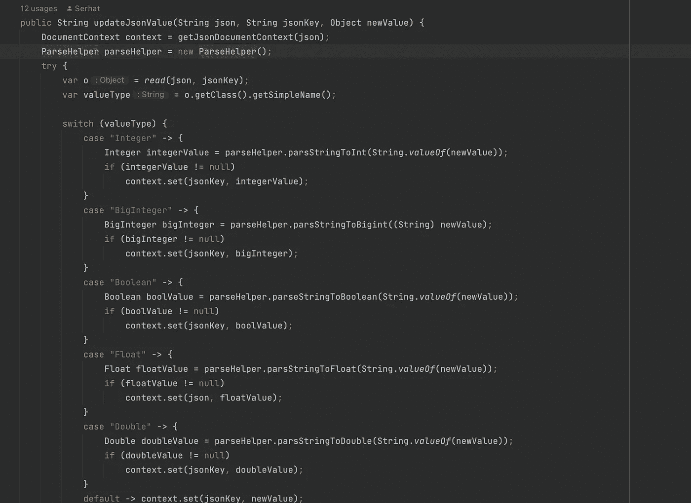
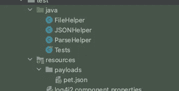

# 不放心用 Java 写 POJO 类，怎么管理 Payload 和 Response？

> 原文：<https://blog.devgenius.io/how-can-we-manage-payload-and-response-without-writing-pojo-class-in-java-with-rest-assured-8ce07217947c?source=collection_archive---------7----------------------->



对于任何使用 Java 和放心的 API 测试自动化项目，我愿意分享我是如何处理有效载荷和响应的。

提取响应数据最常见的方法是在开发 API 测试自动化项目时使用 POJO 类。然而，如果您使用放心(在本文的其余部分我将称之为 RA)来测试 API，那么就没有必要编写 POJO 类。相反，您可以利用 RA 特性。下面是 RA 可以用来实现这一点的一些特性。作为第一步，我们来讨论一下有效载荷

以下列表中的任何对象都可以用作 RA 中的有效负载。

*   线
*   字节[]
*   文件
*   输入流
*   目标

换句话说，我们有许多选项来管理有效载荷，我通常遵循这种方法。

首先，项目资源是存储有效载荷的好地方。



有效载荷

1-从资源中获取 JSON 作为字符串

下面是我通常用来获取字符串形式的文件内容的代码。它可以在 MAC 电脑、Linux 电脑或 Windows 电脑上无缝运行

```
public String getFile(String fileName) {
        var is = Objects.requireNonNull(
                getClass()
                        .getClassLoader()
                        .getResourceAsStream("payloads/" + fileName));
        try {
            return new String(is.readAllBytes());
        } catch (IOException e) {
            throw new RuntimeException(String.format("An error occurred message:%s", e.getMessage()));
        }
    }
```

2- JsonPath 可用于根据需要更新 JSON

这就是棘手的地方。在接收到字符串形式的有效载荷后，我们如何更新 JSON 字段呢？

第一步是用 JSON 选择器(JSON path)读取 JSON 字段，为此，我们需要将 string 有效负载转换为 com.jayway.jsonpath 的 DocumentContext 对象。

```
 private DocumentContext getJsonDocumentContext(String json) {
        var configuration = Configuration.builder()
                .jsonProvider(new JacksonJsonNodeJsonProvider())
                .mappingProvider(new JacksonMappingProvider())
                .build();
        return using(configuration).parse(json);
    }
```

通过使用 com . jayway . jsonpath . JSON path . read()，我们现在能够使用 JSON path 和作为 DocumentContext 的有效负载

因为所有的 JSON 字段都有一个类型，所以在更新 JSON 时，我们需要用正确的对象类型更新 JSON 字段，read()方法也以对象的形式返回值。

我们可以根据对象推导出字段值的类型，然后更新 JSON 字段，以便在获得对象后反映有效的类型。

```
 public String updateJsonValue(String json, String jsonKey, Object newValue) {
        DocumentContext context = getJsonDocumentContext(json);
        ParseHelper parseHelper = new ParseHelper();
        try {
            var o = read(json, jsonKey);
            var valueType = o.getClass().getSimpleName();

            switch (valueType) {
                case "Integer" -> {
                    Integer integerValue = parseHelper.parsStringToInt(String.valueOf(newValue));
                    if (integerValue != null)
                        context.set(jsonKey, integerValue);
                }
                case "BigInteger" -> {
                    BigInteger bigInteger = parseHelper.parsStringToBigint((String) newValue);
                    if (bigInteger != null)
                        context.set(jsonKey, bigInteger);
                }
                case "Boolean" -> {
                    Boolean boolValue = parseHelper.parseStringToBoolean(String.valueOf(newValue));
                    if (boolValue != null)
                        context.set(jsonKey, boolValue);
                }
                case "Float" -> {
                    Float floatValue = parseHelper.parsStringToFloat(String.valueOf(newValue));
                    if (floatValue != null)
                        context.set(json, floatValue);
                }
                case "Double" -> {
                    Double doubleValue = parseHelper.parsStringToDouble(String.valueOf(newValue));
                    if (doubleValue != null)
                        context.set(jsonKey, doubleValue);
                }
                default -> context.set(jsonKey, newValue);
            }
            return context.jsonString();
        } catch (PathNotFoundException je) {
            log.warn("{} is couldn't find, in JSON \n{}", jsonKey, json);
            return json;
        }
    }
```

在这种情况下，我们现在有了更新的 JSON 的字符串表示。

让我们用一个真实的场景来尝试一下

```
-- payload
{
  "id": 0,
  "category": {
    "id": 0,
    "name": "string"
  },
  "name": "doggie",
  "photoUrls": [
    "string"
  ],
  "tags": [
    {
      "id": 0,
      "name": "string"
    }
  ],
  "status": "available"
}
```

既然我们已经创建了方法，我们将更新上面的 JSON。

```
 @Test
 public void managingPayload(){
        var fileHelper = new FileHelper();

        var payload = fileHelper.getFile("pet.json");

        var jsonHelper = new JSONHelper();

        payload = jsonHelper.updateJsonValue(payload,"id","10");
        payload = jsonHelper.updateJsonValue(payload,"category.id","1");
        payload = jsonHelper.updateJsonValue(payload,"photoUrls[0]","shorturl.at/rJXZ2");
        payload = jsonHelper.updateJsonValue(payload,"tags[0].id","1");
        payload = jsonHelper.updateJsonValue(payload,"tags[0].name","#dog");
        payload = jsonHelper.updateJsonValue(payload,"status","sold");

        given()
                .basePath("{version}/pet")
                .pathParam("version","v2")
                .contentType(ContentType.JSON)
                .body(payload)
        .when()
                .post()
        .then()
                .statusCode(200)
                .body("id",equalTo(10))
                .body("category.id",equalTo(1))
                .body("photoUrls[0]",equalTo("shorturl.at/rJXZ2"))
                .body("tags[0].id",equalTo(1))
                .body("tags[0].name",equalTo("#dog"))
                .body("status",equalTo("sold"));
  }
```

下面的代码演示了如何在不创建 POJO 类的情况下提取响应，这样我们就可以将 JSON 转换成 map 对象，以便在合适的时候使用。

```
 var responseMap = given()
                .basePath("{version}/pet")
                .pathParam("version", "v2")
                .contentType(ContentType.JSON)
                .body(payload)
                .when()
                .post()
                .as(new TypeRef<Map<String, Object>>() {
                });
  assertEquals(responseMap.get("id"), 1);
  assertEquals(((Map<String, Object>) responseMap.get("category")).get("id"), 2);
```

但是如果 response 是 JSONArray 呢？

```
 var responseMap = given()
                .basePath("{version}/pet")
                .pathParam("version", "v2")
                .contentType(ContentType.JSON)
                .body(payload)
                .when()
                .post()
                .as(new TypeRef<List<Map<String, Object>>>() {
                });
```

我们还可以获得所需类型的响应字段

```
var tagId = response.jsonPath().getInt("tags[0].id");
assertEquals(tagId,2);
```

要访问 git repo，请查看以下链接。

[](https://github.com/serhatozdursun/payload_and_responses) [## GitHub-serhatozdursun/payload _ and _ response

### 此时您不能执行该操作。您已使用另一个标签页或窗口登录。您已在另一个选项卡中注销，或者…

github.com](https://github.com/serhatozdursun/payload_and_responses) 

总之，我想说的是不要总是一成不变。大多数情况下，做任何事情都有比其他方法更好的方法。

希望这篇文章能帮助你们中的一些人给自己的项目增加更多的价值。