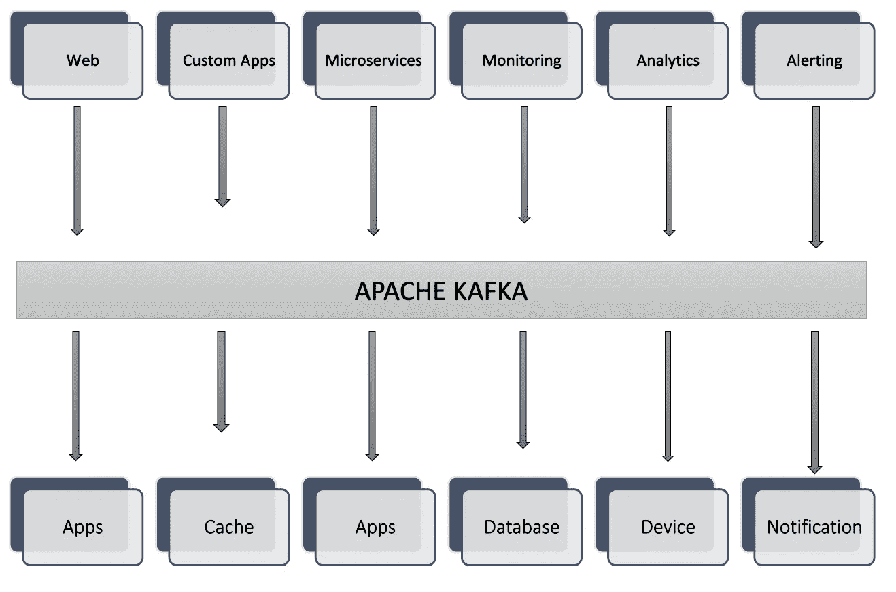

# 我们如何优化卡夫卡的表演？

> 原文：<https://blog.devgenius.io/how-can-we-optimise-kafka-performance-ce2788c54373?source=collection_archive---------5----------------------->

优化 Kafka 性能

阿帕奇卡夫卡

## 前言

Apache Kafka 已经成为世界上最好的事件流媒体平台，被各个领域的公司所利用，从银行和欺诈检测到物联网和运输。生产者和消费者应用程序只需要利用 Kafka APIs，剩下的就交给它了。

**下面是卡夫卡在幕后做的一些看起来很像魔术的事情:**

*   自动平衡集群中所有代理的负载
*   利用代理中的零拷贝传输向消费者发送数据
*   添加或删除使用者时，自动重新平衡使用者组
*   代理出现故障时，自动将分区领导者重新分配给实时代理

虽然 Kafka 确实提供了许多功能，但是可能有某些不同的用例需要调整 Kafka 的不同参数。

> Kafka 的设计本质上为用户提供了配置灵活性。

Kafka 可以进一步优化以下内容:

*   吞吐量
*   潜伏
*   持久性
*   有效性

它们都是相互关联的，因此我们无法同时优化所有功能。尽管这四者之间有时会有折衷，但我们可以根据项目业务需求对其进行调整。

## 吞吐量优化

*   为了优化吞吐量，我们正在尝试提高数据移动的速率。
*   更多的 ***主题分区*** 会导致更高的吞吐量，并且分区应该在代理之间均匀分布。
*   此外，消息的 ***键*** 需要仔细分配，以便消息尽可能均匀地分布在主题分区上。
*   调整生成器批处理，以增加批处理大小和等待消息填满批处理所花费的时间。配置`batch.size` 参数，增加每个消息批次的最大字节数。
*   配置`linger.ms`参数，让生成器在发送前等待更长时间。
*   通过配置`compression.type`参数启用压缩，该参数可以设置为以下标准压缩编解码器之一:lz4、snappy 和 zstd。
*   Set `acks=1`使主代理将消息写入其本地日志，然后确认请求，而不等待来自所有从代理的确认，这反过来增加了吞吐量。

## 延迟优化

*   为了优化延迟，我们正试图最大限度地减少端到端(从生产者到经纪人再到消费者)传递消息的时间。
*   增加 ***分区数量*** 往往会增加延迟，所以减少主题分区数量。
*   调整参数`num.replica.fetchers`以增加跟随者代理中的 I/O 并行度。
*   默认情况下，生成器针对低延迟进行了调整。`linger.ms`设置为 0，这意味着生产者将在有数据要发送时立即发送。
*   使用`compression.type=none`禁用压缩以节省 CPU 周期，尽管一个好的压缩编解码器也可能
    减少延迟。
*   设置`acks=all` ，这意味着主代理将在所有副本接收到消息之前更快地
    对生产者做出响应。
*   将`fetch.min.bytes` 置 1，表示只要有一个字节的数据可用，或者取请求超时等待数据到达，取请求就被应答，即`fetch.max.wait.ms`。

## 优化耐用性

*   为了优化耐久性，我们试图减少信息丢失的机会。
*   设置主题`replication.factor=3`、代理`min.insync.replicas=2`和生产者`acks=all`确保生产者将在大多数副本没有接收到写入时引发异常。
*   设置`broker.rack`配置，将代理分配到不同的可用性区域，以提高耐用性。
*   如果发送失败，生产者还可以通过尝试重新发送消息来增加持久性，以确保数据不会丢失。生成器自动尝试重新发送消息，发送次数由参数`retries=MAX_INT` *指定。*
*   对于吞吐量非常低的主题，根据需要将消息间隔或时间间隔设置为低(默认允许操作系统控制刷新)。

## 可用性优化

*   为了优化可用性，我们正在努力减少意外故障情况下的停机时间
*   更高的 ***主题分区*** 计数可能会增加并行性，但是拥有更多分区也会增加代理失败时的恢复时间，从而降低可用性。
*   设置`acks=all`，这将确保只要满足最小数量的副本，生产者请求将继续成功。这增加了分区的可用性。
*   设置`min.insync.replicas=1`，通过将此值设置为低，群集将能够容忍更多副本故障，从而提高可用性。
*   **注意** :
    当`acks=all`带有`replication.factor=N`和`min.insync.replicas=M`时，集群可以容忍`N-M`个经纪人为了话题可用性而下线。
*   设定`unclean.leader.election.enable=true`。这使得领导者选举发生得更快，从而提高了整体可用性。

## 结论

为了优化 Kafka 性能，应该根据业务需求调整 Kafka 配置参数。吞吐量和延迟之间以及持久性和可用性之间存在性能上的权衡。基准测试对于验证特定 Kafka 集群部署的设置至关重要。

## 参考

优化您的 Apache Kafka 部署