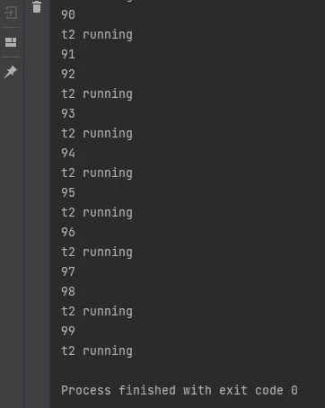
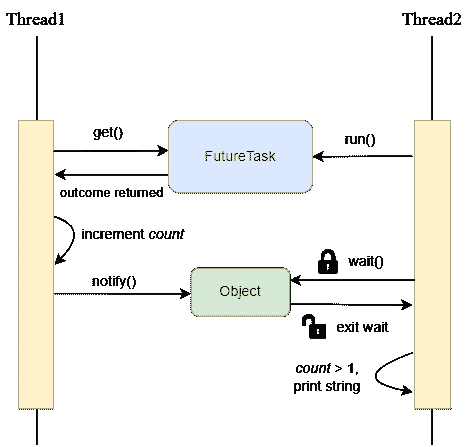
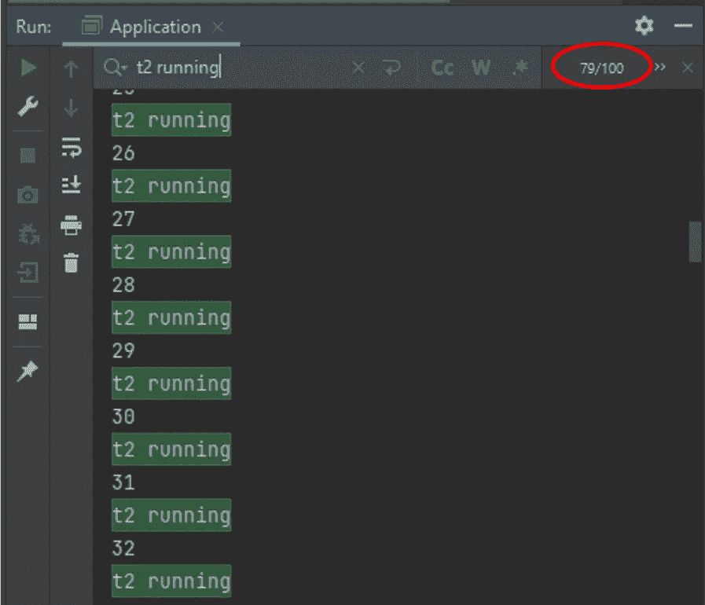

# 如何解决这个 Java 多线程面试问题？

> 原文：<https://blog.devgenius.io/how-can-you-solve-this-java-multithreading-interview-problem-8e6ec53fab27?source=collection_archive---------1----------------------->

## 方案

假设我们有两个线程。在 *Thread1* 中，我们将整数字段“ *count* ”加 1。在 *Thread2* 中，如果我们看到计数大于 1，我们将打印行“t2 running”。

如果我们循环这个 *run()* 方法 100 次，每次我们打印第 n 个循环时，输出如下:

在某些循环中(如 91，97)，不打印*线程 2* 中的字符串。这是因为不能保证*线程 1* 总是在*线程 2* 之前执行。

**现在，您可以对代码进行哪些更改，以便始终打印 *Thread2* 字符串？**

以下是一些限制条件:

1.  不要使用 *Thread.sleep()* 或任何类似的工具轻松脱身:)
2.  您不能修改*逻辑 1* 和*逻辑 2 的零件。然而，你可以在逻辑之上或之下添加代码。*

我们暂停 5 秒钟。

…你有什么解决办法吗？

## 也许这个？

有些人可能会说，让我们为锁机制创建一个对象。我们可以使用对象**等待通知**机制让*线程 2* 先等待。线程 1 完成增量后，让它通知*线程 2* 进一步执行。

经过测试，在我运行该方法的 100 次中，**只有 5 次**在我的机器上返回“t2 running”字符串。

## 为什么会这样呢？

这是因为在大多数情况下，甚至在*线程 2* 开始*等待()*之前，*线程 1* 已经调用了*通知()*。当 *Thread1* 通知时，没有线程在等待队列中！当 *Thread2* 开始执行时，它进入一个无休止的 wait()状态。

## 如何才能提高？

在上面的代码中，我们基本上需要注意一件事——确保*线程 2* 在*线程 1* 通知之前等待。你怎么做到的？

方法之一是使用 ***FutureTask*** 。我们可以定义一个定制的 FutureTask，在本例中，是创建一个*可调用的*对象，该对象在被调用时将返回一个字符串“MyTask”。

在 *Thread1* 中，我们将要求 FutureTask 对象获得结果。在*线程 2* 中，我们将运行任务。这样， *Thread1* 只能在 *Thread2* 运行任务并进入 *synchronized* 块的等待状态后增加计数值。更新计数后， *Thread1* 通知 *Thread2* 继续执行打印字符串。

让我们再次运行程序 100 次，看看每个调用是否能够返回“t2 running”字符串。

我们可以看到，在 FutureTask 和 synchronized lock 的帮助下，所有 100 个循环都打印了 *Thread2* 字符串。

当然，解决这个问题的可能性更多。例如，可以使用阻塞队列来代替 FutureTask 或信号量。欢迎在下面留下你的答案。

我希望这篇文章对你有所帮助。如果你像我一样，渴望学习 Java 和更多关于后端工程的知识，请关注我的频道，了解我在日常工作和生活中获得的灵感。

> ***阅读更多:***[*一个关于 Java 静态关键字在职期间的案例*](/a-case-about-java-static-keyword-during-my-job-53cebb6af597)[*如何自动生成重复的 Java 代码以节省您的时间*](https://medium.com/geekculture/how-to-auto-generate-repetitive-java-code-to-save-your-time-c89a57652e90)
> 
> ***获取连接:***[*我的 LinkedIn*](https://www.linkedin.com/in/daini-wang-5127b2182)