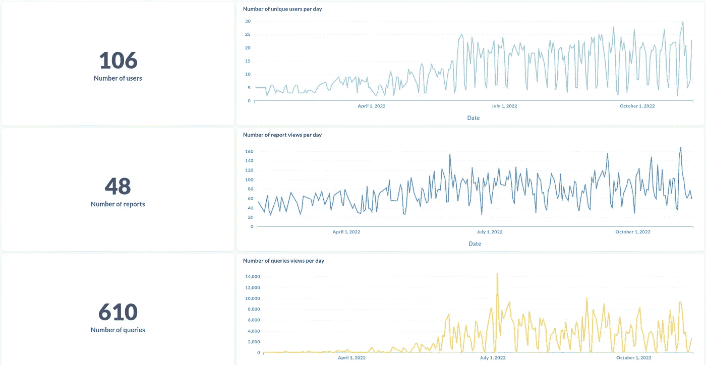
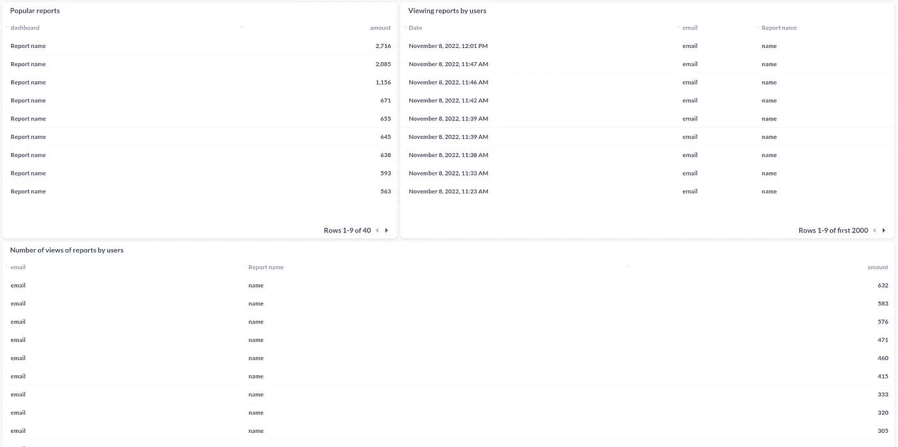

# 您如何理解您的元数据库报告正在使用？

> 原文：<https://blog.devgenius.io/how-can-you-understand-that-your-metabase-reports-are-using-af4b4947f041?source=collection_archive---------7----------------------->

与常规开发一样，报表开发需要花费程序员的时间。有关报告浏览量、活跃用户数和许多其他 BI 相关指标的信息可以提高您的分析团队的效率，并帮助您正确跟踪您的分析效率。每个团队为自己确定这样的度量标准。它们通常与报告的使用和查看报告的用户有关。我们团队中使用的度量标准，以及如何在元数据库中使用它们实现报告，将在本文中讨论。


# 你能从哪里得到报告的信息？

所有必要的信息都存储在元数据库应用程序的数据库中。因此，首先我们需要将这个数据库连接到元数据库。如果您正在使用元数据库，这个阶段对您来说很可能是可以理解的，但是我们仍然会考虑它。转到管理->数据库，然后单击“添加数据库”。选择应用程序使用的数据库类型，并输入必要的凭据。我们将 PostgreSQL 用于元数据库。你可以在这里阅读更多相关信息[。](https://www.metabase.com/docs/latest/databases/connecting.html)

# 度量和 SQL 查询来获得它们

## 1.用户数量

```
SELECT count(*) as "Number"
FROM  core_user
where is_active = True
```

该查询返回关于活动用户数量的信息。如果我们删除 is_active 条件，我们将获得关于在元数据库中创建的所有用户数量的信息。

## 2.每天唯一用户的数量

```
SELECT timestamp::date as "Date", 
count(distinct user_id) as "Number of unique users per day"
FROM public.view_log
INNER JOIN core_user on core_user.id = user_id
INNER JOIN report_dashboard on report_dashboard.id = model_id
WHERE model = 'dashboard'
GROUP BY 1
ORDER BY 1
```

该查询返回关于几天内独立用户数量的信息。这种度量也称为 DAU。为了计算这一指标，我们寻找每天至少查看一份报告的用户。通过稍微修改这个查询，我们还可以构建 WAU 和梅。

## 3.报告数量

```
SELECT count(*) as "Number"
FROM  report_dashboard
WHERE archived = False
```

该查询返回元数据库中的报告数量，但不包括存档的报告。

## 4.每天的报告查看次数

```
SELECT timestamp::date as "Date", count(*) as "Number"
FROM public.view_log
WHERE model = 'dashboard'
GROUP BY 1
ORDER BY 1
```

该查询向我们返回关于在几天内报告的查看次数的信息。如果需要特定用户的信息，还可以将这些数据与 core_user 表(core_user.id = user_id 上的内部连接 core_user)结合起来。

## 5.查询次数

```
SELECT count(*) as "Number"
FROM public.report_card
WHERE archived = False
ORDER BY 1
```

该查询返回元数据库中的查询数，但不包括存档的查询。元数据库中的任何报告都包含一定数量的查询。

## 6.每天的查询查看次数

```
SELECT timestamp::date as "Date", count(*) as "Number"
FROM public.view_log
WHERE model = 'card'
GROUP BY 1
ORDER BY 1
```

该查询返回我们关于几天内查询视图数量的信息。您还可以将这些数据与 core_user 表结合起来，如报告示例所示。

## 7.热门报道

```
SELECT name as "Report name", count(*) as "Number"
FROM public.view_log
INNER JOIN report_dashboard on report_dashboard.id = model_id
WHERE model = 'dashboard' 
GROUP BY 1
ORDER BY 2 desc
```

该查询返回每个报告的查看次数信息，从查看次数最多到最少排序。

## 8.按用户查看报告

```
SELECT timestamp as "Date", email, name as "Report name"
FROM public.view_log
INNER JOIN report_dashboard on report_dashboard.id = model_id
WHERE model = 'dashboard'
ORDER BY 1 desc
```

该查询向我们返回关于报告的启动和谁查看了它们的信息。通过按日期排序，您可以看到最近谁查看了哪些报告。

## 9.用户查看报告的次数

```
SELECT email, name as "Report name", COUNT(*)
FROM public.view_log
INNER JOIN report_dashboard on report_dashboard.id = model_id
WHERE model = 'dashboard'
GROUP BY 1,2
ORDER BY 3 desc
```

该查询返回关于谁查看了报告以及在整个时间内查看了多少次的信息。

# 使用这些指标进行报告

这些查询必须保存在元数据库中，并添加到报表中。保存时，请确保为它们选择元数据库。结果，你会得到这样的报告:



如有必要，您可以添加所需的过滤器。

# 还有哪些有用的指标？

## 1.从未登录过的用户

```
select id, email, first_name, last_name
from core_user
where last_login is null;
```

该查询返回从未登录过元数据库注册用户的信息。

## 2.没有报告的查询

```
select q.id, q.name, q.description, q.display, q.query_type
from report_card q
LEFT JOIN report_dashboardcard rdc on rdc.card_id = q.id
where q.archived = 0 and rdc.card_id is null;
```

该查询返回关于未添加到任何报告中查询的信息。

## 3.按组分布用户

```
SELECT name, count(*)
FROM permissions_group_membership
INNER JOIN permissions_group on group_id = permissions_group.id
GROUP BY 1
ORDER BY 2 DESC
```

该查询返回关于在元数据库中创建的每个访问组中有多少用户的信息。

# 结论

这些查询将帮助您构建一个信息丰富的报告，使您能够评估报告发布后会发生什么情况。