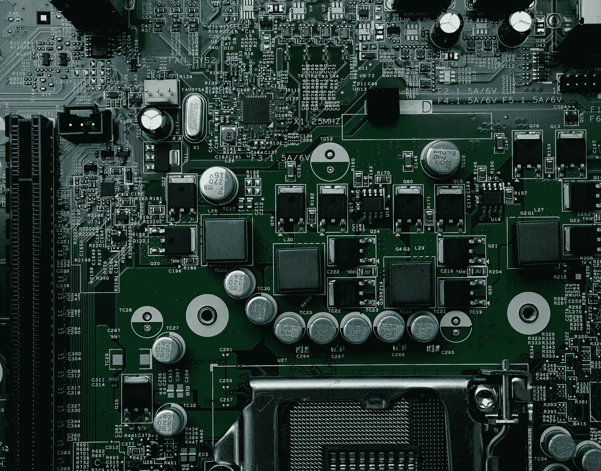
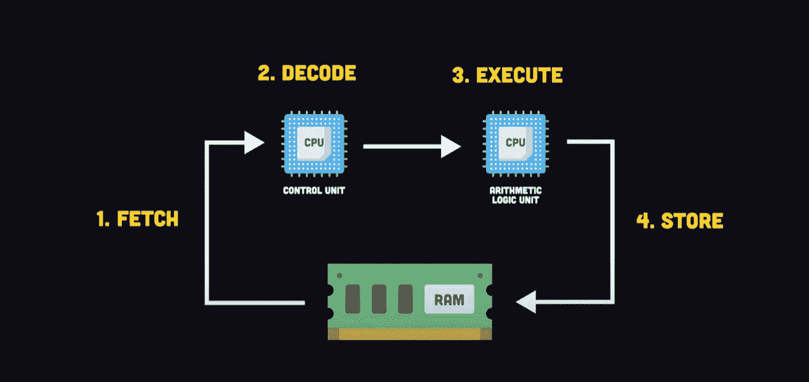
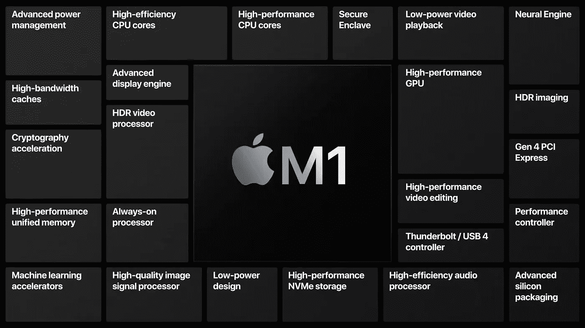
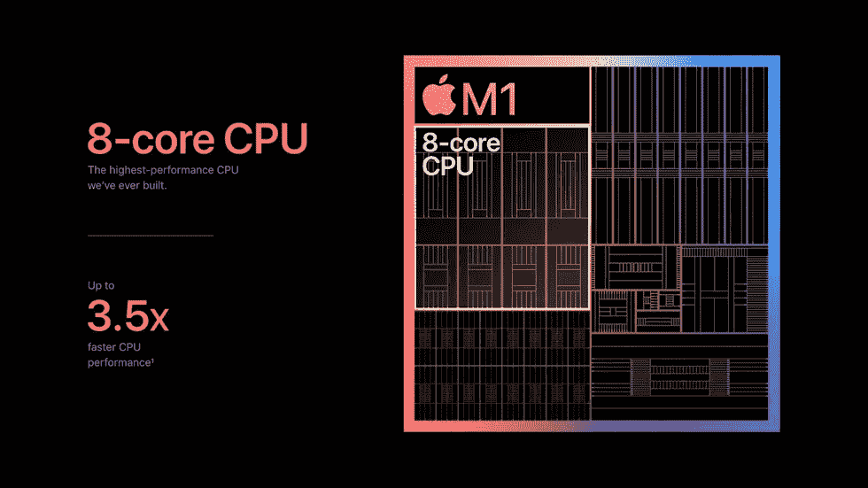
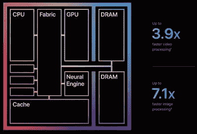
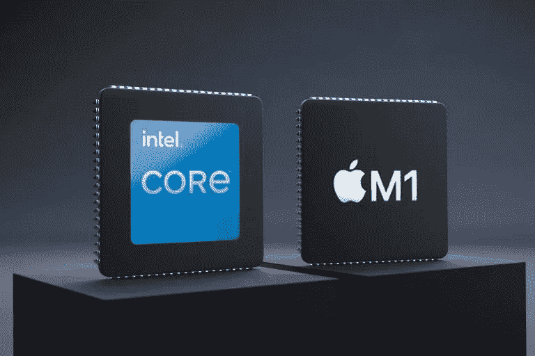

# CPU 如何工作，为什么苹果硅 M1 比英特尔 i9 快？

> 原文：<https://blog.devgenius.io/how-cpu-works-and-why-apple-silicon-is-faster-than-intel-i9-8b9303a98dca?source=collection_archive---------0----------------------->

计算机是一种可以通过编程自动执行一系列算术或逻辑运算的机器。中央处理器是计算机中最重要的部分。因此，在这篇文章中，我将谈论 CPU 是如何工作的，稍后我将谈论为什么苹果硅芯片比英特尔 i9 快。在我们深入研究这个之前，你应该知道基本的计算机知识。

**中央处理器**或 **CPU** 就像你汽车中的引擎或你头骨中的大脑，就像一个非常奇特的计算器，用来运行你电脑上的应用程序。当你用 JavaScript 或 Python 这样的语言编写软件时，你实际上是在编写一组指令，这些指令将作为机器代码由 CPU 执行，CPU 本身是一块精心制作的金属和硅，包含数十亿个代表 1 的 0 来执行数学计算的微小晶体管或开关。CPU 将多个晶体管组合在一起形成逻辑门。

例如，AND 将接受两个二进制输入，并验证两者都为真以产生真输出。解决高度复杂的计算问题需要几个基本的逻辑门。

## **CPU 时钟**

现代芯片包含数十亿个晶体管，每秒钟可以开关数十亿次。CPU 的状态由称为**时钟发生器的振荡器同步。**

计算机的速度是由其时钟周期决定的。它是计算机每秒工作的时钟周期数。单个时钟周期非常小，大约为 250 * 10 *-12 秒。时钟周期越高，处理器越快。一般来说，时钟每秒脉冲的次数越多，CPU 的计算速度就越快，通常用 gHz( **千兆赫**)来衡量。

游戏玩家有时会超频他们的 CPU 以获得更高的性能，代价是更高的温度和更低的预期寿命。

# **机器**或**指令循环**

现在，为了运行应用程序，它与系统**内存**或 **RAM** 在一系列四个步骤中进行交互，这些步骤被称为**机器**或**指令周期。**

1.  **获取-** 第一步是获取阶段。把软件程序想象成存储在 ram 中的一组指令**。**CPU 有寄存器来临时存储它想要与程序计数器从 0 开始交互的地址和内存，并将该地址复制到内存地址寄存器。然后，控制器发出一个信号，将数据从该地址复制到指令寄存器，此时它需要弄清楚如何在解码阶段使用该指令。
2.  **解码-** 在这个阶段，它弄清楚如何使用指令。控制单元解析 **OPTCODE** 中的实际位，包含加减等指令，而**操作数**是内存中执行该操作的地址。
3.  **执行-** 最后的执行阶段获取解码后的信息，并将其作为电信号传递给 CPU 的相关部件。 [**算术逻辑单元**](https://en.wikipedia.org/wiki/Arithmetic_logic_unit) 可以对数据执行数学运算，然后将结果存储在 RAM 中，以改变程序的状态。这个循环每秒钟重复数十亿次。

现代芯片利用多个 CPU 内核并行运行多个计算。这就是 CPU 在引擎盖下的工作方式，但是关于**处理器架构，还有很多你应该知道的。**

# **苹果硅 M1**

首款苹果芯片 M1 芯片于 2020 年 11 月发布，大受追捧。它立即让人们大吃一惊，因为它不仅功耗更低，而且性能比竞争对手提供的许多更昂贵、更强大的芯片更高。

## **什么是苹果 M1 芯片？**

2020 年 11 月 10 日，苹果推出了苹果硅品牌的首款产品，名为苹果 M1。这是苹果公司基于 ARM 架构开发的定制芯片，在 5nm 工艺节点上制造。苹果 M1 向使用该芯片的笔记本电脑和台式机用户承诺行业领先的性能、强大的功能和令人难以置信的效率。作为一个片上系统(SoC)，M1 将许多强大的技术结合到一个芯片中，这是一个非常有趣的创新设计，英特尔或 AMD 之前都没有见过。更不用说，M1 是第一个使用 5 纳米工艺节点制造的个人电脑芯片。很简单，它是由苹果公司自己设计和制造的定制 CPU 的名称。

M1 芯片中的主 CPU 包含 8 个内核——图片:苹果

# 为什么 M1 这么快？

想象一下，你想做带奶酪三明治的火鸡，你去冰箱，在一个地方你有火鸡，奶酪，蛋黄酱，芥末，所有的配料都在一个地方，你不必在房子里跑来跑去收集它们。你不必跑到很多商店去买，这样可以节省你大量的时间和精力。这种高效率可以在新的苹果硅芯片中找到。因为它们不仅仅是一个新的处理器。Apple Silicon 是许多芯片的集合，这些芯片被封装在一个硅容器中，这种类型的系统被称为**片上系统(SoC)。它本质上是一个芯片上的整个计算机。主 CPU、GPU、I/O 控制器、ML 引擎。它们都位于同一位置。因此，对于涉及所有这些不同组件的任何任务，chip 都节省了大量时间，效率也大大提高。就能源使用而言，它只消耗很少的能量，同时比所有组件都独立的典型机器要快。**

基于 Intel 的机器有一个单芯片 CPU，内存位于主板的其他地方，I/O 位于其他地方。单个组件可能比最新的苹果硅基机器更强大，但这是有代价的。由于这些强大的组件就像超市，提供不同的三明治配料，因此当你想在英特尔机器上吃三明治时，你必须开车走遍整个城镇，因为一家商店有火鸡，一家商店有奶酪，另一家商店有蛋黄酱。每个商店可能真的很擅长他们的过程，有最好的配料，但每个商店也需要大量的电力来运行，失去了效率，因为你真正想要的只是做一个简单的三明治。你正在浪费大量的时间和精力从所有不同的商店挑选原料。

# 苹果 M1 芯片与英特尔:主要区别

## 中央处理机体系结构

M1 芯片与英特尔处理器的主要区别在于，M1 基于 ARM 架构。ARM 处理器通常设计得更轻便、更节能，非常适合智能手机和移动设备。此外，它们是在不需要风扇的情况下将过热降至最低的理想处理器类型。

然而，这种体系结构虽然有很多好处，但也有其局限性。例如，像 M1 芯片这样的 ARM 处理器需要全新的软件。这就是为什么你会看到移动设备与电脑相比有不同的操作系统。问题不仅仅在于外形，还在于处理器兼容性。

## 软件、桌面应用和仿真

软件也是 M1 芯片在科技界引起如此大反响的最大原因之一。运行软件的基于 ARM 的处理器是如何为桌面处理器制作和优化的？苹果选择的解决方法是通过仿真运行桌面软件——并且成功通过。这不是一件容易的事，考虑到大多数通过仿真运行的东西不会运行得那么快或那么流畅。

另一方面，由于 M1 是移动处理器，新的 MAC 电脑也可以运行 iOS 应用程序。因此，有更多的交叉兼容性，进一步模糊了移动和桌面之间的界限。当然，你无法在基于英特尔的设备上获得这样的交叉兼容性。然而，微软似乎确实在推动 Windows 11 上的 Android 应用程序。

感谢您阅读我的帖子。 **如果你喜欢这篇文章，请传播这个词。要获得我的新故事的更新，请关注我的******和** [**推特**](https://twitter.com/fixslyr) **。****