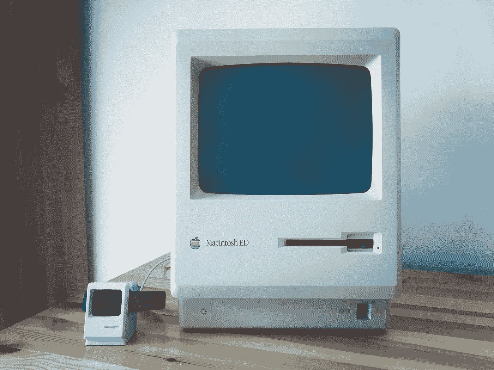
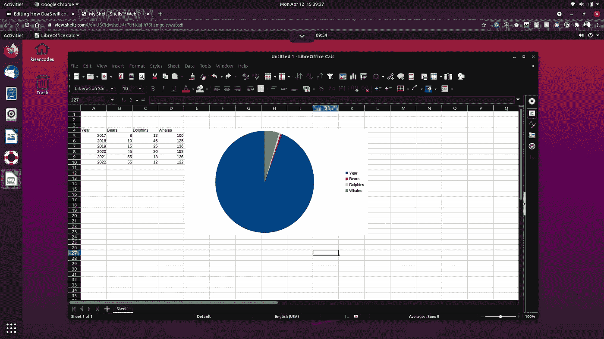
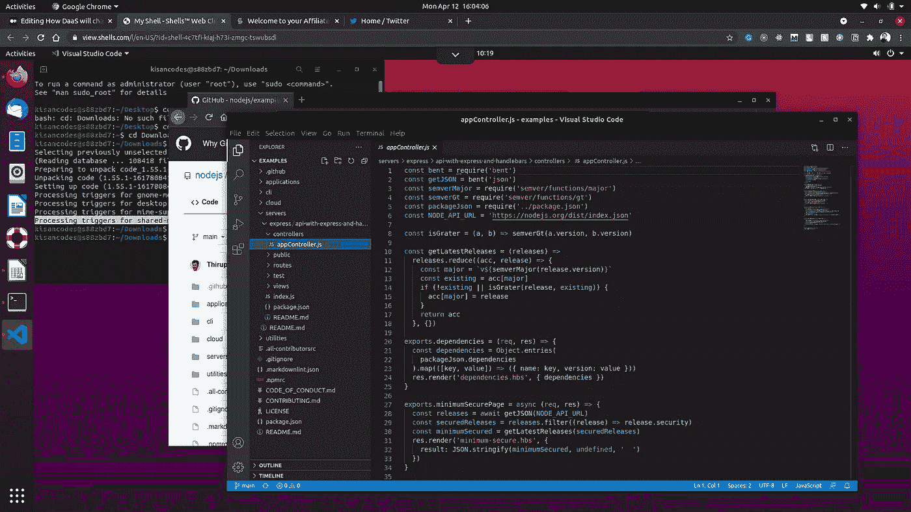
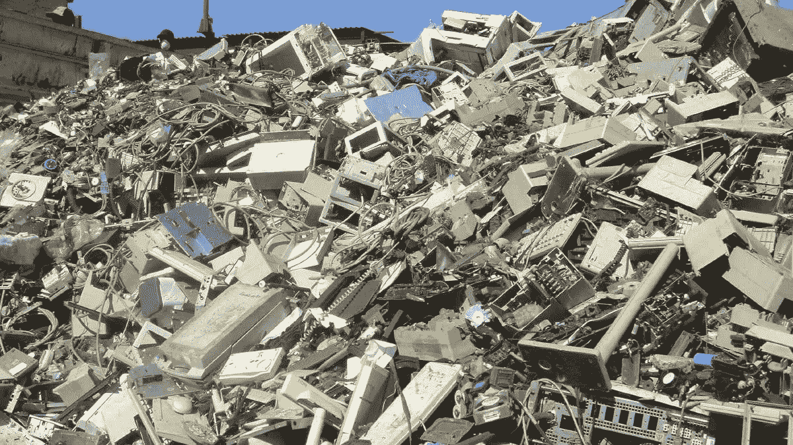

# DaaS 将如何改变我们对个人电脑的看法！

> 原文：<https://blog.devgenius.io/how-daas-will-change-the-way-we-think-about-personal-computers-21c9c224a904?source=collection_archive---------7----------------------->

由 [Pablo Martinez](https://unsplash.com/@pablomp?utm_source=unsplash&utm_medium=referral&utm_content=creditCopyText) 在 [Unsplash](https://unsplash.com/@fedechanw?utm_source=unsplash&utm_medium=referral&utm_content=creditCopyText) 上拍摄的照片

过去，计算机主要被大公司和大学用于研究目的。它又贵又大，曾经占据了整个房间——几千平方英尺，而且速度很慢。

你口袋里的 iPhone 的计算能力是 1961 年美国宇航局阿波罗计划将人类送上月球的电脑的 10 万倍。

一台名为阿波罗制导计算机(AGC)的计算机正在指导这项任务，它只有 0.043MHz 和 2048 个字的内存，用于存储临时结果。

我们及时赶到了。那些事感觉像是一个世纪以前的事了。今天，我们的智能手机可以拥有 **96，000，000，000** 比特的内存，甚至更多。

一年来，计算能力显著增加，不符合摩尔定律——根据摩尔定律，每片硅片上的晶体管数量每年翻一番。

当 AWS 在 2006 年推出名为 EC2 的计算服务时，整个云业务已经有了新的面貌。只需点击一个按钮或执行一个脚本，您就可以在一分钟内获得一个虚拟化的操作系统。是不是很神奇？

今天，我们每天都在使用云计算。即使你已经注意到了。我们使用 google 相册存储照片，使用 Onedrive 存储文件等等。

这些大型科技巨头以服务的形式提供许多东西，这在几年前似乎是不可能的。

在当今的科技行业，有一个叫做 ***桌面即服务(DaaS)的新概念。*** 在这篇文章中，我们将看到 it 的一些概念，以及它将如何改变(我相信)个人电脑业务。

## 我和 DaaS 的经历

让我告诉你一点我在 Shells 的经历，Shells 是一家总部位于加州的技术公司，使用云计算提供桌面即服务(DaaS)。

*DaaS* 是一种利用云计算技术的力量为您提供个人桌面电脑即服务的新方式。它是由云计算机群支持的虚拟化桌面，您只需要一个互联网连接，就可以在任何类型的设备上使用，包括平板电脑、手机和笔记本电脑。

我使用 DaaS 已经有一段时间了。我对此想了很多，也在我的 D2D 工作中进行了尝试。你也可以试一试。在这里报名[。](https://www.shells.com/?_a=NAtWu9)

我试过用 LibreOffice Calc。

LibreOffice Calc 在[shell 中](https://www.shells.com/?_a=NAtWu9)

我用它写了一整天的代码。我不觉得有什么问题。这是一种原生的桌面体验。我遇到的唯一问题是图形有些滞后。这很可能是我的网速问题。我使用的服务器也在日本。所以，一定有一些高延迟。

首先我安装了 VSCode。

在[外壳](https://www.shells.com/?_a=NAtWu9)上运行 VSCode

并在上面运行了一些 Nodejs 应用程序。整体体验真的很好。

那么，使用 DaaS 值得吗？

我坚信这项服务将会更进一步，给你一个原生的桌面体验，并在你的手机、平板电脑上运行台式机。

这些天来，我们一直在积极采用云技术，人们喜欢它，因为它方便、便携。我认为 DaaS 也是如此。

## 使用 DaaS 有什么好处？

让我告诉你这里的一些优点:

## 1.它是可靠的

对谁都靠谱。我坚信人们会用它做更多的事情，就像你用真正的个人电脑做的事情一样。

## 2.它是负担得起的

DaaS 可以以合理的价格使用，如果你想关闭你的账户，你可以在一秒钟内完成。没问题。

## 3.它增强了安全性

DaaS 是由一群高技能的专业人士保护的，我相信在你公开你的账户凭证之前不会有任何问题。

## 4.它由强大的云计算机驱动

云计算很牛逼。您可以将超级计算机的强大功能作为一项服务，只需为您使用的内容付费，并随时取消订阅。DaaS 也是一样。

## 是给谁的？

作为一名软件工程师，我试着在上面编码。由于它的早期阶段，可能会有一些问题，但从长远来看，它对任何人都有用——学生、程序员、工程师、出版商。几乎任何人。

## 减少电子垃圾

堆积如山的电子垃圾。费尔法克斯文件图像。

我们今天面临的主要问题之一是环境问题。我们每年都有数百万吨的电子垃圾。我也相信从长远来看，DaaS 也能减少这种浪费。

## 最终想法

我坚信这个想法是革命性的，随着时间的推移，每个人和每个企业都会从中受益。我也相信经过一些工程迭代，服务会变得更好。

试试看[这里](https://www.shells.com/?_a=NAtWu9)创建一个帐户，让我知道你对它的看法。

*感谢阅读！*