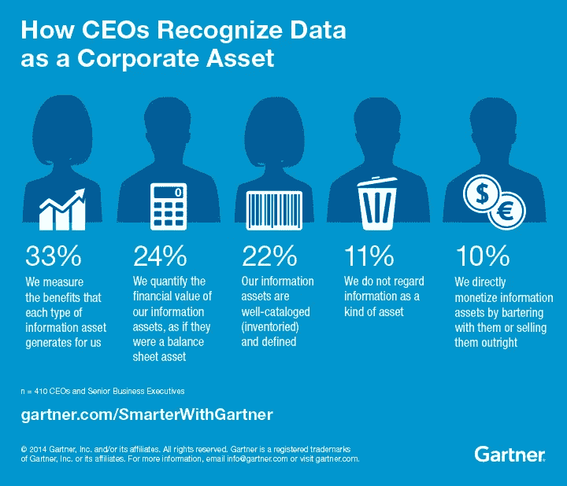
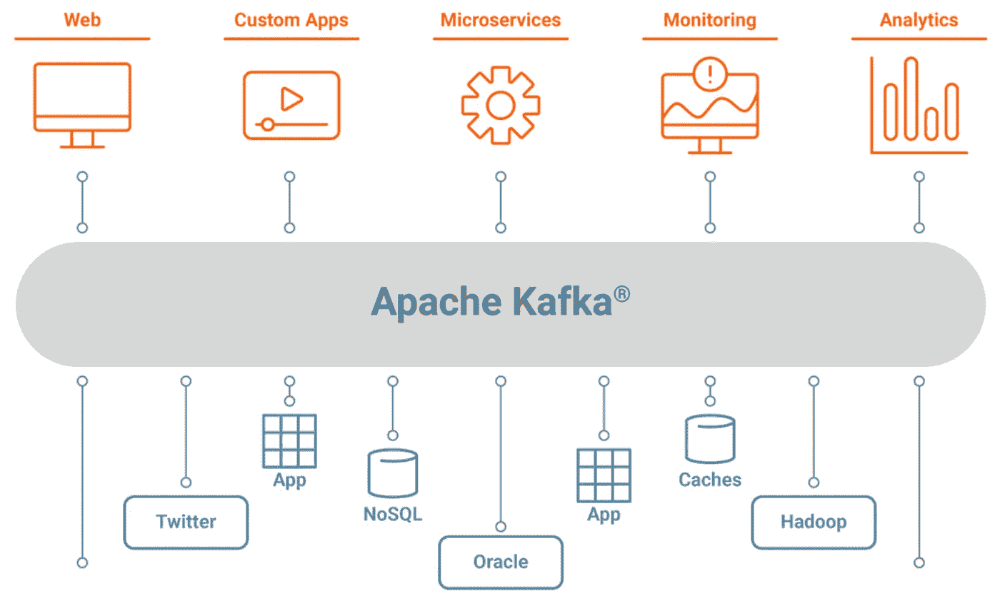

# 数据团队如何发展成 CDO 组织？

> 原文：<https://blog.devgenius.io/how-data-teams-can-evolve-into-cdo-organizations-cfd603decf55?source=collection_archive---------7----------------------->

## 数据组织已经准备好成为 CDO 组织。数据组织应该渴望并被鼓励发展成为一个组织

首席数据官组织是现代组织中的一个关键部门

在当前这个“数据是新的石油” [1](https://www.wired.com/insights/2014/07/data-new-oil-digital-economy/) 的时代，试图开采这种新石油的科技组织被罚款数百万[ [2](https://www.tessian.com/blog/biggest-gdpr-fines-2020/) ]，首席数据官(CDO)组织是大多数大中型组织的必备部门。当许多企业从头开始建立 CDO 组织时，这篇博客认为现有的**数据工程组织**正准备演变成 **CDO 组织**。

# 什么是 CDO 组织，我们为什么需要它？

CDO 角色有多种定义；下面我重点介绍一些比较突出的例子:

> *CDO 的主要作用是用数据支撑业务战略。他们负责最大限度地发挥数据在整个组织中的战略潜力—* 卡洛琳·卡鲁泽斯*[*[*3*](https://www.cio.com/article/230880/what-is-a-chief-data-officer.html)*】*
> 
> CDO 扮演的角色更多的是风险、合规、政策管理和业务。它用于推动信息和分析策略，服务于业务目的。—Gartner[[*4*](https://www.gartner.com/smarterwithgartner/understanding-the-chief-data-officer-role)*】*

虽然首席数据官的日常职责可能因组织而异，但 CDO 的总体使命仍然是在公司内部拥有“数据驱动的文化”，同时满足内部(数据资产管理/货币化)和外部利益相关方(合规)的期望。

首席执行官们已经开始认识到数据是一种公司资产，应该加以管理和货币化[4]

# 为什么数据工程组织准备成为 CDO 组织？

1.  **更高的投资回报率和成功概率**

数据管理和 CDO 组织之间有相当多的职责重叠。因此，这些团队能够利用他们当前的 ***团队、人才、资源和网络*** ，同时也意识到当前系统的弱点。

2.**团队的远大目标和组织的自然继任计划**

对于数据工程、数据科学和商业智能组织来说，成为 CDO 组织可能是一个令人向往的目标。我们可以团结整个团队支持这个远大的目标。

如果领导者有这样一个雄心勃勃的目标，并为公司带来更高的投资回报率，他们可能会发现在这样的过渡时期处理内部政治更容易。

# 数据组织如何演变成 CDO 组织？

任何创业公司都需要两种策略来立足于市场:

1.  **外部视角** —产品、品牌、营销、销售、利益相关方
2.  **内部视图** —如何实现外部视图—目的、人员、技术、技能、团队拓扑、运营、项目管理

让我们探讨一下关于数据组织向 CDO 组织发展的这两种观点

# **外部视图—品牌和产品**

大多数当前的数据组织已经拥有并管理一些 CDO 组织应该提供的最重要的资产，例如企业数据仓库或湖泊、数据管道、数据科学平台、BI 和报告、大数据平台以及数据基础架构。

为了发展成为 CDO，我认为以下附加产品有助于证明这些组织已经作为一个 CDO 组织在运作:

## **1。用于应用程序之间异步通信的组织级队列/消息总线**

虽然大多数数据团队通常拥有组织范围的企业数据仓库(EDW)，但作为 PAAS 产品的企业队列并不普遍。虽然许多软件团队为他们的应用程序构建了这样的队列，但许多技术含量较低或资源受限的团队转而采用不太理想的集成模式，例如:
- **同步通信—** 资源密集，不可重用，并在系统之间创建紧密耦合
- **EDW 作为中间层—** 当两个系统无法在它们之间创建直接连接时，他们还会求助于使用 EDW 作为缓冲存储。
这是次优的，因为下游应用变得紧密耦合，基于事件的集成是不可能的，并且在数据仓库中实施归档策略变得具有挑战性。

企业队列应该作为 PAAS 来提供，以促进应用程序之间的解耦集成

像企业数据仓库一样，**企业消息队列**可能是 CDO 组织提供的 PAAS 服务，用于创建组织范围的架构模式。

## 2.**数据处理系统即服务(PAAS)**

数据处理生态系统正被开源工具(KAFKA、Airflow、Flink 等)所吸引。)，易于设置和试验，但如果没有专门的团队来负责基础架构、修补、升级、合规性等，则很难在生产中进行管理。，尤其是在本地环境中。

此外，这些工具必须由独立的权威机构进行评估、采购，并在必要时升级到企业版本。CDO 组织还必须采用全面分散这些工具的政策。

为了创建数据驱动的文化，数据团队需要从单纯的服务团队发展成支持团队。拥有基础设施和平台仍然是不太面向数据的团队采用数据驱动文化的最大障碍

## 3.**数据治理**

数据治理仍然是 CDO 组织需要扮演的最重要的角色。这包括管理数据生命周期，从创建、更改到废弃。

数据组织需要正确的工具来进行数据编目、概要分析、列级沿袭、数据质量、采样和发现。这些工具还需要专门团队的支持和高管的支持。

## 4.除上报外，推广**数据接口**

虽然大多数数据组织已经拥有 Tableau 和 Looker 等报告工具，但为了根据分析影响行动，洞察需要到达目标用户花费最多时间的应用程序。想想销售的 Salesforce 和营销的 Adobe Analytics。

为目标用户花费最多时间的用户组和角色确定合适的界面是 CDO 组织必须努力去做的事情。然后我们可以利用**反向 ETL** 工具让洞察流向这些接口。

## **5。拥有政策和流程以实现数据驱动的文化**

平台、工具和服务对于 CDO 组织来说非常重要，但是为了能够创建真正的数据驱动型文化，CDO 需要创建和推广正确的策略来支持自助服务、推广正确的体系结构并降低整个组织中数据访问的成本和运营挑战

**5.1。如果不向组织的其余部分提供默认的数据外部化机制，任何项目都不会被视为“完成”**

据科技传奇报道，2002 年，亚马逊创始人杰夫·贝索斯发布了一项命令

> 所有的服务接口，无一例外，都必须从头开始被设计成可外部化的。也就是说，团队必须计划和设计能够向外部世界的开发人员公开接口。没有例外。任何不这样做的人都将被解雇。—杰夫·贝索斯

孤立的数据是组织中数据驱动文化的最大障碍之一。数据组织应该努力制定并实施一项管理应用程序数据访问的政策。任何新的应用程序都不应该被视为“完成”，直到它允许数据外部化以满足分析需求。

通向数据产品的道路要经过数据外部化政策，这应该是 CDO 组织要实现的首要目标。

**5.2。数据生产者与消费者合同**

**数据契约**是数据外化政策的延伸。应用程序和数据源所有者应该设计数据产品，供组织的其他成员用于分析目的。这些分析数据产品将受 ***数据合同、*** 数据合同管辖，因此数据源所有者将尽量不与其下游消费者违反该合同，任何变更都应经过变更管理流程(如有必要)。

## 6.数据货币化政策

照片由 [Mathieu Stern](https://unsplash.com/@mathieustern?utm_source=medium&utm_medium=referral) 在[unplash](https://unsplash.com?utm_source=medium&utm_medium=referral)上拍摄

在介绍了上述基础知识后，CDO 公司的下一个转折点是寻找机会，通过创造新产品或服务，将其现有的数据资产转化为货币。

如果成功，一个 CDO 组织可以致力于为企业从成本中心转变为利润中心。

# 执行 CDO 品牌的内部运营结构

**6P** 结构下可组织一个 CDO 团队。第一个 P 代表*目的，接下来是 PMO、项目、平台、人员和合作伙伴。[*[*7*](https://analyticsindiamag.com/who-should-a-chief-data-officer-report-to/#:~:text=At%20Aditya%20Birla%20Group%2C%20the%20data%20analytics%20team%20has%20been%20organised%20in%20what%20they%20call%20the%206P%20structure.%20The%20first%20P%20stand%20for%20Purpose%2C%20followed%20by%20PMO%2C%20Project%2C%20Platform%2C%20People%20and%20Partnerships)*]*

尽管每个组织的确切团队拓扑会因其规模、需求和成熟度而有所不同，但在尝试成长为 CDO 团队时，这里有一些可以应用的建议。

1.  **数据产品管理团队**

数据产品管理团队的口号是“设计思维”，同时保持客户至上的心态。该团队有三项主要职责:

a. **BU 的开发代表:**这个团队负责在 sprint 会议上提出业务需求。该团队通过密切观察业务流程以及数字化或分析如何帮助数据驱动的决策制定，主动了解业务的数据需求，而无需等待业务部门向 IT 或 CDO 提出此类请求

**b. CDO 业务部门代表:**这个团队也对将分析性见解转化为业务行动直言不讳。例如，一旦系统将客户识别为有流失风险，他们将希望了解现场代表采取的行动。

**c. CDO 和总线代表到源团队:**这个团队作为所有应用团队创建的分析产品需求的 SPOC

**2。平台即服务(PAAS)团队**

CDO 组织应该有一个专门的团队来管理平台即服务，以实现数据民主化和自助服务。PAAS 团队可以由软件工程师组成，他们将负责平台的自动化、高可用性、许可成本优化、最佳实践和治理。

**3。数据治理团队**

CDO 组织应该有一个强大的数据治理团队，致力于它的使命，有管理策略的权力，有适当的执行官的支持，并对源和目标团队有影响力。

这个团队的策略创建和策略执行子组应该将他们的职责分开，以便策略的质量不会因为更容易的实现过程而被牺牲

4.每个大项目可以有 ***产品经理、项目经理、*** 工程经理三人组。这三个角色应该有一个独立的报告结构，以确保交付团队不是唯一一个规定时间表和规范的团队

# 结论

无论有没有 CDO 官方头衔，数据团队对产品组合的轻微扩展都可以为企业增加大量价值。就像个人获得晋升的最佳策略是开始承担下一级的责任一样，即使是部门也需要创造自己的增长战略，以便能够为企业增加更多价值，不管有没有官衔，官衔都会随之而来。

请通过 Linkedin 联系我，以便进一步交流。

非常感谢！

## 参考

1.  [https://www . wired . com/insight/2014/07/data-new-oil-digital-economy/](https://www.wired.com/insights/2014/07/data-new-oil-digital-economy/)
2.  [https://www.tessian.com/blog/biggest-gdpr-fines-2020/](https://www.tessian.com/blog/biggest-gdpr-fines-2020/)
3.  [https://www . CIO . com/article/230880/what-is-a-chief-data-officer . html](https://www.cio.com/article/230880/what-is-a-chief-data-officer.html)
4.  [https://www . Gartner . com/smarterwithgartner/understanding-the-chief-data-officer-role](https://www.gartner.com/smarterwithgartner/understanding-the-chief-data-officer-role)
5.  [https://docs.confluent.io/5.5.1/kafka/introduction.html](https://docs.confluent.io/5.5.1/kafka/introduction.html)
6.  [https://nordicapis . com/the-be zos-API-mandate-amazons-manifesto-for-externalization/](https://nordicapis.com/the-bezos-api-mandate-amazons-manifesto-for-externalization/)
7.  [https://analyticsindiamag . com/who-should-a-chief-data-officer-report-to/](https://analyticsindiamag.com/who-should-a-chief-data-officer-report-to/)
8.  [为失败设立首席数据官(CDO)的五种策略|作者帕拉德普·梅农](https://rpradeepmenon.medium.com/five-strategies-to-set-up-the-chief-data-officer-cdo-for-failure-3062744cd8a6#:~:text=Strategy%20%235%3A%20Create%20a%20data%2Donly%20focus%20for%20the%20CDO)
9.  [塑造首席数据官角色的 10 大趋势](https://www.techtarget.com/searchdatamanagement/tip/10-trends-shaping-the-chief-data-officer-role)