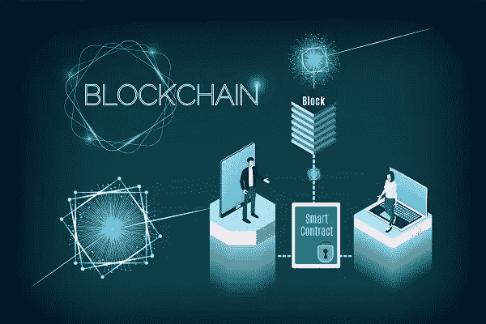

# 如何开发一个完整的以太坊智能合约

> 原文：<https://blog.devgenius.io/how-developing-a-full-ethereum-smart-contract-looks-like-ddad5e5c8e50?source=collection_archive---------6----------------------->

使用 solidity 了解如何制定一份完整的智能合同。

在不编写测试代码的情况下完成了一个完整的智能合约。但是这一个包括与多个参与编程的实体编写一个智能契约。以下是关于我的筹款合同的细节，以学习稳健。

**什么样子**

在我的第一次体验中，它包含了数百行需要修复的错误代码。但是我有一个队友，他在软件测试中懂得编程。我们把我们的小伙子带了进来，我们直接讲述了这个项目。他只是说好，我们决定自己做这项工作。谢天谢地，在我们的网络中，我们的另一个伙伴给我们发来了代码，来分析和构建我们在比赛中需要的东西。这是我的第一次经历。现在我们来分解一下:

创建代码后，分析和修复它们是一个相当大的问题。我甚至没有提到初始阶段的测试。我必须找到我的文本编辑器用红色和黄色圆点显示给我的所有错误，并找到可能的方法来修复它们。睡觉前，我设法解决了大部分问题。剩下的过程由我的队友处理。现在，我们可以放心地展示我们的软件原型了。但是由于不同的原因，几天后我们决定放弃。

**现在我最近的例子**

这是一个筹资合同，其中许多实体都参与了编程。这是主要的软件设计、开发和测试，其中所有组件相互补充。尽管我开始学习软件设计已经有一年了，但我在软件开发和测试方面还是有问题。因此，我找到了一些例子，在这些例子中，我不得不自己开发和测试与我的 CS50 最终项目相似的软件。但是编程语言不同，必须编写测试脚本。在我自己完成全面开发后，逻辑是一样的。

但是，我需要完整的计划和材料来创建一个有效的智能合同。首先，我研究了它们的制作方法，并决定自己动手制作。然后，我构建了智能合同的主要部分，其中主要部分的功能足够好，可以保持合同正常工作。在我完成合同后，我计划增加这些例子，以便在 solidity 和其他平台上独立编程。

*你是如何在稳健性上做全方位智能合约的？你之前的软件开发工作是否和以太坊上的软件开发类似？请在下面的评论区分享你的经历。*