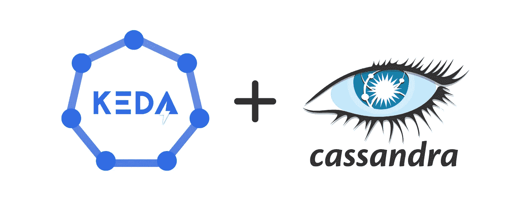
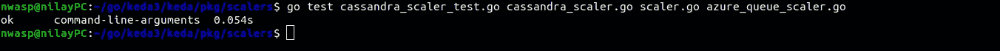
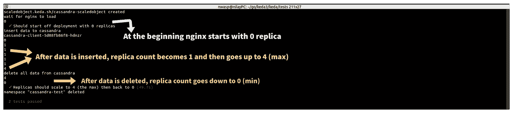
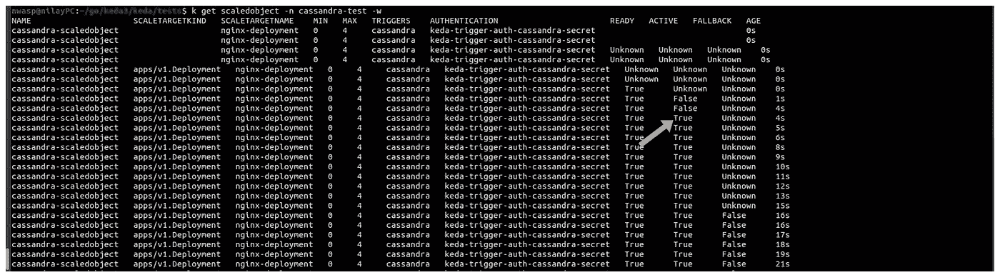

# 我为卡珊德拉添加了一个新的缩放器，这对 KEDA 有什么贡献

> 原文：<https://blog.devgenius.io/how-did-i-contribute-to-keda-by-adding-a-new-scaler-for-cassandra-d0b3878c6baf?source=collection_archive---------1----------------------->



*在我之前的* [*博客*](https://nilayasiktoprak.medium.com/how-to-write-a-weather-scaler-for-keda-454183c57790) *中，我讲过如何写一个“天气定标器”来理解定标器的工作原理。在这一个中，我将谈论 Cassandra scaler 做什么，* ***如何写 scaler，它的单元，和 E2E 测试*** *检查它的运行。*

*您可以查看我的*代码

*   [*卡珊德拉缩放器*](https://github.com/kedacore/keda/blob/main/pkg/scalers/cassandra_scaler.go)
*   [*单元测试*](https://github.com/kedacore/keda/blob/main/pkg/scalers/cassandra_scaler_test.go)
*   [*E2E 测试*](https://github.com/kedacore/keda/blob/main/tests/scalers/cassandra.test.ts) *来自 Github*

# 什么是 KEDA？

**KEDA(基于 Kubernetes 的事件驱动自动缩放器)**是一个单一用途的轻量级组件，可以添加到任何 Kubernetes 集群中。它帮助你根据等待处理的事件数量来扩展 Kubernetes 中的任何容器。

KEDA 有自己的**四** **自定义资源** (CRD):

虽然我将为 Cassandra scaler 使用 **ScaledObjects** 和 **TriggerAuthentications** ，但我不会提及 **ScaledJobs** 和**clustertrigger authentication s**。

`ScaledObjects`表示事件源(例如 Cassandra:)和 Kubernetes 部署、StatefulSet 或任何将要扩展的定制资源之间的期望映射。

`TriggerAuthentication`包含监控事件源的认证配置或秘密，可由 ScaledObjects 引用。

你可以在这里查看如何在 Kubernetes [中**部署 KEDA** 。](https://keda.sh/docs/2.4/deploy/)

# 【Cassandra Scaler 是做什么的？

Cassandra Scaler 通过解析传递了**元数据**和**触发认证**配置的`scaledobject.yaml`文件来打开新的 Cassandra 会话。

会话建立后，定标器运行查询来检查是否有等于或大于 scaledobject.yaml 文件中指定的 **targetQueryValue** 的未决事件。如果是，这将触发缩放器，然后缩放器将其自身设置为“活动”以缩放它们。

它根据 scaledobject.yaml 文件中再次指定的 **maxReplicaCount** 增加 pod 编号。在事件被消耗后，这一次，定标器根据 **minReplicaCount** 减少 pod 编号，并将其自身设置为“无效”,因为不再有事件。

# **Scaler 怎么写？**

KEDA 的定标器写在 **Go** 中。我用 **Minikube** 做当地的 Kubernetes。

首先声明 scaler 的地方应该有一个 struct 变量。缩放器由元数据和 Cassandra 会话组成。

然后，应该声明`CassandraMetadata`结构。要打开带认证的 Cassandra 会话，需要**用户名**和**密码**。

*   **clusterIPAddress** 是 IP 地址或主机名，而 **port** 是 Cassandra 实例的端口号。
*   **一致性**是针对会话或单个读取操作的配置。
*   **protocolVersion** 是 CQL (Cassandra 查询语言)二进制协议。
*   **keyspace** 是定义节点上数据复制的名称空间。
*   **查询**是一个 Cassandra 查询，应该返回一个数值。
*   **targetQueryValue** 是用户提供的阈值，在水平 Pod 自动缩放器(HPA)中用作 targetAverageValue。
*   **指标名称**是分配给指标的名称。
*   **scalerIndex** 通过对 metricName 进行编号来帮助它变得唯一。

所有类型都声明之后，就该创建函数了。应该有构造定标器的函数:`NewCassandraScaler`。

它从`ParseCassandraMetadatathe` 函数获取解析后的元数据，并将其发送给`NewCassandraSessionthe` 函数以启动 Cassandra 会话。这样，如果发生错误，它将返回 **cassandraScaler** 和**错误**。

解析`scaledobject.yaml`文件是由`ParseCassandraMetadata`函数完成的。它返回**Cassandra metadata**struct 和一个**错误**(如果发生的话)。

启动卡珊德拉会话由`NewCassandraSession`功能完成。它返回创建的**会话**和**错误**(如果发生)。

我说过，当有未决事件时，定标器会将其自身设置为**活动状态**。通过`IsActive`功能完成。它获取查询结果并检查它是否高于 0。如果是，则返回 **true** 表示“激活”，如果出现**错误**。

运行查询并得到结果是通过`GetQueryResult`功能完成的。它返回从查询中获得的**数值**，如果发生错误则返回**错误**。

KEDA 与 Kubernetes **卧式豆荚机** **(HPA)** 合作。当 KEDA 注意到一个新的 ScaledObject 时，它会创建一个 HPA 对象，该对象包含轮询和相应缩放 pod 所需度量的基本信息。为了创建这个 HPA 对象，KEDA 求助于`GetMetricSpecForScaling`函数。这里也是借助 **ScalerIndex** 生成 **metricName** 的地方。

`GetMetrics`是洁牙器的关键功能；它返回一个值，该值表示外部度量的当前状态(例如，Cassandra 查询结果)。Kubernetes HPA(水平 Pod Autoscaler)将通过 KEDA 的度量服务器定期轮询`GetMetrics`(只要至少有一个 Pod)，并将返回值与 ScaledObject 配置中的配置值进行比较。Kubernetes 将使用以下公式来决定是否上下缩放豆荚:


最后，还有一个 **Close** 函数，KEDA 调用该函数，以便能够在定标器上的每次轮询之后关闭任何打开的连接来检索度量。

***注意:*** *你可以在最后找到定标器是如何工作的图片！*

# 如何为卡珊德拉定标器编写单元测试？

单元测试测试输入是否产生预期的输出。KEDA 所有的单元测试都写在 **Go** 中。

在卡珊德拉的单元测试中，有两种类型的结构:一种是存储**元数据**的地方，另一种是检查**度量名称**。

在`parseCassandraMetadataTestData`结构中；

*   元数据，
*   身份验证配置
*   和错误被声明。

`cassandraMetricIdentifier`结构中；

*   解析的元数据，
*   scalerIndex
*   并声明度量的名称。

现在，有两种类型的变量。一个是传递所有测试元数据的地方，另一个是传递预期 metricNames 的地方。

在`testCassandraMetadata`变量中，首先没有传递任何会导致错误的东西。接下来，应该不会导致任何错误的所有内容都将通过。然后，所有导致错误的可能性都被忽略了。

在`cassandraMetricIdentifiers`变量中，写入了期望生成 **metricName** 的列表。在这种情况下，metricName 在**列表 1** 和**列表 2** 中进行测试(由于列表 2 和以下内容在产生 metricName 方面是相同的，所以我只测试了列表 2)。

最后，函数出现了。其中一个解析 Cassandra 元数据，另一个检查 metricName 生成。

这里来自定标器的`ParseCassandraMetadata`函数用于解析给定的数据。它检查错误的情况，无论它们是否是预期的。

另一个也是最后一个函数`TestCassandraGetMetricSpecForScaling`在`PaseCassandraMetadata`函数的帮助下再次解析元数据。它创建一个新的 Cassandra 会话，然后检查测试数据中给定的 metricNames 是否与生成的 metricNames 匹配。

## 如何运行单元测试？

使用如下所示的`go test`命令在 Go run 中编写的单元测试。作为命令的参数；

*   单元测试的路径，
*   卡珊德拉 scaler，
*   `scaler.go`文件
*   并且`azure_queue.go scaler`(**externaMetricType**属性是在 azure_queue_scaler.go 中定义的，所以需要导入到 go 测试路径中)必须通过。



# 如何为 Cassandra Scaler 编写 E2E 测试？

E2E 测试从头到尾测试整个软件产品，以确保应用程序按预期运行。

KEDA 的 E2E 考试是用**打字稿(。ts)** 。

有 3 个阶段:测试前，测试，测试后。

卡珊德拉缩放器的场景是这样的:

## 测试阶段前

*   设置测试中经常用到的常量

*   为测试环境创建一个测试命名空间

*   部署 Cassandra，等待它启动并运行

*   部署 Cassandra 客户端，等待它启动并运行

*   进入 Cassandra 客户端窗格，创建一个键空间和一个表

*   部署 nginx，因为它将被缩放(一些缩放者更喜欢 NGINX 缩放，所以我跟随他们)

## 检验阶段

*   在将任何数据插入到 Cassandra 表之前，测试 nginx 部署是否首先从 0 副本开始

*   插入足够的数据并测试副本计数是否达到 maxReplicaCount

*   删除所有数据，并测试副本计数是否下降到 minReplicaCount(零)

## 测试后

*   删除测试命名空间

## 如何运行 E2E 测试？

```
cd tests/
npx ava scalers/cassandra.test.ts -v
```

E2E 测试的输出如下面的第一幅图所示。

# 卡桑德拉 Scaler 如何工作的照片



谢谢你陪我走到这一步！😃希望一切都明白。能为这样一个大而惊人的项目做贡献，我感到非常荣幸！🎉

我非常感谢坎·厄兹丁纳和[奥莰·厄兹德米尔](https://medium.com/u/e81e868a724?source=post_page-----d0b3878c6baf--------------------------------)在整个项目中的支持。非常特别地感谢我唯一的[Bar Kurt](https://medium.com/u/4b2a89e759cf?source=post_page-----d0b3878c6baf--------------------------------)在这个项目中不分昼夜地帮助和支持我。没有他们我做不到。❤️

KEDA 有很棒的维护人员，我也要感谢他们一直以来的帮助和理解。他们不厌其烦地回答你的问题。🌟