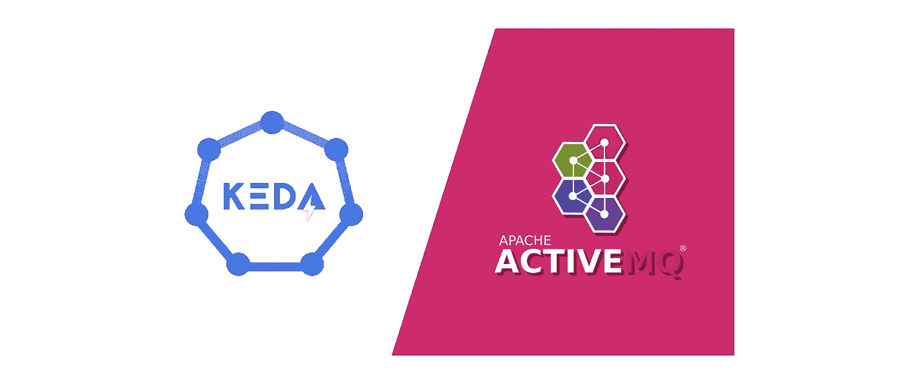
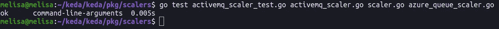
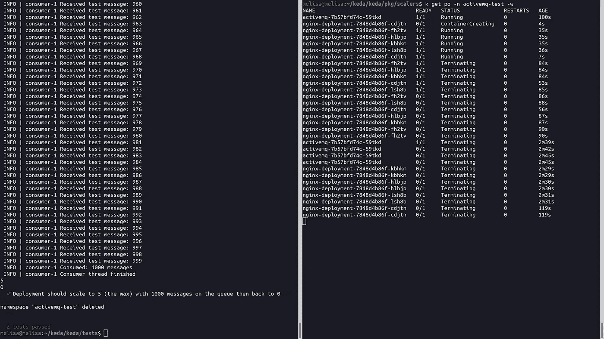

# 我如何为开源做出贡献？—通过添加新的活动 MQ 缩放器来贡献 KEDA 的指南

> 原文：<https://blog.devgenius.io/how-did-i-contribute-to-open-source-46a7bad88d99?source=collection_archive---------14----------------------->



有很多种方式可以为 KEDA 做出贡献。在本文中，我将通过创建一个新的 KEDA 缩放器来解释我的贡献之旅。我添加了一个新的缩放器，它可以基于 ActiveMQ 代理进行缩放。它联系 ActiveMQ 的管理端点来确定队列的消息计数，并相应地进行扩展。

增加一个新的定标器基本上包括 3 个部分:

1.创建新的缩放器

2.提供其单位和 e2e 测试

3.为 [keda.sh](https://keda.sh/) 页面提供文档和示例

定标器和单元测试用 Go 编写，E2E 测试用 TypeScript 编写，使用的是 [ava](https://github.com/avajs/ava) 框架。

点击 [ActiveMQ 定标器](https://github.com/kedacore/keda/blob/main/pkg/scalers/activemq_scaler.go)、[单元测试](https://github.com/kedacore/keda/blob/main/pkg/scalers/activemq_scaler_test.go)、 [e2e 测试](https://github.com/kedacore/keda/blob/main/tests/scalers/activemq.test.ts)和 [ActiveMQ keda.sh 文档](https://github.com/kedacore/keda-docs/blob/main/content/docs/2.6/scalers/activemq.md)可以访问 Github 代码。

## 什么是 KEDA？

KEDA(基于 Kubernetes 的事件驱动自动缩放器)是一个单一用途、轻量级和开放源代码的组件，可以添加到任何 Kubernetes 集群中。

KEDA 的目的是提供更好的扩展选项，以便使用针对 Kubernetes 上的事件驱动应用程序的最佳指标进行更有效的扩展。有了 KEDA，Kubernetes 集群能够根据事件源(例如 MongoDB、Kafka)进行扩展，而不是像 Kubernetes 那样消耗内存和 CPU 等基于资源的指标。

## KEDA 如何使用 ActiveMQ？

扩展事件驱动的微服务时，队列中的消息数实质上就是需要处理的事件数。ActiveMQ 定标器的目的是监视队列积压。使用积压作为需求的衡量标准，KEDA 和水平 Pod Autoscaler (HPA)将每个微服务扩展到所需的副本数量。

如果消息计数较低(低于定义的阈值)，则表明需求较低，应扩展微服务。在相反的情况下，如果队列中有大量的消息，这表明需求很高，应该向外扩展微服务。

从版本 5.8 开始，ActiveMQ 为代理提供了 REST 管理 API。使用 [Jolokia](https://jolokia.org/) JMX-HTTP 桥，可以访问所有代理指标(如内存使用、消息计数)并使用 REST API 执行管理操作。

## 如何编写一个新的 KEDA 缩放器？

## 1.创建新的缩放器

我们从结构变量开始。ActiveMQ scaler 由元数据和 HTTP 客户端组成。

在 ActiveMQMetadata 结构中，我们应该定义希望用户提供的主要数据，或者是 scaler 正常运行所必需的数据。

*   ActiveMQ Scaler 轮询 ActiveMQ REST API 来监控目标队列的消息计数。Scaler 应该支持基本认证。因此需要 ***用户名*** 和 ***密码*** 。
*   ***restapi Template***是用于访问代理的消息计数指标的 REST API 模板。
*   在不使用 restAPITemplate 的情况下，scaler 使用三个参数来解析 REST API 模板:***management endpoint***，***destination name***， ***brokerName。***
*   ***targetQueueSize***是阈值。缩放器内部还有***defaultTargetQueueSize***。缩放器比较这两个值以相应地缩放吊舱。
*   ***metricName*** 是我们在此缩放器中返回的指标的名称。有一个命名助手函数`GenerateMetricNameWithIndex(scalerIndex int, metricName string)`，它接收当前索引和原始指标名称，并使用约定返回连接的字符串。
*   所有定标器都接收一个名为 ***的参数 scalerIndex*** 作为`ScalerConfig`的一部分。该值是 ScaledObject 中当前 scaler 的索引。

最后一个结构是 activeMQMonitoring。它用于通过解码 json 来获得消息计数。

有两个常数。如果没有提供 targetQueueSize 变量，则使用***defaultTargetQueueSize***。
如果未提供 restAPITemplate 变量，***defaultActiveMQRestAPITemplate***用于使用 managementEndpoint、destinationName、brokerName 变量解析 REST API 模板。

***【parseActiveMQMetadata()****函数解析 YAML 文件。MetricName 和 scalerIndex 也在这里生成。*

****new scaler()****函数是初始化缩放器的基本函数。它创建 HTTP 客户端。然后，使用 parseActiveMQMetadata 函数解析元数据，并将这些值赋给元数据结构变量。**

****getRestAPIParameters()** 函数解析 REST API 模板，以在提供 restAPITemplate 变量的情况下提供管理端点、代理名称和目的地名称。**

****getmonitoringedpoint()**函数将 managementEndpoint、brokerName 和 destinationName 这三个参数组合起来，生成一个 REST API 模板，以防不提供 restAPITemplate 变量。**

****getQueueMessageCount()** 函数连接到 ActiveMQ 监控端点，通过 HTTP GET 方法监控队列的消息数。**

**现在，我们应该实现 [scaler 接口](https://github.com/kedacore/keda/blob/main/CREATE-NEW-SCALER.md#scaler-interface)部分中定义的方法。所有的定标器都应该包含这些方法。**

*****【get metrics()***—是定标器的关键功能；它返回一个表示外部指标当前状态的值(在我们的例子中是队列长度)。**

*****GetMetricSpecForScaling()—***KEDA 配合 Kubernetes 水平 Pod 自动缩放器(HPA)工作。当 KEDA 注意到一个新的 ScaledObject 时，它会创建一个 HPA 对象，该对象包含轮询和扩展 pod 所需的度量的基本信息。为了创建这个 HPA 对象，KEDA 调用了`GetMetricSpecForScaling`。**

*****is active()***—KEDA 根据 ScaledObject 中配置的`pollingInterval`轮询 ScaledObject 对象；它检查上次轮询的时间，检查副本的数量是否大于 0，以及缩放器本身是否处于活动状态。因此，如果缩放器为`IsActive`返回 false，并且如果副本的当前数量大于 0，并且没有配置的最小 pod，那么 KEDA 将向下缩放到 0。**

*****【Close()***—每次在定标器上轮询检索指标后，KEDA 为每个定标器调用此函数，以便定标器有机会关闭任何资源。**

## **2.提供单元测试**

**单元测试只是验证单个代码单元(主要是函数)是否按预期工作。它主要有一个或几个输入，产生一个输出。**

**同样，我们从结构变量开始。**

*   *****名称*** 对所提供测试数据中错误信息的说明。**
*   *****元数据*** 存储所有用于测试的元数据变量。**
*   *****authParams*** 存储用户名和密码。**
*   *****isError*** 表示提供的测试数据是否会导致错误。**

**用于创建 metricName 的 activeMQMetricIdentifier 结构。它将用于检查生成的 metricName 是否与提供的 metric name 匹配。**

**activeMQMetricIdentifiers 变量是设置的度量标识符。`scalerIndex` value 是 ScaledObject 中当前 scaler 的索引。所有指标名称都必须以 sX-(其中 X 是 scalerIndex)开头。这种约定使得度量名称在 ScaledObject 中是唯一的，并提供了在 ScaledObject 中定义多个“相似度量名称”的选项。**

**testInvalidRestAPITemplate 是提供的无效 REST API 模板。**

**将缺少的元数据和格式正确的测试数据组合输入到单元测试中，以确认具有特定输入的 ParseActiveMQMetadata 函数按预期执行。示例数据的一个片段:**

**TestParseActiveMQMetadata 函数用于解析提供的测试数据。**

**提供不包括 targetQueueSize 的测试数据，以检查代码内部的 defaultTargetQueueSize 变量是否正常工作。**

**TestActiveMQGetMetricSpecForScaling 函数使用 parseActiveMQMetadata 函数解析元数据。创建一个模拟 ActiveMQ scaler，并检查 activeMQMetricIdentifiers 变量中定义的 metricName 是否与生成的 metricName 匹配。**

****如何运行单元测试？****

**若要运行单元测试，请导航单元测试的路径，并按以下格式运行它:**

```
**go test test_name scaler_name scaler.go azure_queue_scaler.go**
```

**使用 scaler.go，因为 scaler 代码使用包 scaler，并使用 azure_queue_scaler.go，因为 externaMetricType 在那里定义。**

****

## **3.提供 E2E 测试**

**端到端(E2E)测试从头到尾测试应用程序流，以确保应用程序按预期工作。**

**E2E 测试是使用 [ava](https://github.com/avajs/ava) 框架以类型脚本编写的。**

**测试脚本主要有 3 个阶段:**

*   **设置**
*   **试验**
*   **打扫**

****设置阶段****

**我们从常数开始。我们应该将测试中经常使用的值定义为常量。**

**这个阶段的目的是创建 ActiveMQ 名称空间，并应用 ActiveMQ 的 YAML 文件来安装 ActiveMQ。我们应该等到 ActiveMQ 加载。**

**即使加载了 ActiveMQ，我们也应该等到它准备好。为此，我们将连接它的健康状态端点，并等待它返回 200。**

**现在，我们应该部署我们想要扩展的内容。我更喜欢像其他缩放器一样部署 Nginx。我们将应用 Nginx 的 YAML 文件，并等待它被加载。**

****测试阶段****

**部署开始时应该有 0 个副本。我们正在检查副本数量以确保这一点。**

**我们将为 ActiveMQ 队列生成 1000 条消息。我们将副本计数设置为 0，将 maxReplicaCount 设置为 5。**

**我们应该等待一段时间，之后，我们期望副本计数应该等于我们声明为 maxReplicaCount 的最大副本计数。**

**我们将使用所有消息，然后再次等待。之后，由于所有消息都被消耗，我们期望我们的副本计数应该是 0。**

****清理阶段****

**这一步清理创建的资源。因此，我们应该删除名称空间。**

****如何运行 E2E 测试？****

**要运行 e2e 测试，请导航到 e2e 测试的路径，并按以下格式运行它:**

```
**cd tests/
npx ava scalers/activemq.test.ts -v**
```

****

**瞧啊。🎉感谢阅读。我希望这篇文章对你有所帮助，并且和我一样喜欢！**