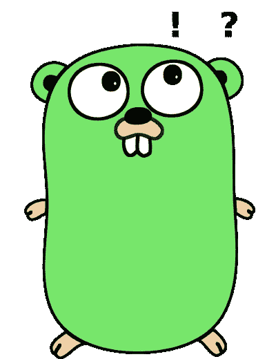

# 我是怎么学会围棋的！！愚蠢但有趣的东西

> 原文：<https://blog.devgenius.io/how-did-i-learn-go-silly-stuff-but-interesting-f69b2876514f?source=collection_archive---------1----------------------->

写这个博客是希望我做的傻事和学到的东西。而在`Golang`中编码可以帮助其他人避免它们。我学到了修复它们的艰难方法，这也鼓励我学习更多关于*语言的知识。*



意图是保持它简短、简明和切中要点。这些大部分其实都是*傻*😉但是嘿，学习就是学习…正确！！

*   `Golang` `arrays`中的**数组 vs 切片**是固定长度的**值**和**，不是*指针*，不是*对象引用。*所以当你把一个`*array*` *传递给函数*或者赋值给另一个`*array*` 时，你得到的只是原来`*array*` *的副本。*所以用 [***切片***](https://go.dev/blog/slices-intro)*代替它们是*的引用类型，可以传递给其他函数并且可以用内置函数[追加](https://pkg.go.dev/builtin#append)来改变它们****

```
**func ChangeArray(arr [5]int) {
    arr[0] = 21
}

func main() {
    v:= [5]int{1, 2, 3, 4, 5}
    ChangeArray(v) 
    fmt.Println(v)
}Output
[1 2 3 4 5] 🤔**
```

```
**func ChangeArray(arr []int) {
    arr[0] = 21
}

func main() {
    v:= []int{1, 2, 3, 4, 5}
    ChangeArray(v) 
    fmt.Println(v)
}Output
[21 2 3 4 5] 🤩**
```

*   ****字符串是不可变的**中的`Golang`字符串是*不可变的字节片。我们可以把一个字符串看作一个(元素不可变的)字节片。所以不能改变*字符串*数据。为此，在`byte`或`rune`级别上操作。更喜欢`**Rune**` **所以** `**utf8**` 也支持。***

```
*str := "modifyString"
str[6] = "s"              ❌ Will throw error, Cannot assign to s[0]
fmt.Println(str)
runeStore := []rune(str)
runeStore[6] = "s"
fmt.Println(string(runeStore)) ✅ Work fine!!*
```

*   ***函数返回多个值时不使用多重赋值。***

```
*func returnValues() (int, int) {
  a := 1
  b := 2
return a, b
}
value := returnValues()      ❌ don’t do this, will throw error
**_, value := returnValues()**   ✅ do this, if you don’t need both*
```

*   ***Go 乘法、除法和余数运算符具有相同的优先级**并从左至右进行计算**。**使用`()`强制优先级*

```
*package mainimport (
  "fmt"
)func main() {
  n := 43210 
  fmt.Println(n/60*60, "hours and", n%60*60, "seconds")     ❌ Nope
  fmt.Println(n/(60*60), "hours and", n%(60*60), "seconds") ✅ Yes
}43200 hours and 600 seconds
12 hours and 10 seconds*
```

*   *Nil 并不总是 Nil 令人困惑，请看例子。只有当*接口*的值和动态类型都是`nil`时，该接口的值才等于`nil`。对于`interface`,我们需要`type`和`value`都成为`nil`,来真实地反映它。比较时，我们会比较**值**和**类型***

```
*package mainimport (
  "fmt"
)func main(){
  var a *int = nil
  var b interface{} = nil     ❌ No Type `Nil` is hardcoded
  var c interface{} = a       ✅ Yes c is type interface & value nil
  if a != b {
    fmt.Println("from [a compared with b] not a nil")
  } else {
    fmt.Println("from [a compared with b] is nil")
  }
  if a != c {
    fmt.Println("from [a compared with c] not a nil")
  } else {
    fmt.Println("from [a compared with c] is nil")
  }
}Output:
from [a compared with b] not a nil
from [a compared with c] is nil*
```

*   ***为什么空** `**{}**` **带** `**json.Marshal**` 因为只有 Go 结构**的**导出**字段才会被考虑。** *Pro-tip:使用* `*json:tag*` *明确标识它们。在我之前的博客中阅读更多关于* [*Go Struct 标签*](https://towardsdev.com/golang-struct-tags-explained-ccb589dcbb98) *的内容。**

```
*package mainimport (
  "fmt"
  "encoding/json"
)type Food struct {
    name string       ❌ Will not work
    item int          ❌ Will not work
}type FevFood struct {
    Name string       ✅ Will work, because **N** in `*Caps*` **exported**
    Item int          ✅ Will work, because **I** in `*Caps*` **exported**
}func main() {
  data1 := Food{"Apple Pie", 5}
  data2 := FevFood{"Apple Pie", 5}
  jd1, _ := json.Marshal(data1)
  jd2, _ := json.Marshal(data2)
  fmt.Println(string(jd1))
  fmt.Println(string(jd2))
}Output
{}
{"Name":"Apple Pie","Item":5}*
```

*   ***改变** `**range**` **循环中的值——Nop 不可能**，因为范围循环将值从切片复制到一个**局部变量。**所以实际价值保持不变*

```
*package mainimport (
  "fmt"
)func main() {
  sliceOfInts := []int{1, 2, 3, 4, 5}
  for _, slice := range sliceOfInts {
      slice += 1                       ❌ Will not work
  }
  fmt.Println(sliceOfInts)
  sliceOfInts = []int{1, 2, 3, 4, 5}
  for i := range sliceOfInts {
      sliceOfInts[i] += 2              ✅ Will work, using Indices
  }
  fmt.Println(sliceOfInts)
}Output:
[1 2 3 4 5]
[3 4 5 6 7]*
```

*   ***正则表达式** `**[0-9]***` **匹配包含**字符的字符串，因为`[regexp](https://golang.org/pkg/regexp/)`包做**子串**匹配。所以我们必须具体使用`^`和`$`*

```
*package mainimport (
  "fmt"
  "regexp"
)func main() {
  if matched, _ := regexp.MatchString(`[0-9]*`, "12three45"); matched {
    fmt.Printf("`[0-9]*` == '12three45' RegExp Matched [%v]\n", matched)                 ❌ **Will match because of substring matching**
  } else {
    fmt.Printf("`[0-9]*` != '12three45' RegExp didn't Match\n")
  }
  if matched, _ := regexp.MatchString(`^[0-9]*$`, "12three45"); matched {
    fmt.Printf("`^[0-9]*$` == '12three45' RegExp Matched [%v]\n", matched)                  ✅ **Will not match because of ^ and $**
  } else {
    fmt.Printf("`^[0-9]*$` != '12three45'  RegExp didn't Match\n")
  }
}Output
`[0-9]*` == '12three45' RegExp Matched [true]
`^[0-9]*$` != '12three45'  RegExp didn't Match*
```

*这些有些 ***傻傻的但是很有趣的*** 的玩意儿我都学过。我会继续下去。想法是让博客小而聪明！！*

**

*希望你们喜欢它…..😁*

# *编码快乐！！*