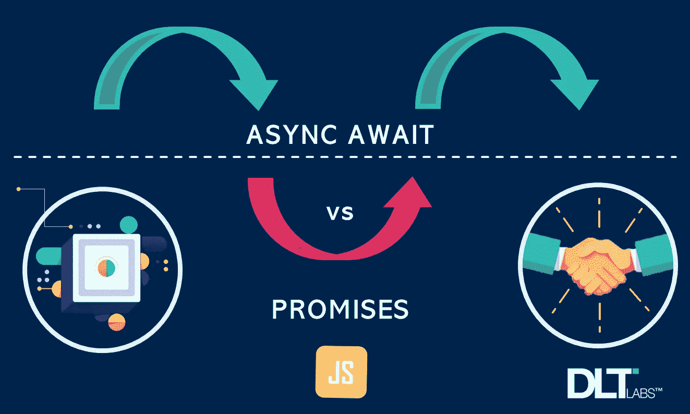

# 承诺链和 Async/Await 中的差异如何影响您的代码逻辑？

> 原文：<https://blog.devgenius.io/how-do-differences-in-promise-chains-and-async-await-affect-your-code-logic-b85aeb566ebb?source=collection_archive---------2----------------------->

承诺链和**异步/等待**都是建立在承诺之上的。它们之间的语法差异会对代码的逻辑产生真正的影响。今天我们用一个例子来理解这个。

在我们的例子中，我们需要根据使用的输入操作符来确定一个算术结果。

下面的函数返回我们正在寻找的算术结果。

用一个函数解决我们的数学问题| [来源](http://www.dltlabs.com)

现在，让我们使用**承诺链**调用上面的函数来获得示例的解决方案。

使用承诺链获得我们的结果| [来源](http://www.dltlabs.com)

现在让我们使用 **async/await** 来做同样的事情。

使用 Async/await 获取我们的结果| [Source](http://www.dltlabs.com)

*请注意——此处使用的示例经过简化，以便于理解。在现实世界中，这将是一个 I/O 操作。*

# 观察

在上面的例子中我们观察到了什么？(*下面的点与上面*中的数字标记相对应)

## **1。逻辑流程**

承诺和异步/等待的逻辑流程非常相似。仔细观察，我们注意到这两点

> 承诺链:
> 
> 然后->抓住->最后。

和

> 异步/等待:
> 
> 尝试->捕捉->最后。

## 2.范围

在*承诺*中，只有承诺链是异步的，而在 async/await 中，整个*包装函数都是异步的。*

## **3。错误处理**

Async/await 可以用 try/catch 处理同步和异步错误。另一方面，在承诺中，我们必须在承诺链上添加一个 catch 处理程序来处理异步错误。

在我们的 promise 链中省略 catch 处理程序将会导致无法处理异步错误。

## **4。代码可读性**

看看我们的两个解决方案，我们使用 async/await 节省了相当多的代码，产生了更干净、更可读的代码。用 *Promise.all()处理多个承诺的时候我们也能感同身受。*

我们使用 async/await | [Source](http://www.dltlabs.com) 节省了大量代码

# **总结**

Async/await 应该是你的首选，因为它给你一种异步代码的同步感觉，特别是当你处理复杂的场景时。

感谢您的阅读！

*作者——安吉雷迪·杰蒂，DLT 实验室*

**关于作者:** *安吉雷迪*是一名热衷于学习新事物的 Node.js 开发者。目前，他与 ASIK 团队合作，致力于 ASIK 认证、同步服务。

