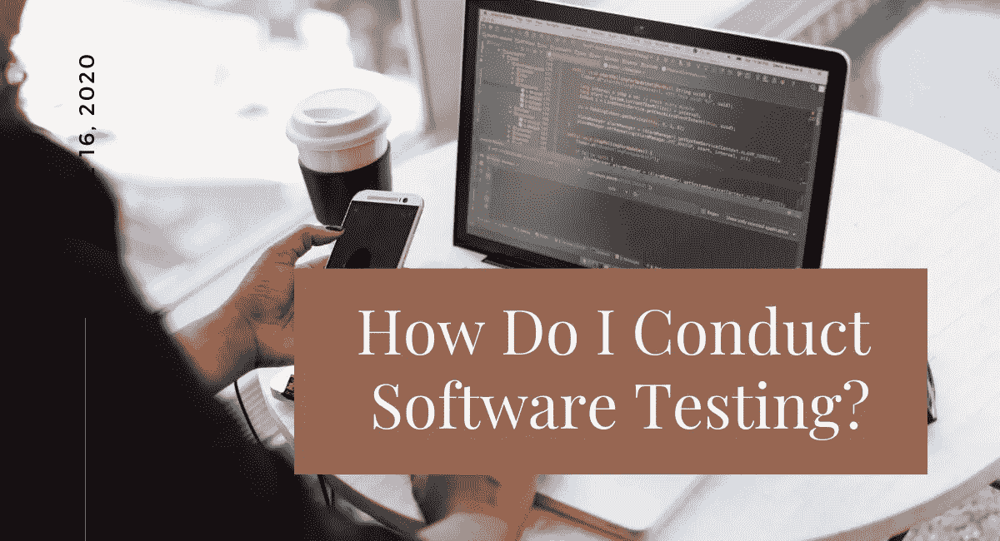
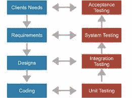
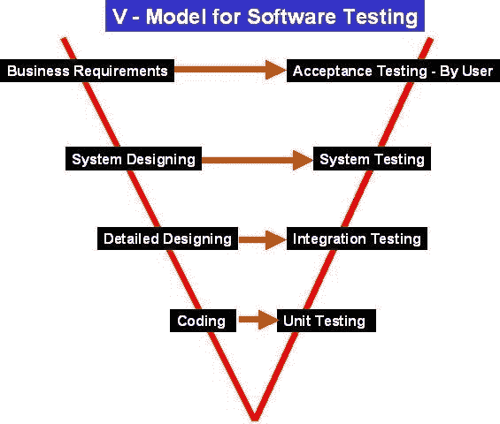

# 我如何进行软件测试？

> 原文：<https://blog.devgenius.io/how-do-i-conduct-software-testing-f85ec43162a?source=collection_archive---------42----------------------->

执行 S [**软件测试**](https://qaandsoftwareblog.blogspot.com/2020/06/how-do-i-conduct-software-testing.html) 以验证完整的软件包功能符合规范/要求所定义的预期。关键的关注点不仅仅是找出存在的每一个软件错误，而是确定可能对客户可用性和/或可维护性产生负面影响的情况。

**专家 QA 公司** [**软件测试**](https://www.bloglovin.com/@shormistha/how-do-i-conduct-software-testing) **的主要目标如下:**

*   ***发现程序员在软件开发过程中可能产生的缺陷和瑕疵。***
*   ***评估一个系统的潜力和系统性能***
*   ***获得信心并传递有关质量水平的信息。***
*   ***防止出现 bug 和缺陷。***
*   ***衡量软件的质量***
*   ***确保最终结果同时满足用户和业务需求。***
*   ***确保满足 SRS(系统需求规范)和 BRS(业务需求规范)。***

***通过向他们提供优质产品来获得信心。*** [***软件测试人员是质量的主要执行者。*T50**](https://qaandsoftwareblog.blogspot.com/2020/06/how-do-i-conduct-software-testing.html)

因此，[软件测试](https://www.bloglovin.com/@shormistha/how-do-i-conduct-software-testing)是验证系统的整个过程，目的是识别任何遗漏的错误、差距或需求与实际需求的对比。软件测试一般分为两种——功能测试和非功能测试。

软件测试

**什么时候开始测试活动？**

测试活动应该尽快开始，以减少返工的时间和成本，并生产出没有麻烦和错误的软件，以便能够及时交付给重要的客户。然而，在 SDLC(软件开发生命周期)中，[测试](https://www.bloglovin.com/@shormistha/how-do-i-conduct-software-testing)可以从需求收集阶段开始，一直持续到软件无故障并投入生产。它还取决于正在使用的开发模型。例如，在瀑布模型中，测试从测试阶段开始，然而，在 V 模型中，测试是与开发阶段并行进行的。

**绘制关键指标，帮助解释测试过程中发生的事情。**

**从哪些关键对比开始:**

*   响应时间与负载(“系统如何扩展？”)
*   端到端业务流程
*   误差与负载(“结果有效吗？”)
*   负载上的带宽吞吐量(“系统瓶颈？”)
*   JVM 堆内存/垃圾收集
*   服务器 CPU 与负载
*   系统资源(“基础设施功能如何？”)
*   页面级
*   数据库锁争用、I/O 延迟

*[***软件*测试****](https://qaandsoftwareblog.blogspot.com/2020/06/how-do-i-conduct-software-testing.html) ****的重要目的是提高项目和产品的整体质量，同时无疑也提高了企业的质量。*****

*****结论:*****

**测试允许开发人员交付能够防止意外结果、满足预期并改善应用程序长期维护的软件。根据测试的目的，应用适当的方法。质量改进有助于公司降低发布后的支持和服务成本，同时带来客户的好感，这种好感可以转化为更大的收入机会。**

****关注我:****

*****LinkedIn***-[https://www.linkedin.com/in/shormistha-chatterjee/](https://www.linkedin.com/in/shormistha-chatterjee/)**

*****【博客】****[*【HTTPS://shormistha4.blogspot.com/】*](https://shormistha4.blogspot.com/)*****

*****【Dzone】****[**【HTTPS://dzone.com/users/3854036/shormistha.html】**](https://dzone.com/users/3854036/shormistha.html)***

****【博客】***[*【HTTPS://www.bloglovin.com/@shormistha】*](https://www.bloglovin.com/@shormistha)*