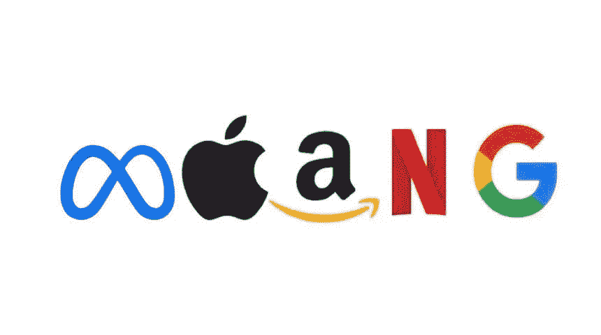
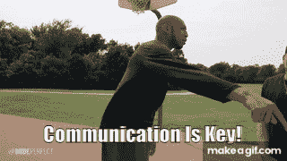

# 我如何获得实习返校的机会？

> 原文：<https://blog.devgenius.io/how-do-i-secure-the-return-offer-9b14f074ebc4?source=collection_archive---------5----------------------->

## 在 MAANG 进行了 3 次软件工程实习后，以下是我获得实习回报甚至转正的最佳建议！

恭喜你！你已经完成了确保软件工程实习的艰苦工作！现在你被安排在夏天、春天、冬天或秋天开始！

祝贺你的新实习！

现在怎么办？在我们得到一个又大又好的实习机会后会发生什么？看起来，这一部分并没有像讨论的那样，讨论如何进入大门，解决那些讨厌的技术面试问题。

在本文的其余部分，我将把我发现真正有用的领域和我实现的让我得到三次回报的大多数方法进行细分。我用了“最”这个词是因为我想让你超越我，真正给我留下很棒的印象，所以这些方面有些是我希望我做到的方面！我们将涵盖…

*   软技能
*   技术
*   个人管理
*   如何超越和超越？
*   总结和总结

> 快速但重要的免责声明:不要把我的话当金子。对我有效的，可能对你无效。此外，公平的警告:有时文章可能很难通过，我已经种植了一些 gif 来强调要点，使它变得更加愉快。:)

梅塔，苹果，亚马逊，网飞和谷歌。

# 1.软技能

软件工程是一项团队运动。这意味着你将和其他人在一个团队里，他们将会有和你不同的经历、背景和期望。理解这一点至关重要，因为你可能是“天才神话”的信徒。软件工程@谷歌就此写了一篇精彩的文章:

> *对于软件工程师来说,【我们的偶像】可能是莱纳斯·托沃兹、圭多·范·罗森、比尔·盖茨——所有这些英雄都用英雄壮举改变了世界。Linus 自己写的 Linux 吧？实际上，Linus 所做的只是编写了一个类似 Unix 的概念验证内核的开端，并将其展示给一个电子邮件列表。这是一个不小的成就，绝对是一个令人印象深刻的成就，但这只是冰山一角。Linux 比最初的内核大几百倍，是由成千上万聪明人开发的。莱纳斯真正的成就是领导这些人，协调他们的工作；Linux 不是他最初想法的光辉成果，而是社区集体劳动的成果。(Unix 本身并不完全是由肯·汤普森和丹尼斯·里奇编写的，而是由贝尔实验室的一群聪明人编写的。)*

💡所以首先，你必须成为一个“体面”的人，学会如何在团队中工作。你愿意每周一到 Fri 和一个刻薄、冷漠、懒散、不爱说话的人一起工作 8 到 9 个小时吗？

沟通是关键！

**我的 4 大软技巧:**

*   **参加一些活动，哪怕是虚拟的。** —让别人看到你，听到你的声音，这很重要。这并不是说你必须参加每一个活动，成为关注的焦点。但这确实意味着每个人都在为自己的职业生涯担忧。你必须清楚
*   **学习如何有效地过度沟通。** —如果有人问你在做什么，进展如何，你应该能够给出一个高层次的版本和一个深层次的版本。学习如何提问。成为一个更好的沟通者需要经验，并找出最适合你的方式。可以练习的事情:我如何消除电子邮件中的混乱？我是否在跟踪我正在做的事情、我面临的挑战等？
*   **讨人喜欢。** —每天以一个很棒的姿态进来。穿漂亮点。看起来不错。要有兴趣，要有趣。控制可控范围，当然可能会有一个同事不喜欢你，但这都是一种选择，这创造了奇迹，让人们想为你而战！大多数人做事是因为喜欢你，而不是因为你一定有最好的产品。(想想苹果、特斯拉、获得晋升的人、社交媒体影响者、YouTubers，我相信你也能想出例子。)
*   学习如何成为一名高效的会议参与者。 —会议具有普遍性，有时会被软件工程师讨厌。因此，因为我们花了这么多时间在他们身上，我们应该学会如何有效地做他们。以下是一些需要思考的事情:我为会议做好准备了吗？与我的团队开会的总体感觉如何；我什么时候可以畅所欲言(在一个话题结束时，会议结束时，等等)？我如何为会议带来价值？我记下说了什么了吗？

# 2.技术

既然你已经掌握了软技能，那么掌握技术技能也是非常重要的。但是，这可能是一个惊喜:**从一开始就相信你有技术技能，并且会获得更多。**

现在不要误解我的意思，我不是说，他们希望你已经精通每一种技术，精通每一种编程语言，并且能够立即提出系统设计问题的创造性解决方案。但他们雇用你是有原因的，其中一个原因是因为他们知道你能胜任这份工作。

关键是，这是假设斯蒂芬·库里练习射击。人们认为勒布朗·詹姆斯训练刻苦。因此，假设你，作为一个软件工程师，会认真对待这项技术。

好奇。质疑事物。“因为我是这么说的……”或“因为事情一直都是这样做的”并不能成为一个决定的正当理由。

**我的 6 大技能技巧:**

*   编写质量代码。 —你可能会问什么是质量代码？质量代码是经过单元测试的代码，编写的代码可以让任何工程师在 6 个月后理解，并通过代码评审向他人学习而变得更好。永远不要依附于你的代码，但是要知道大多数科技公司使用 Git 或者版本控制系统。这意味着你在代码库中写的每一行都将与你联系在一起。
*   **开始好奇。** —科技领域发展迅速。作为一名工程师，对你和你的职业生涯重要的新闻、趋势、书籍和技术进行优先排序是很重要的。你不需要一下子学会所有的东西，但是如果你每天都在工作中使用 Python，那么提高你的技能是有意义的；开始一门 Python 的课程，看一个 Python 的视频，读一本 Python 的书，或者做一个 Python 的小副业。
*   **呈丁字状。**—**T 型技能**的概念，或 **T 型人**是一个[隐喻](https://www.wikiwand.com/en/Metaphor)，用于工作[招聘](https://www.wikiwand.com/en/Recruitment)，描述[劳动力](https://www.wikiwand.com/en/Workforce)中人员的能力。字母 *T* 上的竖线代表单个领域相关技能和专业知识的深度，而横线代表与其他领域的专家进行跨学科合作以及将知识应用于自己专业领域之外的领域的能力。换句话说，如果你每天都在使用 Python，那就深入钻研 Python 的专业知识。但是如果你很少使用 Docker，简单地了解它并在需要的时候学习它是有意义的。
*   **阅读你团队的代码。** —记下风格、使用的功能及其结构。其实就是看关于如何有效阅读别人代码的文章。软件工程更多的是阅读代码，而不是编写代码，通常，文档不是最新的。建立这个技能！
*   不要预先了解所有的事情。——如果你的团队使用 X 技术。不要在你开始工作的第一天就学习 X 技术的所有知识。我见过的最有效的模式是学习 X 技术，只要能完成你的第一个任务就够了。如果不能完成任务，通过多读一些文档和问一些有计划的问题来填补空白。
*   这需要时间，对自己要有耐心。 —保持技术上的稳健并运用它为公司带来价值需要时间、精力和经验。在这个不断发展的软件工程中继续学习和努力。区分不同的主题，走得更远！

# 3.个人管理

对我们大多数人来说，我们的一生都是有人告诉我们该做什么。无论是我们的父母，老师，教练，还是家人。

但是一旦你毕业了，你必须成为你生活和事业的管理者。你的经理不知道你在想什么，也不知道你对更多的 UI / UX 工作感兴趣。实习可以让你习惯于记录你的工作和独立工作。

不要依靠你的头脑来记住你所做的一切。职业生涯不要兜圈子。努力保持条理性，让你的职业目标和公司目标一样重要。

**我的三大个人管理技巧:**

*   **追踪一切。**——使用 Notion、Evernote 或 Google Docs 等笔记应用建立个人工作中心。它应该包括你正在做的所有项目，所有的会议，你在拉动请求中得到的评论趋势，成就，失望，以及你在工作中出现的问题。
*   **寻求指导。导师和教练是两回事。我认为辅导是导师制度。但作为一名实习生，什么都重要。征求他们对你的挑战、成功和其他你正在纠结的概念的意见。甚至提出你在技术之外遇到的任何问题，比如准备演示，如何处理会议，或者如何有效地管理时间。**
*   **强迫人们给出反馈。**——“力”可能有点夸张。但是你应该渴望你的队友、同事和经理尽早尽可能多地给予反馈。协调和合作对于创造最佳团队环境至关重要，因此，如果你不知道你的经理期望什么，他们对实习的总体感觉如何，或者如果实习没有按照他们计划的方式进行，就会创造一个糟糕的环境。这里有一个简单的模型:做一个停止，开始，保持。问你的经理停止做什么事，开始做什么事，继续做什么事。

# 4.我如何超越自我？

这里是我的 3 个建议，你可以做得更好。如果你执行了上面和下面的所有提示，你就为自己提出了一个强有力的理由，让自己可以带回来要求退货！

睁开你的眼睛，看看除了你的产品之外还有什么。开始理解更大的图景

*   寻求了解更大的图景。 —了解你的其他团队成员在做什么，以及你的工作如何与他们的工作交叉？更大的系统是做什么的？你能描述一下你的团队工作的整个系统的工作流程吗？你的团队的范围是什么？
*   **出示证件。**——让跟在你后面的实习生/新员工做些更容易的事情。有没有一个棘手的入职缺陷，你和你的团队找到了一个解决方案，你可以写一个快速的文档？如果团队已经有了文档，但其中的一部分没有意义，如何让这部分更加清晰？
*   **试图拥有你被赋予的东西。**——表明你正在积极尝试独立工作。你能找出下一步需要做什么工作吗？你认为实习经理看不到的任何附加功能和潜在问题？

# 总结和总结

感谢你的阅读，去实习吧！让我们简明扼要地总结一下这些技巧:

# 软技能

*   **参加一些*活动，哪怕是虚拟的。**
*   **学会如何有效地过度沟通。**
*   **讨人喜欢。**
*   **学习如何成为一名高效的会议参与者。**

# 技术

*   **编写质量代码。**
*   **开始好奇。**
*   **呈丁字状。**
*   阅读你团队的代码。
*   不要提前学习所有的东西。
*   这需要时间，对自己要有耐心。

# 个人管理

*   **追踪一切。**
*   寻求指导。
*   **强迫人们给出反馈。**

# 超越自我

*   寻求了解更大的图景。
*   **制作文档。**
*   尝试去拥有你被给予的东西。

鉴于所有这些提示，实习肯定会和你想象的不一样。即使发生错误，也要保持镇静；你会在另一边成功的！

希望这有助于你的旅程！我们在 LinkedIn 上连线吧！[https://www.linkedin.com/in/payton-d-78a7a2171/](https://www.linkedin.com/in/payton-d-78a7a2171/)