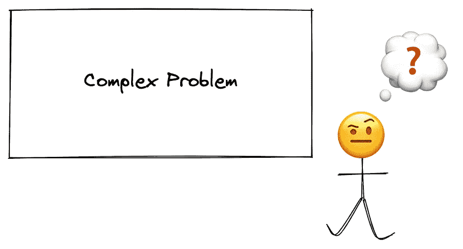
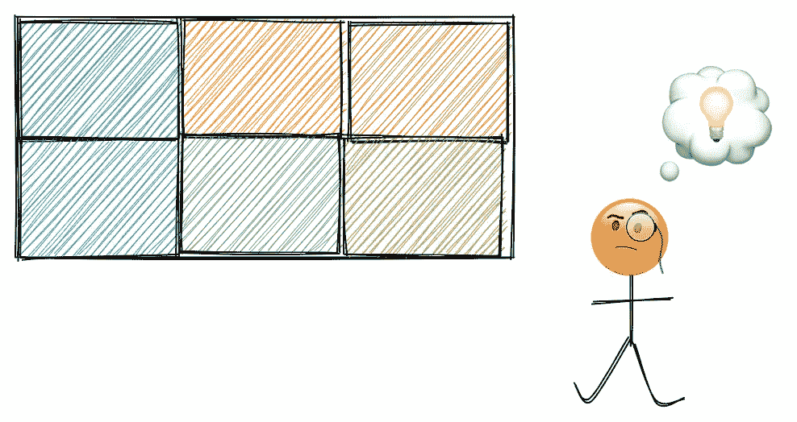
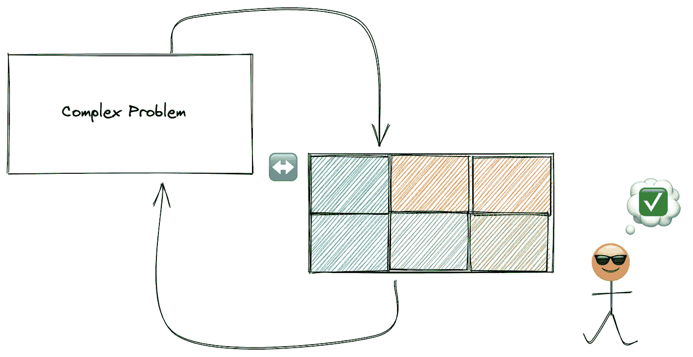

# 我如何解决复杂的问题？

> 原文：<https://blog.devgenius.io/how-do-i-solve-complex-problems-728cdcefdedd?source=collection_archive---------3----------------------->

随着时间的推移，我意识到软件工程纯粹是解决问题。解决问题的能力区分了优秀和伟大的软件开发人员。

在过去的几个月里，我的业内朋友向我询问我解决问题的过程是怎样的，以及当有人向我求助时，我似乎总是知道去哪里找。所以，我决定写这篇文章来分享我是如何解决手头的不同任务或问题的。

**什么是解题？** —你可能会问；我们可以找到各种花哨的定义来解释解决问题实际上意味着什么。有些人会将其定义为心理学、计算机科学、认知科学，甚至逻辑学，这并没有错。然而，在所有不同的领域，它都可以应用；它简单地归结为个人或团体解决给定问题的**能力，不管问题有多复杂。**

> **解决问题**包括有条不紊地使用通用或特别的方法来寻找解决困难的方法。([维基百科](https://en.wikipedia.org/wiki/Problem_solving))

# 解决问题

大多数人处理问题的方式不同；有些人使用技术 x，有些人使用技术 y。当然，有些方法比其他方法更有效，但我不认为存在解决问题的预定义方法。我个人使用一个过程，我已经看到一些我最喜欢的工程师使用，证明完成工作。

说够了；LOL 不管问题有多复杂，我都是这样解决问题的:

# 1.理解问题

问题就像拼图；在试图解决这个问题之前，我们首先需要看到一个完整的画面。解决任何问题的第一步是理解你被要求完成什么。

> 🚩****没有理解，我们什么都做不了。”****

*当分配任务时，我经常犯的一个常见错误是直接跳到我的代码编辑器，在不知道最终情况的情况下开始编写解决方案。最终，我会弄明白并解决这个任务，但我的效率很低，因为我会很晚才问正确的问题，因为我对我被要求做的事情没有一个完整的了解。*

**

*显然，在开始之前，我们应该努力理解我们需要实现什么；为此，我们需要:*

*   *问正确的问题*
*   *把你理解的问题写下来*
*   *验证你对问题的理解*

# *2.分解成更小的块*

*在了解了我们手头的问题是什么之后，我们现在应该把它分成更小的、可实现的子任务。使用拼图类比，如果你有一个很大的拼图，你很清楚一旦你完成它会是什么样子，但是为了快速解决它，理想情况下，你应该把完成一个部分的碎片分成小块。这同样适用于你正在解决的任何问题。*

**

*在编写一行代码之前(如果解决方案要求您编码)，您需要有一个循序渐进的方法来帮助您找到问题的解决方案。这可能很有挑战性，但是如果你理解了问题，你可以把事情分解，并有一个清晰的解决方案。*

*为了做得更好，你需要练习写下来；这可以看作是您正在编写伪代码，通过列出所有步骤并指出在前进到下一阶段之前应该满足的检查点来解决您的问题。*

> *🚩 ***“分而治之。”****

# *3.重新寻找解决方案*

*就像在代码审查过程中一样，在这一步，如果我有其他人，我通常会询问关于我的假设的第二种意见，这样我就可以看看下一个人是否至少能够理解我正在解决的问题。然而，如果我没有第二双眼睛，我就简单地重复每一步，就好像这是一个新问题，以 100%确定我脑海中的解决方案。*

**

*由于这是最后一步，我通常会花更多的时间来捕捉可能的问题，并回到绘图板来调整我的初始假设。*

> *🚩 ***宗旨是“写两遍，码一遍”****

*只有在重新看了我的作品之后；我确实开始应用我写下的东西，总是记住这不是绝对的解决方案，它可以不断改进。*

*毕竟，解决问题是一项需要时间培养的技能(我仍在努力提高自己，成为一名更好的问题解决者)。然而，我意识到你解决的问题越多，你就能越好地为你遇到的问题提供解决方案，不管它们有多复杂。*

*这不仅适用于软件工程职业，也适用于所有其他职业。我们都在以这样或那样的方式解决问题，所以我们都应该找到一种方法来更好地解决我们每天遇到的问题。*

*让我们继续黑吧🙂。*