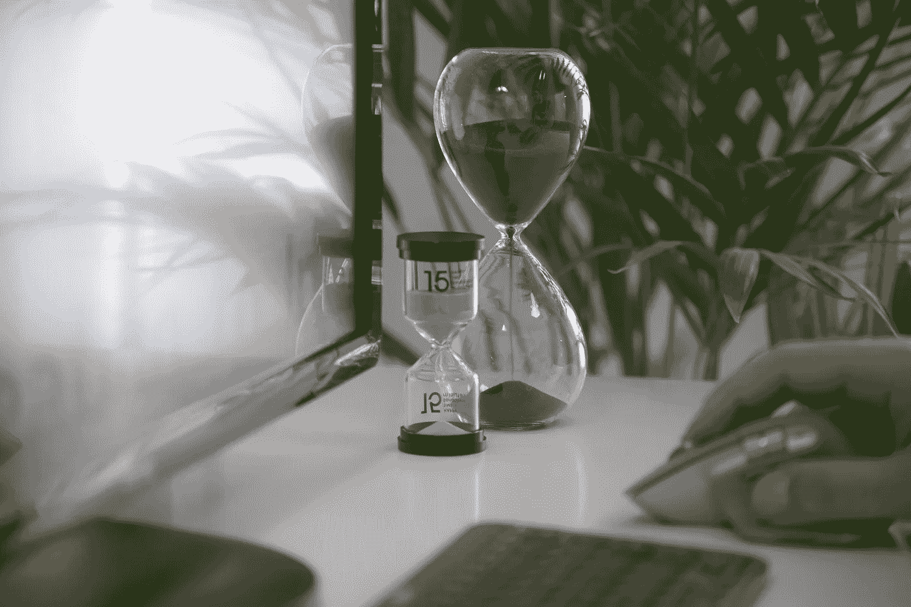
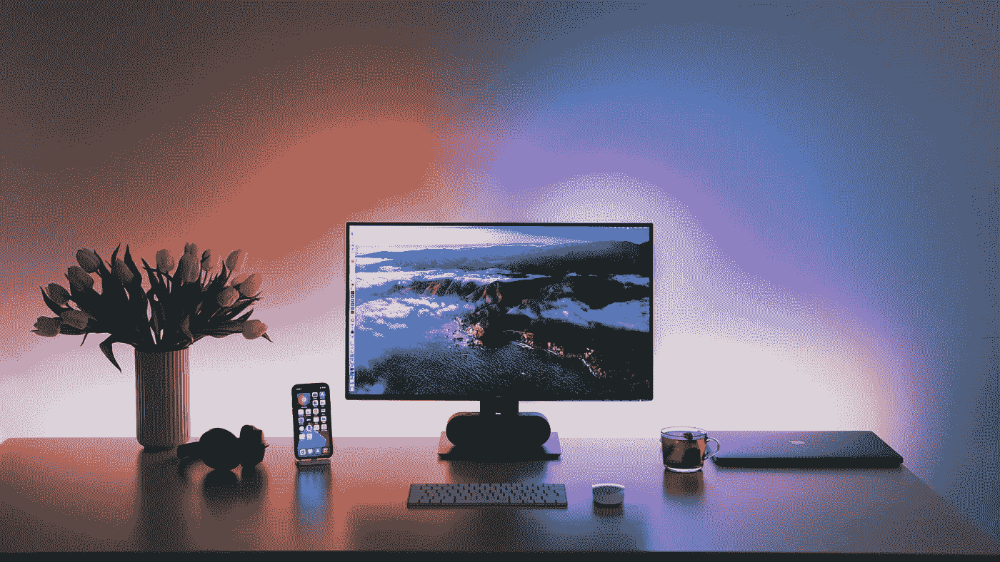

# 我如何保持高效？

> 原文：<https://blog.devgenius.io/how-do-i-stay-productive-18f602f71979?source=collection_archive---------10----------------------->

由[米拉德·法库里安](https://unsplash.com/@fakurian)制作。发现于 [unsplash](https://unsplash.com)

我很久以前就开始研究生产力，因为我想充分利用我的时间。

下面，我将分享我的 10 条原则，这些原则已经被多年证明，可以帮助我每天都保持高效。

## 1.计划你的一天

最重要的是你今天想做什么。要做到这一点，你需要清楚地知道你要解决什么任务，因此你需要把它们写下来，以免忘记。

我更喜欢在记事本上写下我的任务，而不是在应用程序里。因为这样我可以更专注于我的想法，不会分心。

甚至还有单独的记事本，看看这个:

*   [卡森·德洛萨目标远大待办事项记事本](https://amzn.to/3F3NpoM)
*   [敲打敲打本周垫](https://amzn.to/3EVrSye)
*   [Graphique 图书馆卡待办事项记事本](https://amzn.to/3vnghF1)

每完成一项任务后，我就划掉清单上相应的项目，这给我带来了一点快乐😊

还有，我更喜欢在工作日结束的第二天列一个待办事项清单。我试着在工作日开始的时候列一个待办事项清单，但是有几天我只是迷失在我想完成的任务中，花了太多的时间去计划。所以我在睡觉前做，当我不着急和放松的时候。

## 2.早晨决定了一整天的心情

我自己注意到，当我早上醒来，立即拿起电话，20-30 分钟后就陷入其中，这显著影响了我的工作效率，我可以整天懒洋洋地走来走去，这让我非常恼火。

然后我开始尝试并建立了自己的晨间习惯，让我充满活力，一整天都有好心情:

1.  我一醒来，就喝一杯水。在夜间，身体已经设法脱水，所以在早上你需要补充水分供应；
2.  我做 10-20 分钟的冥想和练习；
3.  我喜欢运动，每天以不同的方式——跑步、健身房、瑜伽。运动对我来说很重要，因为一天中的大部分时间我很少运动，所以我选择积极的运动；
4.  我至少阅读 30 分钟；
5.  做一份早餐；
6.  在那之后，我准备好征服这一天；

因此，我想建议你建立你的晨间仪式。尝试，实验，调整早晨让它适合你，最重要的是为你自己度过它。

如果你不相信早晨真的是黄金时间，那就去读读这本书——******。******

## ******3.首先是困难的任务******

******我试图在一天的前半天解决复杂的任务，因为午饭后我已经失去了早上的注意力和思考的活力。******

******也许对其他人来说，相反，头在晚上更好用，但对我来说不是。因此，我把轻松和常规的工作留到后半天。******

## ******4.舒适的工作场所******

******我相信工作场所应该激励人们去工作，去创造一些东西。所以，我尽量保持工作场所的整洁，因为当我看到周围的一切都各就各位的时候，这就转移到了我的思维中，我想得更清楚了。******

******此外，不要吝惜金钱，在工作场所周围安排舒适的环境，你可以创造自己的舒适角落。******

************

******由莱纳斯·米米茨制作。发现于 [unsplash](https://unsplash.com)******

******看看图中的职场，是不是很有启发？******

## ******5.尽量减少分心******

******众所周知，我们的大脑一次只能有效地解决一件事情。这种情况如下:当我们在从事一项大型智力任务(写文章、写程序、开发项目)时，它会捕捉大脑的整个工作(操作)记忆。******

******我举一个可能发生在每个人身上的情况的例子。比方说，你正在做一项你已经投入进去的任务，突然你收到一条信息，然后你分神看了一会儿，然后回到任务上。有什么大不了的？但事实上，大脑在这些简单而不易察觉的动作上花费了巨大的能量。******

******此时，大脑需要将你目前所沉浸的任务的整个信息背景从工作记忆转移到中间记忆(这样两个任务之间就不会混淆)，从你的长期记忆中提取出对信息做出反应所必需的信息，将其放入工作记忆中，并再次集中注意力。******

******当你阅读并回复了信息，大脑需要切换回原来的任务，改变上下文。******

******如果你经常这样转换，那么到午餐时间你的能量供应可能已经耗尽，你很可能会感到压力，因为你没有时间做任何事情。******

******我是这样解决这个问题的:******

*   ******我警告同事，我将暂时不在；******
*   ******我关掉手机，把它收起来；******
*   ******我关掉所有的信使；******
*   ******我打开轻音乐，沉浸在工作中；******

******有时会发生外部声音干扰注意力集中的情况，为了解决这个问题，我有一款耳机— [**索尼 WH-1000XM4 无线**](https://amzn.to/3KneEvy) ，它具有超强的噪音隔离和高质量的声音。真的推荐给需要绝对安静的人。******

## ****6\. 45/15****

****我 45/15 工作，这意味着什么？工作 45 分钟，休息 15 分钟。****

****工作期间，我关闭所有即时通讯工具、通知等。也就是说，我完全沉浸在工作中，在休息时间，我可以回复信息，去煮咖啡或拉伸，总的来说，从工作中休息一下。****

****当然，你可以想出你自己的工作和休息计划，例如 50/10 或 60/15，这应该对你来说是舒适的，这样你就不会累，并有时间休息。****

## ****7.奖励自己****

****选择你喜欢的和你不允许自己经常做的事情:买好吃的，和朋友出去喝咖啡，去看电影。主要是这个仪式要。****

****这个仪式会给人一种完成困难任务或项目的感觉，并给人力量去征服下一个。****

## ****8.沉思****

****我习惯于在早上和睡前冥想，但是如果有我不能解决的问题，我也可以在中午冥想。冥想帮助我“重启”我的大脑，想出一个新的非标准解决方案。****

****此外，冥想是全天管理注意力的最可靠的方法之一。经过几个月的常规练习，你会注意到注意力、内心的清晰和效率的不同。****

## ****9.运动****

****运动不仅能让身体保持良好的状态，还能让大脑恢复活力。****

****因此，在早上上班前，我喜欢参加体育运动，以便醒来后适应新的一天，也喜欢在辛苦一天后慢跑，以补偿久坐的工作。****

****所以选择你最喜欢的运动，每周做 2-3 次，你会感觉更有活力和动力。****

## ****10.食物影响生产力(imho)****

****我不是营养学家，这是我的个人观察，但我吃的东西直接影响我的情绪和工作效率。我从我的饮食中完全消除了快速碳水化合物、甜食、动物源性肉类和动物奶。我不再吃零食，开始一天吃三顿饭，并坚持 8/16 的进食时间(即早上 10 点开始第一餐，下午 6 点结束最后一餐)。****

****我最喜欢的一本让我大开眼界的营养学书籍是 [**【如何不死】**](https://amzn.to/3vqhc7X) 。我建议你去读书，因为我确信我们吃什么就是什么。****