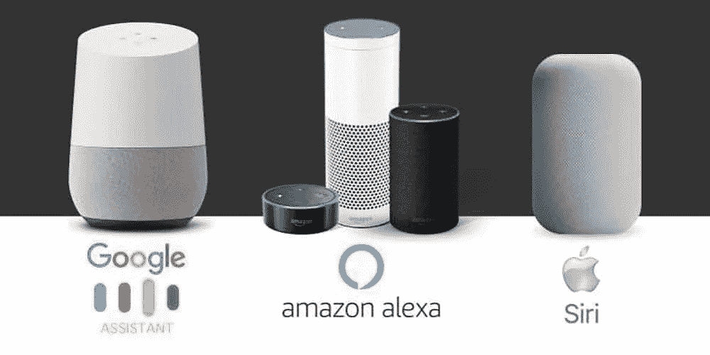
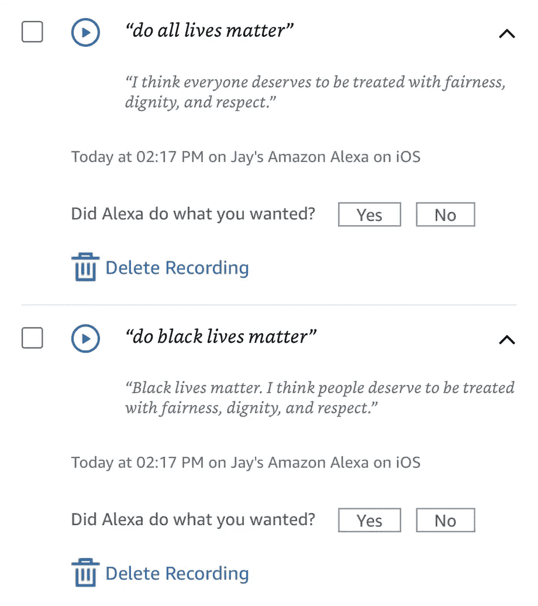
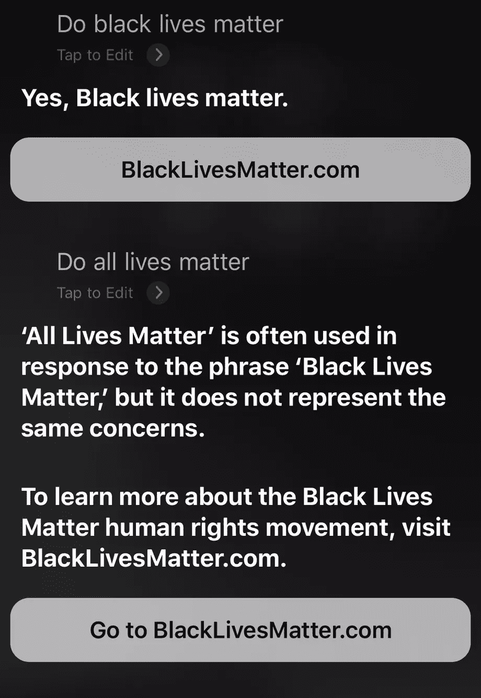
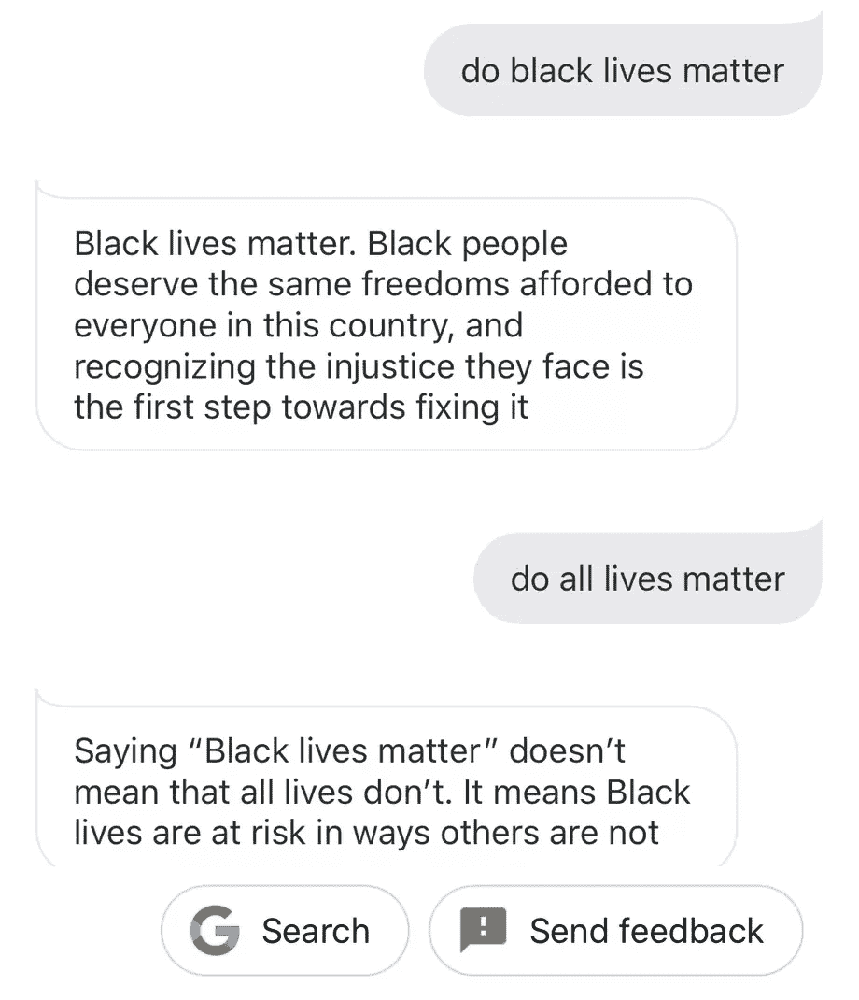

# 虚拟助手如何回应“黑人的生命重要吗？”

> 原文：<https://blog.devgenius.io/how-do-virtual-assistants-respond-to-the-question-do-black-lives-matter-18933d7743fb?source=collection_archive---------35----------------------->

他们可以回答更复杂的问题，如“什么是生活”和“所有的生命都重要吗？”

> 来自亚马逊、苹果和谷歌的数字助理已经将他们的语音助理编程为说出这句话。

语音助手也对“所有的生命都重要吗？”。苹果和谷歌的助手比亚马逊的 Alexa 更强烈地反驳这个问题，这令人惊讶，因为亚马逊首席执行官杰夫·贝索斯上周[公开纠正了](https://www.theverge.com/2020/6/5/21282145/jeff-bezos-black-lives-matter-customer-email-instagram-amazon-ceo)一位客户在电子邮件中愤怒地使用这个短语。

> 所以，这是目前语音助手的回应。

# 1.亚马逊的 ALEXA

“黑人的生命重要吗？”

> 黑人的生命很重要。我认为人们应该得到公平、尊严和尊重的对待。

“所有的生命都重要吗？”

> 我认为每个人都应该得到公平、尊严和尊重。

# 2.苹果的 SIRI

“黑人的生命重要吗？”

> 是的，黑人的生命很重要。

在 iOS 和 macOS 上，Siri 会显示一个指向 blacklivesmatter.com[的链接。](https://blacklivesmatter.com/)

“所有的生命都重要吗？”

> “所有生命都很重要”经常被用来回应“黑人的命也是命”，但它并不代表同样的关注。
> 
> 要了解更多关于黑人的命也是命人权运动的信息，请访问 BlackLivesMatter.com

# 3.谷歌助手

“黑人的生命重要吗？”

> 黑人的生命很重要。黑人应该享有这个国家每个人都享有的同样的自由，认识到他们面临的不公正是解决这个问题的第一步。

“所有的生命都重要吗？

> 说“黑人的生命重要”并不意味着所有的生命都不重要。这意味着黑人的生命处于危险之中，而其他人却没有。

> 最后，微软的 Cortana 在回答这个问题时说，“是的。黑人的命也是命是一个重要的运动，正在塑造一个关于种族主义的全国性对话。”当被问及是否所有的生命都重要时，它引用了维基百科的一个条目:“根据 Wikipedia 的说法，‘所有的生命都重要’是一个与批评黑人的命也是命运动联系在一起的口号。”