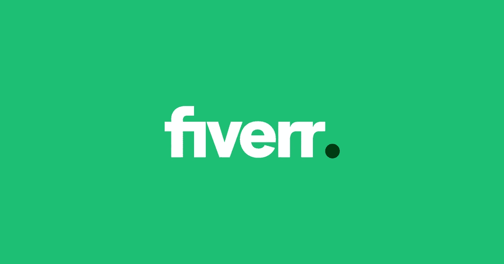
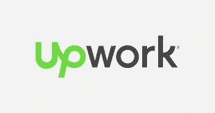
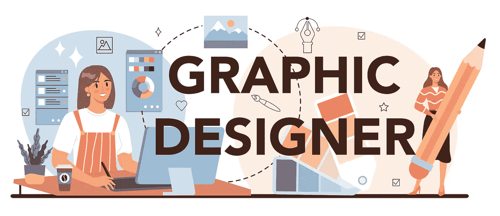

# 你如何在 Fiverr 和 Upwork 这样的网站上赚钱？

> 原文：<https://blog.devgenius.io/how-do-you-make-money-on-sites-like-fiverr-and-upwork-41feeed205d?source=collection_archive---------21----------------------->

来源:谷歌

在像 Fiverr 和 Upwork 这样的自由职业网站上有几种赚钱的方法:

1.  创建个人资料:首先在自由职业平台上创建一个详细的专业个人资料。这包括添加一张个人资料图片，写一份清晰简洁的简历，列出你的技能和经验。
2.  提供服务:确定你可以提供的服务，并为它们创建 gig 列表。确保清楚地描述你提供的服务，并为每场演出设定一个价格。
3.  建立一个投资组合:通过在你的个人资料中添加你以前的项目样本来展示你的工作。这将有助于潜在客户看到你的工作质量，并决定是否雇用你。
4.  推销自己:通过在社交媒体上分享你的演出清单，与潜在客户建立联系，直接接触客户来推销你的服务。
5.  交付高质量的工作:一旦你开始被雇佣，确保向你的客户交付高质量的工作。这将有助于你建立一个积极的声誉，并在未来获得更多的工作。
6.  寻求反馈和评论:完成一个项目后，向你的客户寻求反馈和评论。积极的评论和评级可以帮助你从其他自由职业者中脱颖而出，吸引更多的客户。

按照这些步骤，你可以在像 Fiverr 和 Upwork 这样的自由职业平台上赚钱。

资料来源:www.fiverr.com

Fiverr 是一个自由职业平台，它将企业和个人与提供广泛服务的自由职业者联系起来，如写作、平面设计、视频编辑等。该平台允许自由职业者创建演出列表，在那里他们可以描述他们提供的服务，并为每场演出设定价格。然后，客户可以浏览这些列表，并雇佣自由职业者来完成他们的项目。

Fiverr 的主要优势之一是易于使用，并提供广泛的服务。对于企业和个人来说，雇佣自由职业者也是一种成本效益高的方式，因为这可以让他们以可承受的价格找到高质量的专业人士。

要开始使用 Fiverr，您需要创建一个档案并开始提供服务。您可以从一系列类别中进行选择，如写作、设计、营销等。然后，您需要为您提供的服务创建 gig 列表，包括工作的详细描述和价格。一旦开始被录用，就可以通过平台完成工作并获得报酬。

除了提供服务，你还可以通过成为卖家和提供电子书、模板和课程等数字产品在 Fiverr 上赚钱。你也可以通过向客户提供额外的服务来赚钱，比如修改或更快的交付。

总的来说，对于那些希望通过向世界各地的客户提供技能和专业知识来赚钱的自由职业者来说，Fiverr 是一个很好的平台。

链接:[https://www.fiverr.com/](https://www.fiverr.com/)

来源:谷歌

Upwork 是一个自由职业平台，将企业和个人与提供广泛服务的自由职业者联系起来，如写作、平面设计、编程等。该平台允许自由职业者创建个人资料，列出他们的技能和经验，客户可以搜索和雇佣自由职业者来完成他们的项目。

Upwork 的主要优势之一是其庞大的自由职业者群体，这使得客户能够找到具有特定技能和专业知识的专业人士。对于自由职业者来说，它也是一个方便的平台，因为它提供了工具和资源来帮助他们管理工作和获得报酬。

要开始后续工作，你需要创建一个个人资料，并完成一个技能测试，以展示你在所选领域的专业知识。然后你就可以开始申请工作或为潜在客户提供建议。Upwork 采用招标系统，自由职业者可以提交项目提案，客户可以审查并选择最合适的项目。

除了提供服务，你还可以通过成为卖家和提供电子书、模板和课程等数字产品来赚钱。你也可以通过向客户提供额外的服务来赚钱，比如修改或更快的交付。

总的来说，对于那些希望通过向世界各地的客户提供技能和专业知识来赚钱的自由职业者来说，Upwork 是一个受欢迎的有效平台。

链接:【https://www.upwork.com/ 

有几个免费的平面设计网站，您可以使用它们来创建专业品质的设计:

来源:谷歌

1.  Canva: Canva 是一个用户友好的图形设计平台，提供了广泛的模板和设计工具。它适合初学者和专业人士，并提供各种功能，包括文本、形状和图像。【https://www.canva.com/ 
2.  Adobe Spark: Adobe Spark 是一个免费的图形设计网站，它提供一系列模板、图像和字体来帮助您创建专业质量的设计。它易于使用，并提供了各种设计工具和功能。
3.  Piktochart: Piktochart 是一个图形设计网站，允许您创建信息图、演示文稿和其他可视内容。它提供了一系列模板、图标和设计工具来帮助您创建专业品质的设计。
4.  Visme: Visme 是一个图形设计网站，允许您创建各种各样的视觉内容，包括信息图、演示文稿和社交媒体图形。它提供了各种模板、图像和设计工具来帮助您创建专业质量的设计。
5.  Inkscape: Inkscape 是一个免费的开源图形设计软件，适合创建矢量图形。它提供了一系列功能和工具，包括文本、形状和图像，来帮助您创建专业质量的设计。

总的来说，这些网站提供了一系列功能和工具来帮助您免费创建专业质量的图形设计。

来源:谷歌

我希望这个博客能帮助你了解关于自由职业网站的一切。

谢谢大家！