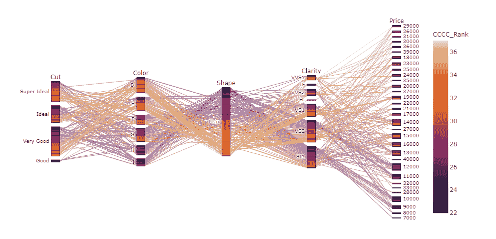

# 数据科学家如何选择订婚戒指？

> 原文：<https://blog.devgenius.io/how-does-a-data-scientist-choose-an-engagement-ring-37c25ac3b568?source=collection_archive---------26----------------------->



“为什么”一个人会发这样一个帖子应该没有什么问题。但是如果它不是非常清楚，我会把它留给你的想象力。我在这篇文章中使用的网站是:[https://www.brilliantearth.com/](https://www.brilliantearth.com/)这是一个很棒的网站，因为他们提供道德采购的钻石以及实验室制造的钻石。

# 项目的结构

*   库和设置
*   找到数据
*   刮下来放入熊猫数据框
*   格式
*   添加有趣的栏目
*   展示视觉效果

# 图书馆

有相当多的库参与了这个项目的创建。其中一些关键的是:beautifulsoup、plotly.express、regex、iPython.display、json 和 statsmodels.api。对于那些对我使用的所有库感兴趣的人，笔记本在我的 [github](https://l.workplace.com/l.php?u=https%3A%2F%2Fgithub.com%2Fsupercoolgetsallthegirlsmax%2Fdiamonds&h=AT2Sg5CuZ4tEJuzlajnj_kLMrKV9JToJv5-QBWsLMDKYyFidr6ubjzNjYT9XMiKMQf3B5IDp6iPcHKeKBLIWX6L-Qo4VXBWeHSUnoeQbe-cuk_gk9N6Xdao3xgT9tNDzVk42znsk-3NAx1I5QQ) 上。

# 设置

我添加了一些 jupyter 显示设置，以便更容易地查看长 URL 和 request_header，因为我们将抓取网站。

```
#set some display settings for notebooks
pd.set_option('display.max_rows', 500)
pd.set_option('display.max_columns', 500)
pd.set_option('display.width', 1000)
# pd.set_option('display.max_colwidth', -1)#add headers in case you use chromedriver (captchas are no fun); namely used for chromedriver
req_headers = {
    'accept': 'text/html,application/xhtml+xml,application/xml;q=0.9,image/webp,image/apng,*/*;q=0.8',
    'accept-encoding': 'gzip, deflate, br',
    'accept-language': 'en-US,en;q=0.8',
    'upgrade-insecure-requests': '1',
    'user-agent': 'Mozilla/5.0 (Windows NT 10.0; Win64; x64) AppleWebKit/537.36 (KHTML, like Gecko) Chrome/61.0.3163.100 Safari/537.36'
}
```

# 接下来我们的汤对象

这只是用我们请求的 url 的内容创建了一个 soup 变量。

```
#create session and soup object for the diamonds website and table
with requests.Session() as s:
    url = "[https://www.brilliantearth.com/design-your-own-engagement-ring/?sid=3755106&dc=](https://www.brilliantearth.com/design-your-own-engagement-ring/?sid=3755106&dc=)"
    r = s.get(url, headers=req_headers)#add contents of urls to soup variable from each url
soup = BeautifulSoup(r.content, 'lxml')
```

# 接下来是将我们的 url 内容转换成 json

我这样做的原因是因为 beautifulsoup 在解析一些 html 标签时有所欠缺。所以我走了一条不同的路线来解析数据，将页面转换成 json 文本。Pandas 还有一些很酷的功能，可以将 json 转换成 dataframe。

**我采取的步骤:**

*   检查页面元素
*   选择网络选项卡
*   选择 XHR 选项卡
*   找到包含 URL/查询的正确 json 对象
*   我使用的网站从 json 查询中提取了所有内容，所以这就是我需要找到的页面
*   使用在 XHR 找到的网址作为你的汤网址
*   该 url 将带您到一个带有数据 json 的页面
*   插入参数——这基本上类似于 sql 查询的 where 子句


检查元素，网络，xhr，json 对象，url

# 这是代码

```
#convert the url to a json object and pass in parameters (found in xhr of url (inspect element))
import json
import requests
from pandas.io.json import json_normalizesearch_parameters = {
'shapes': "Pear",
'cuts': "Good,Very Good,Ideal,Super Ideal",
'colors': "I,H,G,F,E,D",
'clarities': "SI1,VS2,VS1,VVS2,VVS1,IF,FL",
'polishes': "Good,Very Good,Excellent",
'symmetries': "Good,Very Good,Excellent",
'fluorescences': "Very Strong,Strong,Medium,Faint,None",
'min_carat': "1.50",
'max_carat': "11.02",
'min_table': "50.00",
'max_table': "86.00",
'min_depth': "46.20",
'max_depth': "629.00",
'min_price': "470",
'max_price': "40400",
'stock_number': "",
'row': "0",
'page': "0,1,2,3,4,5",
'requestedDataSize': "200",
'order_by': "carat",
'order_method': "desc",
'currency': "$",
'has_v360_video': "",
'dedicated': "",
'sid': "",
'min_ratio': "1.00",
'max_ratio': "2.75",
'shipping_day': "",
'MIN_PRICE': "470",
'MAX_PRICE': "956970",
'MIN_CARAT': "0.29",
'MAX_CARAT': "11.02",
'MIN_TABLE': "45",
'MAX_TABLE': "86",
'MIN_DEPTH': "46.2",
'MAX_DEPTH': "629"
}data = requests.get('[https://www.brilliantearth.com/loose-diamonds/list/?shapes=Pear&cuts=Good%2CVery+Good%2CIdeal%2CSuper+Ideal&colors=I%2CH%2CG%2CF%2CE%2CD&clarities=SI1%2CVS2%2CVS1%2CVVS2%2CVVS1%2CIF%2CFL&polishes=Good%2CVery+Good%2CExcellent&symmetries=Good%2CVery+Good%2CExcellent&fluorescences=Very+Strong%2CStrong%2CMedium%2CFaint%2CNone&min_carat=1.50&max_carat=11.02&min_table=50.00&max_table=86.00&min_depth=46.20&max_depth=629.00&min_price=470&max_price=40400&stock_number=&row=0&page=2&requestedDataSize=200&order_by=carat&order_method=desc&currency=%24&has_v360_video=&dedicated=&sid=3755106&min_ratio=1.00&max_ratio=2.75&shipping_day=&MIN_PRICE=470&MAX_PRICE=956970&MIN_CARAT=0.29&MAX_CARAT=11.02&MIN_TABLE=45&MAX_TABLE=86&MIN_DEPTH=46.2&MAX_DEPTH=629'](https://www.brilliantearth.com/loose-diamonds/list/?shapes=Pear&cuts=Good%2CVery+Good%2CIdeal%2CSuper+Ideal&colors=I%2CH%2CG%2CF%2CE%2CD&clarities=SI1%2CVS2%2CVS1%2CVVS2%2CVVS1%2CIF%2CFL&polishes=Good%2CVery+Good%2CExcellent&symmetries=Good%2CVery+Good%2CExcellent&fluorescences=Very+Strong%2CStrong%2CMedium%2CFaint%2CNone&min_carat=1.50&max_carat=11.02&min_table=50.00&max_table=86.00&min_depth=46.20&max_depth=629.00&min_price=470&max_price=40400&stock_number=&row=0&page=2&requestedDataSize=200&order_by=carat&order_method=desc&currency=%24&has_v360_video=&dedicated=&sid=3755106&min_ratio=1.00&max_ratio=2.75&shipping_day=&MIN_PRICE=470&MAX_PRICE=956970&MIN_CARAT=0.29&MAX_CARAT=11.02&MIN_TABLE=45&MAX_TABLE=86&MIN_DEPTH=46.2&MAX_DEPTH=629'), params=search_parameters).json()
# uncomment this to print all data:
# print(json.dumps(data, indent=4))for d in data['diamonds']:
    print('{:<50} {:<35} {} {} {} {} {} {} {} {} {} {} {} {} {} {}'.format(
        d['title'], d['shape'], \
        d['color'], d['clarity'], \
        d['cut'], d['origin'], d['price'],\
        d['length_width_ratio'], d['polish'], d['symmetry'],\
        d['depth'], d['table'], d['girdle'],\
        d['culet'], d['fluorescence'], d['length']\
    ))
```


它很丑，但它就在那里

# 将 JSON 数据放入数据帧中

不言自明。我们创建一个空的 dataframe 和空的 list，然后遍历 url (data)中的每个条目(d ),并将它们附加到 list 中。然后将该列表设置为等于数据帧。这将在 dataframe 中放置一列，每行/每个元素都有一个 json 对象。用 json_normalize()将数据规范化到单独的列中。

```
#Put all the data in a dataframe
df = pd.DataFrame()
rows = []for d in data['diamonds']:
#     print('{:<4} {:<10} {} {} {} {:<7} {} {} {} {} {} {}'.format(
#         d['title'], d['shape'], 
#         d['color'], d['clarity'], 
#         d['cut'], d['origin'], d['price'],
#         d['length_width_ratio'], d['polish'], d['symmetry'],
#         d['depth'], d['table'], d['girdle'],
#         d['culet'], d['fluorescence']
#     ))
    rows.append(d)

df['rows'] = rows
df = json_normalize(df['rows'])
df
```


我们的数据框架！

# 接下来，我们将创建一些函数，并将它们应用到新的 dataframe 列

我这样做的原因是为了获得每个 c(颜色、切工、克拉、净度)的临时排名。这将有助于我们确定整体最佳钻石，而不必做一些数学，我甚至不知道如何做。我们将对每个 Cs 做同样的事情:为最差的值返回 1，为最好的值返回最高的数字(给定可能值的范围)。最后，我们将使用 apply()将该函数应用于新的 dataframe 列。

```
#create rank functions
def rank_func(df):
    if df['cut'] == 'Fair':
        return '1'
    elif df['cut'] =='Good':
        return '2'
    elif df['cut'] =='Very Good':
        return '3'
    elif df['cut'] =='Ideal':
        return '4'
    elif df['cut'] =='Super Ideal':
        return '5'
    else:
        return '0'df['Cut_Rank'] = df.apply(rank_func, axis=1)
df
```


看看 Cut_Rank 列吧！

# 接下来我们将排列价格

我选择了一种不同的方法来给价格分配一个等级——也就是说，因为我不想在价格变化很大的情况下让等级饱和。因此，首先我创建了一个列，用 round()方法将价格四舍五入到最接近的千位。然后我创建了一个带有密集参数的 price_rank 列——很难解释它的作用。但本质上，它给你的是整数，每个值都是按其排名的元素分组的。因此，它不会对每一行都应用唯一的排名—当值不唯一时，它会回收排名。

```
#create a rank column for price
df['price_thousands'] = df.price.round(decimals=-3)
df['price_rank'] = df['price_thousands'].rank(ascending = 1,method='dense')
df[['price_rank','price_thousands']].sort_values(by='price_rank')
```


谁说我不懂四舍五入()和排名()？

# 接下来，我们需要转换一些列，并创建真正的排名列

因为我们的大部分数据都是通过 json 函数获取的，所以如果原始数据类型在转换过程中与值不符，我不会感到奇怪。因此，我们转换它们，这很简单。然后，我们将创建一个列，将所有这些排名列相加，作为我们真正的临时排名系统。

```
#convert datatypes
df['Cut_Rank'] = df.Cut_Rank.astype(float)
df['Color_Rank'] = df.Color_Rank.astype(float)
df['Clarity_Rank'] = df.Clarity_Rank.astype(float)
df['Carat_Rank'] = df.Carat_Rank.astype(float)
df['price'] = df.price.astype(float)
df['carat'] = df.carat.astype(float)#create a rank column that combines all c's
df['CCCC_Rank'] = df['Cut_Rank'] + df['Color_Rank'] + df['Clarity_Rank'] + df['Carat_Rank']
df['CCCC_Rank'] = df.CCCC_Rank.astype(float)
df = df.sort_values(by='CCCC_Rank',ascending=False)
df.sort_values(by=['CCCC_Rank','price'],ascending=False)
```


现在我们有了一些非常有用的数据，格式非常有用！

# 接下来，我们要做一些很酷的事情，显示数据框中每个钻石的图像。你听到了。

我认为看到真正的钻石可能会很酷——我的意思是，你为它付出了这么多，很难完全依靠数据来进行购买。所以，我至少会让你体验一下你花了 6 个月的时间才能买得起的东西。

首先，我们创建一个图像 url 列，其次，我们使该列成为所述图像的缩略图。

```
#1 remove everything but the url
df['images_string'] = [','.join(map(str, l)) for l in df['images.real_images']]
df['images_string'] = df['images_string'].replace(' ', '', regex=True)
df['images_string'] = df['images_string'].replace("{'caption':'real_view','src':'//", '', regex=True)
df['images_string'] = df['images_string'].replace("','alt':'RealDiamondImage','size':", '', regex=True)
df['images_string'] = df['images_string'].str.split('[').str[0]
df['images_string'] = "https://" + df['images_string']
df['image_thumbnail'] = df['images_string']
images = df['images_string']
df['images_string']
```


现在我们在 dataframe 列中有了 url 链接。你说得对。它是奇特的。

```
#2 display diamond image in dataframe
def path_to_image_html(path):
    return ''df1 = df[['price','shape','carat','cut','clarity','color','CCCC_Rank','symmetry','polish','origin','image_thumbnail']]HTML(df1.to_html(escape=False, formatters=dict(image_thumbnail=path_to_image_html)))
```


啊啊啊啊啊

# 如果您想要描述数据的每一列，快速提示:

使用 describe()。

```
[#describe](https://clarityinsights.workplace.com/hashtag/describe?__eep__=6&source=note&epa=HASHTAG) the dataframe
df.describe().T
```


# 现在，我们的第一个悲伤的小情节

Seaborn 散点图。不多，但是又快又简单。

```
[#first](https://clarityinsights.workplace.com/hashtag/first?__eep__=6&source=note&epa=HASHTAG) sad little plot
sns.jointplot(x="CCCC_Rank", y="price", data=df)
```


# 在更酷的图表上:交互式 Plotly 分布图

第一个图描述了 cccc_rank 和价格之间的分布，而第二个图描述了克拉和价格。

```
[#scatter](https://clarityinsights.workplace.com/hashtag/scatter?__eep__=6&source=note&epa=HASHTAG) plot
fig = px.scatter(df
, x="CCCC_Rank"
, y="price"
, color="CCCC_Rank"
, size='carat'
, hover_data=['upc']
, trendline='ols')fig.show()fig = px.scatter(df
, x="carat"
, y="price"
, color="CCCC_Rank"
, color_continuous_scale=px.colors.sequential.Viridis                 , size='carat'
, hover_data=['upc']
, trendline='ols')fig.show()
```


我选择了颜色。我是个艺术家。

# 接下来我们有一些方框图

您可以添加更多的代码来将它们并排放在一起。我沿着小路走了几分钟，但很快意识到…谁在乎。如果你问我，那应该是 jupyter 的一个特色。任何人都不应该在这上面浪费时间。

```
[#box](https://clarityinsights.workplace.com/hashtag/box?__eep__=6&source=note&epa=HASHTAG) plots
fig1 = px.box(df, x="CCCC_Rank", y="price")
# fig1.show()
fig2 = px.box(df, x="clarity", y="price")
# fig2.show()
fig3 = px.box(df, x="color", y="price")
fig1.show(), fig2.show(), fig3.show()
```


我懒得改变这些颜色。你得到你所得到的。

# **接下来，删除一些列**

我觉得这里面的栏目太多了，所以我们要去掉一些。

```
#drop unecessary columns
df.drop(['inventory_quantity_virtualwarehouse'
                    ,'inventory_quantity_sanfrancisco'
                    ,'inventory_quantity_philadelphia'
                    ,'inventory_quantity_washingtondc'
                    ,'inventory_quantity_losangeles'
                    ,'inventory_quantity_chicago'
                    ,'inventory_quantity_denver'
                    ,'inventory_quantity_boston'
                    ,'inventory_quantity_sandiego'
                    ,'images.skin_tone'
                    ,'images.similar_purchased'
                    ,'images.purchased'
                    ,'images.thumb_images'
                    ,'images.shape'
                    ,'images.sort_shapes'
                    ,'orderby_short'
                    ,'receiveby'
                    ,'receiveby_short'
                    ,'inventory_location'
                    ,'is_christmas'
                    ,'is_new_year'
                    ,'real_diamond_image']
        ,axis = 1, inplace = True)
```

# 接下来，再来几张图表

方框图——因为我觉得它们看起来很酷。

```
#some bar plots
fig1 = px.bar(df, x="CCCC_Rank", y="price", color="color", barmode="group",
             facet_row="shape", facet_col="color",
             category_orders={"color": ["D", "E", "F", "G", "H", "I"],
                              "shape": ["Pear"]})
fig1.show()fig2 = px.bar(df, x="CCCC_Rank", y="price", color="cut", barmode="group",
             facet_row="shape", facet_col="cut",
             category_orders={"color": ["D", "E", "F", "G", "H", "I"],
                              "cut": ['Super Ideal', 'Ideal', 'Very Good', 'Good']})
fig2.show()
```


*#nofilter —我的意思是#nocaption*

# **散点图因为很明显。**

```
[#similar](https://clarityinsights.workplace.com/hashtag/similar?__eep__=6&source=note&epa=HASHTAG) to a pairplot in seaborn - a scatter_matrix plotfig = px.scatter_matrix(df, dimensions=["color", "carat", "cut", "clarity", "price"], color="CCCC_Rank")
fig.show()
```


*就像 seaborn 的 pairplot，但是是交互式的*

# **最后但同样重要的是，parallel_categories 绘图。**

```
#a couple plots to show trendlines and outliers
fig = px.scatter(df, x="price"
                 , y="CCCC_Rank"
                 , color="carat"
                 , size='carat'
                 , hover_data=['upc']
                 , trendline="ols")fig.show()fig = px.scatter(df, x="price"
                 , y="carat"
                 , color="CCCC_Rank"
                 , size='carat'
                 , hover_data=['upc']
                 , trendline="ols")fig.show()
```


*可以说是最酷的情节*

# 综上

现在——你已经走了这么远；你已经自动收集了数据，创建了一个可用的数据框架，识别了异常值，提供了一种在线查看钻石的方法，并创建了一些交互式图表，把这些都扔掉了。没错，把我说的都扔出窗外，因为你要看到它才能决定买哪颗钻石！你不知道你不知道什么！你不知道它是否会比你喜欢的看起来更黄，你不知道特定的形状是否有太小的表面，即使它是一个大克拉，它可能仍然比更小克拉的钻石看起来更小。你，不知道。但是你可以说你已经尝试过分析了。我现在正在创造[](https://clarityinsights.workplace.com/hashtag/analyticstry?__eep__=6&source=note&epa=HASHTAG)

**[](https://www.buymeacoffee.com/31yearoldmoron)**

****感谢阅读。****

****最高出价****

****instagram: @data.env.y 或@maxbade****

****github:@超冷 getsalltigirlsmax****

****linkedin** : @maxbade**