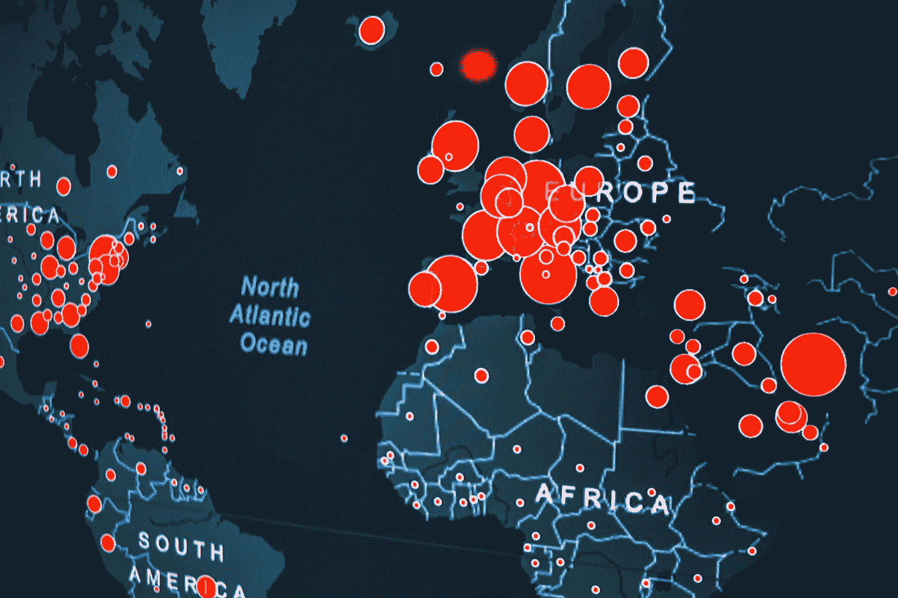
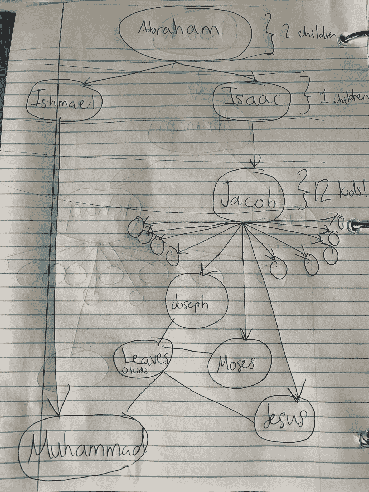
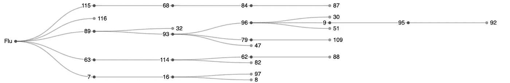
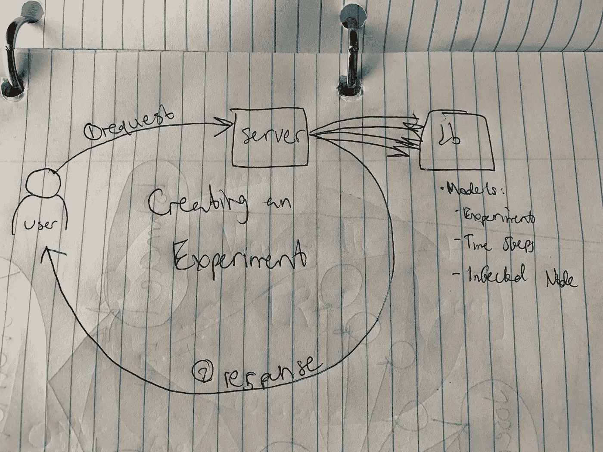
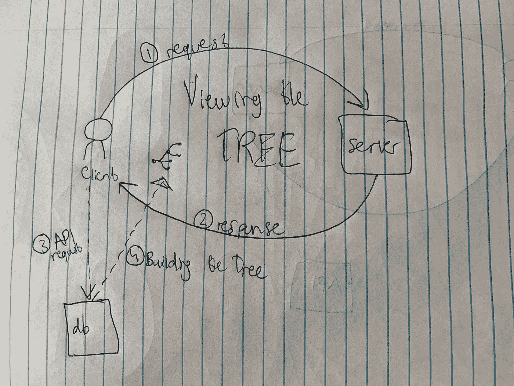
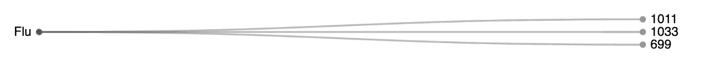
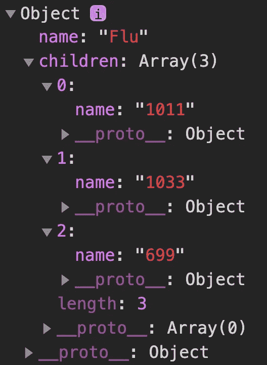

# 病毒是如何在人群中传播的？

> 原文：<https://blog.devgenius.io/how-does-a-virus-spread-throughout-a-population-a3b6c019a704?source=collection_archive---------1----------------------->

# 应用计算机科学分析流行病

声明:如果你在寻找新冠肺炎的最新消息，这个博客不是最好的地方。为此，我建议查看[疾控中心网站](https://www.cdc.gov)。在这篇文章中，我只是分享了我的一个与流行病研究和分析相关的软件工程项目。

照片由[埃里克·麦克莱恩](https://unsplash.com/@introspectivedsgn?utm_source=unsplash&utm_medium=referral&utm_content=creditCopyText)在 [Unsplash](https://unsplash.com/s/photos/virus?utm_source=unsplash&utm_medium=referral&utm_content=creditCopyText) 上拍摄

# 为什么群体免疫很重要

这是周六晚上。晚上 8 点

在一个不知名的城市中心，一家通常熙熙攘攘的餐馆静悄悄的。所有的灯都灭了，已经好几天没人进去过了。

它的主人，丹，已经关闭了生意。

离餐馆几个街区，有一家医院。医生办公室的灯是亮着的，尽管通常在下午 5 点以后就没人了。

医生 Syeda 打算花一整晚的时间来照顾病人。

丹和希达过着截然不同的生活。其中一个知道如何填饱肚子；另一个知道胃里实际能装多少食物。他们中的一个可能希望人们回到街上；另一个人看到没有戴口罩的行人会发抖。

不过，丹和希达的共同点也同样重要——他们都是群体免疫的受害者。

# 那么，如何模拟疾病爆发呢？

在这篇博客文章中，我想与你分享最新和改进版本的[群体免疫](https://herd-immunity.herokuapp.com/)，这是我最近部署的一个网络应用程序，用于帮助研究人员、教师和好奇的人对每次疫情和流行病爆发背后的潜在变量进行实验。

## 如何使用该网站

如果你想知道这个网站实际上是如何运作的，这里有一个 1 分钟的演示视频。它用伤寒作为病毒的例子。

[群体免疫项目演示视频](https://youtu.be/rLb2eaMichE)。

## 这篇博文的路线图

我计划通过图表、代码片段和个人故事的方式与你分享很多东西。请记住，在这篇博客结束时，我计划与你分享两个主要概念:

1.  什么是 M-way 树，以及它们如何应用于现实世界
2.  我如何有效地集成不同的 Web 开发框架

## 项目灵感

最初的项目受到了比尔·盖茨工作的启发，他在 2015 年的 ted 演讲中预测了疫情病毒爆发的威胁(令人难忘地类似于新冠肺炎)。

在最初的范围内，我和我的合作伙伴 [Shashwat Prajjwal](https://www.linkedin.com/in/shashwat-prajjwal-309339108/) 将群体免疫构建为一个简单的基于命令行的应用程序。它能够计算出理论上可能被感染、产生免疫力或死亡的人数，给定某些变量，如人口规模、人口中接种疫苗者的百分比、病毒本身以及最初被感染的人数。通过使用 Python 3 中的[随机模块，程序中的“随机性”成为可能(代码将包含在本文底部的链接中)。](https://docs.python.org/3.7/library/random.html)

通过这门课之后，我决定更进一步，从盖茨在他的 TED 演讲中使用的更先进的计算机模拟中获得线索。

# 现实世界中的数据结构

现在的问题是:*向*展示模拟结果的最佳方式是什么，这样用户就可以*看到*个人之间的互动是如何*联系起来的？*

答案是:使用 M 叉树！

## m 向树

M-way 树是一种*抽象数据类型*，它建立在一种更一般化形式的*二叉树之上。*如果这看起来像是计算机科学术语，不要担心——我的意图是帮助你认识到你可能已经比你意识到的更好地理解了这种数据结构！

展示伊斯兰教“先知之树”的书法作品。图片鸣谢[http://www . zombie time . com/Mohammed _ image _ archive/this _ is _ Mohammed/](http://www.zombietime.com/mohammed_image_archive/this_is_mohammed/)

让我们从考虑一个*家谱开始，*一种通常用来表示同一家族成员之间的谱系关系的图。

例如，左边的树显示了[穆罕默德](https://www.biography.com/religious-figure/muhammad)的家庭。它从底部开始，或者说从*根开始，*随着我们沿着图表向上移动，我们可以看到每个人，作为*父母*，是如何与他们的*子女*发生系谱联系的。

所有这些只是想告诉你，在计算机科学背后有一种疯狂的方法。我知道我个人感觉每当我被一个概念的术语弄糊涂时，回到现实世界的例子总是有帮助的，然后归纳到 CS 理论！

代表亚伯拉罕家族的 12 向树。

也就是说，让我们来看看和以前一样的家谱，只是看起来更像 M-way 树！需要指出几件事:

1.  树的*根*在图的顶部。
2.  我们把每一个人(在英语中用他们的名字代表)称为树中的一个*节点*。这些节点并不总是人——它们可以是存储在树中的任何数据。
3.  节点是按后代排列的:*父*节点分支成不同的*子*节点。在最底部，节点不再有孩子——我们称这些节点为*叶。根据定义，叶节点总是没有子节点。*

那么，M-way 树有什么特别之处呢？M 代表什么？

m 只不过是一个变量，用于表示*可能从任何给定父节点分支的子节点*的最大数量。在我们不知道树中的单个数据可能与树中的其他节点有多少关系的情况下，我们使用 M 向树。

在上面家谱的上下文中，M=12。这是因为我们从亚伯拉罕开始，他有两个孩子。然后在图表的下一层是以实玛利和以撒，他们都有一个孩子。注意，如果我们的树到此为止，称它为二叉树就足够了——因为二叉树只是 M 向树，其中 M=2。然而，下一层是雅各布，他有 12 个孩子！因此，我们有一个 12 向树。

# 群体免疫是如何工作的

我们这些对研究疾病爆发感兴趣的人今天处于一种独特的境地。出于显而易见的原因，我们可能不会运行任何真实世界的实验——这就是为什么我们有计算机模拟是伟大的！

在最新版本的[群体免疫](https://herd-immunity.herokuapp.com/)中，用户现在可以看到一个 M-way 树，显示在他们进行的实验中被病毒感染的人群。

## 这棵树展示了什么

对于每个模拟，用户现在可以选择查看树形可视化，显示在实验的每个阶段(称为“时间步长”)有多少人感染了病毒。

例如，让我们用这些输入参数来分析我通过创建一个实验制作的树:

*   *人口数量:* 120 人
*   *接种率:* 78%
*   *初始感染:* 5
*   *病毒死亡率:* 1%
*   *病毒繁殖率:* 10%

一个 M 向树的例子，展示了一个虚构的流感病毒的传播。

从该树中，我们可以得出以下观察结果:

1.  这是一个 5 向树，因为 5 是任何父节点拥有的最大数量的子节点
2.  树的根(最左边)是病毒本身，任何分支最右边的节点是叶子。
3.  除了根之外的每个节点都代表一个感染者。存储在每个节点的数据是这个人唯一的、随机分配的 ID 号。

## 这项技术

下面是构建这个网站时使用的三个主要 web 框架，以及我如何使用它们的简短描述:

*   [Django](https://www.djangoproject.com) :配置服务器
*   [Django REST 框架](https://www.django-rest-framework.org):设置 API 端点将数据传递给浏览器
*   [数据驱动文档](https://d3js.org/):用于在他们的站点上创建[“整洁树”。](https://observablehq.com/@d3/tidy-tree)

## 框架是如何使用的

姜戈:制作模型

创建新实验的请求-响应循环。

当用户第一次在站点上创建一个新实验时，服务器被配置为完成几个步骤:

1.  一个 POST 请求被发送到视图，它处理一个实验“对象”的创建，以及在疾病爆发过程中被感染的所有人的对象。
2.  在 MVC 架构方面，“Experiment”和 person 的类“InfectedNode”都是保存在数据库中的模型。数据库使用 PostgresSQL，并使用“一对多”关系维护实验及其相关感染节点之间的连接。
3.  然后，用户被重定向到一个新视图，该视图显示模拟的结果。

可视化实验感染树的请求-响应循环

**Django REST 框架:**从后端向前端传递数据

1.  从结果页面中，用户可以单击一个链接来查看一个单独的页面(为树的可视化留出尽可能多的空间)。这会向服务器发送一个 HTTP GET 请求。
2.  服务器做出响应，一旦用户到达下一个视图模板。我在这个页面的 HTML 中嵌入了一个 AJAX 调用，所以用户一登陆就触发另一个对 API 端点的 GET 请求，这个请求是使用 Django REST 框架建立的:InfectedNodeData。

**数据驱动文档(又名 D3):** 可视化数据

API 端点的工作是将 JSON 响应发送回 HTML 模板，这样我就可以在 D3 框架上使用 Javascript 来可视化树。

这有点棘手，因为 D3 要求数据是递归结构的。

以这棵小树为例。等效的 JSON 格式显示在左下方。

为了生成树，JSON 被格式化为根节点“嵌套”所有其他节点的所有数据。这个原则递归地应用于所有节点。

这是因为 InfectedNode 模型本身的每个实例都必须保留两个引用:

1.  它的父节点(假定是一对一的关系)，是将病毒传递给它们的节点。
2.  它的子节点，也就是他们把病毒传给的节点。这是使用另一个一对多关系存储的。

最终，通过使用预先排序的深度优先搜索，我能够以一种如左图所示的方式构建 JSON:根节点。在字典的顶层(就像在树中一样)。

然后，它将引用嵌套到它的所有子节点，子节点将引用嵌套到它们的子节点，依此类推。嵌套仅在每个分支结束时结束:在一个叶节点，它没有对子节点的引用。

最后，这里是用于最终可视化树的 Javascript 代码，它再次使用了大量的 D3 API 来创建[“整齐的树。](https://observablehq.com/@d3/tidy-tree)“jQuery 也被用来简化 AJAX 的使用。

嵌入 HTML 的 Javascript 代码，产生一个表示 M 向树的 SVG。使用 AJAX 和 jQuery 从后端调用数据。

# 资源

感谢你读到这里，我个人感谢你对公共健康现状的足够关心来阅读我的作品。如果你觉得有用，请分享[群体免疫](https://herd-immunity.herokuapp.com/)的链接。如果你是一名网页开发人员，想要提高你的技能，也请查看这些链接，以促进你的成长:

1.  通过探索[群体免疫 GitHub 知识库](https://github.com/UPstartDeveloper/herd-immunity)，了解更多关于网站架构的信息
2.  在阿尔伯塔大学的这个[讲座中了解 M-way 树](https://webdocs.cs.ualberta.ca/~holte/T26/m-way-trees.html)
3.  在 Vaidehi Joshi 的博客中了解[深度优先搜索树木](https://medium.com/basecs/deep-dive-through-a-graph-dfs-traversal-8177df5d0f13)
4.  查看关于在 D3 上创建整齐的树的笔记本