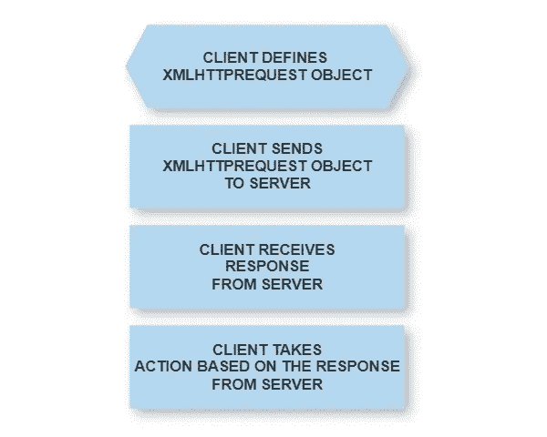
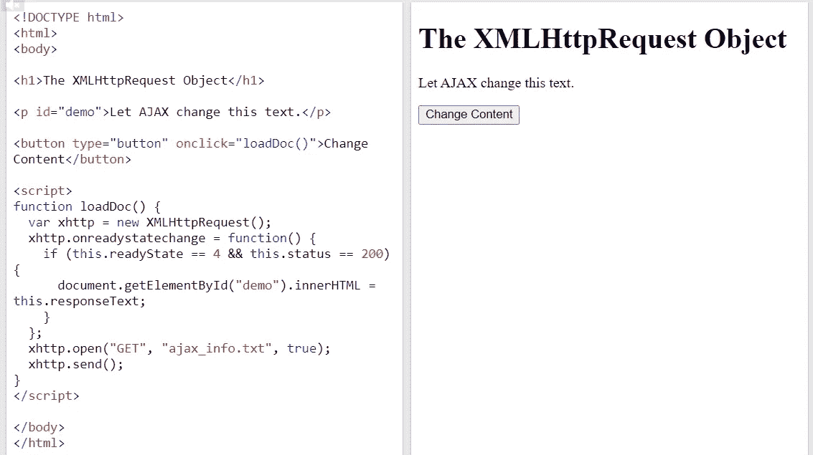
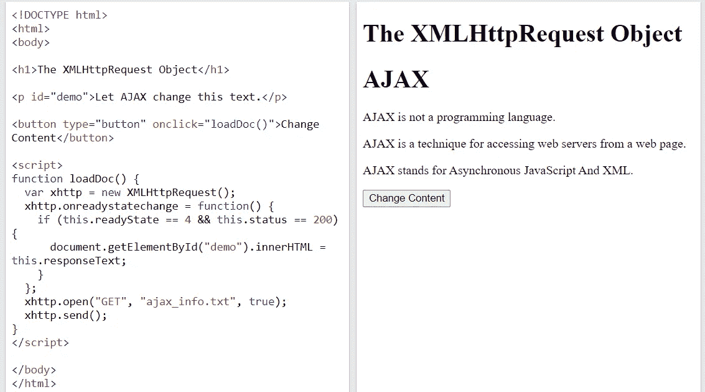

# AJAX 实际上是如何工作的？

> 原文：<https://blog.devgenius.io/how-does-ajax-actually-work-2f57cf4ddc55?source=collection_archive---------8----------------------->

XHR、jQUERY、AXIOS 和 FETCH 代码示例


在 [Unsplash](https://unsplash.com?utm_source=medium&utm_medium=referral) 上由 [Kirstell Pauldoss](https://unsplash.com/@kirstell7?utm_source=medium&utm_medium=referral) 拍摄的照片

AJAX(异步 JavaScript 和 XML)依赖于一个被称为 XMLHttpRequest (XHR)对象的核心组件，该组件由 Mozilla 从微软创建的名为 XMLHTTP 的 ActiveX 对象开发而来(参见 [XUL AJAX](https://www.xul.fr/en-xml-ajax.html) )。多年来，已经开发了一些包装器库和框架，如代码中包含 XHR 对象的 [jQuery](https://jquery.com/) 、 [Axios](https://axios-http.com/docs/intro) 和 [NATURAL AJAX](/developing-ajax-web-pages-e270eb59fc92) 。在某种程度上，不熟悉 AJAX 的开发人员在完全不了解实际的 XHR 对象的情况下就接触了这些库和框架。

下图简要说明了 AJAX 或 XHR 对象的工作原理:
(1)客户端(即运行在客户端的 JavaScript)定义 XHR 对象。
(2)XHR 对象向服务器发送对象请求。
(3)XHR 对象(等待并)接收传入的响应。
(4)XHR 对象采取行动。
当 XHR 对象等待响应时，客户端将继续执行其余的代码。这就是所谓的异步过程。



W3Schools 的以下示例(参考 [W3Schools AJAX](https://www.w3schools.com/xml/tryit.asp?filename=tryajax_xmlhttp) )展示了 AJAX 在实践中是如何工作的。

```
<!DOCTYPE html>
<html>
<body><h1>The XMLHttpRequest Object</h1><p id="demo">Let AJAX change this text.</p><button type="button" onclick="loadDoc()">Change Content</button><script>**/*(1) DEFINE XMLHTTPREQUEST OBJECT */**
function loadDoc() {
  var xhttp = new XMLHttpRequest();
  **/*(3) RECEIVE RESPONSE */**
  xhttp.onreadystatechange = function() {
    **/*(4) TAKE ACTIONS */**
    if (this.readyState == 4 && this.status == 200) {
      document.getElementById("demo").innerHTML = this.responseText;
    }
  };
  xhttp.open("GET", "ajax_info.txt", true);
  **/*(2) SEND REQUEST */**
  xhttp.send();
}
</script></body>
</html>
```

W3Schools 演示页面允许不熟悉 AJAX 的开发人员通过单击“更改内容”按钮来体验这种效果。



当点击按钮时，一些新的文本将被插入到页面中，并替换现有的文本。页面根本不需要刷新。



jQuery 和 Axios 旨在通过引入更简单的编码方法来简化 XHR 码的排列。以下是发送 HTTP 请求的三个版本，即(1)普通 XHR，(2) jQuery，和(3) Axios(参考[邮递员代码片段](https://learning.postman.com/docs/sending-requests/generate-code-snippets/))。

```
/* POSTMAN Snippet:Plain XHR */
// WARNING: For POST requests, body is set to null by browsers.var xhr = new XMLHttpRequest();
xhr.withCredentials = true;xhr.addEventListener("readystatechange", function() {
  if(this.readyState === 4) {
    console.log(this.responseText);
  }
});xhr.open("POST", "[http://localhost:8190/login](http://localhost:8190/login)");
xhr.setRequestHeader("Authorization", "Basic YWRtaW46bWFuYWdl");xhr.send();
```

jQuery 简化了请求设置和响应处理代码。

```
/* POSTMAN Snippet:jQuery */
var settings = {
  "url": "[http://localhost:8190/login](http://localhost:8190/login)",
  "method": "POST",
  "timeout": 0,
  "headers": {
    "Authorization": "Basic YWRtaW46bWFuYWdl"
  },
};$.ajax(settings).done(function (response) {
  console.log(response);
});
```

Axios 支持客户端和服务器端 JavaScript。这里显示的例子是针对服务器端 JavaScript 的，即 NodeJS。

```
/* POSTMAN Snippet:Axios */
var axios = require('axios');var config = {
  method: 'post',
  url: '[http://localhost:8190/login'](http://localhost:8190/login'),
  headers: { 
    'Authorization': 'Basic YWRtaW46bWFuYWdl'
  }
};axios(config)
.then(function (response) {
  console.log(JSON.stringify(response.data));
})
.catch(function (error) {
  console.log(error);
});
```

最近 Mozilla 推出了一个新的 API，他们声称比 AJAX 更强大，称为 Fetch(参见 [Mozilla Fetch API](https://developer.mozilla.org/en-US/docs/Web/API/Fetch_API) )。下面的代码演示了 Fetch 的用法(参考 [Mozilla 使用 Fetch API](https://developer.mozilla.org/en-US/docs/Web/API/Fetch_API/Using_Fetch) )。然而，fetch()是 ECMAScript6 (ES6)的一项功能(参见 [W3School Fetch API](https://www.w3schools.com/jsref/api_fetch.asp) )，因此不适用于 ECMAScript/JavaScript 的旧版本(即 2015 年之前)。

```
/* Fetch API */
fetch('[http://example.com/movies.json'](http://example.com/movies.json'))
  .then((response) => response.json())
  .then((data) => console.log(data));
```

AJAX 使得 RESTful web 应用程序非常有效。

未完待续[下一部分](https://medium.com/@mohamad.razzi.my/sending-ajax-request-with-jwt-token-to-access-adabas-rest-web-services-28baa254e9ae)。

本帖是“Adabas & Natural 入门”系列的一部分，包括:
本帖是“Adabas 入门& Natural”系列的一部分，包括:
(1) [设置 Adabas & Natural 社区版(Docker 版)](https://medium.com/@mohamad.razzi.my/getting-started-with-adabas-natural-part-1-6597688406ad)。
(2) [通过 Adabas REST Web app 访问 Adabas 数据库](https://medium.com/@mohamad.razzi.my/getting-started-with-adabas-natural-part-2-34621e576fa4)。
(3) [Adabas“周期组”和“多值”以 JSON 数据格式表示](/getting-started-with-adabas-natural-part-3-a334822db12)。
(4) [使用 Adabas TCP-IP 节点包访问 Adabas 数据库](https://medium.com/@mohamad.razzi.my/getting-started-with-adabas-natural-part-4-728e6977ad4f)。
(5) [使用 NaturalONE IDE 的大型机编程(Natural)介绍](https://medium.com/@mohamad.razzi.my/getting-started-with-adabas-natural-part-5-1665a0be42ab)。
(6) [使用自然编程和自然 IDE 访问 Adabas 数据库](https://medium.com/@mohamad.razzi.my/getting-started-with-adabas-natural-part-6-48b4b2fd3e6d)。
(7) [大型机数据库编程基础](https://medium.com/@mohamad.razzi.my/mainframe-database-programming-fundamentals-b34fd88acf6e)。
(8) [大型机数据库编程中级](https://medium.com/@mohamad.razzi.my/mainframe-database-programming-27803b92a3a3)。
(9) [使用自然 AJAX 框架开发 AJAX 网页](https://medium.com/@mohamad.razzi.my/developing-ajax-web-pages-e270eb59fc92)。
(10)[AJAX 实际上是如何工作的](https://medium.com/@mohamad.razzi.my/how-does-ajax-actually-work-2f57cf4ddc55)？
(11) [向 ADABAS REST Web app 发送带有 JWT 令牌的 AJAX 请求](https://medium.com/dev-genius/how-does-ajax-actually-work-2f57cf4ddc55)。
(12)通过 Java Servlets 和 Java Web Services (SOAP)向 ADABAS REST 服务发送 HTTP 请求。