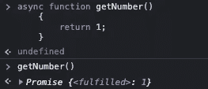
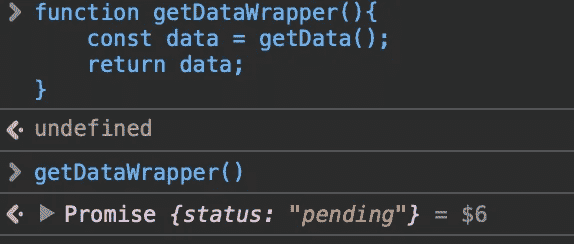

# 异步等待在 NodeJS 中是如何工作的？

> 原文：<https://blog.devgenius.io/how-does-async-await-work-in-nodejs-d85645f85e19?source=collection_archive---------4----------------------->

在理解 async await 如何工作以及如何使用它之前，理解 Javascript 中的承诺是很重要的。你很幸运，我有一个关于承诺的快速指南，所以一会儿见。
欢迎回来！既然我们已经了解了什么是承诺，那么是时候了解 async await 能做什么来帮助我们处理承诺了。哦，我已经放弃了这个工具，所以 async await 帮助我们以一种更舒适的方式处理承诺。我们已经转移到承诺，以避免回调地狱，现在我们想得到更多的安慰，我们的承诺，异步等待将帮助我们实现这一点。我们先来看看 async 是做什么的。

# **异步**

每当任何函数被定义为异步时，它将返回一个承诺。让我们看一个例子。

好的，我们的函数 getNumber 只是返回 1，在添加 async 关键字时，现在返回一个 promise。我们现在已经知道，如何处理承诺。使用“然后”。太好了！

太棒了，我们得到了预期的价值。你脑海中浮现的另一个问题可能是，async 关键字仅限于函数吗？从逻辑上讲，为任何数据类型分配 async 关键字都是没有意义的，因为它并不表示类型，而是让函数返回承诺，而不是通常的返回值。你可以在你的游戏机上试试，那是你的游戏场。让我们移步等待，这样我们就能清楚地看到整个画面。

# 等待

Await 在一个异步函数中可以创造奇迹，要注意的关键是 await 只能在异步函数中工作，如果没有它，它会抛出一个严重的错误。但是，await 做什么呢？嗯，await 使我们能够以更好的方式处理承诺。带有 await 关键字的异步函数中的承诺将在继续进一步工作之前等待承诺的结果。很多话，我们来看一个例子。

在我们的 getData 函数中，我们进行了两次调用，将返回 promise“fetch”和“json ”,而不是用 then 函数链接 promises，我们在调用之前添加了 await 关键字，这意味着我们正在等待调用的响应，只有当有响应时，才会执行剩余的代码行。让我们首先理解 getData 调用的输出，然后我们检查前面的句子实际上是否正确。

正如我们已经看到的，每当我们向一个函数添加 async 时，它将返回一个 promise，这个 promise 由第一个语句验证。我们通过用一个 then 函数链接这个承诺来得到这个承诺的结果。同时我们还可以从 getData 函数中观察到 log，这两个 log 语句都返回了当时获得的数据，而不是一个承诺。理解 await 关键字只在异步函数中起作用是很重要的，你肯定可以提出一个论点，说在最后的 getData 调用中使用“then”函数，我们可以添加 await 关键字来获得承诺的响应，如果你在控制台中尝试，你可能会看到没有任何问题的结果。是不是感觉被骗了！？嗯，await 关键字在没有 async 关键字的情况下在您的控制台中工作是有原因的，这是由于您的控制台中提供了类似于[https://developer.chrome.com/blog/new-in-devtools-62/#await](https://developer.chrome.com/blog/new-in-devtools-62/#await)的附加功能，但是如果您包装 getData 函数，您会看到错误，因为 await 在没有 async 的情况下不会被识别。

如果您在这里删除 await 关键字，事情将开始正常工作。

让我们回到我们的语句，每当我们遇到 await 键时，在承诺实现之前，后面的语句不会运行。让我们比较一下 wait 和 then 中的行为。

为了理解这个流程，我添加了一些额外的日志语句。让我们看看调用后的输出。

日志的顺序与函数中定义的顺序相同，如果使用 then 函数执行类似的调用，我们会看到不同的结果。

我们使用 then 链接我们的承诺，不从 getData 函数返回任何内容。让我们看看输出的顺序。

正如我们所讨论的，执行并没有在 fetch 调用时停止，而是所有的代码在它被执行之后，同时承诺被实现，当承诺被实现时，我们收到了响应。

我们对异步等待有了很好的理解。你可能会想到的另一个问题是，当我们在一个异步函数中指定 await 关键字时，代码会等待它完成，这是否意味着我们的主线程会被阻塞，因为我们知道 Nodejs 是一个单线程应用程序？！不会，将函数标记为 async 并不意味着函数会异步执行，函数仍然会同步执行，但是 await 会让节点在执行下一个代码之前等待响应，主线程不会在这里被阻塞等待结果，它可以继续处理事件循环中的其他事件。Async await 使代码看起来像是阻塞的，但它不是阻塞代码，只是一种更漂亮的处理承诺的方式。

如果你觉得这篇文章有帮助，别忘了鼓掌，这会让我开心一天。:D