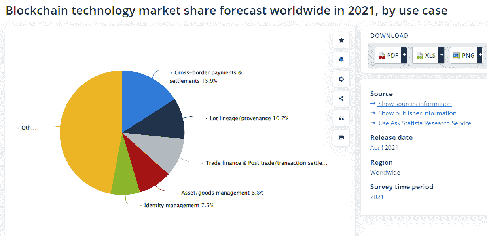

# 区块链如何在商业行业创造信任？

> 原文：<https://blog.devgenius.io/how-does-blockchain-create-trust-in-the-business-industry-13cdfc8e2888?source=collection_archive---------7----------------------->

安德烈·梅特列夫在 [Unsplash](https://unsplash.com?utm_source=medium&utm_medium=referral) 上拍摄的照片

区块链是指记录交易的公共账本，或者是指比特币、以太坊和莱特币等加密货币背后的技术。它还意味着智能合约、ico 和其他各种需要单独解释的东西。这项技术可以在商业交易中建立信任，尤其是当对方的可信度有疑问的时候。

例如，假设一个行业中的一个企业开始使用区块链作为其运营的一部分。在这种情况下，该行业的其他公司可能会效仿，因为他们知道他们的客户可以证明他们在区块链运营，因此按照最高的诚信标准运营。

那么，区块链是如何创造信任的呢？本文将帮助您分析区块链如何通过破坏技术的工作组件和用例来建立信任。

让我们从技术如何工作开始。区块链技术工作机制包括节点、分布式总账和智能合约。

*   节点遍布世界各地，负责在其计算机上存储信息的副本。
*   分布式分类帐是在公共的、不可变的分布式数据库上存储数据的仅附加记录，当网络中的参与者达成共识时，该数据库可以被更新。
*   智能合同是根据预编程指令直接控制数字资产的自动执行代码。这种类型的合同消除了第三方的干扰，并有可能增加商业行业的透明度。

区块链科技将如何在商业领域创造信任？不变性、透明性和可靠性这三个特征。当用户发送他们的数据存储在区块链上时，没有人能修改或删除它，因为每个人都可以访问它。

**区块链技术以安全为中心的特性:**

*   **不可变:**记录一旦输入系统，就不能再做修改。条目一旦被写入，就不能被修改或删除。
*   **透明性:**各方都可以访问数据，因此一个团队无法在不让其他人知道他们在做什么的情况下控制所有数据，而在当前的系统中，你需要得到其他人的许可才能看到任何信息。
*   **可靠性:**如果一个节点宕机也没关系，因为有如此多的副本可用，我们总是有足够的副本来验证事务。你不需要信任，因为你已经通过数学和密码学得到了认可。
*   **分布式:**数据在全球不同的服务器上复制，而不是由一个人保存。
*   **分散化:**没有中央权威机构管理系统。而是所有用户都是平等的，都有权力。
*   **共识:**要做出改变，网络上 51%的节点必须同意。记录为高接受率块的交易每 10 分钟验证一次。随着每个新块被添加到链中，修改前一个块所花费的时间呈指数增长。一旦数据被输入到一个数据块中并被 51%的节点验证，该数据块就成为永久数据块。除非随后发生另一个 51%的共识，否则你永远不能再修改它。

**阅读也:** [区块链趋势 2022:深度行业&生态系统分析](https://www.pixelcrayons.com/blog/blockchain-trends/)

# **详细了解区块链的三个基本安全方面**

## **该块**

迄今为止，“区块链”这个词主要与虚拟货币和支付系统比特币联系在一起。尽管如此，区块链技术及其原理适用于商业交易。基本思想相对简单，由两个要素组成，顾名思义:在商业中，有两种类型的区块:区块和链。

该块是与商业交易相关的高度加密的条目列表。可以使用块来跟踪交货状态、负责产品生产的人员等。任何对业务至关重要的东西都可以记录在块中。

## **链条**

区块链的文档不仅由中央服务器管理，还分布在网络用户中。有数百万份数据。在区块链技术中，块的链接确保块的内容保持可信。如果在一个块中输入一个付款单，网络中的所有计算机都会检查其有效性。

由于加密、分散、社区控制和许多利益相关者，这个系统几乎不可能被黑客攻击。信任不是来自各方或中介之间的关系，而是来自网络中的技术和比较过程。

## **智能合约**

冻结信息还可以链接到“智能合同”(智能合同软件)，该软件在特定事件发生时触发交易。例如，在产品售出后，自动按比例支付给有权获得补偿的所有各方。分散式网络作为权威机构比作为中央权威机构更有意义，因为它增加了安全性、降低了成本、提高了速度并建立了信心，所有这些都不需要中间人。

## **区块链用例**

[**来源:Statista —区块链用例**](https://www.statista.com/statistics/982566/worldwide-top-use-cases-blockchain-technology-by-market-share/)

*   **文档共享门户**

ShareDocs 是一个基于区块链的文件存储平台，允许用户访问、存储和与他人共享他们的文档。它是首批提供此类功能的分散式平台之一，因为它的分散性质消除了任何可能导致安全漏洞或数据丢失的单点故障或漏洞。

区块链层还通过在网络内的多个节点上存储所有文件的不可变副本来防止未经授权的更改和破坏。上传时，文件使用公钥加密技术加密，以提高安全性和隐私性。ShareDocs 还为存储在其平台上的每个文档创建了一个数字指纹，因此只有获得授权的个人才能在不损害其内容的情况下访问它们。

总体而言，当试图在任何网络或移动应用的最终用户之间建立信任时，区块链是一个可靠的选择。此外，您可以[在印度雇佣区块链开发人员](https://www.pixelcrayons.com/hire-blockchain-developers?utm_source=GP%2FBlockchain+Trust%2FMedium&utm_medium=Hire+Blockchain+Developers%2FSR-AR&utm_campaign=SR-AR)，他们可以让您创建先进的数字解决方案，确保您的业务更加可信和透明。

*   **比特币**

区块链技术已经应用于各个行业和用例，包括比特币。比特币是世界上最受欢迎的加密货币，创建于 2009 年。一个用户通过挖掘比特币，从另一个用户那里获得比特币作为支付，或者在比特币的帮助下在线购买商品来获得比特币。但是比特币到底是什么？比特币是一种分散的货币形式，交易通过分布式共识进行验证，而不是像银行或政府这样的中央控制实体。

比特币是利用区块链技术开发的。与依赖集中控制来监管其流动的传统货币不同，比特币使用全球范围内的点对点(P2P)计算机网络来验证交易。P2P 网络依赖于每个人分担一些责任来保持事情顺利进行——在这种情况下，就是验证交易。

为了参与这些网络并从交易费用和新产生的比特币中赚钱，人们将他们设备或云服务的计算机能力用于解决数学问题(也称为挖掘)。任何贡献计算能力的人都可以获得新的比特币奖励！商业行业在很大程度上依赖于商品和服务交易双方之间的信任。

**阅读也:**[Argo 区块链是好的投资吗？下面是你需要知道的](https://www.pixelcrayons.com/blog/is-argo-blockchain-a-good-investment/)

# **收尾**

区块链创建信托的最简单方式是提供所有权证明。当你拥有一项位于区块链的资产时，你可以确信，没有你的允许，没人能把它拿走。这是因为每一笔交易都记录在区块链上，每个人都有一本分类账。

对于一家企业是否试图利用你，不再有任何不确定性。[印度定制区块链开发公司](https://www.pixelcrayons.com/blockchain-development?utm_source=GP%2FBlockchain+Trust%2FMedium&utm_medium=Blockchain+Development+company%2FSR-AR&utm_campaign=SR-AR)创建易于使用的区块链解决方案，帮助增进双方之间的信任。因此，公司可以减少与监督相关的费用，并遵守旨在保护消费者的法律要求。