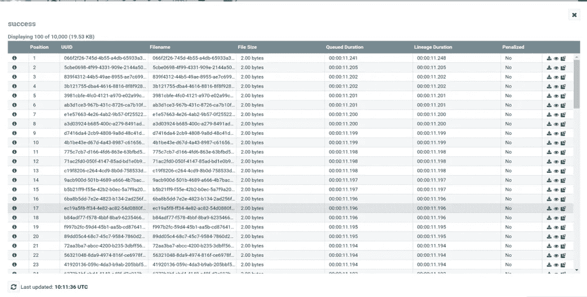

# Ctyun 如何将 SeaTunnel 应用到他们的数据集成平台中

> 原文：<https://blog.devgenius.io/how-does-ctyun-apply-seatunnel-to-their-data-integration-platform-8729802dc9c3?source=collection_archive---------14----------------------->

演讲人:Ctyun 大数据开发工程师周厉王

11 月 26 日，在 Apache SeaTunnel 和 APISIX 的联席会议上，Ctyun 的大数据开发工程师周厉王分享了他在将 SeaTunnel 引入 Ctyun 数据集成平台过程中的实践。

Ctyun 数据集成平台基于 Apache Nifi，但是 Apache Nifi 不能很好的满足一些特定的需求，需要引入第三方数据集成工具来补充能力。而 SeaTunnel 是一个很好的工具，可以补充 Nifi。在这里，我将从架构层面介绍将 SeaTunnel 集成到 Ctyun 数据平台的设计和思路。

本课题主要包括四个部分:

●阿帕奇海底隧道简介

Apache Nifi 简介

●海底隧道和 Nifi 集成解决方案

● Ctyun 数据集成平台

●我参与开源的经历和思考

# 海底隧道简介

Ctyun 平台主要面向政企客户。目前以 Apache Nifi 为核心，辅以原生 Flink 应用。在此基础上，对各种数据集成应用进行打包和二次开发，为不同行业提供解决方案。虽然目前 SeaTunnel 在我们公司还没有投产，但是我们已经在它上面做了很多探索，所以这个题目主要说一下我对 SeaTunnel 和 Nifi 结合使用的体会。因为两者各有利弊，所以在功能上可以互补，提供更多的功能，满足更多的客户需求。

SeaTunnel 本质上是一层 Spark 和 Flink 的封装。现在新版本增加了其自主开发的 SeaTunnel 发动机。用户可以通过编辑配置文件快速构建工作流。

配置文件由四部分组成:

*   env 用于配置整体环境
*   来源是配置数据源信息
*   转换与配置数据处理相关
*   接收器配置数据的去向。

与 kettle、Nifi 等重量级平台相比，SeaTunnel 更像是一个轻量级的数据传输工具。用户可以根据需要安装源、接收器和转换插件。

在数据源方面，SeaTunnel 支持关系数据库如 MySQL，和 Oracle，非关系数据库如 MongoDB，Redis 等。、文件类型，如 FTP、HDFS、ossFile、网络通信套接字、HTTP、消息队列、Kafka、Pulsar、数据湖等。，其中有许多类型。

转换插件支持大小写转换、替换、分段、SQL 和 uid 提取。用户也可以根据自己的需求定制插件。

安装和启动 SeaTunnel 也非常方便。下载压缩包并解压后，根据要运行的任务类型运行相应的启动脚本。

Spark 和 Flink 都有两个版本，v1 和 v2。现在他们也支持新的 SeaTunnel 引擎，启动方式也差不多。在这里，它支持向三种环境提交任务:local、yarn 和 k8s。

# Nifi 简介

Apache Nifi 是一个基于 web 的图形界面，它通过拖放、连接和配置来完成基于流程的编程。它可以在单个节点上运行，也可以以集群模式运行，集群的节点由 Zookeeper 协调。

图中显示了一个 Nifi 集群，每个矩形相当于一个 Nifi 节点。在其顶层，web 服务器接收这样的用户请求。每个节点的服务运行在一个 JVM 上，有一个处理器和流控制器支持业务逻辑的构建，而流文件是底层的数据结构，将存储在流文件存储库和内容存储库中。

Nifi 的常用组件主要包括五个部分

*   流文件
*   处理器
*   关系
*   过程组
*   控制器服务

## 流文件

流文件是 Nifi 的底层数据结构。它由属性和内容组成。它的属性可以用来描述数据。例如，如果 putFile 组件向本地提供输出数据，则它输出的 FlowFile 的属性可以是文件名。这个 Flowfile 是一个抽象的概念，它可以通过配置放在内存或者硬盘上，用户可以通过查看队列(以可视化的形式)看到 Flowfile(其属性和相关内容)。

## 处理器

它是映射器的核心。处理者可以通过编排连接来构建工作流。常用的处理器还包括读取数据、转换数据和输入数据。

处理器是 Nifi 的核心，它可以通过编排连接来构建工作流。常用的处理器包括读取数据、转换数据和输出数据。支持的组件总数约为三四百个。

每个组件都支持单独调度策略的配置，并支持定时调度和 cron 表达式调度。虽然 Nifi 有这么多组件，但是 CDC 组件相对较弱，只有 MySQL CDC，而且一些新的数据源读写组件是目前开源版本的 Nifi 所不支持的，比如数据湖胡迪、冰山等；

## 关系

连接用于连接不同的处理器。它相当于一个队列。从上游传输的数据将进入该队列，直到数据被下游组件使用。该连接可以配置不同的优先级策略，以及数据到期时间和存储容量。等等；

## 处理器组

它用于将一组处理器组织在一起。外部数据可以通过 Nifi 端口组件输入和输出。远程处理器组是用户从远程进程(Nifi 实例)接收的数据。

## 控制器服务

它相当于一个运行在后端的服务。它用于提取处理器使用的一些公共属性，比如用于连接数据库的 JDBC 连接池，以及用于达到重用目的的 Kerberos 身份验证服务。

# 与 Nifi 的海底隧道集成

## 执行流程组件包隧道

第一种组合方法是用 Nifi 的 Execute Process 组件封装 SeaTunnel，利用 Nifi 的调度能力让它定期运行 SeaTunnel 任务。通常，如果您想首先调度 SeaTunnel 任务，您需要依赖 Apache DolphinScheduler 或其他调度工具。现在 SeaTunnel 有了 web 平台(UI 还在开发中)，将任务提交给 DolphinScheduler 进行调度。在这里使用 Nifi 提供了新的思路。

## 构建 Nifi 工作流

在一个节点上部署 SeaTunnel 和 Nifi，可以通过 executeProcess 组件运行 SeaTunnel 启动脚本，SeaTunnel 运行日志会通过 head 节点传输到下游组件，head 节点可以通过这个推测节点，下游传播日志会包含一些任务相关的信息。

如果任务启动成功，我们可以筛选出它的任务 id，得到任务 id 后，可以进一步控制任务，比如封装和停止任务，取消一些任务接口功能。

上图显示了队列中的 SeaTunnel 运行日志。SeaTunnel 启动成功后，可以看到里面的任务 id，比如 Flink 作业 ID 和 applicationID，可以获取。

## 通过 Nifi 站点到站点协议构建 SeaTunnel -Nifi 连接器

Nifi 实例之间的首选通信协议是 Nifi 站点到站点(S2S)协议。S2S 可以轻松、高效、安全地将数据从一个 Nifi 实例传输到另一个实例或其他应用程序或设备，通过 S2S 协议与 Nifi 进行通信。S2S 支持套接字协议和 HTTP(S)协议作为底层传输协议。

Nifi 可以基于站点到站点协议与外部 Nifi 节点或集群通信，也可以与外部应用程序通信。协议的底层是基于套接字和 HTTP 协议实现的。您可以使用 Nifi 的端口组件从外部接收数据或向外部系统发送数据。

如图，左边的流程是外部数据通过输入口传输到 Nifi，右边的流程是 Nifi 数据通过端口传输到外部。

**海底隧道 Nifi 连接器接收器**

这是我做的海底隧道连接器水槽演示。它基于 SeaTunnel Flink v1 连接器，太幼稚了，无法提交到社区。以后完善了再提交。

因为 Nifi 的数据是流式的，所以首先我们实现了 FlinkStreamSink 接口，并重写了 outputStream 方法来将数据输出到 Nifi。我们需要在配置中指定 Nifi 的 URL 和目标端口，然后使用 Flink 内置的 Nifi Sink 组件输出数据。如果数据结构由内容和属性组成。此处的属性设置为空。我们可以根据需要在属性中添加一些附加信息。这里，Nifi 使用 Nifi 数据包数据结构。底层是基于站点到站点协议的实现。

**海底隧道 Nifi 连接器来源**

Nifi 连接器源的实现类似于接收器的实现。它基于 Flink 的 Nifi 源代码，通过 FlinkStreamSource 接口重写 getData 方法来实现。

类似的实现也可以用于基于火花发动机的连接器。

通过 SeaTunnel 的 Nifi 连接器，可以方便地传输 Nifi 和 SeaTunnel 之间的数据，在某些场景下可以替代使用 Kafka 作为消息传输中间件的解决方案

# Ctyun 数据集成平台

## V1 海底隧道和 V2 API 工艺流程对比

核心连接器是基于 Apache Nifi 封装的。原生的 Nifi 对用户很不友好，对用户来说成本很高。

虽然组件很多，非专业人士很难玩，但是它的能力还是很强大的，比如工作流安排、调度、统计监控、版本管理、血缘关系分析等。，甚至 mini Nifi 也支持从边缘收集物联网数据，所以我们在原生 Nifi 之上做了大量的包装，开发了很多常见的数据集成应用。

对于我们的数据总线部分，底层使用的是 Flink。Flink 使用 Kafka 的数据写入 Hive 或其他目标。在上层应用中，将连接器向 Kafka 发送数据的任务进行封装，然后通过数据总线写入数据中心的数据仓库，接收 Kafka 数据并写入数据中心。

> 在探索过程中，我们也考虑过引进海底隧道。引入它有什么好处？首先，SeaTunnel 可以补充原有系统的一些 CDC 功能。
> 
> 1.因为 Nifi 的 CDC 组件只支持 MySQL 数据源，所以 Cloudera 官方并不推荐使用 Nifi 作为 CDC。即使 Nifi 提供了再开发能力，使用 Nifi 定制 CDC 组件也是成本高昂的。
> 
> 2.碰巧的是，SeaTunnel 是一个轻量级工具，支持丰富类型的组件，并依赖于 Flink 生态系统，使其适合 CDC 场景。另外，我们的数据总线部分本来是服务于中端产品内部数据仓库的，在新版本中 hive 也希望支持写更多的目标，也希望能够做一些简单的 ETL。
> 
> 当然，我们可以通过自己开发更多的 Flink 程序来满足这一要求，但是我们发现，只要简单地修改解析配置，就可以将 SeaTunnel 集成到我们原来的系统中。

基于这两点，我来说说我们是怎么做的。

这是整个数据平台的**业务调用逻辑。用户在前端填写配置参数后，将参数发送给 web 服务，web 服务使用 Flink Yarn API 启动一个 Flink 应用程序。**

当然，在此之前，我们需要部署 Hadoop 等相关环境，Flink 需要依靠相关的包上传到 HDFS。

**那么我们如何将最初的 Flink 程序转换成 SeaTunnel 内核呢？**一共 6 步！

1.main 函数将 args 参数组织成一个映射；

2.FlinkCommandArgs 添加一个 map 类型的成员变量；

3.FlinkApiTaskExecuteCommand 接收 FlinkCmmandArgs，在 execute()中，尝试将 map 传递给 ConfigBuilder

4.修改 SeaTunnel-core-base 中的 ConfigBuilder，添加 loadByMap 方法；

5.loadByMap 方法在内部调用 ConfigFactory.parseMap 方法并返回 Config

6.重新包装 SeaTunnel-core-flink 模块；

这张图是一个简单的演示。首先可以配置 SeaTunnel-core-flink.jar，放在 HDFS 上的一个路径下替换原来的 app，替换相关的 lib。使用的 SeaTunnel 插件也将放在 lib 目录中。

这里我要改的是程序运行的主类，**改成 org . Apache . sea tunnel . core . flink . seatunnellink，**这样原来的数据总线部分就可以用 Flink 部分代替了。

另一种形式是可以对 Nifi 进行二次开发，封装 SeaTunnel 组件，最后的结果是生成一个 nar 包(类似于 jar 包)，放在 Nifi 的 lib 目录下后生效。生成的组件可以与其他 Nifi 组件连接。该方法不同于前面提到的 executeProcess 组件启动 SeaTunnel，它可以实现更深层次的定制。比如重写 Nifi 处理器的 onStop 方法来控制 Spark 或 Flink 任务的停止，重写 OnTrigger 方法来处理数据，或者定义一个新的连接关系来处理异常数据。

该组件显示如图所示的效果。它可以将 SeaTunnel 需要的环境信息传递给组件，同时可以在自定义组件上定义 SeaTunnel 的参数，包括 env、source、transform、sink，还可以针对不同的数据源类型细分参数，这些参数很容易通过 Nifi API 从前端传递给 Nifi，所以这种形式可以很容易地将 SeaTunnel 放入 Nifi 系统中，将两者的能力结合起来。

# 我参与开源的经历和思考

在我的工具研究和为 SeaTunnel 做贡献的过程中有一个很长的故事，感谢热心帮助我的社区成员。

在官网上获得更多关于 SeaTunnel 的信息后，我们团队发现 SeaTunnel 的引入可以为后续的平台开发节省大量的工作，于是我们开始制作 demos 进行验证，也尝试开发插件。正好社区发布了“连接器”开发者激励计划，我就试着把自己开发的插件提交给社区。

第一次提交 PR 有很多陷阱，因为如果你想为 SeaTunnel 社区提交代码，你不仅需要通过代码风格的测试，还要遵守相关的许可。代码检查过程花了我大约四天时间。

在和社区的交流过程中，我发现运营助理很热心的帮我一起协调解决问题。我觉得这种氛围对用户和贡献者都很友好。非常棒的体验！

# 关于海底隧道

SeaTunnel(原 Waterdrop)是一个简单易用、超高性能的分布式数据集成平台，支持海量数据的实时同步，可以稳定高效地同步每天数千亿的数据。

我们为什么需要海底隧道？

SeaTunnel 竭尽所能解决你在同步海量数据时可能遇到的问题。

*   数据丢失和重复
*   任务构建和延迟
*   低吞吐量
*   从应用到生产周期长
*   缺乏应用程序状态监控

**海底隧道使用场景**

*   海量数据同步
*   海量数据集成
*   大量数据的 ETL
*   海量数据聚合
*   多源数据处理

**海底隧道的特点**

*   丰富的组件
*   高可扩展性
*   使用方便
*   成熟稳重

**如何快速上手 SeaTunnel？**

想快速体验海底隧道？SeaTunnel 2.1.0 只需 10 秒钟即可启动并运行。

[https://seatunnel.apache.org/docs/2.1.0/developement/setup](https://seatunnel.apache.org/docs/2.1.0/developement/setup)

**我能做些什么？**

我们邀请所有对本地开源全球化感兴趣的合作伙伴加入 SeaTunnel 贡献者大家庭，共同促进开源！

提交问题:

[https://github.com/apache/incubator-seatunnel/issues](https://github.com/apache/incubator-seatunnel/issues)

将代码贡献给:

[https://github.com/apache/incubator-seatunnel/pulls](https://github.com/apache/incubator-seatunnel/pulls)

订阅社区发展邮件列表:

dev-subscribe@seatunnel.apache.org

开发邮件列表:

dev@seatunnel.apache.org

加入时差:

[https://join . slack . com/t/Apache seatunnel/shared _ invite/ZT-1 HSO 5 N2 TV-mkfkwxonc 70 heqgxtvi 34 w](https://join.slack.com/t/apacheseatunnel/shared_invite/zt-1kcxzyrxz-lKcF3BAyzHEmpcc4OSaCjQ)

关注 Twitter:

https://twitter.com/ASFSeaTunnel

来加入我们吧！