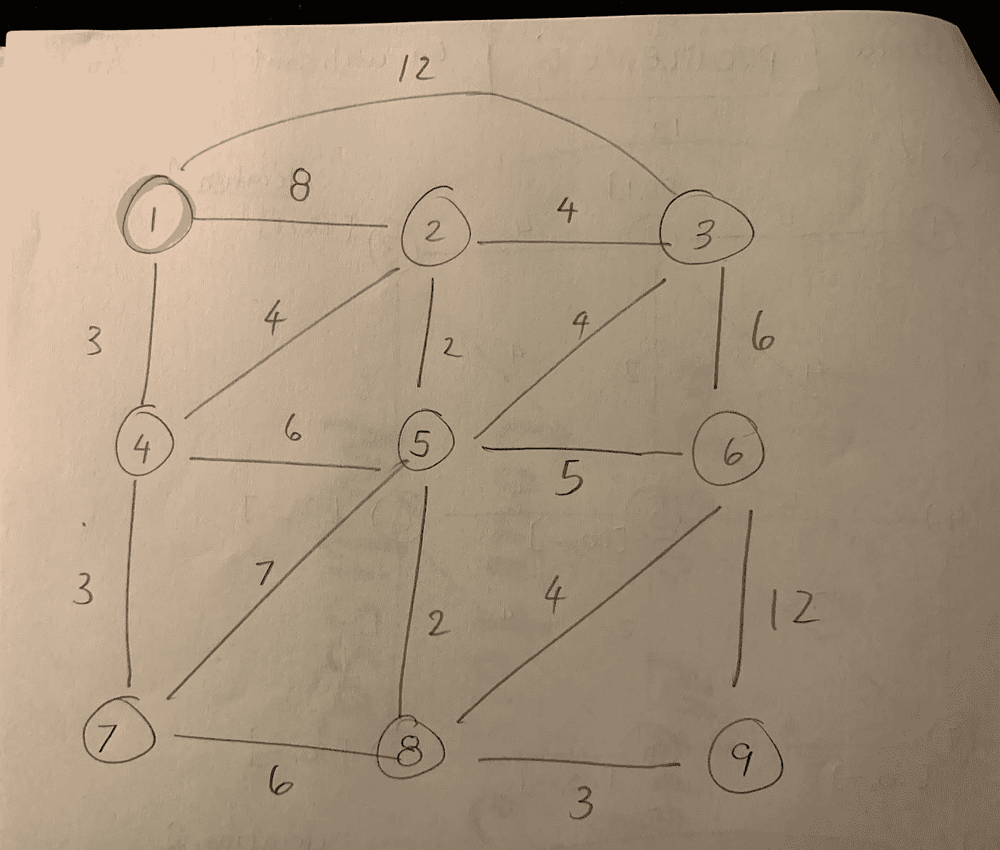
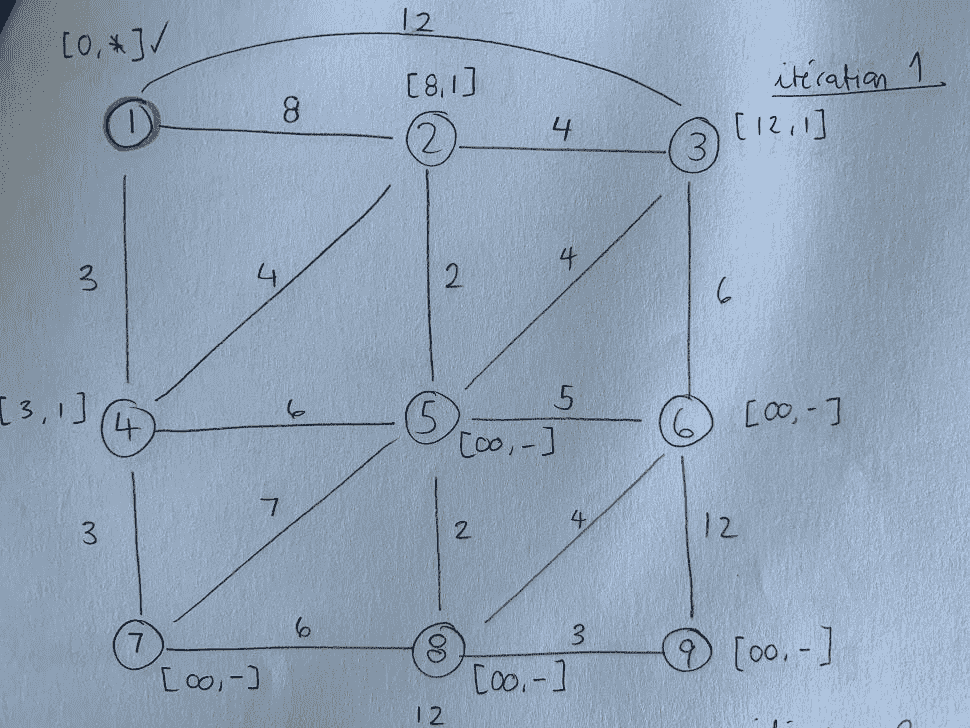
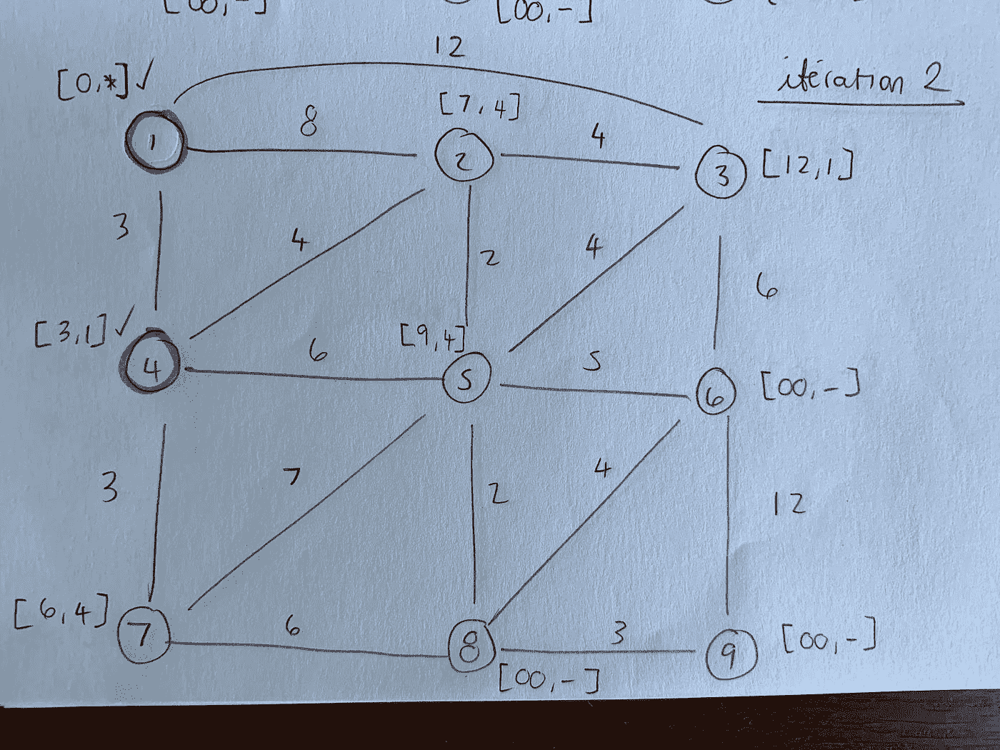
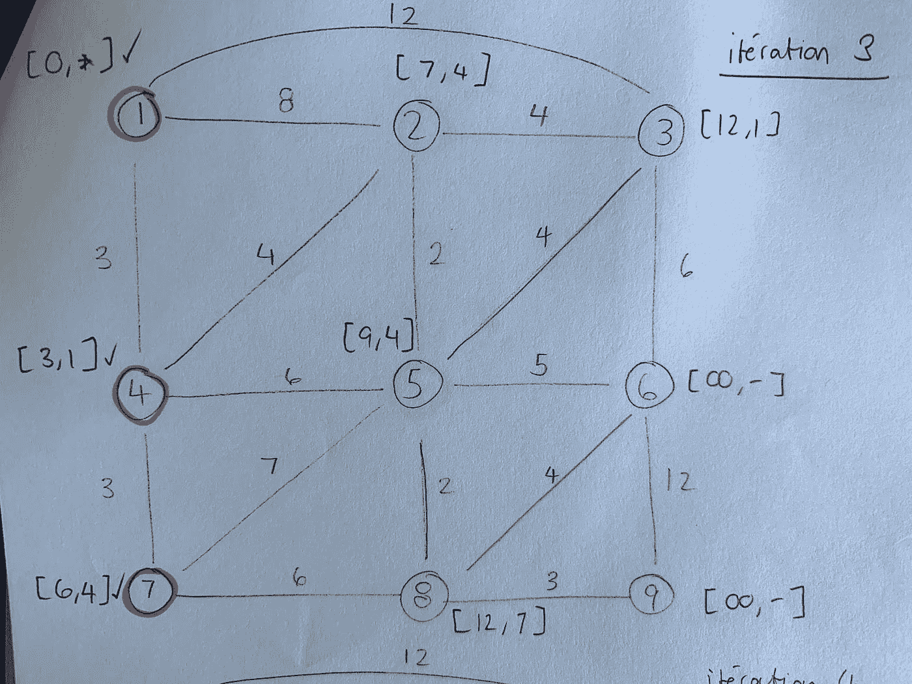
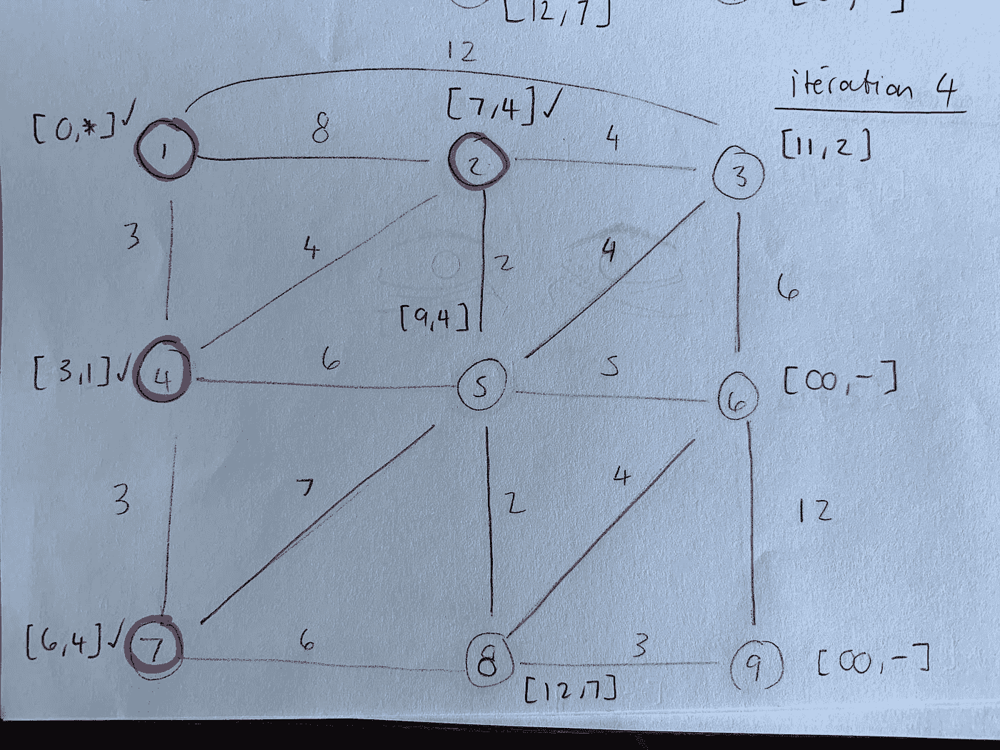
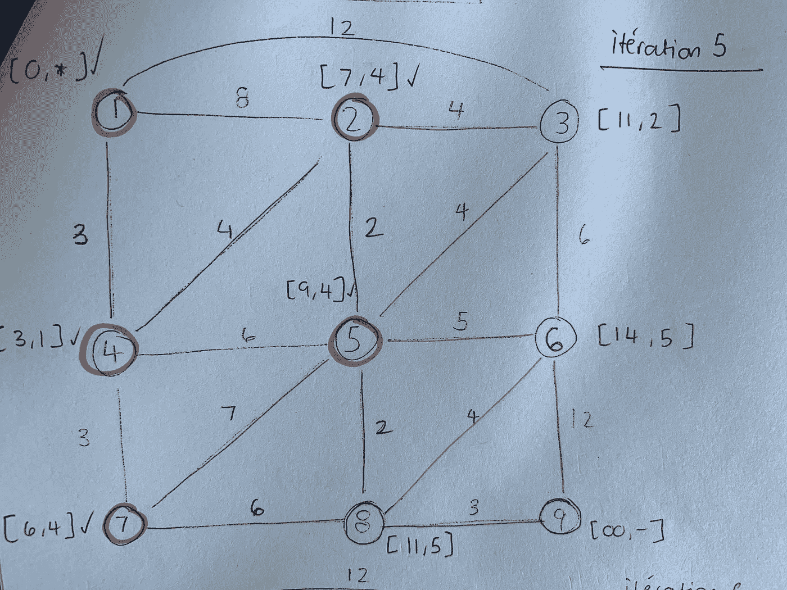
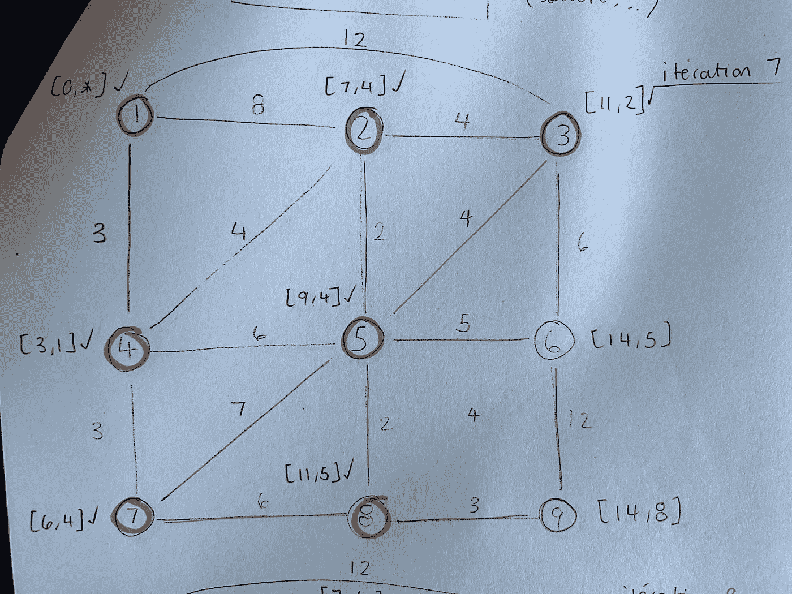
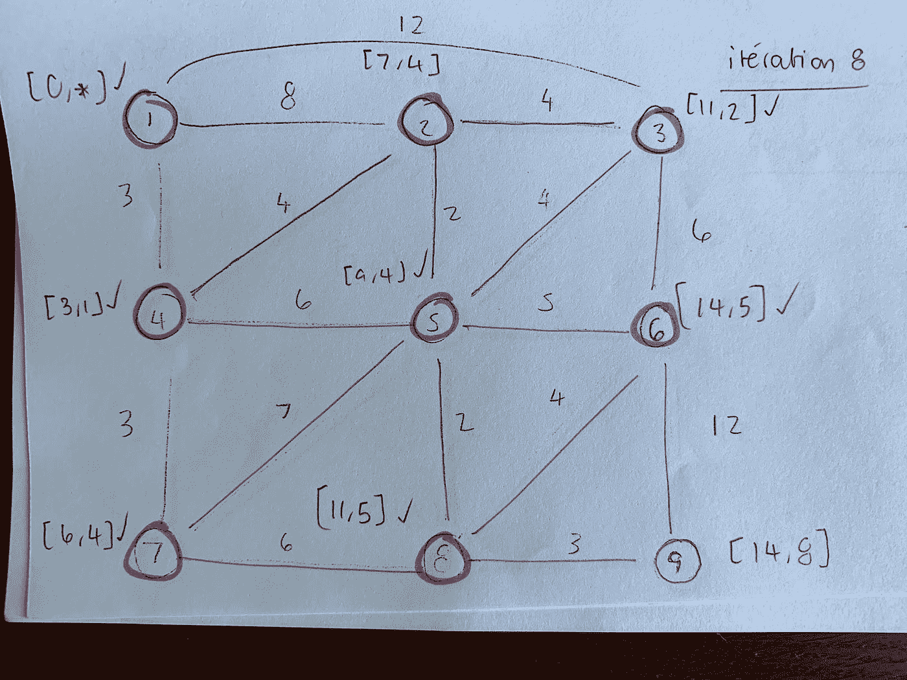
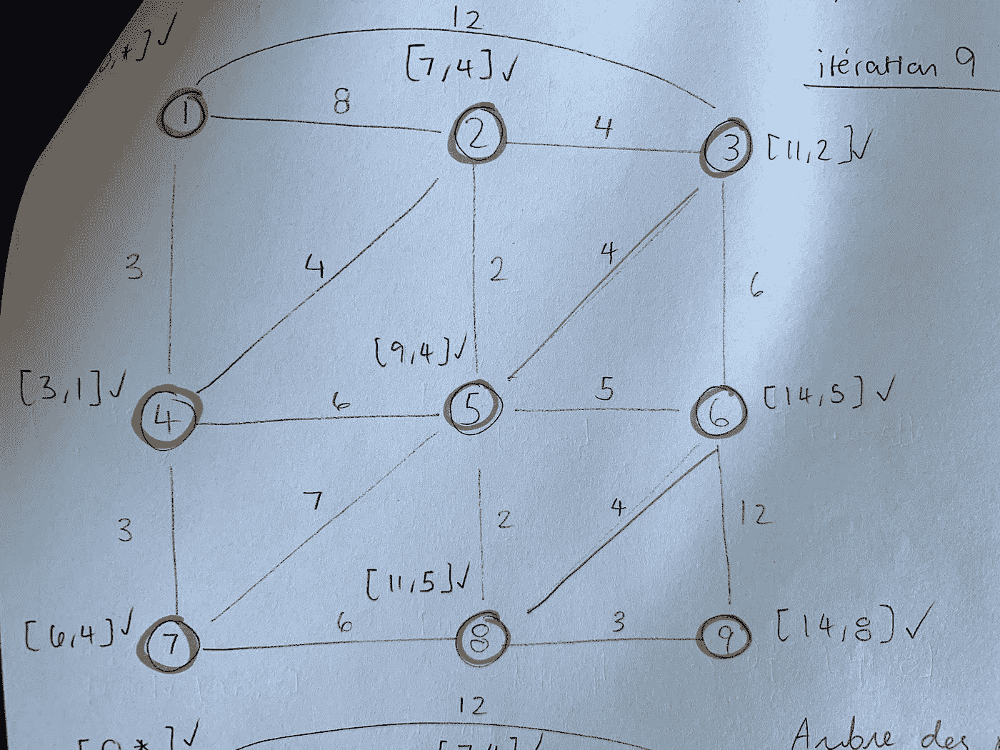
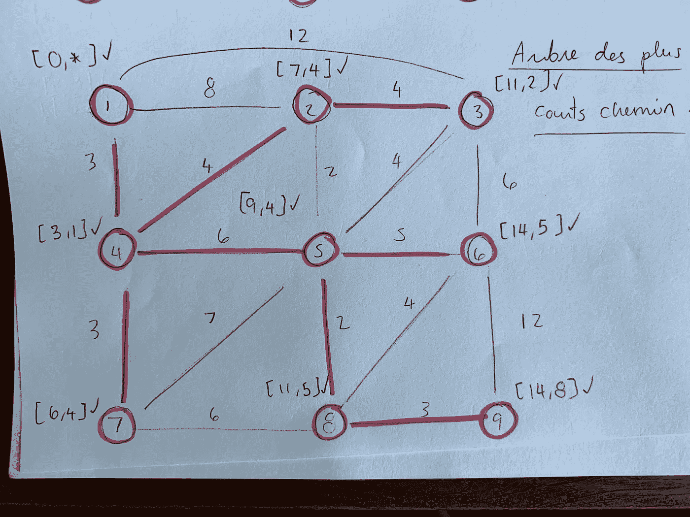

# 谷歌地图如何找到最短路径？

> 原文：<https://blog.devgenius.io/how-does-google-maps-find-the-shortest-path-44be4b1c74c6?source=collection_archive---------1----------------------->

图片由 [Pixabay](https://pixabay.com/fr/) 上的 [DariuszSankowski](https://pixabay.com/fr/users/dariuszsankowski-1441456/) 拍摄

你有没有想过你的 GPS 实际上是如何工作的？什么事？没有吗？嗯，没关系！我将用通俗的方式来解释它是如何工作的。

声明:我不知道谷歌使用哪种算法。可能是 Dijkstra，可能是 A*，可能是很多东西。我认为，由于这个问题越来越复杂，它不可能是其中之一。很难，我相信算法的基础是相似的。

谷歌地图可能正在使用一种叫做 Dijkstra 最短路径的算法。它是由一位名叫 Edsger W. Dijkstra 的计算机科学家在 1956 年设计的。这就是它的工作原理。

注意:为了便于教育，我们准备做一个数据量少的例子。

假设我们收集了由不同长度的道路连接的 9 个不同城市的数据。我们称城市为“节点”,称道路为“边缘”。假设我们在节点 1。

这是我们的起点:

以上称为“图形”。

我们首先给每个以[x，y]形式表示的节点分配 2 样东西。x 表示到 1 的最短距离，y 表示前一个节点。

我们总是将[0，*]赋给起始节点。显然，从 1 到 1 不需要任何代价，也没有前一个节点，所以我们放了一个*。

我们检查了所有的邻居。从 1，我们可以去 2，如果我们支付 8 个单位，我们可以去 3 使用 12 个单位，我们可以去 4 使用 3 个单位。

对于我们够不到的节点，我们简单的赋值【无穷大，-】。

我们转到要求我们支付最少数量单位的节点，并锁定该表。在这种情况下，它是节点 4！

注意:红圈表示我们已经完成了这个节点。

对于下一个迭代，我们执行与第一次迭代相同的步骤。我们检查每个被访问节点的邻居。如果路径更短，我们就给表分配新的变量。

例如，要转到 2，实际上可以使用以下路径:1–4–2。它的成本为 7 个单位，低于第一条路径的 8 个单位。因此，我们更改了节点 2 的前一个表。我们对每个红色节点都这样做。我们选择最短路径并锁定表格。在这种情况下，它将是节点 7！

对所有剩余的节点重复该过程。

这里是完成的结果！算法产生一棵“树”。它基本上从第一张图中去掉了你不用的道路。

如果我当前在节点 1，并且我希望导航到节点 9，我所要做的就是从节点 9 一直向后到节点 1。所以，我在节点 9。我知道要到达那里需要花费我 14 个单位，最短的路径是通过节点 8。现在，我在节点 8。我知道去节点 8 的最短路径是通过节点 5，等等。这将给我们留下以下路径:1–4–5–8–9。GPS 会在屏幕上显示信息。

这就对了。如有任何问题，欢迎留言评论！

 [## 为什么软件工程被完全高估了

### 我展示了作为一名程序员的一些不好的方面

medium.com](https://medium.com/dev-genius/why-software-engineering-is-absolutely-overrated-3782a7a12ba3)