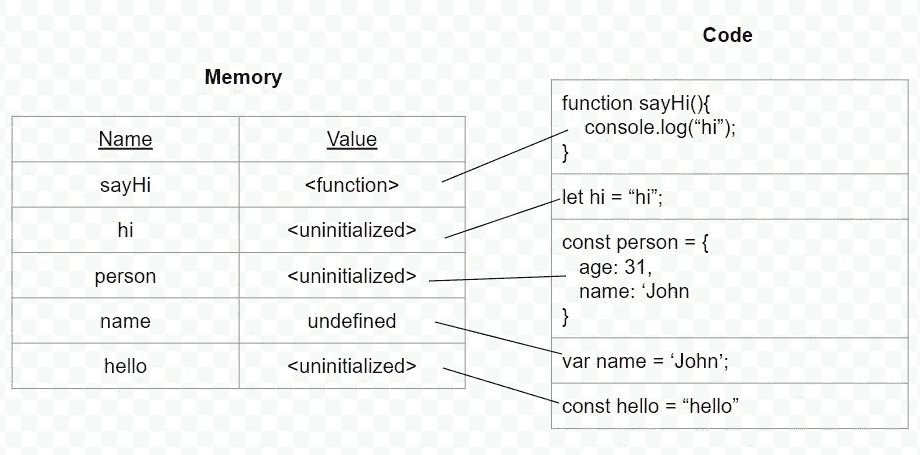

# JavaScript 中的提升是如何工作的

> 原文：<https://blog.devgenius.io/how-does-hoisting-in-javascript-works-80614300cb98?source=collection_archive---------14----------------------->

在这篇文章中，我将解释 JavaScript 中的提升是如何工作的，以及函数和变量是如何被它影响的。

提升是一种 JavaScript 机制，在解析器执行代码之前，变量和函数声明被移动到它们作用域的顶部，解析器在 JavaScript 解释器开始实际执行之前将源代码读入中间表示。因此，变量或函数在哪里声明并不重要，不管它们的作用域是全局的还是局部的，它们都将被移动到作用域的顶部。

这意味着

```
console.log (hi);     
var hi = "say hi";
```

实际上是这样解释的

```
var hi = undefined;
console.log (hi);
hi = "say hi";
```

因此，正如我们刚才看到的，`var`变量被提升到其作用域的顶部，并用值`undefined`进行初始化，这意味着我们可以在代码中实际声明它们之前实际赋值，如下所示:

```
hi = “say hi”
console.log (hi); // say hi
var hi;
```

那么，函数呢？

如果我们在讨论函数声明，我们可以在实际声明之前调用它们，就像这样:

```
sayHi(); // Hi

function sayHi() {
  console.log('Hi');
};
```

另一方面，函数表达式没有被提升，所以我们会得到下面的错误:

```
sayHi(); //Output: "TypeError: sayHi is not a function

var sayHi = function() {
  console.log('Hi');
};
```

ES6 向 JavaScript 开发者介绍了`let`和`const`关键字。虽然`let`和`const`是块作用域的，而不是像`var`那样是函数作用域的，但是在讨论它们的提升行为时应该没有什么不同。我们从最后开始，JavaScript 吊起`let`和`const`(:

我们先来探究一下`let`关键词行为。

```
console.log(hi); // Output: Cannot access 'hi' before initialization 
let hi = 'Hi';
```

正如我们在上面看到的，`let`不允许我们使用未声明的变量，因此解释器显式输出一个`Reference`错误，表明在初始化之前不能访问 hi 变量。

如果我们将上述`let`改为`const`，也会出现同样的错误

```
console.log(hi); // Output: Cannot access 'hi' before initialization
const hi = 'Hi';
```

总而言之，JavaScript 解析器搜索变量声明和函数，在代码执行之前将它们提升到作用域的顶部，并在内存中为它们赋值，这样万一解释器在执行代码时遇到它们，它将识别它们，并能够使用它们的赋值来执行代码。
用`let`或`const`声明的变量在执行开始时保持未初始化，而用`var`声明的变量用**未定义的**值初始化。

通过下图，我们可以更好地理解它:



我希望你喜欢这篇文章，它在提升如何在幕后工作和行动方面有一些意义。如果你喜欢它，欢迎你在下面为它鼓掌。

您也可以关注我以获得更多类似的文章(: