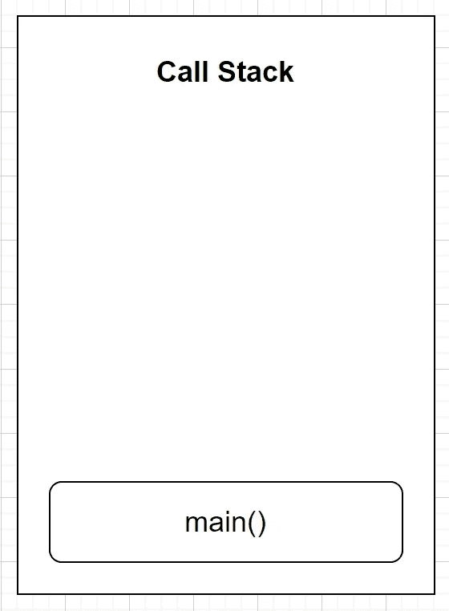
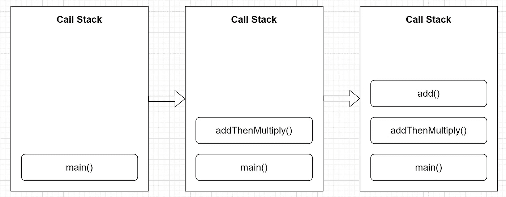
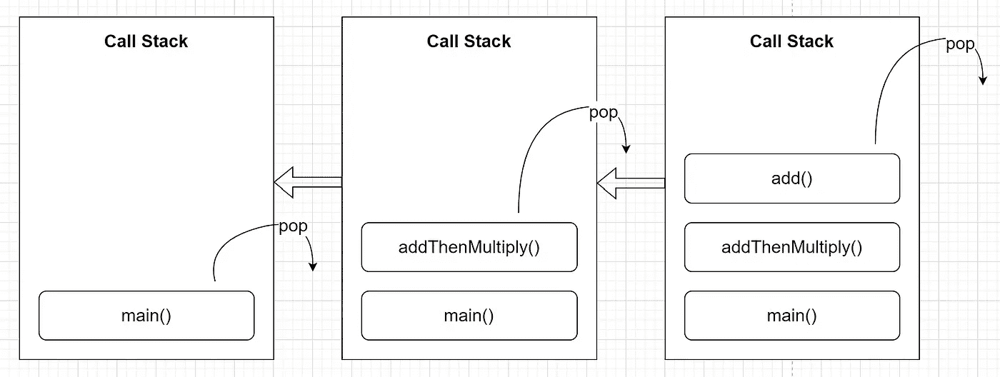

# JavaScript 是如何工作的？

> 原文：<https://blog.devgenius.io/how-does-javascript-work-feb906ca536c?source=collection_archive---------8----------------------->

解释 JavaScript 的内部工作原理

首先，让我们先了解一下什么是 JavaScript / ECMAScript 引擎。


克劳迪奥·施瓦兹在 [Unsplash](https://unsplash.com?utm_source=medium&utm_medium=referral) 上的照片

# JavaScript/ ECMAScript 引擎

当您用 JavaScript 编写一段代码时，代码会被 JavaScript 引擎提取。

如果代码是用 Node.js 编写的，那么这个引擎会在你的网络浏览器或电脑中运行。

该引擎旨在理解您的代码，然后执行它。

有多个 JavaScript 引擎，它们基于 **ECMAScript 标准**。

一些受欢迎的是:

*   V8 引擎:用于谷歌 Chrome、Node.js 和 Deno
*   查克拉:用于微软边缘和互联网浏览器
*   蜘蛛猴:用于 Mozilla Firefox
*   JavaScript 核心:在 Safari 中使用


丹尼·米勒在 [Unsplash](https://unsplash.com?utm_source=medium&utm_medium=referral) 上拍摄的照片

# JavaScript 引擎如何理解代码？

让我们先了解两个术语:

## 解释程序

*   当程序运行时，它们将代码逐行翻译成机器可读的形式。
*   像 Python 和 Ruby 这样的语言使用这些

## 编译程序

*   在程序运行之前，它们立刻把代码翻译成机器可读的形式。
*   像 Java 和 C++这样的语言使用这些

解释器启动很快，但总体上很慢，因为它们不支持代码优化(编译器也是如此)。

为了从这两个过程中获得最佳效果，为现代 JavaScript 引擎制定了一个称为实时(JIT)编译的过程。

## 实时(JIT)编译

JIT 编译是在程序执行期间而不是执行之前编译代码的过程。


努贝尔森·费尔南德斯在 [Unsplash](https://unsplash.com?utm_source=medium&utm_medium=referral) 上的照片

# JIT 编译背后的思想

JavaScript 引擎中添加了一个名为**分析器**的新部件。

它就像一个监视器，在你的代码中寻找可以优化的地方。

简而言之，它就是这样工作的。

1.  代码首先被完全解释。
2.  然后，分析器识别出可以更快执行的区域(比如循环)。
3.  这些代码区域被输入到不同的编译器中。
4.  然后，这些编译器将这些代码块转换成优化的、更快的机器可读版本。
5.  这些经过编译(优化)的代码块被添加回基础代码。

# JavaScript 代码是如何执行的？

JavaScript 使用调用堆栈来执行代码。

## 什么是堆栈？

堆栈是一种遵循 **FILO(先进先出)**原则的数据结构，即添加到堆栈中的数据首先在最后一个地方弹出。

## 调用堆栈

为了理解 JavaScript 调用堆栈，让我们创建两个函数。

*   函数将两个数字相加

```
function add(num1, num2){
    return num1 + num2
}; // Returns the sum of num1 & num2
```

*   函数将两个数字相加，并将总和与另一个数字相乘(该函数使用前面的函数)

```
function addThenMultiply(num1, num2, num3){
    const sum = add(num1, num2);
    return sum * num3
}; // Returns the sum of num1 & num2, and multiplies it by num3
```

然后，我们将按如下方式运行这个组合代码。

```
function add(num1, num2){
    return num1 + num2
};function addThenMultiply(num1, num2, num3){
    const sum = add(num1, num2);
    return sum * num3
};console.log(addThenMultiply(1, 2, 3));
```

## 全局执行上下文

当 JavaScript 引擎开始执行代码时，它会创建一个默认的**全局执行上下文**(称为 main())

这是不在函数内部的所有 JavaScript 代码被执行的地方。

执行之前，所有定义的变量和函数都存储在内存堆中。这叫做**吊装**。

然后，这个全局执行上下文被推到一个空的调用堆栈上。



在调用堆栈上推送全局执行上下文

然后，JavaScript 引擎会遇到这段代码:

```
console.log(addThenMultiply(1, 2, 3));
```

这为“addThenMultiply”函数创建了一个函数执行上下文。

这被推到调用堆栈上。

## 函数执行上下文

对于 JavaScript 引擎遇到的每个函数，它都会为其创建一个函数执行上下文，并将其推送到调用堆栈上。

因为“addThenMultiply”函数依赖于“add”函数，所以为“add”函数创建了一个函数执行上下文，并将其推送到调用堆栈上。



为所有函数创建函数执行上下文

一旦定义了所有的函数执行上下文，JavaScript 引擎就开始执行“add”函数(调用堆栈上最顶层的函数执行上下文)并返回结果。

这然后从调用堆栈中弹出。

重复这个过程，直到调用堆栈为空。



调用堆栈中的执行

## 为什么 JavaScript 是单线程的？

JavaScript 引擎运行一个调用堆栈。

因此，它可以一次执行一行代码。

这使得 JavaScript 成为单线程的。


照片由 [Mohammad Rahmani](https://unsplash.com/@afgprogrammer?utm_source=medium&utm_medium=referral) 在 [Unsplash](https://unsplash.com?utm_source=medium&utm_medium=referral) 上拍摄

*感谢您阅读本文！*

*如果你是一个对 Python 或整体编程不熟悉的人，那就来看看我的新书吧，书名是《不要多头学习 Python 指南》***如下:****

**[](https://bamaniaashish.gumroad.com/l/python-book) [## 学习 Python 的指南

### 你是一个正在考虑学习编程却不知道从哪里开始的人吗？我有适合你的解决方案…

bamaniaashish.gumroad.com](https://bamaniaashish.gumroad.com/l/python-book) [](https://bamania-ashish.medium.com/membership) [## 通过我的推荐链接加入 Medium——Ashish Bama nia 博士

### 阅读 Ashish Bamania 博士(以及 Medium 上成千上万的其他作家)的每一个故事。您的会员费直接…

bamania-ashish.medium.com](https://bamania-ashish.medium.com/membership)**