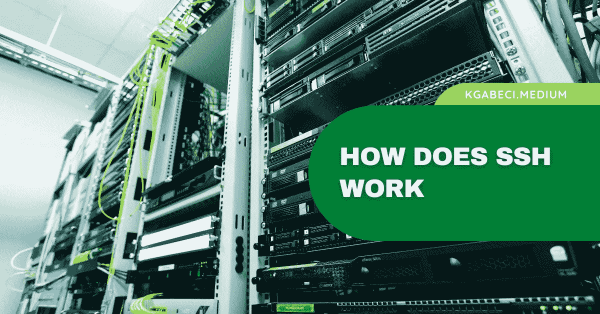

# SSH 是如何工作的

> 原文：<https://blog.devgenius.io/how-does-ssh-work-2b78c503f2ff?source=collection_archive---------18----------------------->

## 什么是 SSH(安全外壳)？

## 了解什么是 SSH 以及它是如何工作的

SSH 代表 Secure Shell，是一种通过互联网等不安全网络连接计算机的网络协议。

你只需要一台运行 Linux 或 macOS 的电脑，并配有支持 SSH 的操作系统(大多数现代电脑都应该支持 SSH)。另一台机器充当 SSH 服务器。

## 什么是宋承宪？

SSH 代表安全外壳。这是一种将两台电脑连接在一起的安全方式。您可以安全地将一台计算机连接到另一台计算机，而不会暴露任何有关连接的信息。

> 这意味着不可能窃听两台计算机之间的连接。

SSH 是由 OpenBSD 项目在 1994 年开发的。1997 年，SSH 的第一个版本发布，此后一直在发展。今天有许多不同版本的 SSH，包括 SSH-1、SSH-2、OpenSSH 等等。

目前最流行的版本是 SSH-2，它使用公钥认证。公钥认证允许用户登录到远程计算机，而无需输入用户名和密码。

## SSH 连接的类型

有两种类型的连接:

**1。客户端到服务器** —这是客户端计算机向 SSH 服务器计算机发送数据的地方。例如，使用 web 浏览器登录远程计算机。

2.服务器到服务器—这是指一台 SSH 服务器计算机从另一台 SSH 服务器计算机接收数据。大多数企业在防火墙后运行他们的服务器，并使用 SSH 来远程访问它们。

# 为什么要用 SSH？

您可能以前听说过 SSH，但从未真正理解它的功能。以下是您可能希望使用 SSH 的几个原因:

防止对敏感文件的未授权访问。

控制谁可以访问您的电脑。

确保您的所有服务正常运行。

允许多人同时处理一个文件。

快速高效地传输大量数据。

*   为 VPN 连接创建安全隧道。

# 结束语

我希望这篇文章能帮助您更好地理解 SSH，它是什么以及为什么使用它。如果你对这篇文章有任何问题或建议，请不要犹豫，在评论区回复。

喜欢你读的东西吗？为什么不关注我的媒体简讯，这样你就不会错过我未来的任何文章了？很简单，点击这里输入你的电子邮件地址，然后点击订阅。

你喜欢阅读媒体上的文章吗？考虑成为会员，有很多功能，你将获得所有创作者的内容，每月只需 5 美元。使用这个链接，你也帮我赚一小笔佣金，点击成为会员，并输入您的信息。