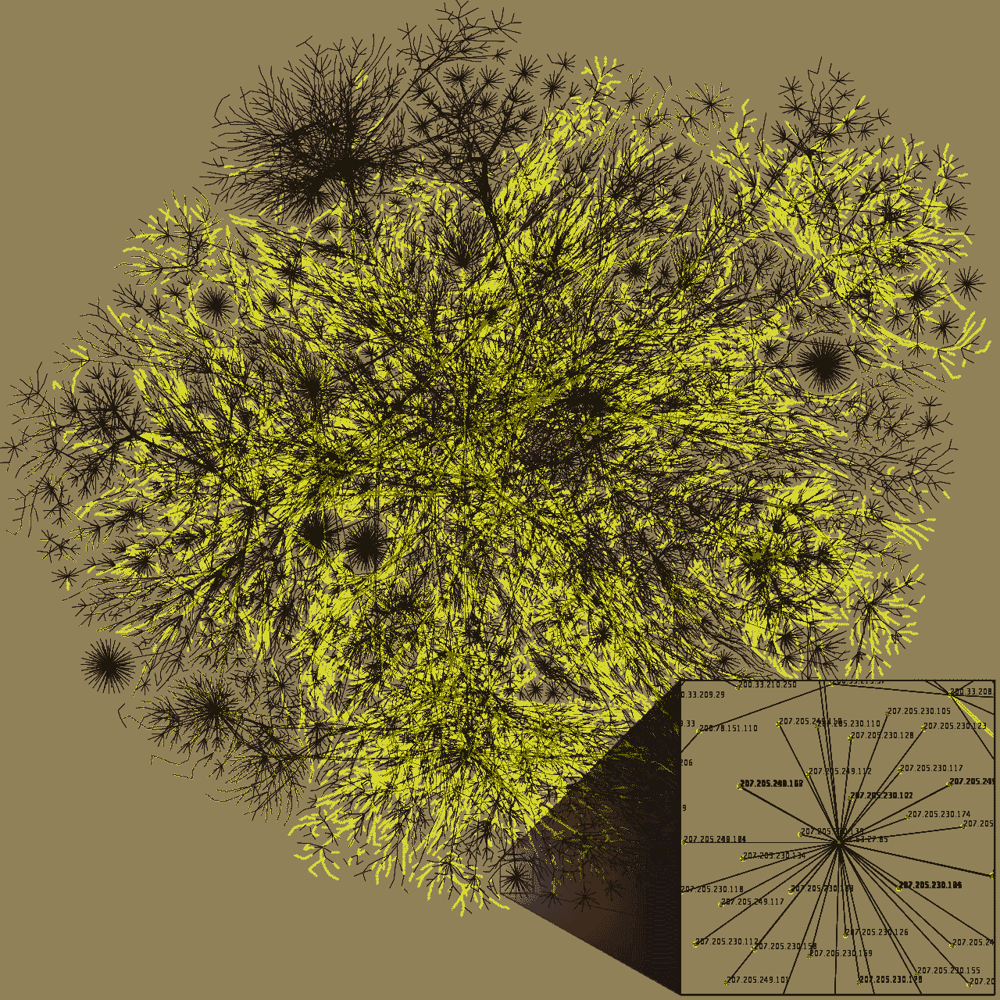
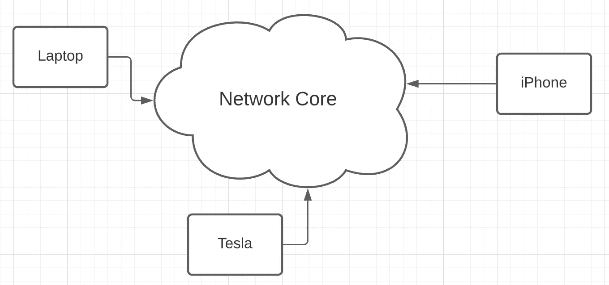
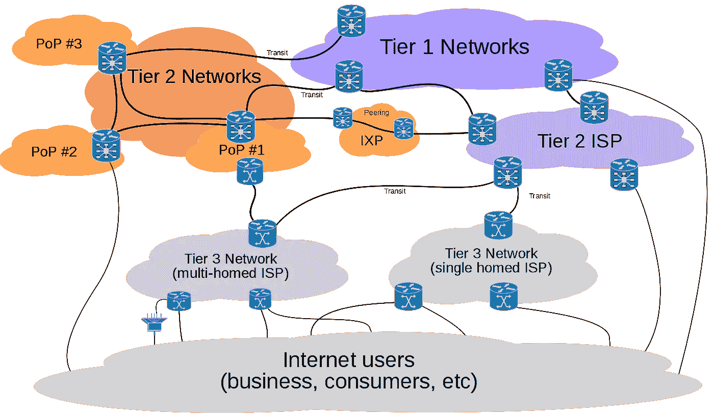
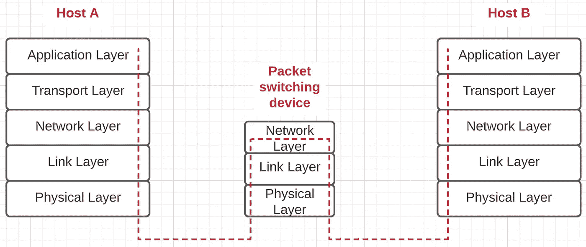

# 互联网是如何工作的？

> 原文：<https://blog.devgenius.io/how-does-the-internet-work-256891cdbb77?source=collection_archive---------12----------------------->

## 计算机网络的构建模块

纳斯蒂亚·杜尔希尔在 [Unsplash](https://unsplash.com?utm_source=medium&utm_medium=referral) 上的照片

计算机网络是 21 世纪生活的面包和黄油。电话、短信、蓝牙、网上购物等。都是由计算机网络驱动的用例。计算机网络最流行的例子之一是互联网。它为实体间的全球联系提供了动力，这在过去几个世纪是不可想象的。这个网络的规模从一开始就膨胀到了几个数量级。

在 opte.org[发现的 2005 年数据的部分互联网地图。图片来源:](https://www.opte.org/)[维基媒体](https://commons.wikimedia.org/wiki/File:Internet_map_1024_-_transparent,_inverted.png)

左边是从 2005 年开始的互联网的部分快照，从那时起互联网有了巨大的发展(社交网络、视频流等等)。由于几个原因，互联网是一个有趣的网络，

A)交流的规模可以是巨大的:我们可以与世界另一端的人互动 b)大量活跃用户:管道的建设成本很高，所以每个人都可以同时分享

c)互联网的核心是在近 40 年前建立的:这个强大的核心使我们能够将其扩展到几个数量级

d)流经该网络的数据量巨大且不断增加，[参见此处](https://techjury.net/blog/how-much-data-is-created-every-day/)

让我们深入了解这个强大的网络是如何组织的。

## 互联网

互联网是网络的网络:互联网作为网络是由网络组成的，每个网络可能是其他网络的组成(递归)。互联网可以分为:

网络边缘(笔记本电脑、iPhone、汽车等。)和网络核心

a) **网络边缘**:设备(笔记本电脑、手机、汽车等。)插入网络核心。

b) [**网络核心**](https://en.wikipedia.org/wiki/Backbone_network) :由设备(路由器、分组交换机等)组成。)有助于这些设备之间的数据传输、物理链路(电缆)。这些服务由互联网服务提供商(**ISP**)提供，如 AT & T、威瑞森等。

**主持人**

网络边缘的设备被称为**终端系统**或**主机**，因为它们托管通过计算机网络通信的应用程序。例如，当与一个电子商务网站交互时，一个应用程序被托管在你的网络浏览器中，而另一个应用程序被托管在包含该网站的公司服务器上。[抽象对于主机之间的通信至关重要。网络核心负责在两台主机之间传输数据时涉及的大量底层细节。](harlotte.craigslist.org/d/sublets-temporary/search/sub)

## 信息

工作中的分组交换设备

两台主机之间的通信包括在两个系统之间传输信息。信息通常被分成更小的块，每个信息块(位的集合)被称为一个**包**。粗略地说，网络核心包含称为 [**分组交换机**](https://en.wikipedia.org/wiki/Packet_switching) (例如[路由器](https://en.wikipedia.org/wiki/Router_(computing))、[链路层交换机](https://en.wikipedia.org/wiki/Network_switch))的设备，负责根据分组中包含的信息转发分组。

分组交换技术允许多个通信主机同时共享一条路径或部分路径。

## 协议

在两台主机之间传输信息的生命周期中，会涉及各种设备，这些设备可能包含不同种类的软件和硬件。为了解决这些差异，定义了**协议**。协议是一组定义明确的规则，支持互联网上不同实体之间的通信，是计算机网络的组成部分。例如，Sam 和 Sarah 之间的问候协议可以是这样的，

山姆:你好，莎拉

莎拉:你好，山姆

山姆:很高兴见到你

莎拉:我也很高兴见到你

该协议定义了 Sam 和 Sarah 之间相互问候的规则。礼仪可以有不同的风格，就像(在不同的文化中)问候人们可以有其他的规则一样。类似于此[握手](https://en.wikipedia.org/wiki/Handshaking)协议是为启用电话、笔记本电脑、物联网设备等的设备定义的。，运行不同的软件(Windows，Mac，Android 等。)互相交谈。

## 网络核心

终端系统使用其 ISP 接入网络核心，ISP 以分层方式组织。

网络核心组织，来源:[维基媒体](https://commons.wikimedia.org/wiki/File:Internet_Connectivity_Distribution_%26_Core.svg)

层级的最底层是第 3 级 ISP。例如，你家里的网络供应商。位于层级顶端的是数量相对较少的一级 ISP。这些网络覆盖全球，包含必须能够以极高速度转发数据包的网络路由器。一级 ISP 被称为**互联网骨干网**。第 1 层网络连接到大量第 2 层网络。第二层网络被称为第一层网络的客户，类似地，第三层网络也是该层级中第二层网络的客户。在一个 ISP 的网络中，该 ISP 与其他 ISP 的连接点称为接入点( [POPs](https://en.wikipedia.org/wiki/Point_of_presence) )。

## 网络堆栈

两台主机之间的通信需要多种协议。这些可以在软件(HTTP、SMTP)、硬件(以太网)或两者的组合中实现([数据链路层](https://en.wikipedia.org/wiki/Data_link_layer))。

网络堆栈

应用程序(网站、游戏等。)在终端系统中，在称为[应用层](https://en.wikipedia.org/wiki/Application_layer)的软件层的最高抽象层上运行。应用程序通过将通信抽象到负责在应用程序(/进程)之间端到端传输数据的[传输层](https://en.wikipedia.org/wiki/Transport_layer)来通过网络相互通信。传输层将一些工作抽象到称为[网络层](https://en.wikipedia.org/wiki/Network_layer)的较低层，网络层负责在两台主机(/设备)之间传输信息(传输层和网络层之间的区别很重要，因为一台主机可以同时运行几个应用程序)。网络层将其部分工作抽象给[链路层](https://en.wikipedia.org/wiki/Link_layer)，链路层负责在两个分组交换设备之间的链路上传输信息。链路层抽象出将比特实际移动到物理层的责任。以这种方式组织的协议被称为[网络栈](https://en.wikipedia.org/wiki/Protocol_stack)。

网络堆栈每一层的抽象都可以被认为是提供给上层的服务。例如，一个应用程序可以与另一个应用程序通信，而不必担心通过网络发送信息的细节。因此，传输层可以被认为是用一个 [SLA](https://en.wikipedia.org/wiki/Service-level_agreement) 为应用程序提供服务。网络堆栈的分层架构支持[松耦合](https://en.wikipedia.org/wiki/Coupling_(computer_programming)#Disadvantages_of_tight_coupling)。

*总之，互联网由一组不同的终端系统(/主机)组成，这些终端系统使用一组称为协议的预定义规则相互交换信息，其中信息使用网络核心(ISP)提供的服务进行传输。计算机网络的协议被组织为协议栈，其中每一层都依赖于其下一层所提供的服务。*

来源:[计算机网络:自上而下的方法](https://www.pearson.com/us/higher-education/program/Kurose-Computer-Networking-A-Top-Down-Approach-7th-Edition/PGM1101673.html)