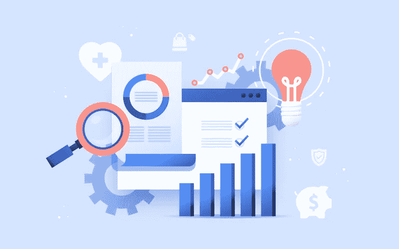

# 技术行业如何使用商业智能— NIX United

> 原文：<https://blog.devgenius.io/how-does-the-technology-industry-use-business-intelligence-nix-united-e7d4c97b7770?source=collection_archive---------10----------------------->

对于现代企业来说，在日常工作流程操作中凭直觉行事意味着在竞争中无望地落后于对手。大多数企业主认识到这个简单的事实，并试图收集与客户相关的数据，涉及他们的人口统计数据和对公司提供的产品的偏好。较小的公司在有限的范围内进行这项工作，而较大的组织在[商业智能(BI)软件](https://nix-united.com/services/business-intelligence-services-bi/)上投入大量资金，依靠最先进的技术来分析历史过程、衡量公司的当前状况，并预测将在未来几个月塑造行业面貌的市场趋势。

随着当代文明快速推进工业 4.0 的发展，BI 在商业世界中风靡一时，引入了[新方法](https://nix-united.com/blog/top-business-intelligence-trends-for-2021/)，并扩大了其包含的活动范围。

# 放大 BI 操作

商业智能意味着采用大量的信息处理过程，这些过程可以作为制定数据驱动的商业决策的基准。这种程序的范围相当大:

*   [数据挖掘](https://nix-united.com/blog/top-14-most-important-data-mining-techniques-to-use/)。这不是关于寻找不同的信息(也称为数据中的知识发现)，而是发现已经检测到的数据集中的模式和异常。为了简化和促进相关信息的识别和收集，AI 和 [ML 技术](https://nix-united.com/blog/find-out-how-to-use-machine-learning-for-time-series-forecasting/)被广泛应用。
*   数据跟踪。在 21 世纪不断变化的世界中，数据很快就会过时。BI 工具提供了对相关当前报告的即时访问，因此企业所有者在采取措施时不会太迟。
*   数据组织。原始信息很难处理，因此应该根据一些度量和维度进行排列，以便进行后续分析。
*   数据可见性和同步。只看到全貌的一部分(这是一个组织内不同部门通常遭受的)会扭曲你决策的客观性。商业智能工具保证了 360°视角，这对于获得真相的单一版本至关重要。
*   数据表示。各种可视化技术，如表格、图表和图形，可以使普通人更容易理解这些固定的数字。
*   正在查询。通过获取某一领域的完整信息，员工可以获得其能力范围内特定问题的答案。
*   数据比较和分析。BI 工具提供了一长串基准测试选项，以便您可以比较与不同行业相关的各种数据集，或者历史与当前的数据集，从而找出差异或类似趋势。这种分析可以利用描述或统计技术，这取决于你的最终目标和所涉及数据的特性。
*   报道。一旦分析完成，其结果将发送给所有制定相应商业战略的决策者。

鉴于这种由信息技术推动的机制所带来的毋庸置疑的好处，各个领域的组织——从高等教育和体育到[医疗保健](https://nix-united.com/blog/healthcare-business-intelligence/)和数字[营销](https://nix-united.com/blog/how-to-leverage-business-intelligence-for-marketing/)——应用 BI 的规模不断扩大。

# 制造业中的商业智能

作为一个本质上由数据驱动的领域，制造业很容易将 BI 实践引入其工作流程。如果实施得当，制造业中的商业智能可以提供:

*   全面的供应链透明。供应链分析有助于避免数据孤岛，并能够跟踪产品生产和物流的所有阶段，在出现问题时，了解哪个环节表现不佳。
*   制造周期监控。BI 工具有助于尽可能缩短制造周期，为提高公司的盈利能力铺平道路。
*   生产力提高。管理人员可以利用 BI 来控制每个员工或整个部门的停机时间，并通过消除可能存在的生产瓶颈将停机时间降至最低。
*   提高运营效率。当经理们对所有的绩效指标都了如指掌时，他们就会知道问题出在哪里，并采取必要的纠正措施。
*   库存管理。存储占用仓库空间的原材料和成品是组织预算的巨大负担。加速它们到达加工厂和最终用户的过程是 BI 擅长的。此外，由于商业智能作为现代 ERP 系统的一部分，当原材料及时获得时，可以避免或从根本上减少生产能力的停机时间。
*   设备控制。专业的 BI 指标可以帮助您监控机器的使用情况，并通过减少停机时间和提供适当的维护，对机器进行微调，以达到其最大效率。
*   质量保证。管理人员可以监控不符合质量标准的产品比例，以评估员工的能力，如果该比例很高，则提醒负责人员培训的利益相关者。
*   合规监控。企业在严格的安全和绩效法规下运作，通过应用 BI 工具，首席执行官可以确保这些法规得到遵守。

商业智能在制造业中带来的所有这些额外好处最终会提高实施商业智能的企业的盈利能力。

# 保险业中的商业智能

考虑到保险公司为弥补客户损失而支付的巨额款项，BI 在这一领域的应用是必不可少的。企业在保险中实施商业智能得到了什么？

*   欺诈防范。专家估计美国每年的保险欺诈金额超过惊人的 800 亿美元。公司试图通过提高费率来支付这些现金支出，这是消费者不喜欢的结果。保险业的商业智能可以通过提供预测分析来检测欺诈企图，从而有助于避免因为这些措施而吓跑客户。该软件可识别出表明可能存在欺诈活动的模式，并提醒相关人员进行干预。
*   高效的索赔处理。这一过程包括仔细检查各种与客户相关的数据。通过应用 BI 工具来分析客户档案、他们以前的索赔和其他相关信息，可以显著简化和促进这一复杂的过程。
*   风险预测和管理。保险公司可以通过减少索赔来降低财务风险。BI 算法可以检测客户的行为模式或可能导致保险事件的天气变化，并通过及时建议他们参加体育运动、接受先发制人的治疗、将他们的汽车置于安全的环境中等来阻止他们。
*   数据库集中化。保险公司在其工作流程中利用多个内部档案和来自公开来源的信息，浪费了大量时间来整理所有数据并有效利用这些数据。BI 工具不仅可以将客户和环境数据存储在一个地方，还可以检测哪些数据是重复的，并定期更新。

# 银行业中的商业智能

作为精于计算的人，金融家深知数据的价值，这也解释了商业智能在银行业的广泛应用。据[估计](https://yourstory.com/mystory/business-intelligence-applications-technology-industry/amp)，银行业的商业智能带来了商业智能市场总收入的近 14%。商业智能在银行业中的应用在哪些工作流活动中最有用？

*   风险管理。金融领域的欺诈与保险业一样猖獗，尽管在这里它有了其他的伪装。犯罪者试图利用无法收回的贷款或从事各种类型的信用卡诈骗来赚钱。BI 机制允许银行跟踪潜在不法行为者的可疑行为(如非正常提款、异常交易或异常大额购买)，并采取迅速有效的措施防止他们造成财务损失。
*   客户细分。通过专门的 BI 工具将客户分为不同的阶层，金融机构可以更好地了解每个群体的需求，并定制适合大多数群体的产品和服务。此外，这种分析可以帮助发现理想的客户(带来更多价值的客户)，并在所有活动和营销策略中优先考虑他们。
*   客户保持。商业智能中使用的数据钻取和分析技术不仅可以显示流失率动态，还可以揭示客户离开的原因。此外，他们还能发现即将发生的客户流失的迹象，并提醒员工采取紧急预防措施。此外，银行可以制定忠诚度计划并开展有针对性的活动，以留住客户并防止普通客户流失。
*   提高运营效率。当银行管理层的目标是提高员工绩效，最大限度地发挥他们的专业技能，并削减管理费用支出时，银行业的商业智能也可以向内发展。BI 数据分析软件可以提供对关键工作流程指数的有意义的洞察，并作为所有进一步优化计划的出发点。

# 公共部门的商业智能

商业智能在政府中的应用与在制造业、银行业或保险业中的应用追求本质上相同的目标:更好的服务、优化工作流程和降低成本。然而，在这里，通过在公共部门引入商业智能，最终受益的应该是公民。利用 BI 技术可以改善政府机构运营的哪些方面？

*   机构内和机构间数据交换。没有地方、省和国家当局共享信息的能力，有效解决个人和社区的需求几乎是不可能的。公共部门中的商业智能可以通过将政府机构使用的不同数据合并到一个统一的数据库中来抓住这一机会。
*   电子政务。单一的数据库对居民来说也是有益的。现代信息技术的进步带来了公民自助，或人们通过互联网享受广泛公共服务的能力。BI 全面的基础设施可以让数百万市民享受到这一开放访问数据计划。
*   预算管理。为了把每一分钱都用在最需要的地方，当局必须对支出模式和预测未来承诺和支出的能力有深刻的见解。政府中的商业智能提供了专门的工具，将极大地促进预算控制和分配。
*   客户智能。只有政府对消费者的需求、人口统计和行为了如指掌，公共服务才能充分提供。只是在这里，消费者不是特定的社会、年龄或专业目标受众，而是整个社区。
*   智能城市。随着物联网的全面出现，智能城市的概念越来越受到重视，涵盖了广泛的使用案例-从市立学校和高等教育机构管理和交通优化到智能停车和[废物收集](https://www.wasterecyclingmag.ca/blog/as-cities-grow-the-internet-of-things-can-help-us-get-on-top-of-the-waste-crisis/)。当使用 BI 分析工具时，这种驱动力可以产生惊人的结果，使城市环境成为所有社区成员的舒适居住地。

# 零售业中的商业智能

这是一个必须不断扬帆的领域——或者更确切地说，销售——随着消费者海岸的风而调整。难怪几乎[该行业 60%的利益相关者](https://yourstory.com/mystory/business-intelligence-applications-technology-industry/amp)认为零售业的商业智能非常重要。在这方面，商务智能软件可以提供极大的帮助:

*   管理多个网点。随着零售帝国向更广泛的地区扩张，满足当地消费者的部分需求、处理物流和维护品牌声誉变得越来越具有挑战性。具有数据分析能力的 BI 工具是管理这种分支机构的最佳手段。
*   监测和预测消费趋势。零售业的商业智能主要侧重于评估当前的市场形势和消费者偏好，并预测其未来发展。商店经理必须了解最新的趋势，并相应地调整他们的销售策略。
*   克服供应链瓶颈。库存不足是困扰大多数零售企业主的最大噩梦之一，无论他们是经营实体店还是参与电子商务和数字营销。为了避免这种情况发生，他们应该保持供应链齿轮不停地转动，而 BI 预测软件可以成为 IT 驱动的润滑剂，永远保持润滑。
*   销售个性化。当在零售商店买东西时，第三个千年早期挑剔的消费者非常欣赏个人接触和在个人规模上被处理。如何实现这一点？只有对每一个(或至少是最有价值的)买家角色编制一份全面的档案，包含他们的人口统计、品味和消费者行为的最大信息。通过利用商业智能技术收集和处理大量客户数据，对于客户个性化工作和管理有针对性的活动非常有用。
*   人事管理。如果你的员工在业务流程或客户服务方面表现不佳，你所有的消费者情报都可能变得毫无用处。因此,“了解你的客户”这句格言应该加上另一句——了解你的员工。有了这个目标，就可以像收集和分析客户信息一样利用商业智能工具。

# 总结一下

随着所有业务领域中竞争的指数增长，问题“我们的组织应该使用商业智能吗？”已经失去了相关性。现在听起来更像是“技术行业将如何使用商业智能？”如今，雄心勃勃的公司意识到将 BI 技术引入日常工作流程的必要性。NIX United 作为商业智能软件市场的资深玩家，可以为任何行业构建商业智能解决方案，为您的组织的运营效率增值并增加您的收入。

*原载于 2022 年 3 月 18 日*[*【https://nix-united.com】*](https://nix-united.com/blog/employing-business-intelligence-industries-that-stand-to-benefit/)*。*