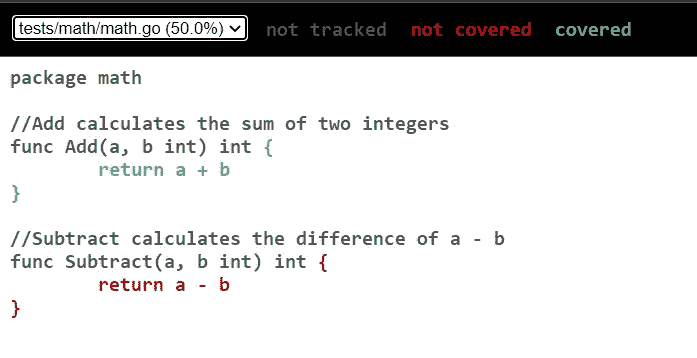
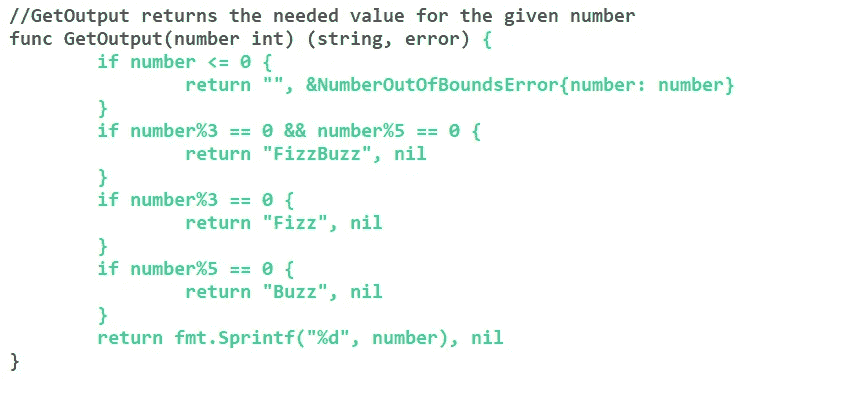

# 测试能有多简单？

> 原文：<https://blog.devgenius.io/how-easy-can-testing-be-3f9ad2ce7a7c?source=collection_archive---------8----------------------->

## 如果你真的认为在 Golang 中测试很复杂，看看这篇介绍吧！


照片由[丹尼尔·伊德里](https://unsplash.com/@ricaros?utm_source=medium&utm_medium=referral)在 [Unsplash](https://unsplash.com?utm_source=medium&utm_medium=referral) 上拍摄

# 介绍

如今，当开发软件时，仅仅交付一个满足需求并做了预期工作的产品是不够的。如今，以下特征也很重要:

*   可维护性
*   可量测性
*   易测性
*   成本效益

特别是成本效益这一点，因为特别是在软件开发中，假设了 1–10–100 规则，这意味着修正和错误修复的支出和成本呈指数增长。如果开发人员直接发现了一个错误，他可以直接用很少的支出来纠正这个错误(因素 1)。然而，如果测试人员发现了一个错误，这个过程需要更长的时间，因为测试人员必须首先与开发人员沟通这个问题，然后开发人员必须修复这个错误(10 倍)。在最后一步，即在最终客户处或在实际操作中，故障排除已经变得非常困难，因为客户必须首先创建对不当行为的精确描述。那么必须对这种行为进行分析和调整，这也会给最终客户带来经济损失。最后，问题仍然需要修复、测试和交付(100 倍)。

这只是对测试原因的简单总结。存在多种类别和类型的测试，但最常见的是单元测试。顾名思义，单元测试用于测试最小的代码单元，在大多数情况下是函数。

## 先决条件

要遵循本教程，你至少应该有一些编码经验。对于本教程，至少了解一点 Golang 是明智的。此外，必须存在 Golang 的运行安装(使用 Golang v1.16)。安装说明可以在[这里](https://go.dev/doc/install)找到。

# 在 Golang 测试

为您的项目创建新文件夹。打开命令行，运行命令`go mod init`。它初始化并在当前目录中写入一个新的`go.mod`文件，实际上是在当前目录中创建一个新的模块。创建一个子目录`math`，并在新目录下创建一个`math.go`。向文件中添加两个函数:

*   `Add()`:两个整数之和
*   `Subtract()`:两个整数之差

包`testing`自动执行以下形式的所有测试:

```
func TestXxx(*testing.T)
```

为了编写测试，创建一个包含测试函数的`math_test.go`。下面的例子展示了函数`Add()`的测试是怎样的:

为了执行测试，使用命令`go test`，这表明所有测试都通过了:

当在功能 Add()中用`-`替换`+`时，测试失败，输出如下:

为了提高单元测试的质量，可以使用像`github.com/stretchr/testify/assert`这样的包。最后一个例子中的`if`可以用调用`assert.Equal()`来代替。

在大多数情况下，当编写单元测试时，会使用不止一个用例来测试一个功能。因此，可以使用所谓的测试表。以下示例包含一个测试表，其中包含所需的输入和预期的输出:

为了在运行测试时获得更多细节，可以使用标志`-v`:

编写测试时，尽可能多地覆盖代码是很重要的。您可能想知道如何知道，代码的哪些部分已经被覆盖了。问这个问题的时候*报道*大多时候是答案。顾名思义，覆盖率报告是关于代码覆盖率的报告。运行命令`go test`时，可以用标志`-coverprofile`创建 coverprofile。正如所料，当前覆盖率为 50%，因为只有功能`Add()`被覆盖。

为了更深入地了解代码的哪些部分，可以使用命令`go tool cover -html="cover.out"`。这将生成一个`.html`文件，其中包含一份关于所覆盖文件的报告。它将在浏览器中打开并可视化，功能`Add()`被覆盖，但功能`Subtract()`未被覆盖；



为了覆盖代码的所有部分(因此覆盖率为 100%)，必须添加函数`Subtract()`的测试:

为了显示更高级的单元测试，将使用 Golang `FizzBuzz`。你们中的许多人可能知道，这里有一个小总结:从 1 到`n`循环并打印每个数字。

*   对于 3 的每个倍数，打印`Fizz`而不是数字。
*   对于每个 5 的倍数，打印`Buzz`而不是数字。
*   对于 3 和 5 的每个倍数，打印`FizzBuzz`而不是数字。

如果你想尝试，先解决问题，这里有一个 [HackerRank](https://www.hackerrank.com/challenges/fizzbuzz/problem) 的链接。获取输出的示例解决方案可以在这里找到:

对于这个函数，你会看到，用一个输入来测试这个函数是不够的。因此，使用测试表进行测试是很常见的。测试表包含测试数据和预期结果。

在这个例子中，函数`GetOutput`用不同的输入进行测试，测试不同的用例。这就产生了一个完全覆盖的功能:



当您现在尝试优化该功能时，您可以轻松地验证它是否仍在工作，而不必手动检查每种情况。

# 结论

这篇文章强调了在 Golang 中保持高测试覆盖率是多么容易，以及如何编写测试。以一个软件测试笑话来结束这篇文章:

*问题*:换一个灯泡需要多少个软件测试人员？*回答*:没有，测试人员不修复问题，他们只是发现问题。

如果你觉得这篇文章和内容有用，请与你的朋友分享，留着以后看，并留下你的👏甚至是 5️⃣0️⃣

如果你对软件开发和 IT 领域的其他话题感兴趣，请跟我来💯