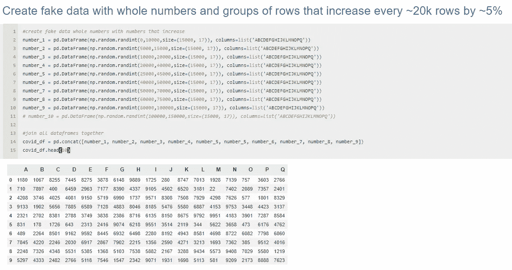

# 伪造新冠肺炎数据有多容易

> 原文：<https://blog.devgenius.io/how-easy-it-is-to-create-fake-covid-19-data-b426aafce017?source=collection_archive---------9----------------------->

一个带有虚假数据的虚假图表声称，HCQ 导致新冠肺炎患者死亡的可能性是其他患者的 2 倍

我通常不会产生这样的故事，但不得不说，如果不是我，一个自由思考的数据工程师/数据科学家，对任何一方都有最小的偏见，并有看穿谎言的眼睛，我不知道谁会产生它。

## 新冠肺炎假 HCQ 审判数据背景

最近一篇[文章强调了羟基氯喹研究的不一致性](https://www.theguardian.com/world/2020/jun/10/surgisphere-sapan-desai-lancet-study-hydroxychloroquine-mass-audit-scientific-papers)和不可行性，该研究“证明”该药物可能增加新冠肺炎患者心血管问题的风险 2 倍。

Surgisphere 的维基百科页面，截至 2020 年 8 月 3 日

这个“试验”是由一家现已倒闭的名为 Surgisphere **的公司进行的，该公司没有网站**，**没有首席执行官，没有员工，linkedin 上的前员工的个人资料突然消失了，其中的前员工是一名科幻作家和一名可能的雇佣模特**，据称在他们的羟基氯喹试验中有超过 15 万人的结果。当被要求从试验结果/数据中复制 15k 个结果/行时，他们不能。

## 那么这意味着什么呢？

简单地说，这意味着美国公众被福奇博士和两家世界领先的医学杂志《柳叶刀》和《新英格兰医学杂志》欺骗了，他们相信并向立法者和公众推荐了一种自 20 世纪 40 年代以来世界上一直在使用的极其廉价和有效的药物，这种药物在治疗新冠肺炎时是不安全和无效的。这无疑导致了成千上万不必要的死亡，因为医生无法为早期新冠肺炎患者开出可能挽救生命的药物。

## 那么伪造数据有多容易呢？

> *为了简单起见，将使用 dataframe 代替数据库，它们非常相似。数据帧是内存中的数据结构，我们在其中存储数据。数据帧可以以多种方式导出和导入到数据库中——通过脚本自动导出、通过 csv 导入、通过 ETL 调度等。因此，数据库是我们数据的最终归宿，数据帧是我们处理数据和进行分析的工具。

为了模仿可能的空壳公司 Surgisphere 为创建这个“试验”所做的工作，我将向您展示创建虚假数据并推出毫无根据的叙述是多么容易。

## **导入库和格式**

导入 pandas、numpy 和 plotly，即用于数据操作和可视化，以及调整 [jupyter notebook](https://jupyter.org/) 单元格的格式/输出。

数据库

## **用假数据创建假列**

创建患者、days_since_covid started 和 is_dead 列以进一步验证此数据框架。

我们用假数字创建列表，然后添加到数据帧中

## **用随机数生成的列创建一个假数据帧**

这就是了。我们所需要的是大约 20 行代码，我们有一个完全虚假的数据框架，带有可怕的声音列，如 is_dead 和 days_since_covid。

就是这样。

输出

## 更进一步

下面是一个列中有小数而不是整数的数据框架。只是为了让它更可信。

数据帧中的小数

## 呈现方式

如果我们必须呈现数据，我们可能想让它看起来很漂亮。这是我们看起来很漂亮的假数据:

style . background _ gradient(cmap = ' Blues ')

## 让我们的数据看起来越来越多

现在假设我们想让我们的数据看起来好像在增加。这很简单，我没有创建一个函数来编程实现，但是我们可以创建一些数据帧，最后把它们连接在一起。每个数据帧将由稍高的数字组成(平均高 5%左右)。

## 添加我们的恐怖专栏并显示信息()

添加我们为早期数据帧创建的列。

顶部的数据帧信息()和底部逐渐增加的数据帧

## 把它带回家——绘制我们的假数据

嘭，我们有了一个逐渐增加的新冠肺炎 hcq 试验样的数据框架；不到 100 行代码。此时唯一要做的事情就是将我们的数据插入数据库，并与任何需要访问的人共享数据库凭证。

我们可以让线条不那么平滑，但这只是一个不到一个小时就完成的例子

## 所有这些意味着什么？

如果你像我一样对数据着迷，你会厌倦几乎所有的统计数据。尤其是政府生产的。你应该从中得到的是——任何数据都很容易被篡改。你永远不会从错误的信息或来自伪造数据的错误叙述中得到安全。但还是有希望的。你必须使用美丽的大脑之神或你的更高力量给你的任何人，来质疑，批判性地思考，并最终找到你信任的人。我们通常没有时间去研究和核实我们在新闻中听到的每一件事，但谢天谢地，有人就是这样谋生的。以下是我最喜欢的几个信息页面:

## 获取准确新闻信息的最佳资源

[布莱巴特](https://www.breitbart.com/)

[毫不留情播客](https://www.instagram.com/tommygpatriot/?hl=en)

[海岸对海岸调幅广播](https://www.coasttocoastam.com/)

[Tim Pool 播客](https://podcasts.apple.com/us/podcast/tim-pool-daily-show/id1362265400)

[乔·罗根播客](http://podcasts.joerogan.net/)

Qanon 页面(twitter 和 instagram)

*   https://www.instagram.com/wwg1wga_/?hl=en
*   【https://www.instagram.com/qthewakeup/?hl=en 
*   [https://www.instagram.com/q_pill/?hl=en](https://www.instagram.com/q_pill/?hl=en)
*   [https://www.instagram.com/sheepn0more/?hl=en](https://www.instagram.com/sheepn0more/?hl=en)

如果你想支持我的工作，请给我买杯咖啡，或者在社交媒体上关注我。

谢谢，
Max