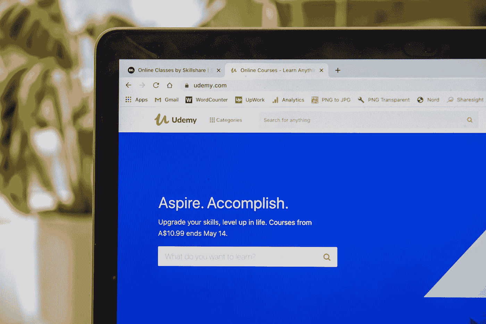

# 网络课程的效果如何？

> 原文：<https://blog.devgenius.io/how-effective-are-online-classes-5ca368e09480?source=collection_archive---------52----------------------->

## 现场讲座或录制内容。它们真的能取代面对面的课堂吗？

路易斯·基根-Skillscouter.com 在 T2 Unsplash 的照片

正在进行的新冠肺炎锁定为学校和大学从面对面的课堂体验过渡到在线课堂铺平了道路，在线课堂提供现场讲座、预先录制的内容、更多的作业和更多的活动，这极大地改变了学生的学习方式。

近年来，随着 Udemy 和 Udacity 等在线学习平台的兴起，在线课程和 MOOCs 的概念越来越受欢迎和接受。近 46%的新近毕业的学生获得了一个在线学分，作为他们学位的一部分，因为大学关闭了他们的场所，以抗击新冠肺炎病毒的传播。这个数字只会增加，因为世界各地的教育机构已经宣布，他们将至少在下学期完全上网。

如同世界上的一切事物一样，网络课程也有其利弊。

## 赞成的意见

1.  **可访问性增加**
    与他们在学校或大学所学的课程相比，学生们可以访问大量的在线课程。无论学生是想学习文学、计算机编程还是任何工程学科，他们都可以在网上找到适合自己要求的课程。这真的很有用，尤其是在人口密度较低的城市或州，这些学科的教师不容易找到。
2.  **成本因素**
    这是一个非常明显的因素。在许多大学，学费可能高达 3 万至 5 万美元。在网上授课的情况下，经济上的挫折可能会小得多。除非你要去哈佛，在这种情况下，你要支付网上课程的全部费用。
3.  **灵活性** 根据您选择的课程类型和您的注册地，您可以更加灵活地选择您的科目以及您打算完成这些课程的时间表。很多时候，这对于那些试图兼顾事业或家庭，同时又希望继续深造并获得学位的人来说尤为重要。

虽然这些优势可能看起来非常吸引人们接受在线教育，但它并非没有公平的现实。

## 骗局

1.  信息过载
    虽然优点部分的第一点看起来不错，但这对学生来说却是一把双刃剑。接触到大量的课程会让学生更难选择想要学习的课程。同时，这导致了教学方法质量的差异。
2.  **没有方向** 虽然在线学习在灵活性方面提供了很多，但这可能会影响学生的学习能力，因为学生没有教师的定期指导。这可能会导致学生失去动力，尤其是那些有很多其他事情要做的学生，可能会导致他们完全放弃这门课程。根据 Udemy 提供的统计数据，平均每个学生完成了 30%的课程内容，平均 70%的学生甚至从未开始他们注册的课程！
3.  许多课堂学习都涉及到学生们面对面的互动，互相交流想法，或者只是互相提供精神上的支持。建立一个现实生活中的网络是任何课程最重要的部分之一，不管是在线的还是其他的。独自学习比在教室里学习困难得多，在教室里你有同伴可以帮助和支持你。如果学生不能与他们的同龄人交流，他们就没有动力继续学习，因为他们所学的东西得不到任何认可。

对于许多教育机构来说，提供在线课程和混合学习将在它们的长期生存中发挥重要作用。许多学生发现全日制校园课程的费用令人望而却步。对其他人来说，全职学习与其他重要的责任相冲突，比如职业生涯或养家糊口。提供在线学习资源的大学鼓励更多的学生注册他们的学校，包括那些可能生活在不同州或在某些情况下，不同国家的学生。虽然在线课程的有效性可以无休止地争论，但有一点是肯定的。在线课程不只是停留在这里，而是将成为我们未来不可或缺的一部分。